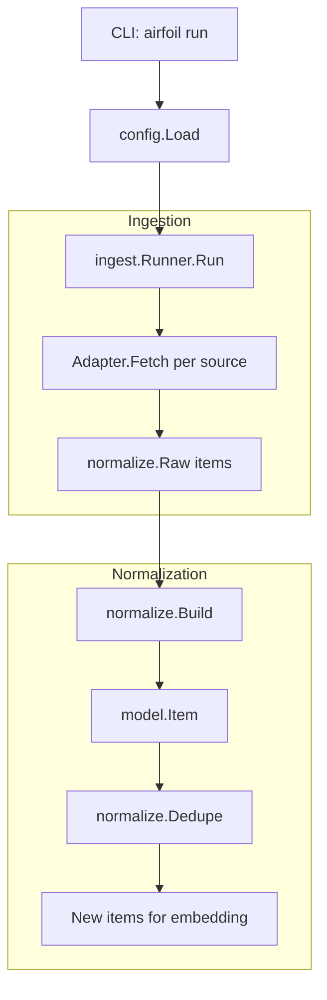
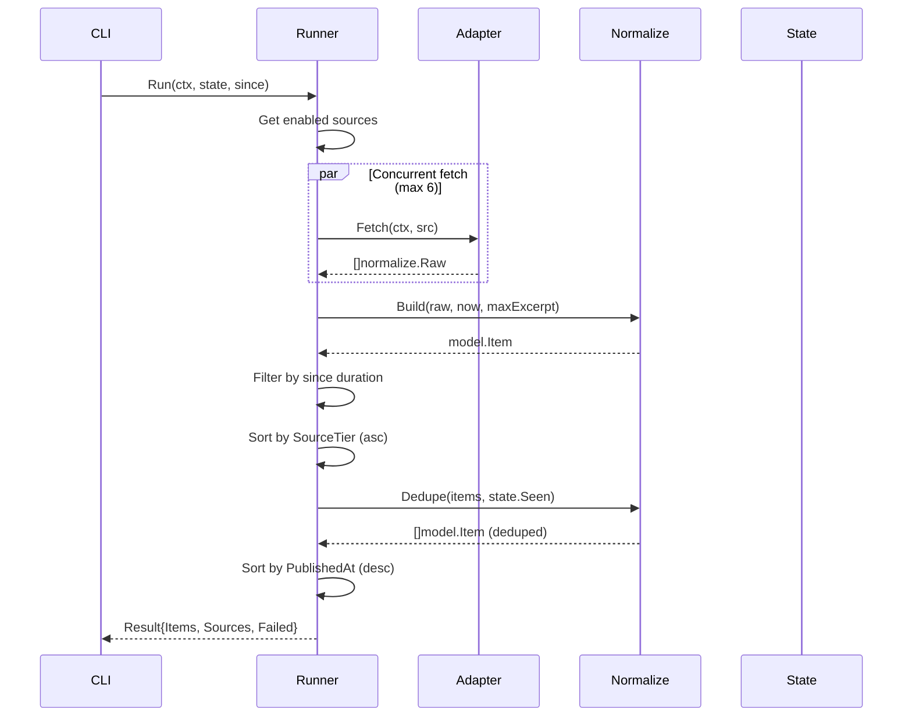

# Agent Pipeline Stages

This chapter details the Go agent's pipeline stages from ingestion through normalization, covering the Runner orchestration, source adapters (Hacker News, RSS for Reddit/HF Papers/GitHub), HTTP fetching with retries, text processing (HTML stripping, excerpt capping at 300 chars, title cleaning), URL canonicalization (wrapper unwrapping, tracking param removal, ItemID generation), entity extraction (GitHub repos, arXiv papers), item construction, deduplication against `State.Seen`, and the core data models (`Item`, `Cluster`, `Story`, `Index`, `State`) with JSON persistence.

## Table of Contents

- [Architecture Overview](#architecture-overview)
- [Core Data Models](#core-data-models)
- [Ingestion: Runner Orchestration](#ingestion-runner-orchestration)
- [Source Adapters](#source-adapters)
- [HTTP Fetching with Retries](#http-fetching-with-retries)
- [Normalization Pipeline](#normalization-pipeline)
- [URL Canonicalization](#url-canonicalization)
- [Entity Extraction](#entity-extraction)
- [Item Construction](#item-construction)
- [Deduplication](#deduplication)
- [JSON Persistence](#json-persistence)
- [Referenced Files](#referenced-files)

---

## Architecture Overview

The agent pipeline follows a linear flow where each stage transforms data and passes it to the next. The ingestion and normalization stages covered here are the first two phases:



---

## Core Data Models

The `model` package defines the contract between pipeline stages. Every type is serialized to JSON and persisted under `data/`.

### Item

`Item` is the normalized, deduplicated ingest unit — the atomic record after normalization.

`agent/internal/model/types.go:11-25`

```go
type Item struct {
	ID          string    `json:"id"` // sha256(canonicalURL)[:16]
	SourceID    string    `json:"source_id"`
	SourceName  string    `json:"source_name"`
	SourceTier  int       `json:"source_tier"`
	URL         string    `json:"url"` // canonical
	Title       string    `json:"title"`
	Excerpt     string    `json:"excerpt"`
	Author      string    `json:"author,omitempty"`
	PublishedAt time.Time `json:"published_at"`
	FetchedAt   time.Time `json:"fetched_at"`
	Metrics     Metrics   `json:"metrics"`
	RepoURL     string    `json:"repo_url,omitempty"`
	PaperURL    string    `json:"paper_url,omitempty"`
}
```

**Key invariants:**
- `ID` = first 16 hex chars of SHA-256(canonical URL) — stable identity for deduplication
- `Excerpt` capped at 300 chars (enforced in `normalize.Build` via `Excerpt`)
- `RepoURL` and `PaperURL` extracted during normalization for clustering signals

### Metrics

`agent/internal/model/types.go:28-34`

```go
type Metrics struct {
	HNPoints    int `json:"hn_points,omitempty"`
	HNComments  int `json:"hn_comments,omitempty"`
	RedditScore int `json:"reddit_score,omitempty"`
	HFUpvotes   int `json:"hf_upvotes,omitempty"`
	GitHubStars int `json:"github_stars,omitempty"`
}
```

Community-validation signals used by scoring. Each source adapter populates its relevant fields.

### Cluster

`agent/internal/model/types.go:37-41`

```go
type Cluster struct {
	ID       string    `json:"id"`
	Items    []Item    `json:"items"`
	Centroid []float32 `json:"-"`
}
```

Groups similar `Item`s by embedding similarity. `Centroid` is the mean vector (not serialized).

### Tier Constants

`agent/internal/model/types.go:45-47`

```go
const (
	TierMajor   = "major"
	TierNotable = "notable"
	TierMinor   = "minor"
)
```

Importance levels driving scoring weights via `Scoring.TierWeight(tier)`.

### Story

`agent/internal/model/types.go:55-69`

```go
type Story struct {
	ID              string        `json:"id"`
	Slug            string        `json:"slug"`
	Title           string        `json:"title"`
	Summary         string        `json:"summary"`
	Score           int           `json:"score"`
	Tier            string        `json:"tier"`
	Tags            []string      `json:"tags"`
	BuilderRelevant bool          `json:"builder_relevant"`
	Date            time.Time     `json:"date"`
	ClusterSize     int           `json:"cluster_size"`
	Sources         []StorySource `json:"sources"`
	Takeaways       []string      `json:"takeaways,omitempty"`
	Body            []string      `json:"body,omitempty"`
}
```

Publishable unit: one `Cluster` → LLM summary + frontmatter. Written as Markdown in `site/src/content/stories/`.

### StorySource & SourceMetrics

`agent/internal/model/types.go:73-88`

```go
type StorySource struct {
	Name    string         `json:"name"`
	URL     string         `json:"url"`
	Tier    int            `json:"tier"`
	Type    string         `json:"type"` // lab | press | community
	Metrics *SourceMetrics `json:"metrics,omitempty"`
}

type SourceMetrics struct {
	Points   int `json:"points,omitempty"`
	Comments int `json:"comments,omitempty"`
	Score    int `json:"score,omitempty"`
	Upvotes  int `json:"upvotes,omitempty"`
	Stars    int `json:"stars,omitempty"`
}
```

Every source a cluster drew from appears here (R3).

### SourceType

`agent/internal/model/types.go:91-100`

```go
func SourceType(tier int) string {
	switch {
	case tier <= 3:
		return "lab"
	case tier == 4:
		return "press"
	default:
		return "community"
	}
}
```

Maps source tier to coarse category for site rendering.

### IndexEntry & Index

`agent/internal/model/types.go:103-120`

```go
type IndexEntry struct {
	ID              string    `json:"id"`
	Slug            string    `json:"slug"`
	Title           string    `json:"title"`
	Summary         string    `json:"summary"`
	Score           int       `json:"score"`
	Tier            string    `json:"tier"`
	Tags            []string  `json:"tags"`
	BuilderRelevant bool      `json:"builder_relevant"`
	Date            time.Time `json:"date"`
	ClusterSize     int       `json:"cluster_size"`
}

type Index struct {
	GeneratedAt time.Time    `json:"generated_at"`
	Stories     []IndexEntry `json:"stories"`
}
```

`Index` is the ranked list serialized to `data/index.json` for site consumption.

### State

`agent/internal/model/types.go:123-151`

```go
type State struct {
	SeenURLs map[string]string `json:"seen_urls"`
	Cursors  map[string]string `json:"cursors"`
	LastRun  *time.Time        `json:"last_run"`
}

func NewState() *State {
	return &State{
		SeenURLs: map[string]string{},
		Cursors:  map[string]string{},
	}
}

func (s *State) Seen(id string) bool {
	_, ok := s.SeenURLs[id]
	return ok
}

func (s *State) MarkSeen(id string, day time.Time) {
	if s.SeenURLs == nil {
		s.SeenURLs = map[string]string{}
	}
	s.SeenURLs[id] = day.UTC().Format(time.DateOnly)
}
```

Dedup tracker persisted to `data/state.json`. `SeenURLs` maps item ID → date (YYYY-MM-DD). `Cursors` holds per-source high-water marks.

---

## Ingestion: Runner Orchestration

The `Runner` executes every enabled source concurrently, normalizes results, and returns new items.

### Runner Structure

`agent/internal/ingest/ingest.go:41-46`

```go
type Runner struct {
	cfg      *config.Config
	log      *slog.Logger
	adapters map[string]Adapter
	now      func() time.Time
}
```

### Adapter Interface

`agent/internal/ingest/ingest.go:33-38`

```go
type Adapter interface {
	Type() string
	Fetch(ctx context.Context, src config.Source) ([]normalize.Raw, error)
}
```

Each adapter handles one source type from `sources.json`.

### Runner Construction

`agent/internal/ingest/ingest.go:49-66`

```go
func New(cfg *config.Config, log *slog.Logger) *Runner {
	f := newFetcher(sourceTimeout, defaultUserAgent)

	adapters := []Adapter{
		newRSSAdapter(f),
		newHNAdapter(f),
		newRedditAdapter(f, cfg.Ingest.RedditUserAgent),
		newHFAdapter(f),
		newGitHubAdapter(f, cfg.Ingest.GitHubToken),
	}

	byType := make(map[string]Adapter, len(adapters))
	for _, a := range adapters {
		byType[a.Type()] = a
	}

	return &Runner{cfg: cfg, log: log, adapters: byType, now: time.Now}
}
```

Five adapters registered: RSS (covers Reddit, HF Papers, GitHub), HN, Reddit, HF, GitHub.

### Run Method

`agent/internal/ingest/ingest.go:97-182`

The `Run` method orchestrates the full ingestion pass:



Key behaviors:
- **Concurrency limit**: `maxConcurrent = 6` via `errgroup.SetLimit`
- **Per-source timeout**: `sourceTimeout = 15s` via `context.WithTimeout`
- **Error isolation**: One failed source logs warning but doesn't cancel others
- **Failure threshold**: If >50% sources fail, abort before write (R9)
- **Deterministic ordering**: Normalize in source order, then sort by tier, then dedupe, then sort by recency

### SourceResult & Result

`agent/internal/ingest/ingest.go:77-91`

```go
type SourceResult struct {
	SourceID string
	Fetched  int // raw items returned
	Kept     int // items that survived normalization
	Duration time.Duration
	Err      error
}

type Result struct {
	Items   []model.Item
	Sources []SourceResult
	Failed  int
}
```

---

## Source Adapters

### Adapter Registry

| Adapter | Type Constant | Sources Covered |
|---------|---------------|-----------------|
| `rssAdapter` | `config.SourceRSS` | Lab blogs, press feeds, arXiv |
| `hnAdapter` | `config.SourceHN` | Hacker News (Algolia API) |
| `redditAdapter` | `config.SourceReddit` | Reddit via RSS |
| `hfAdapter` | `config.SourceHFPapers` | Hugging Face Papers via RSS |
| `githubAdapter` | `config.SourceGitHub` | GitHub via RSS |

### RSS Adapter

`agent/internal/ingest/rss.go:16-55`

```go
type rssAdapter struct {
	fetch *fetcher
}

func (a *rssAdapter) Type() string { return config.SourceRSS }

func (a *rssAdapter) Fetch(ctx context.Context, src config.Source) ([]normalize.Raw, error) {
	body, err := a.fetch.get(ctx, src.URL, map[string]string{
		"Accept": "application/rss+xml, application/atom+xml, application/xml;q=0.9, */*;q=0.8",
	})
	if err != nil {
		return nil, err
	}

	feed, err := gofeed.NewParser().Parse(bytes.NewReader(body))
	if err != nil {
		return nil, fmt.Errorf("parse feed %s: %w", src.URL, err)
	}

	out := make([]normalize.Raw, 0, len(feed.Items))
	for _, item := range feed.Items {
		if item == nil || item.Link == "" {
			continue
		}
		out = append(out, normalize.Raw{
			SourceID:    src.ID,
			SourceName:  src.Name,
			SourceTier:  src.Tier,
			URL:         item.Link,
			Title:       item.Title,
			Body:        feedBody(item),
			Author:      feedAuthor(item),
			PublishedAt: feedTime(item),
		})
	}
	return out, nil
}
```

**Feed body selection** (`feedBody`): Prefers `item.Content` (full content) over `item.Description` — critical for arXiv where abstract is in Content.

`agent/internal/ingest/rss.go:61-66`

```go
func feedBody(item *gofeed.Item) string {
	if item.Content != "" {
		return item.Content
	}
	return item.Description
}
```

**Author extraction**: First author from `item.Authors`, fallback to `item.Author`.

**Time extraction**: Falls back through `PublishedParsed` → `UpdatedParsed` → zero time (normalize substitutes fetch time).

### Hacker News Adapter

`agent/internal/ingest/hn.go:19-77`

Queries Algolia API once per configured keyword.

```go
func (a *hnAdapter) Fetch(ctx context.Context, src config.Source) ([]normalize.Raw, error) {
	opts := src.Options
	if len(opts.Queries) == 0 {
		return nil, fmt.Errorf("hn: no queries configured for %s", src.ID)
	}

	hoursBack := opts.HoursBack
	if hoursBack <= 0 {
		hoursBack = 48
	}
	after := time.Now().Add(-time.Duration(hoursBack) * time.Hour).Unix()

	seen := make(map[string]bool)
	var out []normalize.Raw

	for _, query := range opts.Queries {
		hits, err := a.search(ctx, src.URL, query, opts.MinPoints, after)
		if err != nil {
			return nil, err
		}
		for _, hit := range hits {
			if seen[hit.ObjectID] {
				continue
			}
			seen[hit.ObjectID] = true

			raw, ok := hnRaw(hit, src)
			if !ok {
				continue
			}
			out = append(out, raw)
		}
	}
	return out, nil
}
```

**Search parameters**: `tags=story`, `numericFilters=created_at_i>X,points>Y`, `hitsPerPage=50`.

**Hit conversion** (`hnRaw`): Submissions without outbound link point to HN discussion page.

`agent/internal/ingest/hn.go:100-127`

```go
func hnRaw(hit hnHit, src config.Source) (normalize.Raw, bool) {
	if hit.Title == "" {
		return normalize.Raw{}, false
	}

	link := hit.URL
	if link == "" {
		if hit.ObjectID == "" {
			return normalize.Raw{}, false
		}
		link = "https://news.ycombinator.com/item?id=" + hit.ObjectID
	}

	return normalize.Raw{
		SourceID:    src.ID,
		SourceName:  src.Name,
		SourceTier:  src.Tier,
		URL:         link,
		Title:       hit.Title,
		Body:        hit.StoryText,
		Author:      hit.Author,
		PublishedAt: time.Unix(hit.CreatedAtI, 0).UTC(),
		Metrics: model.Metrics{
			HNPoints:   hit.Points,
			HNComments: hit.NumComments,
		},
	}, true
}
```

Populates `Metrics.HNPoints` and `Metrics.HNComments` for scoring.

### Reddit, HF Papers, GitHub Adapters

These use the RSS adapter internally (Reddit/HF Papers/GitHub all expose RSS feeds). Their constructors are called in `Runner.New` but implementations are in separate files not fully shown in the source block. The RSS adapter handles all three via `config.SourceRSS` type.

---

## HTTP Fetching with Retries

The `fetcher` handles all outbound HTTP with timeout, retry, and body limits.

### Fetcher Structure

`agent/internal/ingest/http.go:19-29`

```go
type fetcher struct {
	client    *http.Client
	userAgent string
}

func newFetcher(timeout time.Duration, userAgent string) *fetcher {
	return &fetcher{
		client:    &http.Client{Timeout: timeout},
		userAgent: userAgent,
	}
}
```

### Get with Retry

`agent/internal/ingest/http.go:32-57`

```go
func (f *fetcher) get(ctx context.Context, url string, headers map[string]string) ([]byte, error) {
	var lastErr error

	for attempt := range 2 {
		if attempt > 0 {
			delay := 500*time.Millisecond + time.Duration(rand.N(500))*time.Millisecond
			select {
			case <-ctx.Done():
				return nil, ctx.Err()
			case <-time.After(delay):
			}
		}

		body, retryable, err := f.tryGet(ctx, url, headers)
		if err == nil {
			return body, nil
		}
		lastErr = err
		if !retryable {
			return nil, err
		}
	}
	return nil, lastErr
}
```

- **Two attempts max** (one retry)
- **Jittered backoff**: 500–1000ms
- **Retryable**: 429 (TooManyRequests) or 5xx; context cancellation is not retryable

### TryGet

`agent/internal/ingest/http.go:61-92`

```go
func (f *fetcher) tryGet(ctx context.Context, url string, headers map[string]string) (body []byte, retryable bool, err error) {
	req, err := http.NewRequestWithContext(ctx, http.MethodGet, url, nil)
	if err != nil {
		return nil, false, fmt.Errorf("request %s: %w", url, err)
	}
	req.Header.Set("User-Agent", f.userAgent)
	for k, v := range headers {
		req.Header.Set(k, v)
	}

	resp, err := f.client.Do(req)
	if err != nil {
		return nil, ctx.Err() == nil, fmt.Errorf("get %s: %w", url, err)
	}
	defer resp.Body.Close()

	switch {
	case resp.StatusCode == http.StatusTooManyRequests, resp.StatusCode >= 500:
		return nil, true, fmt.Errorf("get %s: %s", url, resp.Status)
	case resp.StatusCode != http.StatusOK:
		return nil, false, fmt.Errorf("get %s: %s", url, resp.Status)
	}

	b, err := io.ReadAll(io.LimitReader(resp.Body, maxBodyBytes))
	if err != nil {
		return nil, true, fmt.Errorf("read %s: %w", url, err)
	}
	return b, false, nil
}
```

**Body limit**: `maxBodyBytes = 16 MiB` — feeds are text; larger indicates misconfiguration.

**Accept-Encoding**: Deliberately not set — Go transport adds gzip and decompresses transparently only when header is unset.

### GetJSON

`agent/internal/ingest/http.go:95-111`

```go
func (f *fetcher) getJSON(ctx context.Context, url string, headers map[string]string, out any) error {
	if headers == nil {
		headers = map[string]string{}
	}
	if _, ok := headers["Accept"]; !ok {
		headers["Accept"] = "application/json"
	}

	body, err := f.get(ctx, url, headers)
	if err != nil {
		return err
	}
	if err := json.Unmarshal(body, out); err != nil {
		return fmt.Errorf("decode %s: %w", url, err)
	}
	return nil
}
```

Used by HN adapter for Algolia API.

---

## Normalization Pipeline

### Raw Input Type

`agent/internal/normalize/normalize.go:17-35`

```go
type Raw struct {
	SourceID   string
	SourceName string
	SourceTier int

	URL         string
	Title       string
	Body        string // summary or content HTML from the feed
	Author      string
	PublishedAt time.Time

	Metrics model.Metrics

	RepoURL  string
	PaperURL string
}
```

Pre-normalization struct from adapter. Fields are whatever the source gave us — unescaped HTML, tracking URLs, missing dates.

### Build Function

`agent/internal/normalize/normalize.go:41-82`

```go
func Build(r Raw, now time.Time, maxExcerpt int) (model.Item, error) {
	canonical, err := CanonicalURL(r.URL)
	if err != nil {
		return model.Item{}, fmt.Errorf("normalize: %s: %w", r.SourceID, err)
	}

	title := CleanTitle(r.Title, r.SourceName)
	if title == "" {
		return model.Item{}, fmt.Errorf("normalize: %s: empty title for %s", r.SourceID, canonical)
	}

	published := r.PublishedAt.UTC()
	if published.IsZero() || published.After(now.UTC()) {
		published = now.UTC()
	}

	repo, paper := r.RepoURL, r.PaperURL
	if repo == "" {
		repo = ExtractRepoURL(canonical, r.Title, r.Body)
	}
	if paper == "" {
		paper = ExtractPaperURL(canonical, r.Title, r.Body)
	}

	return model.Item{
		ID:          ItemID(canonical),
		SourceID:    r.SourceID,
		SourceName:  r.SourceName,
		SourceTier:  r.SourceTier,
		URL:         canonical,
		Title:       title,
		Excerpt:     Excerpt(r.Body, maxExcerpt), // R1
		Author:      CollapseSpace(r.Author),
		PublishedAt: published,
		FetchedAt:   now.UTC(),
		Metrics:     r.Metrics,
		RepoURL:     repo,
		PaperURL:    paper,
	}, nil
}
```

**Pipeline steps:**
1. `CanonicalURL` — stable identity
2. `CleanTitle` — strip publication suffixes
3. Clamp future publication dates to `now`
4. `ExtractRepoURL` / `ExtractPaperURL` — entity extraction
5. `ItemID` — SHA-256 hash prefix
6. `Excerpt` — HTML strip + cap at 300 chars (R1)
7. `CollapseSpace` — whitespace normalization

---

## URL Canonicalization

`CanonicalURL` reduces a URL to stable identity: no tracking params, no fragment, no default port, lowercase scheme/host, sorted query, no trailing slash.

### CanonicalURL Entry Point

`agent/internal/normalize/url.go:58-60`

```go
func CanonicalURL(raw string) (string, error) {
	return canonicalURL(raw, 0)
}
```

### Recursive Canonicalization

`agent/internal/normalize/url.go:62-120`

```go
func canonicalURL(raw string, depth int) (string, error) {
	s := strings.TrimSpace(raw)
	if s == "" {
		return "", fmt.Errorf("normalize: empty url")
	}

	switch {
	case strings.HasPrefix(s, "//"):
		s = "https:" + s
	case !strings.Contains(s, "://"):
		if hasOpaqueScheme(s) {
			return "", fmt.Errorf("normalize: unsupported scheme in %q", raw)
		}
		s = "https://" + s
	}

	u, err := url.Parse(s)
	if err != nil {
		return "", fmt.Errorf("normalize: parse url %q: %w", raw, err)
	}

	u.Scheme = strings.ToLower(u.Scheme)
	if u.Scheme != "http" && u.Scheme != "https" {
		return "", fmt.Errorf("normalize: unsupported scheme %q in %q", u.Scheme, raw)
	}
	if u.Host == "" {
		return "", fmt.Errorf("normalize: no host in %q", raw)
	}

	u.Host = strings.ToLower(u.Host)
	u.Host = strings.TrimSuffix(u.Host, ":80")
	u.Host = strings.TrimSuffix(u.Host, ":443")
	u.User = nil
	u.Fragment = ""
	u.RawFragment = ""

	if target, ok := unwrap(u); ok && depth < maxUnwrapDepth {
		return canonicalURL(target, depth+1)
	}

	q := u.Query()
	for key := range q {
		if isTracking(key) {
			q.Del(key)
		}
	}
	u.RawQuery = q.Encode()

	u.Path = cleanPath(u.Path)
	u.RawPath = ""

	return u.String(), nil
}
```

**Processing order:**
1. Trim whitespace
2. Handle protocol-relative (`//`) and bare-host inputs
3. Parse URL
4. Lowercase scheme/host
5. Strip default ports (80, 443)
6. Remove userinfo, fragment
7. **Unwrap redirect wrappers** (recursive, max depth 3)
8. Drop tracking parameters
9. Sort query params via `q.Encode()`
10. Clean path (collapse `//`, trim trailing `/`)

### Wrapper Unwrapping

`agent/internal/normalize/url.go:13-24` (redirectWrappers)

```go
var redirectWrappers = map[string][]string{
	"news.google.com":               {"url"},
	"www.google.com":                {"url", "q"},
	"google.com":                    {"url", "q"},
	"out.reddit.com":                {"url"},
	"l.facebook.com":                {"u"},
	"lm.facebook.com":               {"u"},
	"href.li":                       {"url"},
	"outgoing.prod.mozaws.net":      {"url"},
	"steamcommunity.com/linkfilter": {"url"},
}
```

`agent/internal/normalize/url.go:123-139`

```go
func unwrap(u *url.URL) (string, bool) {
	keys, ok := redirectWrappers[u.Host]
	if !ok {
		keys, ok = redirectWrappers[u.Host+strings.TrimSuffix(u.Path, "/")]
		if !ok {
			return "", false
		}
	}
	q := u.Query()
	for _, k := range keys {
		if v := strings.TrimSpace(q.Get(k)); v != "" && strings.Contains(v, "://") {
			return v, true
		}
	}
	return "", false
}
```

Unwraps known redirect hosts (Google News, Reddit out, Facebook link shims) by extracting destination from query param. Recursion bounded by `maxUnwrapDepth = 3`.

### Tracking Parameter Removal

`agent/internal/normalize/url.go:13-24` (trackingParams, trackingPrefixes)

```go
var trackingParams = map[string]bool{
	"ref": true, "ref_src": true, "ref_url": true, "referrer": true, "referer": true,
	"source": true, "src": true,
	"fbclid": true, "gclid": true, "dclid": true, "msclkid": true, "yclid": true, "twclid": true,
	"mc_cid": true, "mc_eid": true,
	"igshid": true, "igsh": true,
	"_hsenc": true, "_hsmi": true,
	"cmpid": true, "campaign_id": true,
	"spm": true, "si": true,
	"at_medium": true, "at_campaign": true,
	"sh": true, "share_id": true, "sr_share": true,
}

var trackingPrefixes = []string{"utm_", "ga_", "hsa_", "mtm_", "pk_", "piwik_"}
```

`agent/internal/normalize/url.go:162-173`

```go
func isTracking(key string) bool {
	k := strings.ToLower(key)
	if trackingParams[k] {
		return true
	}
	for _, p := range trackingPrefixes {
		if strings.HasPrefix(k, p) {
			return true
		}
	}
	return false
}
```

Exact-match params + prefix matches (utm_, ga_, etc.).

### Path Cleaning

`agent/internal/normalize/url.go:177-185`

```go
func cleanPath(p string) string {
	if p == "" || p == "/" {
		return ""
	}
	for strings.Contains(p, "//") {
		p = strings.ReplaceAll(p, "//", "/")
	}
	return strings.TrimSuffix(p, "/")
}
```

Collapses repeated slashes, removes trailing slash.

### ItemID Generation

`agent/internal/normalize/url.go:189-192`

```go
func ItemID(canonicalURL string) string {
	sum := sha256.Sum256([]byte(canonicalURL))
	return hex.EncodeToString(sum[:])[:16]
}
```

First 16 hex chars of SHA-256(canonical URL) — stable 64-bit identity.

---

## Entity Extraction

### GitHub Repository Extraction

`agent/internal/normalize/extract.go:10-42` (regex + reserved lists)

```go
var githubRepoRE = regexp.MustCompile(`(?i)github\.com/([A-Za-z0-9][A-Za-z0-9_.-]*)/([A-Za-z0-9][A-Za-z0-9_.-]*)`)

var githubReservedPaths = map[string]bool{
	"about": true, "account": true, "actions": true, "apps": true, "blog": true,
	"careers": true, "changelog": true, "codespaces": true, "collections": true,
	"contact": true, "copilot": true, "customer-stories": true, "dashboard": true,
	"discussions": true, "education": true, "enterprise": true, "events": true,
	"explore": true, "features": true, "git-guides": true, "github": true,
	"issues": true, "join": true, "login": true, "logout": true, "marketplace": true,
	"mobile": true, "new": true, "nonprofit": true, "notifications": true,
	"organizations": true, "orgs": true, "packages": true, "premium-support": true,
	"pricing": true, "pulls": true, "readme": true, "releases": true, "search": true,
	"security": true, "settings": true, "signup": true, "site": true, "sponsors": true,
	"stars": true, "team": true, "topics": true, "trending": true, "users": true,
	"watching": true,
}

var githubReservedRepos = map[string]bool{
	"followers": true, "following": true, "repositories": true, "projects": true,
	"packages": true, "stars": true, "sponsors": true, "settings": true,
}
```

`agent/internal/normalize/extract.go:49-69`

```go
func ExtractRepoURL(texts ...string) string {
	for _, text := range texts {
		for _, m := range githubRepoRE.FindAllStringSubmatch(text, -1) {
			owner, repo := m[1], strings.TrimSuffix(m[2], ".git")

			if githubReservedPaths[strings.ToLower(owner)] {
				continue
			}
			if githubReservedRepos[strings.ToLower(repo)] {
				continue
			}
			repo = strings.TrimRight(repo, ".-_")
			if repo == "" {
				continue
			}
			return "https://github.com/" + owner + "/" + repo
		}
	}
	return ""
}
```

**Logic:**
1. Find all `github.com/owner/repo` matches (case-insensitive)
2. Skip if owner is a reserved path (site features, not user accounts)
3. Skip if repo is a reserved repo name (account pages)
4. Trim trailing punctuation from prose
5. Return first valid match canonicalized to `https://github.com/owner/repo`

### arXiv Paper Extraction

`agent/internal/normalize/extract.go:13-16` (regexes)

```go
var arxivModernRE = regexp.MustCompile(`(?i)(?:arxiv\.org/(?:abs|pdf|html)/|arxiv[:\s]+|huggingface\.co/papers/)(\d{4}\.\d{4,5})(v\d+)?`)

var arxivLegacyRE = regexp.MustCompile(`(?i)arxiv\.org/(?:abs|pdf)/([a-z-]+(?:\.[a-z]{2})?/\d{7})`)
```

`agent/internal/normalize/extract.go:76-86`

```go
func ExtractPaperURL(texts ...string) string {
	for _, text := range texts {
		if m := arxivModernRE.FindStringSubmatch(text); m != nil {
			return "https://arxiv.org/abs/" + m[1]
		}
		if m := arxivLegacyRE.FindStringSubmatch(text); m != nil {
			return "https://arxiv.org/abs/" + strings.ToLower(m[1])
		}
	}
	return ""
}
```

**Modern IDs**: `2401.12345` (optionally `v1`, `v2` — version dropped deliberately so v1/v2 collapse to same cluster)

**Legacy IDs**: `cs.AI/0301001`, `math/0211159` (pre-2007)

**Sources checked**: URL, title, body — covers arXiv links, HF Papers references, prose mentions.

---

## Item Construction

The `

<!-- kaioken:files agent/internal/ingest/ingest.go,agent/internal/normalize/normalize.go,agent/internal/model/types.go,agent/internal/store/json.go,agent/internal/ingest/hn.go,agent/internal/ingest/rss.go,agent/internal/ingest/http.go,agent/internal/normalize/text.go,agent/internal/normalize/url.go,agent/internal/normalize/extract.go -->
