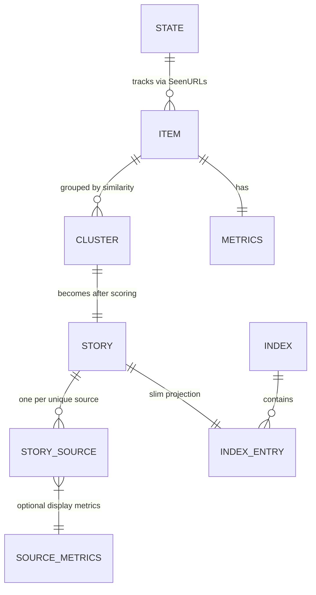
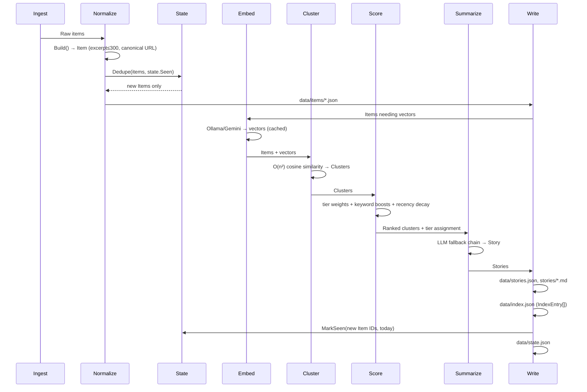

# Core Data Models

This chapter defines the canonical Go data types that flow through the Airfoil agent pipeline: `Item`, `Cluster`, `Story`, `StorySource`, `IndexEntry`, `Index`, `State`, `Metrics`, `SourceMetrics`, and the tier constants (`TierMajor`, `TierNotable`, `TierMinor`). These types live in `internal/model/types.go` and form the contract between ingest, normalize, embed, cluster, score, summarize, and write stages. The TypeScript mirrors in `site/src/types/story.ts` are documented in the sibling chapter *Data Models & Types*.

## Table of Contents

- [Tier Constants](#tier-constants)
- [Metrics & SourceMetrics](#metrics--sourcemetrics)
- [Item](#item)
- [Cluster](#cluster)
- [Story](#story)
- [StorySource](#storysource)
- [IndexEntry & Index](#indexentry--index)
- [State](#state)
- [Relationships & Data Flow](#relationships--data-flow)
- [Referenced Files](#referenced-files)

---

## Tier Constants

The tier constants classify story importance and drive scoring weights, source-type mapping, and UI badges. They are string constants (not `iota`) so they serialize stably to JSON.

`agent/internal/model/types.go:45-47`

```go
const (
	TierMajor   = "major"
	TierNotable = "notable"
	TierMinor   = "minor"
)
```

| Constant | Value | Numeric Tier (SourceTier) | SourceType | Typical Use |
|----------|-------|---------------------------|------------|-------------|
| `TierMajor` | `"major"` | ≤ 3 | `lab` | Breakthrough papers, major releases, significant funding |
| `TierNotable` | `"notable"` | 4 | `press` | Notable announcements, blog posts from known orgs |
| `TierMinor` | `"minor"` | ≥ 5 | `community` | Community discussions, minor updates, derivative work |

The `SourceType` function maps the numeric `SourceTier` (from `sources.json`) to the coarse category the site renders:

`agent/internal/model/types.go:91-100`

```go
func SourceType(tier int) string {
	switch {
	case tier <= 3:
		return "lab"
	case tier == 4:
		return "press"
	default:
		return "community"
	}
}
```

---

## Metrics & SourceMetrics

### Metrics

`Metrics` carries community-validation signals attached to an `Item`. These fields are populated during ingest (HN, Reddit, HF Papers, GitHub) and consumed by the scoring stage.

`agent/internal/model/types.go:28-34`

```go
type Metrics struct {
	HNPoints    int `json:"hn_points,omitempty"`
	HNComments  int `json:"hn_comments,omitempty"`
	RedditScore int `json:"reddit_score,omitempty"`
	HFUpvotes   int `json:"hf_upvotes,omitempty"`
	GitHubStars int `json:"github_stars,omitempty"`
}
```

| Field | Source | Description |
|-------|--------|-------------|
| `HNPoints` | Hacker News | Upvote count on the HN submission |
| `HNComments` | Hacker News | Comment count on the HN submission |
| `RedditScore` | Reddit | Net upvote score (upvotes − downvotes) |
| `HFUpvotes` | Hugging Face Papers | Upvote count on the paper page |
| `GitHubStars` | GitHub | Star count of the linked repository |

All fields use `omitempty` — absent signals serialize as null/omitted.

### SourceMetrics

`SourceMetrics` mirrors the per-source metrics block rendered on story pages. It is a subset of `Metrics` with renamed fields for the site's display layer.

`agent/internal/model/types.go:82-88`

```go
type SourceMetrics struct {
	Points   int `json:"points,omitempty"`
	Comments int `json:"comments,omitempty"`
	Score    int `json:"score,omitempty"`
	Upvotes  int `json:"upvotes,omitempty"`
	Stars    int `json:"stars,omitempty"`
}
```

| Field | Maps From | Display Label |
|-------|-----------|---------------|
| `Points` | `HNPoints` | "Points" |
| `Comments` | `HNComments` | "Comments" |
| `Score` | `RedditScore` | "Score" |
| `Upvotes` | `HFUpvotes` | "Upvotes" |
| `Stars` | `GitHubStars` | "Stars" |

---

## Item

`Item` is the normalized, deduplicated ingest unit — the atomic record after `normalize.Build` runs. One `Item` = one article from one source. Items are written to `data/items/*.json` (one file per item, named by `ID`).

`agent/internal/model/types.go:11-25`

```go
type Item struct {
	ID          string    `json:"id"` // sha256(canonicalURL)[:16]
	SourceID    string    `json:"source_id"`
	SourceName  string    `json:"source_name"`
	SourceTier  int       `json:"source_tier"`
	URL         string    `json:"url"` // canonical
	Title       string    `json:"title"`
	Excerpt     string    `json:"excerpt"`
	Author      string    `json:"author,omitempty"`
	PublishedAt time.Time `json:"published_at"`
	FetchedAt   time.Time `json:"fetched_at"`
	Metrics     Metrics   `json:"metrics"`
	RepoURL     string    `json:"repo_url,omitempty"`
	PaperURL    string    `json:"paper_url,omitempty"`
}
```

### Field Details

| Field | Type | Constraints / Notes |
|-------|------|---------------------|
| `ID` | `string` | SHA-256 of canonical URL, truncated to 16 hex chars. Generated by `normalize.ItemID`. Primary key for deduplication via `State.Seen`. |
| `SourceID` | `string` | Stable identifier from `sources.json` (e.g., `"hn"`, `"rss-openai"`). |
| `SourceName` | `string` | Human-readable name from `sources.json` (e.g., `"Hacker News"`, `"OpenAI Blog"`). |
| `SourceTier` | `int` | Numeric tier from `sources.json` (1–10). Drives `SourceType` and scoring weight. |
| `URL` | `string` | Canonical URL after `normalize.CanonicalURL` (wrapper unwrapping, variant collapsing). |
| `Title` | `string` | Cleaned title via `normalize.CleanTitle` (HTML entity decode, whitespace collapse). |
| `Excerpt` | `string` | **Hard-capped at 300 characters** by `normalize.Excerpt`. HTML stripped, whitespace collapsed. |
| `Author` | `string` | Optional; extracted from RSS `<author>` or HN `by` field. |
| `PublishedAt` | `time.Time` | Original publication timestamp (RFC3339 in JSON). |
| `FetchedAt` | `time.Time` | When the agent fetched this item (pipeline run timestamp). |
| `Metrics` | `Metrics` | Community signals (see above). Zero values for sources that don't provide them. |
| `RepoURL` | `string` | Extracted GitHub repo URL via `normalize.ExtractRepoURL` (e.g., `github.com/owner/repo`). |
| `PaperURL` | `string` | Extracted arXiv/HF paper URL via `normalize.ExtractPaperURL` (e.g., `arxiv.org/abs/...`). |

### Invariants (Enforced in `normalize`)

- **Excerpt ≤ 300 chars** — `normalize.Excerpt` truncates at 300 runes, appends `…` if truncated.
- **Canonical URL** — `normalize.CanonicalURL` removes tracking params (`utm_*`, `ref`, `fbclid`), unwraps known redirectors (`t.co`, `lnkd.in`), collapses `www`/non-`www`, lowercases host, max 3 redirect hops.
- **ID stability** — Same canonical URL → same `ID` → `State.Seen` blocks re-ingest.

---

## Cluster

`Cluster` groups `Item`s that cover the same event/story, determined by embedding similarity (O(n²) cosine similarity with threshold). A cluster becomes one `Story` after scoring and summarization.

`agent/internal/model/types.go:37-41`

```go
type Cluster struct {
	ID       string    `json:"id"`
	Items    []Item    `json:"items"`
	Centroid []float32 `json:"-"`
}
```

| Field | Type | Notes |
|-------|------|-------|
| `ID` | `string` | Generated as `cluster-<sha256(centroid)[:12]>` or similar deterministic hash. |
| `Items` | `[]Item` | All items in this cluster. Order preserved from similarity grouping. |
| `Centroid` | `[]float32` | Mean embedding vector of all items (used for cluster-to-cluster comparison). **Not serialized** (`json:"-"`). |

### Cluster → Story Mapping

- One `Cluster` → exactly one `Story` (if it passes score threshold).
- `ClusterSize` in `Story` and `IndexEntry` = `len(Cluster.Items)`.
- `Story.Sources` derives from unique `Item.SourceName`/`Item.URL` pairs in the cluster.
- Tier assignment happens in scoring stage based on cluster's highest-scoring item + keyword boosts.

---

## Story

`Story` is the publishable unit: a scored, summarized cluster with frontmatter for the site. Written to `data/stories.json` (authoritative) and rendered as Markdown in `site/src/content/stories/<slug>.md`.

`agent/internal/model/types.go:55-69`

```go
type Story struct {
	ID              string        `json:"id"`
	Slug            string        `json:"slug"`
	Title           string        `json:"title"`
	Summary         string        `json:"summary"`
	Score           int           `json:"score"`
	Tier            string        `json:"tier"` // "major" | "notable" | "minor"
	Tags            []string      `json:"tags"`
	BuilderRelevant bool          `json:"builder_relevant"`
	Date            time.Time     `json:"date"`
	ClusterSize     int           `json:"cluster_size"`
	Sources         []StorySource `json:"sources"`
	Takeaways       []string      `json:"takeaways,omitempty"`
	Body            []string      `json:"body,omitempty"`
}
```

### Field Details

| Field | Type | Source / Generation |
|-------|------|---------------------|
| `ID` | `string` | Same as `Cluster.ID` (stable across runs). |
| `Slug` | `string` | URL-safe: lowercase, hyphenated, derived from title + date (e.g., `2024-01-15-gpt-5-announced`). |
| `Title` | `string` | LLM-generated headline (distinct from item titles). |
| `Summary` | `string` | LLM-generated 1–2 sentence summary (original prose, not extracted). |
| `Score` | `int` | Final composite score from scoring stage (tier weight + keyword boost + recency decay). |
| `Tier` | `string` | One of `TierMajor`, `TierNotable`, `TierMinor`. Drives UI badge and sort weight. |
| `Tags` | `[]string` | LLM-extracted topics (e.g., `["llm", "release", "openai"]`). |
| `BuilderRelevant` | `bool` | Heuristic: true if tags contain builder-oriented keywords (SDK, API, framework, CLI). |
| `Date` | `time.Time` | Publication date for display/sort — typically earliest `Item.PublishedAt` in cluster. |
| `ClusterSize` | `int` | `len(Cluster.Items)` — number of sources covering this story. |
| `Sources` | `[]StorySource` | One entry per unique source in cluster (see `StorySource`). |
| `Takeaways` | `[]string` | Optional: LLM bullet-point takeaways (3–5 items). |
| `Body` | `[]string` | Optional: LLM-generated body paragraphs for long-form story page. |

### Serialization Notes

- `data/stories.json` is an array of `Story` — the **authoritative record**.
- Markdown files under `site/src/content/stories/` are **rendered from** `stories.json` at write time; the writer never parses frontmatter back.
- `Takeaways` and `Body` are `omitempty` — only present for tier `major` stories (configurable).

---

## StorySource

`StorySource` represents one outbound link on a story page. **R3**: every source a cluster drew from appears here — no deduplication of sources at story level.

`agent/internal/model/types.go:73-79`

```go
type StorySource struct {
	Name    string         `json:"name"`
	URL     string         `json:"url"`
	Tier    int            `json:"tier"`
	Type    string         `json:"type"` // lab | press | community
	Metrics *SourceMetrics `json:"metrics,omitempty"`
}
```

| Field | Type | Notes |
|-------|------|-------|
| `Name` | `string` | `Item.SourceName` (e.g., `"Hacker News"`, `"The Verge"`). |
| `URL` | `string` | `Item.URL` (canonical). |
| `Tier` | `int` | `Item.SourceTier` (numeric 1–10 from `sources.json`). |
| `Type` | `string` | `SourceType(Item.SourceTier)` → `"lab"`, `"press"`, or `"community"`. |
| `Metrics` | `*SourceMetrics` | Pointer so `omitempty` works; populated from `Item.Metrics` mapped to display fields. |

### Example (JSON)

```json
{
  "name": "Hacker News",
  "url": "https://news.ycombinator.com/item?id=42123456",
  "tier": 2,
  "type": "lab",
  "metrics": { "points": 342, "comments": 89 }
}
```

---

## IndexEntry & Index

### IndexEntry

`IndexEntry` is the slim record in `data/index.json` used by feed, top, and ship pages. It omits `Sources`, `Takeaways`, `Body` to keep the index small for client download.

`agent/internal/model/types.go:103-114`

```go
type IndexEntry struct {
	ID              string    `json:"id"`
	Slug            string    `json:"slug"`
	Title           string    `json:"title"`
	Summary         string    `json:"summary"`
	Score           int       `json:"score"`
	Tier            string    `json:"tier"`
	Tags            []string  `json:"tags"`
	BuilderRelevant bool      `json:"builder_relevant"`
	Date            time.Time `json:"date"`
	ClusterSize     int       `json:"cluster_size"`
}
```

| Field | Mirrors |
|-------|---------|
| All fields | Corresponding `Story` field |

### Index

`Index` wraps the generated-at timestamp and the story list.

`agent/internal/model/types.go:117-120`

```go
type Index struct {
	GeneratedAt time.Time    `json:"generated_at"`
	Stories     []IndexEntry `json:"stories"`
}
```

- `GeneratedAt` — pipeline completion timestamp (UTC).
- `Stories` — sorted by `Score` descending (primary), then `Date` descending (tiebreaker).
- Written to `data/index.json`; consumed by site at build time.

---

## State

`State` is `data/state.json` — the deduplication tracker that makes the agent idempotent (R7). It persists across runs.

`agent/internal/model/types.go:123-129`

```go
type State struct {
	// SeenURLs maps an item ID to the date it was first seen, as YYYY-MM-DD.
	SeenURLs map[string]string `json:"seen_urls"`
	// Cursors holds per-source high-water marks.
	Cursors map[string]string `json:"cursors"`
	LastRun *time.Time        `json:"last_run"`
}
```

### Fields

| Field | Type | Purpose |
|-------|------|---------|
| `SeenURLs` | `map[string]string` | Key = `Item.ID` (sha256(canonicalURL)[:16]), Value = `YYYY-MM-DD` (UTC day of first ingest). |
| `Cursors` | `map[string]string` | Key = `SourceID`, Value = source-specific cursor (e.g., HN max item ID, RSS feed etag, GitHub `since` timestamp). |
| `LastRun` | `*time.Time` | Timestamp of last successful pipeline completion (UTC). |

### Methods

#### NewState

`agent/internal/model/types.go:132-137`

```go
func NewState() *State {
	return &State{
		SeenURLs: map[string]string{},
		Cursors:  map[string]string{},
	}
}
```

Returns an empty, non-nil `State` (avoids nil map panics).

#### Seen

`agent/internal/model/types.go:140-143`

```go
func (s *State) Seen(id string) bool {
	_, ok := s.SeenURLs[id]
	return ok
}
```

Reports whether an item ID has already been ingested. Used by `normalize.Dedupe` to filter new items.

#### MarkSeen

`agent/internal/model/types.go:146-151`

```go
func (s *State) MarkSeen(id string, day time.Time) {
	if s.SeenURLs == nil {
		s.SeenURLs = map[string]string{}
	}
	s.SeenURLs[id] = day.UTC().Format(time.DateOnly)
}
```

Records an item ID as ingested on the given day (UTC). Called during write stage for each new `Item`.

### Idempotency Guarantee

- On re-run same day: `State.Seen(id)` returns `true` for previously ingested items → `Dedupe` drops them → zero new stories.
- Per-day granularity: if an item appears on day 1 and again on day 2, it **will** be re-ingested (new day key). This handles corrections/updates.

---

## Relationships & Data Flow





### Pipeline Stage ↔ Type Mapping

| Stage | Input Types | Output Types |
|-------|-------------|--------------|
| Ingest | — | `normalize.Raw` (pre-normalization) |
| Normalize | `Raw` | `Item` |
| Dedupe | `[]Item`, `State` | `[]Item` (new only) |
| Embed | `[]Item` | `[]Item` + vectors (cached) |
| Cluster | `[]Item` + vectors | `[]Cluster` |
| Score | `[]Cluster` | `[]Cluster` (with tier, score) |
| Summarize | `[]Cluster` | `[]Story` |
| Write | `[]Story`, `[]Item`, `State` | `data/stories.json`, `data/index.json`, `data/items/*.json`, `data/state.json` |

---

## Referenced Files

- `agent/internal/model/types.go` — All type definitions, constants, and `State` methods documented in this chapter (lines 11–151).

<!-- kaioken:files agent/internal/model/types.go -->
