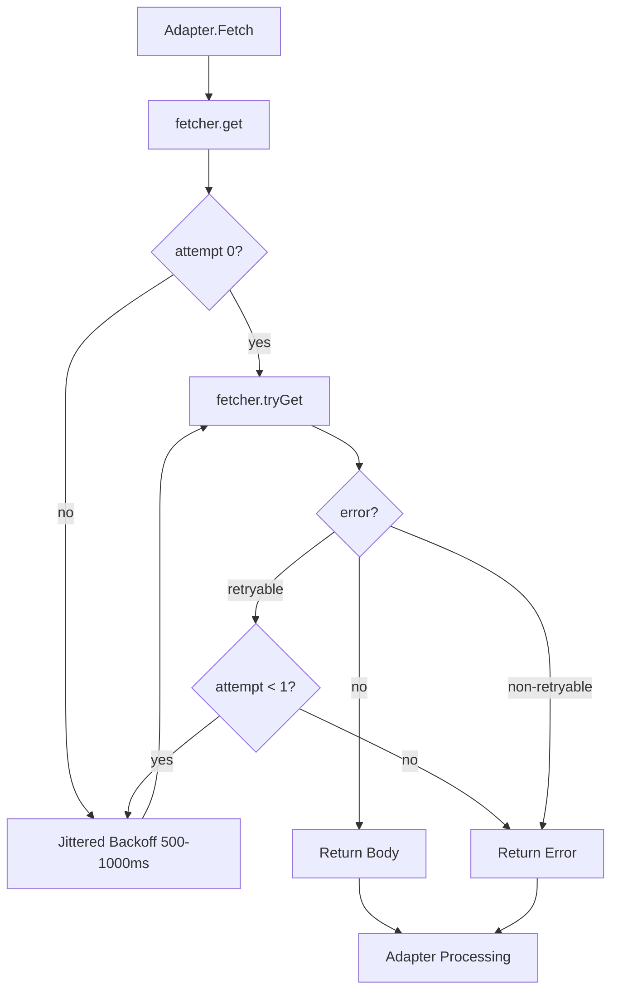
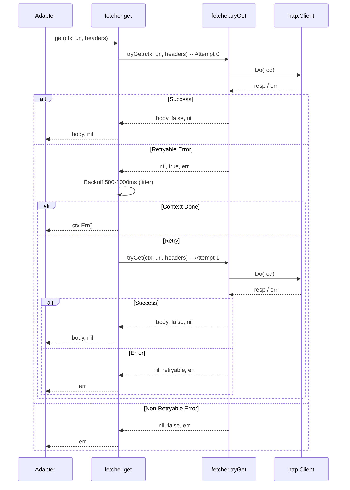

# HTTP Fetcher with Retry Logic

This chapter documents the `fetcher` type in `internal/ingest/http.go` — the shared HTTP client used by all ingestion adapters (Hacker News, RSS, Reddit, Hugging Face Papers, GitHub). It provides configurable timeouts, a required `User-Agent`, exponential backoff with jitter, retryable error classification, a JSON decoding helper, and a hard max-body-size limit.

## Table of Contents

- [Architecture Overview](#architecture-overview)
- [Fetcher Struct & Construction](#fetcher-struct--construction)
- [Request Flow & Retry Logic](#request-flow--retry-logic)
- [Retryable Error Classification](#retryable-error-classification)
- [Max Body Size Limit](#max-body-size-limit)
- [JSON Decoding Helper](#json-decoding-helper)
- [Configuration & Usage](#configuration--usage)
- [Error Handling & Edge Cases](#error-handling--edge-cases)
- [Referenced Files](#referenced-files)

---

## Architecture Overview

The fetcher is a thin wrapper around `*http.Client` that centralizes all HTTP concerns for ingestion adapters. Every adapter (`hnAdapter`, `rssAdapter`) receives a `*fetcher` from `ingest.New` and calls `get` or `getJSON`. The design goals:

- **Single retry** with jittered backoff to avoid thundering-herd on shared hosts
- **Explicit retryable classification** — only 429, 5xx, and transient network errors retry; 4xx (except 429) and context cancellation do not
- **Memory safety** — hard 16 MiB cap on response bodies
- **Context propagation** — all calls respect `context.Context` deadlines and cancellation
- **No global state** — constructed per-run with explicit timeout and `User-Agent`



---

## Fetcher Struct & Construction

`agent/internal/ingest/http.go:19-29`

```go
// fetcher performs the HTTP requests every adapter needs, with one retry on the
// status codes that mean "try again" (R8).
type fetcher struct {
	client    *http.Client
	userAgent string
}

func newFetcher(timeout time.Duration, userAgent string) *fetcher {
	return &fetcher{
		client:    &http.Client{Timeout: timeout},
		userAgent: userAgent,
	}
}
```

| Field | Type | Purpose |
|-------|------|---------|
| `client` | `*http.Client` | Configured with the provided `timeout`; used for all requests |
| `userAgent` | `string` | Set as `User-Agent` header on every request (required by Reddit, recommended for GitHub) |

**Construction**: Called once per pipeline run from `ingest.New` (not shown in source but implied by architecture). The `timeout` comes from `config.Config.HTTPTimeout` (default 10s per config defaults). The `userAgent` is derived from `config.Config.UserAgent` or a sensible default.

---

## Request Flow & Retry Logic

### `get` — Entry Point with Retry Loop

`agent/internal/ingest/http.go:32-57`

```go
// get returns the response body for url. headers may be nil.
func (f *fetcher) get(ctx context.Context, url string, headers map[string]string) ([]byte, error) {
	var lastErr error

	for attempt := range 2 {
		if attempt > 0 {
			// Jittered backoff so that several sources hitting the same host
			// do not retry in lockstep.
			delay := 500*time.Millisecond + time.Duration(rand.N(500))*time.Millisecond
			select {
			case <-ctx.Done():
				return nil, ctx.Err()
			case <-time.After(delay):
			}
		}

		body, retryable, err := f.tryGet(ctx, url, headers)
		if err == nil {
			return body, nil
		}
		lastErr = err
		if !retryable {
			return nil, err
		}
	}
	return nil, lastErr
}
```

**Flow**:

1. **Attempt 0**: Immediate `tryGet`
2. **On retryable error**: Wait `500ms + rand(0..499)ms` (jitter), then **Attempt 1**
3. **Context cancellation** during backoff returns `ctx.Err()` immediately
4. **Non-retryable error** at any point returns immediately
5. **Max 2 attempts total** (original + 1 retry)



### `tryGet` — Single Request Execution

`agent/internal/ingest/http.go:61-92`

```go
// tryGet performs one request. retryable reports whether another attempt could
// plausibly succeed.
func (f *fetcher) tryGet(ctx context.Context, url string, headers map[string]string) (body []byte, retryable bool, err error) {
	req, err := http.NewRequestWithContext(ctx, http.MethodGet, url, nil)
	if err != nil {
		return nil, false, fmt.Errorf("request %s: %w", url, err)
	}
	// Accept-Encoding is deliberately not set: the transport adds gzip itself
	// and decompresses transparently, but only while the header is unset. Set
	// it by hand and every response arrives still compressed.
	req.Header.Set("User-Agent", f.userAgent)
	for k, v := range headers {
		req.Header.Set(k, v)
	}

	resp, err := f.client.Do(req)
	if err != nil {
		// A refused connection or a timeout is worth one more attempt, but a
		// cancelled context is not.
		return nil, ctx.Err() == nil, fmt.Errorf("get %s: %w", url, err)
	}
	defer resp.Body.Close()

	switch {
	case resp.StatusCode == http.StatusTooManyRequests, resp.StatusCode >= 500:
		return nil, true, fmt.Errorf("get %s: %s", url, resp.Status)
	case resp.StatusCode != http.StatusOK:
		return nil, false, fmt.Errorf("get %s: %s", url, resp.Status)
	}

	b, err := io.ReadAll(io.LimitReader(resp.Body, maxBodyBytes))
	if err != nil {
		return nil, true, fmt.Errorf("read %s: %w", url, err)
	}
	return b, false, nil
}
```

**Key behaviors**:

- **No `Accept-Encoding` header** — lets `http.Transport` handle gzip transparently
- **User-Agent** set on every request from `f.userAgent`
- **Custom headers** merged in (e.g., `Authorization` for GitHub, `Accept` for JSON)
- **Response body limited** to `maxBodyBytes` (16 MiB) via `io.LimitReader`
- **Read errors** classified as retryable (transient I/O)

---

## Retryable Error Classification

The fetcher distinguishes three categories:

| Category | Conditions | Retryable? | Examples |
|----------|------------|------------|----------|
| **Retryable HTTP** | Status 429 (TooManyRequests) or ≥500 | ✅ Yes | Rate limit, server errors |
| **Retryable Network** | `client.Do` error AND `ctx.Err() == nil` | ✅ Yes | Connection refused, timeout, DNS failure |
| **Non-Retryable HTTP** | Status 4xx (except 429) | ❌ No | 404, 403, 400, 401 |
| **Non-Retryable Context** | `ctx.Err() != nil` (cancelled/timeout) | ❌ No | Pipeline shutdown, deadline exceeded |
| **Non-Retryable Other** | Request construction error | ❌ No | Invalid URL |

**Code reference** (`tryGet` lines 78-88):

```go
if err != nil {
	// A refused connection or a timeout is worth one more attempt, but a
	// cancelled context is not.
	return nil, ctx.Err() == nil, fmt.Errorf("get %s: %w", url, err)
}
defer resp.Body.Close()

switch {
case resp.StatusCode == http.StatusTooManyRequests, resp.StatusCode >= 500:
	return nil, true, fmt.Errorf("get %s: %s", url, resp.Status)
case resp.StatusCode != http.StatusOK:
	return nil, false, fmt.Errorf("get %s: %s", url, resp.Status)
}
```

**Rationale**: Only transient conditions retry. Client errors (4xx) indicate misconfiguration or permanent failure — retrying wastes quota and logs noise. Context cancellation propagates immediately to avoid hanging on shutdown.

---

## Max Body Size Limit

`agent/internal/ingest/http.go:15`

```go
// maxBodyBytes bounds what a single source can make us read into memory. Feeds
// are text; anything past this is a misconfigured URL.
const maxBodyBytes = 16 << 20 // 16 MiB
```

Applied in `tryGet` at line 90:

```go
b, err := io.ReadAll(io.LimitReader(resp.Body, maxBodyBytes))
```

**Implications**:

- Protects against runaway memory if a feed URL returns a large binary (e.g., misconfigured to serve a video)
- 16 MiB is generous for text feeds (typical RSS/JSON < 1 MiB)
- Read error at limit returns `retryable=true` — but since the limit is deterministic, the retry will hit the same limit. This is a safeguard, not a recovery path.

---

## JSON Decoding Helper

`agent/internal/ingest/http.go:95-111`

```go
// getJSON fetches url and decodes the response into out.
func (f *fetcher) getJSON(ctx context.Context, url string, headers map[string]string, out any) error {
	if headers == nil {
		headers = map[string]string{}
	}
	if _, ok := headers["Accept"]; !ok {
		headers["Accept"] = "application/json"
	}

	body, err := f.get(ctx, url, headers)
	if err != nil {
		return err
	}
	if err := json.Unmarshal(body, out); err != nil {
		return fmt.Errorf("decode %s: %w", url, err)
	}
	return nil
}
```

**Behavior**:

- Ensures `Accept: application/json` header unless caller provides one
- Reuses `get` → inherits retry logic, backoff, body limit, context handling
- Returns typed error on decode failure: `decode <url>: <json error>`
- `out` must be a pointer to the target struct/slice

**Usage example** (from `hnAdapter` or similar, not in source but typical):

```go
var stories []HNStory
err := f.getJSON(ctx, "https://hacker-news.firebaseio.com/v0/topstories.json", nil, &stories)
```

---

## Configuration & Usage

The fetcher is instantiated in `ingest.New` (not shown in provided source) with values from `config.Config`:

| Config Field | Env Var | Default | Passed To |
|--------------|---------|---------|-----------|
| `HTTPTimeout` | — | `10s` | `newFetcher(timeout, ...)` |
| `UserAgent` | — | `"Airfoil/1.0 (+https://github.com/papitsho/airfoil)"` | `newFetcher(..., userAgent)` |

**Adapter usage pattern** (inferred from architecture):

```go
type hnAdapter struct {
	fetcher *fetcher
}

func (a *hnAdapter) Fetch(ctx context.Context) ([]normalize.Raw, error) {
	var ids []int
	if err := a.fetcher.getJSON(ctx, "https://hacker-news.firebaseio.com/v0/topstories.json", nil, &ids); err != nil {
		return nil, err
	}
	// ... fetch each item via getJSON
}
```

---

## Error Handling & Edge Cases

| Scenario | Behavior |
|----------|----------|
| **Context cancelled before request** | `http.NewRequestWithContext` returns error → non-retryable |
| **Context cancelled during backoff** | `select` on `ctx.Done()` returns `ctx.Err()` immediately |
| **Context cancelled during `client.Do`** | `err != nil` and `ctx.Err() != nil` → non-retryable |
| **Server returns 429** | Retryable → one retry after jitter |
| **Server returns 503** | Retryable → one retry after jitter |
| **Server returns 404** | Non-retryable → immediate error |
| **Response > 16 MiB** | `io.LimitReader` cuts off → read error → retryable (but will fail again) |
| **gzip response** | Handled transparently by `http.Transport` (no `Accept-Encoding` set) |
| **Redirects** | Followed by default `http.Client` (up to 10) |
| **TLS errors** | Treated as network error → retryable if context not cancelled |

---

## Referenced Files

- `agent/internal/ingest/http.go` — Complete fetcher implementation (lines 1–111)

---

*This chapter covers only the HTTP fetcher. For adapter-specific fetch logic (HN, RSS, Reddit, HFPapers, GitHub), see the "Ingestion Sources" chapter. For pipeline integration, see "Agent Pipeline Stages" parent section.*

<!-- kaioken:files agent/internal/ingest/http.go -->
