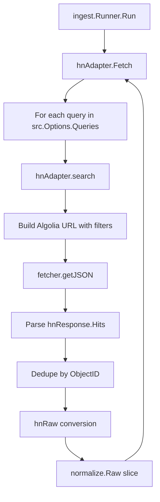

# Hacker News Adapter

This chapter details the `hnAdapter` implementation in `agent/internal/ingest/hn.go`. It covers the Algolia API search endpoints, query construction with `minPoints` and time filters, hit-to-`Raw` conversion, and handling of HN-specific fields (points, comments, author).

## Table of Contents

- [Architecture Overview](#architecture-overview)
- [Adapter Structure and Registration](#adapter-structure-and-registration)
- [Algolia API Search Flow](#algolia-api-search-flow)
- [Query Construction](#query-construction)
- [Hit-to-Raw Conversion](#hit-to-raw-conversion)
- [HN-Specific Fields Handling](#hn-specific-fields-handling)
- [Error Handling and Edge Cases](#error-handling-and-edge-cases)
- [Referenced Files](#referenced-files)

---

## Architecture Overview

The `hnAdapter` implements the `ingest.Adapter` interface and fetches Hacker News submissions via the **Algolia Search API** (hosted at `https://hn.algolia.com/api/v1/search`). It is instantiated by the `ingest.Runner` during pipeline initialization and invoked once per configured HN source in `sources.json`.



**Key design points:**
- One HTTP request per configured keyword query
- Client-side deduplication by `ObjectID` across queries
- Submissions without outbound links (Ask HN, text posts) resolve to the HN discussion page
- HN is treated as a "tier 5 signal" — points serve as a proxy for engineer interest

---

## Adapter Structure and Registration

The adapter is a minimal struct wrapping the shared HTTP `fetcher`:

`agent/internal/ingest/hn.go:19-23`

```go
type hnAdapter struct {
	fetch *fetcher
}

func newHNAdapter(f *fetcher) *hnAdapter { return &hnAdapter{fetch: f} }
```

The `Type()` method returns the source type identifier used in configuration:

`agent/internal/ingest/hn.go:25`

```go
func (a *hnAdapter) Type() string { return config.SourceHN }
```

`config.SourceHN` is a constant defined in `internal/config` (value: `"hn"`). The `fetcher` provides timeout, retry, and JSON decoding logic shared across adapters.

---

## Algolia API Search Flow

The `Fetch` method orchestrates the search loop:

`agent/internal/ingest/hn.go:42-77`

```go
func (a *hnAdapter) Fetch(ctx context.Context, src config.Source) ([]normalize.Raw, error) {
	opts := src.Options
	if len(opts.Queries) == 0 {
		return nil, fmt.Errorf("hn: no queries configured for %s", src.ID)
	}

	hoursBack := opts.HoursBack
	if hoursBack <= 0 {
		hoursBack = 48
	}
	after := time.Now().Add(-time.Duration(hoursBack) * time.Hour).Unix()

	// One submission often matches several keywords.
	seen := make(map[string]bool)
	var out []normalize.Raw

	for _, query := range opts.Queries {
		hits, err := a.search(ctx, src.URL, query, opts.MinPoints, after)
		if err != nil {
			return nil, err
		}
		for _, hit := range hits {
			if seen[hit.ObjectID] {
				continue
			}
			seen[hit.ObjectID] = true

			raw, ok := hnRaw(hit, src)
			if !ok {
				continue
			}
			out = append(out, raw)
		}
	}
	return out, nil
}
```

**Flow details:**

| Step | Description |
|------|-------------|
| 1 | Validate `src.Options.Queries` is non-empty |
| 2 | Compute `after` timestamp: `now - HoursBack` (default 48h) |
| 3 | Iterate each query keyword |
| 4 | Call `search` with endpoint, query, `MinPoints`, `after` |
| 5 | Deduplicate hits by `ObjectID` across all queries |
| 6 | Convert each unique hit via `hnRaw` |
| 7 | Return accumulated `[]normalize.Raw` |

The `search` method performs the actual HTTP request:

`agent/internal/ingest/hn.go:79-96`

```go
func (a *hnAdapter) search(ctx context.Context, endpoint, query string, minPoints int, after int64) ([]hnHit, error) {
	filters := fmt.Sprintf("created_at_i>%d", after)
	if minPoints > 0 {
		filters += ",points>" + strconv.Itoa(minPoints)
	}

	q := url.Values{}
	q.Set("query", query)
	q.Set("tags", "story")
	q.Set("numericFilters", filters)
	q.Set("hitsPerPage", "50")

	var resp hnResponse
	if err := a.fetch.getJSON(ctx, endpoint+"?"+q.Encode(), nil, &resp); err != nil {
		return nil, fmt.Errorf("hn %q: %w", query, err)
	}
	return resp.Hits, nil
}
```

---

## Query Construction

The Algolia query parameters are built in `search`:

| Parameter | Value | Purpose |
|-----------|-------|---------|
| `query` | Keyword from `src.Options.Queries` | Full-text search on title/body |
| `tags` | `"story"` | Restrict to story submissions (exclude comments, polls) |
| `numericFilters` | `created_at_i>{after}[,points>{minPoints}]` | Time window + optional minimum points |
| `hitsPerPage` | `"50"` | Maximum results per request |

**Numeric filters syntax:** Algolia expects comma-separated conditions. The code constructs:

```
created_at_i>1704067200,points>10
```

- `created_at_i` — Unix timestamp of submission creation
- `points` — Upvote count (HN "points")

**Default behavior:** If `HoursBack` is not set or ≤ 0, it defaults to 48 hours. If `MinPoints` is 0 or unset, the points filter is omitted entirely.

---

## Hit-to-Raw Conversion

The `hnRaw` function converts an Algolia hit to the pipeline's `normalize.Raw` type:

`agent/internal/ingest/hn.go:100-127`

```go
// hnRaw converts a hit. Submissions with no outbound link (Ask HN, and text
// posts) point at the discussion itself.
func hnRaw(hit hnHit, src config.Source) (normalize.Raw, bool) {
	if hit.Title == "" {
		return normalize.Raw{}, false
	}

	link := hit.URL
	if link == "" {
		if hit.ObjectID == "" {
			return normalize.Raw{}, false
		}
		link = "https://news.ycombinator.com/item?id=" + hit.ObjectID
	}

	return normalize.Raw{
		SourceID:    src.ID,
		SourceName:  src.Name,
		SourceTier:  src.Tier,
		URL:         link,
		Title:       hit.Title,
		Body:        hit.StoryText,
		Author:      hit.Author,
		PublishedAt: time.Unix(hit.CreatedAtI, 0).UTC(),
		Metrics: model.Metrics{
			HNPoints:   hit.Points,
			HNComments: hit.NumComments,
		},
	}, true
}
```

**Conversion rules:**

| HN Field | Raw Field | Notes |
|----------|-----------|-------|
| `objectID` | — | Used for deduplication; becomes discussion URL if no outbound link |
| `title` | `Title` | Required; empty title → rejection |
| `url` | `URL` | If empty, construct `https://news.ycombinator.com/item?id={objectID}` |
| `author` | `Author` | Username string |
| `story_text` | `Body` | Raw HTML/text content (may be empty for link posts) |
| `created_at_i` | `PublishedAt` | Converted to UTC `time.Time` |
| `points` | `Metrics.HNPoints` | Integer upvote count |
| `num_comments` | `Metrics.HNComments` | Integer comment count |
| `src.ID/Name/Tier` | `SourceID/SourceName/SourceTier` | Propagated from source config |

**Rejection conditions:**
1. Empty `Title`
2. Empty `URL` **and** empty `ObjectID` (cannot construct discussion link)

---

## HN-Specific Fields Handling

The `hnHit` struct captures all relevant Algolia response fields:

`agent/internal/ingest/hn.go:31-40`

```go
type hnHit struct {
	ObjectID    string `json:"objectID"`
	Title       string `json:"title"`
	URL         string `json:"url"`
	Author      string `json:"author"`
	StoryText   string `json:"story_text"`
	Points      int    `json:"points"`
	NumComments int    `json:"num_comments"`
	CreatedAtI  int64  `json:"created_at_i"`
}
```

These fields map to the `model.Metrics` struct (defined in `internal/model`):

```go
type Metrics struct {
	HNPoints   int
	HNComments int
	// ... other source-specific metrics
}
```

**Downstream usage:** The `Metrics` struct flows through normalization into `model.Item`, where scoring consumes `HNPoints` and `HNComments` via the scoring configuration (`config/scoring.json`). The tier assignment and keyword boosting also consider these metrics.

---

## Error Handling and Edge Cases

| Scenario | Handling |
|----------|----------|
| No queries configured | `Fetch` returns error: `"hn: no queries configured for {src.ID}"` |
| HTTP request failure | `fetcher.getJSON` error wrapped with query context: `"hn {query}: {err}"` |
| Empty title | `hnRaw` returns `(Raw{}, false)` — hit skipped |
| Missing URL + missing ObjectID | `hnRaw` returns `(Raw{}, false)` — hit skipped |
| Duplicate ObjectID across queries | `seen` map in `Fetch` deduplicates; only first occurrence kept |
| `HoursBack` ≤ 0 | Defaults to 48 hours |
| `MinPoints` ≤ 0 | Points filter omitted from Algolia query |
| Empty `StoryText` | Stored as empty string in `Raw.Body`; normalization handles missing content |

**Rate limiting:** The shared `fetcher` implements retry with exponential backoff and respects HTTP 429 responses. No HN-specific rate limit handling exists beyond the generic fetcher.

---

## Referenced Files

- `agent/internal/ingest/hn.go` — Complete adapter implementation (lines 1–127)
- `agent/internal/config` — `SourceHN` constant, `Source` and `SourceOptions` types
- `agent/internal/normalize` — `Raw` type definition
- `agent/internal/model` — `Metrics` type definition
- `agent/internal/ingest/fetcher.go` — Shared HTTP fetcher with timeout/retry (not shown in scope but referenced)

<!-- kaioken:files agent/internal/ingest/hn.go -->
