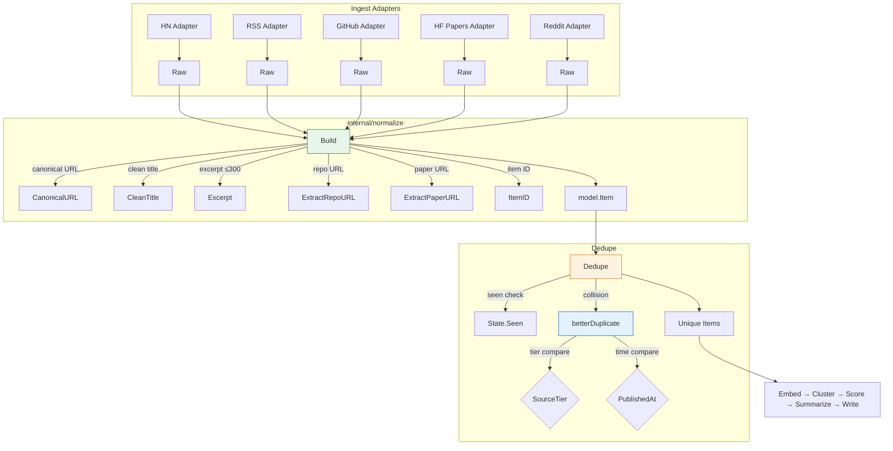

# Item Construction & Deduplication

This chapter covers the normalization stage that transforms raw ingest output into canonical `model.Item` records and removes duplicates both within a single run and across runs. The three core functions — `Build`, `Dedupe`, and `betterDuplicate` — live in `internal/normalize/normalize.go` and are pure, table-driven tested.

## Table of Contents

- [Raw Input Structure](#raw-input-structure)
- [Build: Raw → Item](#build-raw--item)
  - [Canonical URL Resolution](#canonical-url-resolution)
  - [Title Cleaning](#title-cleaning)
  - [Publication Time Handling](#publication-time-handling)
  - [Repository & Paper URL Extraction](#repository--paper-url-extraction)
  - [Excerpt Generation (300-char Cap)](#excerpt-generation-300-char-cap)
  - [Item Assembly](#item-assembly)
- [Dedupe: Within-Run & Cross-Run Filtering](#dedupe-within-run--cross-run-filtering)
  - [Seen Function Contract](#seen-function-contract)
  - [Collision Resolution](#collision-resolution)
- [betterDuplicate: Comparison Logic](#betterduplicate-comparison-logic)
- [Data Flow Diagram](#data-flow-diagram)
- [Referenced Files](#referenced-files)

---

## Raw Input Structure

Every ingest adapter produces a `Raw` value before normalization. The struct captures whatever the source provided — unescaped HTML, tracking URLs, possibly missing dates.

`agent/internal/normalize/normalize.go:17-35`

```go
// Raw is what an ingest adapter produces before normalization. Fields are
// whatever the source gave us — unescaped HTML, tracking URLs, missing dates.
type Raw struct {
	SourceID   string
	SourceName string
	SourceTier int

	URL         string
	Title       string
	Body        string // summary or content HTML from the feed
	Author      string
	PublishedAt time.Time

	Metrics model.Metrics

	// RepoURL and PaperURL may be set by adapters that already know them, such
	// as the GitHub and HuggingFace papers adapters. Otherwise they are
	// extracted from URL, title, and body.
	RepoURL  string
	PaperURL string
}
```

| Field | Purpose |
|-------|---------|
| `SourceID` | Unique identifier for the source (e.g., `hn`, `rss-github-trending`) |
| `SourceName` | Human-readable name |
| `SourceTier` | Authority tier: lower = more authoritative (0=Major, 1=Notable, 2=Minor) |
| `URL` | Original link from the feed (may contain tracking params, wrappers) |
| `Title` | Raw title, may contain HTML entities or source-specific prefixes |
| `Body` | Summary or content HTML from the feed |
| `Author` | Author string, may have extra whitespace |
| `PublishedAt` | Publication timestamp from feed; may be zero |
| `Metrics` | Source-provided engagement metrics (stars, upvotes, comments) |
| `RepoURL` | Pre-extracted repository URL (GitHub adapter sets this) |
| `PaperURL` | Pre-extracted paper URL (HuggingFace Papers adapter sets this) |

---

## Build: Raw → Item

`Build` is the **only** path that constructs a `model.Item`. This enforces the excerpt cap (R1) and canonicalization before anything reaches disk.

`agent/internal/normalize/normalize.go:41-82`

```go
// Build normalizes a Raw into an Item.
//
// now is the fetch time, used both as FetchedAt and as the fallback publication
// date for feeds that omit one. maxExcerpt is the R1 cap in characters.
func Build(r Raw, now time.Time, maxExcerpt int) (model.Item, error) {
	canonical, err := CanonicalURL(r.URL)
	if err != nil {
		return model.Item{}, fmt.Errorf("normalize: %s: %w", r.SourceID, err)
	}

	title := CleanTitle(r.Title, r.SourceName)
	if title == "" {
		return model.Item{}, fmt.Errorf("normalize: %s: empty title for %s", r.SourceID, canonical)
	}

	// A publication date in the future is a feed bug, and it would win every
	// recency comparison. Clamp it to now.
	published := r.PublishedAt.UTC()
	if published.IsZero() || published.After(now.UTC()) {
		published = now.UTC()
	}

	repo, paper := r.RepoURL, r.PaperURL
	if repo == "" {
		repo = ExtractRepoURL(canonical, r.Title, r.Body)
	}
	if paper == "" {
		paper = ExtractPaperURL(canonical, r.Title, r.Body)
	}

	return model.Item{
		ID:          ItemID(canonical),
		SourceID:    r.SourceID,
		SourceName:  r.SourceName,
		SourceTier:  r.SourceTier,
		URL:         canonical,
		Title:       title,
		Excerpt:     Excerpt(r.Body, maxExcerpt), // R1
		Author:      CollapseSpace(r.Author),
		PublishedAt: published,
		FetchedAt:   now.UTC(),
		Metrics:     r.Metrics,
		RepoURL:     repo,
		PaperURL:    paper,
	}, nil
}
```

### Canonical URL Resolution

The first step resolves the raw URL to a canonical form via `CanonicalURL` (defined elsewhere in the package). This unwraps tracking parameters, collapses known redirector variants, and enforces recursion bounds to avoid loops.

**Behavior**: If canonicalization fails, `Build` returns an error wrapping the source ID for traceability.

### Title Cleaning

`CleanTitle(r.Title, r.SourceName)` strips HTML entities, removes source-specific prefixes (e.g., "Show HN:"), and collapses whitespace. An empty title after cleaning is an error — the item cannot be identified.

### Publication Time Handling

```go
published := r.PublishedAt.UTC()
if published.IsZero() || published.After(now.UTC()) {
    published = now.UTC()
}
```

- Zero `PublishedAt` → fallback to fetch time (`now`)
- Future `PublishedAt` (feed bug) → clamped to `now`
- Both stored as UTC

The `FetchedAt` field is always set to `now.UTC()` — the moment the agent fetched this item.

### Repository & Paper URL Extraction

If the adapter did not pre-populate `RepoURL` or `PaperURL`, extraction runs against the **canonical URL**, title, and body:

- `ExtractRepoURL(canonical, title, body)` — detects GitHub repository URLs
- `ExtractPaperURL(canonical, title, body)` — detects arXiv/HuggingFace paper URLs

These are best-effort; empty strings are valid outcomes.

### Excerpt Generation (300-char Cap)

`Excerpt(r.Body, maxExcerpt)` enforces the **R1 structural limit**: excerpts are capped at `maxExcerpt` characters (configured as 300). The function:
1. Strips HTML tags (`StripHTML`)
2. Collapses whitespace (`CollapseSpace`)
3. Truncates at `maxExcerpt` without breaking mid-word (adds `…` if truncated)

This cap is applied **once**, at construction, guaranteeing no stored item exceeds it.

### Item Assembly

The returned `model.Item` contains:

| Field | Source |
|-------|--------|
| `ID` | `ItemID(canonical)` — deterministic hash of canonical URL |
| `SourceID` / `SourceName` / `SourceTier` | Copied from `Raw` |
| `URL` | Canonical URL |
| `Title` | Cleaned title |
| `Excerpt` | Capped at `maxExcerpt` (300) |
| `Author` | `CollapseSpace(r.Author)` |
| `PublishedAt` | Clamped/fallback UTC time |
| `FetchedAt` | `now.UTC()` |
| `Metrics` | Copied from `Raw` |
| `RepoURL` | Adapter-provided or extracted |
| `PaperURL` | Adapter-provided or extracted |

---

## Dedupe: Within-Run & Cross-Run Filtering

`Dedupe` removes items whose ID has already been seen. It handles two collision domains:

1. **Within a single run** — two feeds carrying the same article (same canonical URL)
2. **Across runs** — `state.Seen` checks `data/state.json` (per-day keys)

`agent/internal/normalize/normalize.go:90-108`

```go
// Dedupe removes items whose ID has already been seen, keeping the first
// occurrence. Within a single run, two feeds carrying the same article collapse
// to one item; across runs, state.SeenURLs does the same job (R7).
//
// The higher-tier item wins a collision, so a lab blog post beats the press
// rewrite of it that happens to share a canonical URL.
func Dedupe(items []model.Item, seen func(id string) bool) []model.Item {
	byID := make(map[string]int, len(items))
	out := make([]model.Item, 0, len(items))

	for _, item := range items {
		if seen != nil && seen(item.ID) {
			continue
		}
		if at, dup := byID[item.ID]; dup {
			if betterDuplicate(item, out[at]) {
				out[at] = item
			}
			continue
		}
		byID[item.ID] = len(out)
		out = append(out, item)
	}
	return out
}
```

### Seen Function Contract

```go
seen func(id string) bool
```

- Called with the item's `ID` (hash of canonical URL)
- Returns `true` if the item was already processed in a prior run (persisted in `data/state.json`)
- `nil` is valid — means no cross-run state available (first run or tests)
- Implemented by `model.State.Seen` which checks per-day keys

### Collision Resolution

Two items with the same `ID` within one run → `betterDuplicate` decides which to keep:

```go
if at, dup := byID[item.ID]; dup {
    if betterDuplicate(item, out[at]) {
        out[at] = item
    }
    continue
}
```

- The **first** occurrence is stored at index `at`
- Subsequent duplicates are compared via `betterDuplicate`
- Winner replaces the stored item
- Order of input matters only for tie-breaking when `betterDuplicate` returns `false` for both directions

---

## betterDuplicate: Comparison Logic

Determines which of two items with the same canonical URL is the "better" representation. Lower tier number = more authoritative source.

`agent/internal/normalize/normalize.go:112-117`

```go
// betterDuplicate reports whether a should replace b. Lower tier number is a
// more authoritative source; ties go to the earlier publication.
func betterDuplicate(a, b model.Item) bool {
	if a.SourceTier != b.SourceTier {
		return a.SourceTier < b.SourceTier
	}
	return a.PublishedAt.Before(b.PublishedAt)
}
```

### Decision Matrix

| Condition | Winner |
|-----------|--------|
| `a.SourceTier < b.SourceTier` | `a` (more authoritative) |
| `a.SourceTier > b.SourceTier` | `b` (more authoritative) |
| Tiers equal, `a.PublishedAt < b.PublishedAt` | `a` (earlier publication) |
| Tiers equal, `a.PublishedAt > b.PublishedAt` | `b` (earlier publication) |
| Tiers equal, same `PublishedAt` | `b` (first-seen wins — `betterDuplicate` returns `false` both ways) |

### Tier Semantics (from `model`)

| Constant | Value | Meaning |
|----------|-------|---------|
| `TierMajor` | 0 | Lab blogs, official announcements, primary sources |
| `TierNotable` | 1 | Technical aggregators, curated newsletters |
| `TierMinor` | 2 | Press rewrites, social media links, secondary coverage |

**Example**: A GitHub blog post (TierMajor=0) and a Hacker News submission linking to it (TierMinor=2) share a canonical URL → the GitHub post wins.

---

## Data Flow Diagram



---

## Referenced Files

| File | Role |
|------|------|
| `agent/internal/normalize/normalize.go` | Core normalization: `Raw`, `Build`, `Dedupe`, `betterDuplicate` |
| `agent/internal/model/item.go` | `Item` struct definition (referenced, not in scope) |
| `agent/internal/model/state.go` | `State.Seen` / `MarkSeen` implementation (referenced) |
| `agent/internal/normalize/url.go` | `CanonicalURL`, `ExtractRepoURL`, `ExtractPaperURL` (referenced) |
| `agent/internal/normalize/text.go` | `CleanTitle`, `Excerpt`, `CollapseSpace`, `StripHTML` (referenced) |
| `agent/internal/normalize/id.go` | `ItemID` (referenced) |
| `agent/internal/ingest/adapter.go` | Adapters producing `Raw` (referenced) |
| `config/sources.json` | Source tier assignments (referenced) |

<!-- kaioken:files agent/internal/normalize/normalize.go -->
