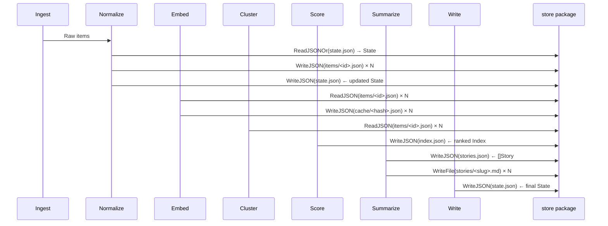

# JSON Persistence Layer

The `internal/store` package provides the atomic, crash-safe JSON persistence layer used throughout the Airfoil agent pipeline. Every JSON artifact the agent produces — per-item files under `data/items/`, the ranked `data/index.json`, the deduplication `data/state.json`, and the site-facing `data/stories.json` — is read and written through these functions. The layer guarantees that a crashed run never leaves a half-written file: writes go to a temporary file in the destination directory and are renamed into place only after a successful `fsync`.

## Table of Contents

- [Package Overview](#package-overview)
- [Read Operations](#read-operations)
  - [ReadJSON](#readjson)
  - [ReadJSONOr](#readjsonor)
- [Write Operations](#write-operations)
  - [WriteJSON](#writejson)
  - [WriteFile](#writefile)
- [Utility](#utility)
  - [Exists](#exists)
- [Atomic Write Guarantees](#atomic-write-guarantees)
- [Directory Creation & Permissions](#directory-creation--permissions)
- [Error Handling Patterns](#error-handling-patterns)
- [Pipeline Integration](#pipeline-integration)
- [Concurrency Considerations](#concurrency-considerations)
- [Referenced Files](#referenced-files)

---

## Package Overview

```
agent/internal/store/json.go
```

The package exports five functions, all pure and stateless. They operate on file paths provided by the caller (typically derived from `config.Config` — see [Configuration System](../Configuration%20System/)). No global state, no background goroutines, no caching.

| Function | Purpose | Atomic? | Creates Directories? |
|----------|---------|---------|---------------------|
| `ReadJSON[T]` | Decode JSON file into `T` | N/A (read) | No |
| `ReadJSONOr[T]` | Decode with fallback on missing file | N/A (read) | No |
| `WriteJSON` | Encode value as indented JSON, write atomically | **Yes** | Yes (0755) |
| `WriteFile` | Write raw bytes atomically | **Yes** | Yes (0755) |
| `Exists` | Check path existence | N/A (stat) | No |

All functions accept a `path string` — the caller is responsible for constructing absolute or relative paths. The package does not interpret path semantics (e.g., it does not know about `ItemsDir` or `IndexPath`).

---

## Read Operations

### ReadJSON

```
agent/internal/store/json.go:19-29
```

```go
func ReadJSON[T any](path string) (T, error) {
	var v T
	b, err := os.ReadFile(path)
	if err != nil {
		return v, fmt.Errorf("store: read %s: %w", path, err)
	}
	if err := json.Unmarshal(b, &v); err != nil {
		return v, fmt.Errorf("store: parse %s: %w", path, err)
	}
	return v, nil
}
```

**Behavior:**
- Reads the entire file into memory (`os.ReadFile`).
- Unmarshals into the generic type parameter `T`.
- Returns a zero value of `T` on any error.
- Errors are wrapped with the path for debugging: `"store: read <path>: <cause>"` or `"store: parse <path>: <cause>"`.
- A missing file yields an error satisfying `errors.Is(err, fs.ErrNotExist)` — callers can distinguish "not found" from "corrupt" or "permission denied".

**Type parameter constraints:** None. `T` can be any type supported by `encoding/json` (structs, slices, maps, pointers, primitives). The pipeline uses it for `model.Index`, `model.State`, `[]model.Item`, `[]model.Story`, and `model.Metrics`.

**Example usage (reading the index):**

```go
idx, err := store.ReadJSON[model.Index](cfg.IndexPath)
if err != nil {
    return fmt.Errorf("load index: %w", err)
}
```

### ReadJSONOr

```
agent/internal/store/json.go:34-40
```

```go
func ReadJSONOr[T any](path string, fallback T) (T, error) {
	v, err := ReadJSON[T](path)
	if err != nil && errors.Is(err, fs.ErrNotExist) {
		return fallback, nil
	}
	return v, err
}
```

**Behavior:**
- Delegates to `ReadJSON`.
- If the error is *exactly* "file does not exist" (`fs.ErrNotExist`), returns the provided `fallback` value and `nil` error.
- **Any other error** (corrupt JSON, permission denied, I/O error) is propagated unchanged — the function **does not** silently swallow parse failures. This is intentional: corrupt state would break idempotency guarantees (see [Normalization & Deduplication](../Normalization%20&%20Deduplication/)).

**When to use:**
- First run (no `state.json` yet) → `ReadJSONOr(cfg.StatePath, model.State{})`
- Optional cache files that may not exist on cold start
- Any artifact that is valid to start empty

**When NOT to use:**
- Required artifacts where missing indicates a pipeline bug (e.g., `index.json` after a successful run)
- Cases where a parse error should be surfaced immediately

---

## Write Operations

### WriteJSON

```
agent/internal/store/json.go:44-50
```

```go
func WriteJSON(path string, v any) error {
	b, err := json.MarshalIndent(v, "", "  ")
	if err != nil {
		return fmt.Errorf("store: encode %s: %w", path, err)
	}
	return WriteFile(path, append(b, '\n'))
}
```

**Behavior:**
- Marshals `v` with two-space indentation (`json.MarshalIndent(v, "", "  ")`).
- Appends a trailing newline (`\n`) for POSIX-friendly diffs and `cat` output.
- Delegates to `WriteFile` for the atomic write.
- Returns `"store: encode <path>: <cause>"` on marshal failure (e.g., unsupported type, cyclic struct).

**Type safety:** The `any` parameter means the compiler cannot verify that `v` is JSON-serializable. The pipeline passes concrete types (`model.Index`, `model.State`, `[]model.Item`, etc.) so marshal failures are caught in testing.

### WriteFile

```
agent/internal/store/json.go:53-95
```

```go
func WriteFile(path string, b []byte) error {
	dir := filepath.Dir(path)
	if err := os.MkdirAll(dir, 0o755); err != nil {
		return fmt.Errorf("store: mkdir %s: %w", dir, err)
	}

	tmp, err := os.CreateTemp(dir, ".tmp-"+filepath.Base(path)+"-*")
	if err != nil {
		return fmt.Errorf("store: temp file for %s: %w", path, err)
	}
	tmpName := tmp.Name()

	// On any failure past this point, remove the temp file rather than leaving
	// litter next to the real one.
	defer func() {
		if tmpName != "" {
			_ = os.Remove(tmpName)
		}
	}()

	if _, err := tmp.Write(b); err != nil {
		tmp.Close()
		return fmt.Errorf("store: write %s: %w", tmpName, err)
	}
	if err := tmp.Sync(); err != nil {
		tmp.Close()
		return fmt.Errorf("store: sync %s: %w", tmpName, err)
	}
	if err := tmp.Close(); err != nil {
		return fmt.Errorf("store: close %s: %w", tmpName, err)
	}

	// Windows will not rename onto an existing file, so clear the way first.
	if err := os.Remove(path); err != nil && !errors.Is(err, fs.ErrNotExist) {
		return fmt.Errorf("store: replace %s: %w", path, err)
	}
	if err := os.Rename(tmpName, path); err != nil {
		return fmt.Errorf("store: rename into %s: %w", path, err)
	}
	tmpName = "" // renamed; nothing to clean up

	return nil
}
```

**Atomic write algorithm:**

```mermaid
flowchart TD
    A[WriteFile(path, bytes)] --> B[MkdirAll(dir, 0755)]
    B --> C[CreateTemp(dir, .tmp-<basename>-*)]
    C --> D[Write bytes to temp]
    D --> E[Sync temp to disk]
    E --> F[Close temp]
    F --> G[Remove destination if exists]
    G --> H[Rename temp -> destination]
    H --> I[Success]
    D -.->|error| J[Close temp]
    E -.->|error| J
    J --> K[Remove temp]
    K --> L[Return error]
    G -.->|error not NotExist| L
    H -.->|error| L
```

**Step-by-step guarantees:**

| Step | Operation | Failure Handling |
|------|-----------|------------------|
| 1 | `MkdirAll(dir, 0755)` | Returns error; no temp file created |
| 2 | `CreateTemp` in same directory | Returns error; no partial state |
| 3 | `Write` all bytes | Closes temp, removes temp, returns error |
| 4 | `Sync` (fsync) | Closes temp, removes temp, returns error — **data on disk** |
| 5 | `Close` | Returns error (temp already removed by defer) |
| 6 | `Remove` destination (Windows compat) | Ignores `ErrNotExist`; other errors returned |
| 7 | `Rename` temp → destination | Returns error; temp cleaned by defer |

**Key properties:**
- **Same-filesystem rename** — `CreateTemp` uses the destination directory, guaranteeing `os.Rename` is atomic on POSIX and Windows (after the explicit `Remove`).
- **fsync before rename** — `tmp.Sync()` ensures bytes hit the physical device before the file becomes visible at the final path.
- **No temp litter** — The `defer` removes the temp file on any early return; `tmpName = ""` after successful rename disables the cleanup.
- **Windows compatibility** — Explicit `os.Remove(path)` before rename because Windows `Rename` fails if the destination exists.
- **Permissions** — Directories created at `0755`; the temp file inherits the directory's default (typically `0644` respecting umask). The final file has the same mode as the temp file.

---

## Utility

### Exists

```
agent/internal/store/json.go:98-101
```

```go
func Exists(path string) bool {
	_, err := os.Stat(path)
	return err == nil
}
```

**Behavior:**
- Returns `true` iff `os.Stat` succeeds (file, directory, or symlink exists).
- Returns `false` for any error — including permission denied, not exist, or I/O error.
- **No error detail** — callers that need to distinguish "missing" from "can't stat" should use `os.Stat` directly.

**Pipeline usage:** Quick pre-checks before attempting reads (e.g., skip embedding if `items/<id>.json` already exists). Not used for correctness-critical decisions.

---

## Atomic Write Guarantees

The atomic write pattern is the cornerstone of the agent's crash safety. The pipeline runs on a schedule (cron, GitHub Actions) and may be killed at any point (OOM, spot instance termination, `SIGKILL`). The guarantees:

| Scenario | Outcome |
|----------|---------|
| Crash **before** `WriteFile` called | Previous file untouched |
| Crash **during** temp file write | Temp file left in dir (cleaned on next run's `MkdirAll` or manual cleanup); previous file untouched |
| Crash **after** `Sync`, **before** `Rename` | Temp file fully written on disk; previous file untouched; next run may see orphan temp |
| Crash **during** `Rename` | POSIX: atomic — either old or new file appears. Windows: `Remove` + `Rename` sequence; if killed between them, destination missing (treated as "not exist" on next read via `ReadJSONOr`) |
| Power loss **after** `Rename` returns | New file durable (fsync'd before rename) |

**Orphan temp files:** The pattern `".tmp-"+filepath.Base(path)+"-*` makes them identifiable. They are harmless but accumulate on repeated crashes. A periodic cleanup job or the next successful `MkdirAll` (which succeeds on existing dir) does not remove them. The pipeline does not currently auto-clean; operators can `rm data/.tmp-*` safely when the agent is not running.

---

## Directory Creation & Permissions

`WriteFile` calls `os.MkdirAll(dir, 0o755)` before creating the temp file. This means:

- **Parent directories are created on demand** — callers need not pre-create `data/items/`, `data/cache/`, etc.
- **Mode `0755`** — readable/traversable by all, writable by owner. The generated files inherit the temp file's mode (typically `0644`).
- **Idempotent** — `MkdirAll` on an existing directory is a no-op (no error, no mode change).
- **Race condition:** Two concurrent `WriteFile` calls for files in the same new directory both call `MkdirAll`; the second succeeds silently.

**Pipeline paths created this way:**
| Path | Created By | Contents |
|------|------------|----------|
| `data/items/` | First `WriteJSON` for an item | Per-item `model.Item` JSON |
| `data/cache/` | Embedder cache writes | Embedding vectors (never committed) |
| `data/` (root) | `WriteJSON(cfg.IndexPath, ...)` | `index.json`, `state.json`, `stories.json` |
| `site/src/content/stories/` | Markdown writer (uses `WriteFile` directly) | `.md` story files |

---

## Error Handling Patterns

All errors from `store` functions are **wrapped** with `fmt.Errorf("store: <op> %s: %w", path, err)`. This provides:

1. **Operation context** — "read", "parse", "encode", "mkdir", "temp file", "write", "sync", "close", "replace", "rename"
2. **Path context** — the exact file path that failed
3. **Error chain** — `errors.Is` / `errors.As` work through the wrapper

**Standard handling in the pipeline:**

```go
// Read with fallback for optional state
state, err := store.ReadJSONOr(cfg.StatePath, model.State{})
if err != nil {
    return fmt.Errorf("load state: %w", err) // parse error or permission denied
}

// Write required artifact
if err := store.WriteJSON(cfg.IndexPath, idx); err != nil {
    return fmt.Errorf("write index: %w", err) // any write failure aborts pipeline
}
```

**Do not** use `errors.Is(err, fs.ErrNotExist)` on `WriteJSON`/`WriteFile` errors — they never return `ErrNotExist` (the `MkdirAll` ensures the directory exists).

---

## Pipeline Integration

The store layer is used at four distinct points in the pipeline:



### 1. Per-Item Files (`data/items/<id>.json`)

- **Written by:** Normalize stage after deduplication (`normalize.Dedupe` → new items)
- **Read by:** Embed stage (to get text for embedding), Cluster stage (to get items for similarity)
- **Format:** Single `model.Item` per file, indented JSON
- **ID:** `model.ItemID` = SHA256(canonical URL)[:16] (see [Data Models](../Data%20Models%20&%20Types/))
- **Atomicity:** Each item written independently; partial crash leaves some items written, others not. Next run's `ReadJSONOr(state)` + `Dedupe` handles this idempotently.

### 2. Index (`data/index.json`)

- **Written by:** Score stage (final ranked `model.Index`)
- **Read by:** Site build (`npm run build` → Vite reads `data/index.json`)
- **Format:** `model.Index` = `[]model.IndexEntry` (Story ref + score)
- **Critical:** Must be valid for site build; write failure aborts pipeline before commit.

### 3. State (`data/state.json`)

- **Written by:** Normalize stage (after marking new items seen), Write stage (final mark)
- **Read by:** Normalize stage at start (`ReadJSONOr(cfg.StatePath, model.State{})`)
- **Format:** `model.State` with `Seen map[string]string` (key=ItemID, value=day "YYYY-MM-DD")
- **Idempotency key:** `State.Seen(id)` / `State.MarkSeen(id, day)` — see [Normalization & Deduplication](../Normalization%20&%20Deduplication/)

### 4. Stories (`data/stories.json` + `site/src/content/stories/*.md`)

- **Written by:** Summarize stage
- **`stories.json`:** `[]model.Story` via `WriteJSON` — consumed by site for search/index pages
- **`.md` files:** Frontmatter + body via `WriteFile` (raw bytes) — consumed by site for story pages
- **Atomicity:** Each story file written independently; `stories.json` written once at end.

### 5. Embedding Cache (`data/cache/<hash>.json`)

- **Written by:** Embed stage (after generating vector)
- **Read by:** Embed stage (cache hit)
- **Format:** `[]float32` (embedding vector)
- **Never committed** — `.gitignore` excludes `data/cache/`
- **Atomicity:** Same guarantees; cache corruption on crash is benign (recomputed on next run).

---

## Concurrency Considerations

The store package **is not thread-safe for concurrent writes to the same file**. The pipeline is single-threaded (one `airfoil run` process), so this is not an issue in normal operation. However:

- **Concurrent reads** of the same file are safe (`os.ReadFile` + `json.Unmarshal`).
- **Concurrent writes to different files** in the same directory are safe (each gets its own temp file, `MkdirAll` is idempotent).
- **Concurrent write + read of the same file:** The read may see the old file or the new file, never a partial file (atomic rename). This is the desired behavior for the site build reading `index.json` while a new agent run writes it — but the pipeline does not run concurrently with the site build in production (GitHub Actions: agent runs → commits → pushes → separate build job).

**If you ever run multiple agent instances concurrently** (not supported), you would need external locking (e.g., `flock` on a lock file) before writing shared artifacts (`index.json`, `state.json`, `stories.json`). Per-item files are naturally partitioned by ID.

---

## Referenced Files

- `agent/internal/store/json.go` — Complete implementation of all five functions (lines 1–101)

---

*This chapter covers only the JSON persistence layer. For the pipeline stages that consume and produce these artifacts, see [Agent Pipeline Stages](../Agent%20Pipeline%20Stages/), [Normalization & Deduplication](../Normalization%20&%20Deduplication/), [Embedding & Clustering](../Embedding%20&%20Clustering/), [Scoring & Ranking](../Scoring%20&%20Ranking/), and [LLM Summarization & Provider Fallback](../LLM%20Summarization%20&%20Provider%20Fallback/). For configuration of the paths used here, see [Configuration System](../Configuration%20System/).*

<!-- kaioken:files agent/internal/store/json.go -->
