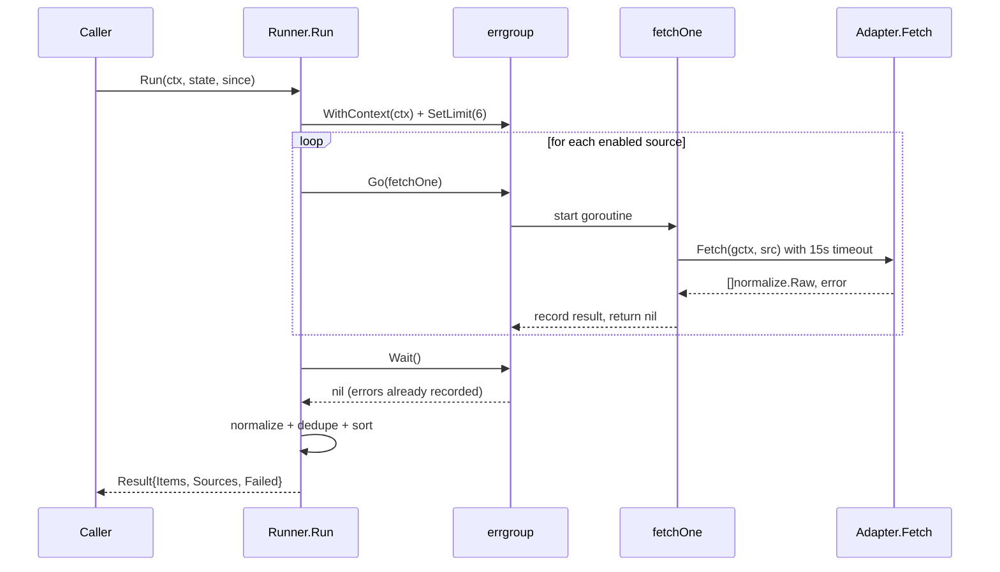

# Pipeline Orchestration & Ingest Runner

This chapter documents the **ingest orchestration layer** — the `Runner` struct, `Adapter` interface, concurrent fetching with `errgroup`, per-source timeouts, and the `Run` method that coordinates ingestion, normalization, and deduplication. It is the entry point of the agent pipeline: every enabled source is fetched in parallel, normalized into `model.Item` values, deduplicated against the persistent `State`, and returned as a `Result` for downstream stages (embed → cluster → score → summarize → write).

---

## Table of Contents

1. [Architecture Overview](#architecture-overview)
2. [Adapter Interface](#adapter-interface)
3. [Runner Construction](#runner-construction)
4. [Concurrent Fetching with errgroup](#concurrent-fetching-with-errgroup)
5. [Per-Source Timeouts](#per-source-timeouts)
6. [Run Method — End-to-End Flow](#run-method--end-to-end-flow)
7. [Normalization & Deduplication Integration](#normalization--deduplication-integration)
8. [Failure Semantics & Abort Conditions](#failure-semantics--abort-conditions)
9. [Result Types](#result-types)
10. [Referenced Files](#referenced-files)

---

## Architecture Overview

The ingest stage sits at the top of the pipeline. Its responsibilities:

- **Discover enabled sources** from `config.Config` (loaded from `config/sources.json` + env).
- **Dispatch each source to its Adapter** concurrently, bounded by `maxConcurrent = 6`.
- **Enforce a per-source deadline** of `sourceTimeout = 15s` so one slow host cannot stall the run.
- **Normalize** every `normalize.Raw` into a `model.Item` (excerpt ≤ 300 chars, canonical URL, extracted repo/paper URLs).
- **Deduplicate** against `model.State.Seen` (persisted to `data/state.json`).
- **Return a deterministic, sorted `Result`** — newest-first, highest-tier-source-first for tie-breaking.

```mermaid
graph TD
    A[cmd/airfoil: run] --> B[config.Load]
    B --> C[ingest.New(cfg, log)]
    C --> D[Runner.Run(ctx, state, since)]
    D --> E[EnabledSources from config]
    E --> F[errgroup.WithContext + SetLimit(6)]
    F --> G[fetchOne per source]
    G --> H[Adapter.Fetch with 15s timeout]
    H --> I[normalize.Raw[]]
    I --> J[normalize.Build → model.Item]
    J --> K[since filter]
    K --> L[sort by SourceTier asc]
    L --> M[normalize.Dedupe against state.Seen]
    M --> N[sort by PublishedAt desc]
    N --> O[Result{Items, Sources, Failed}]
    O --> P[embed → cluster → score → summarize → write]
```

**Key invariants** (enforced in `Run`):

- One failed source **never cancels** the group — its error is recorded in `SourceResult.Err` and logged at `WARN`.
- If **>50% of sources fail**, the run aborts before any write (R9: "a run where most sources are down would produce a misleading digest").
- Output order is **deterministic**: source-order normalization → tier-stable sort → dedupe → newest-first stable sort.

---

## Adapter Interface

```go
// Adapter fetches raw items for one configured source.
type Adapter interface {
	// Type is the source type in sources.json that this adapter handles.
	Type() string
	// Fetch returns raw items. Returning an empty slice is not an error.
	Fetch(ctx context.Context, src config.Source) ([]normalize.Raw, error)
}
```

`agent/internal/ingest/ingest.go:33-38`

| Method | Purpose |
|--------|---------|
| `Type()` | Returns the string key matching `config.Source.Type` (e.g., `"rss"`, `"hn"`, `"reddit"`, `"hf"`, `"github"`). Used by `Runner` to route a `config.Source` to its adapter. |
| `Fetch(ctx, src)` | Executes the HTTP request(s) for the source, parses the response, and returns `[]normalize.Raw`. Must respect `ctx` deadline. Empty slice = no items, not an error. |

**Standard adapter set** (constructed in `New`):

| Adapter | Type | Source |
|---------|------|--------|
| `rssAdapter` | `"rss"` | Generic RSS/Atom feeds (also used for Reddit, HFPapers, GitHub via RSS) |
| `hnAdapter` | `"hn"` | Hacker News Algolia API |
| `redditAdapter` | `"reddit"` | Reddit JSON endpoints (sets custom User-Agent) |
| `hfAdapter` | `"hf"` | Hugging Face Papers RSS |
| `githubAdapter` | `"github"` | GitHub trending/repos via RSS |

Each adapter wraps a shared `*fetcher` (HTTP client with timeout/retry) created via `newFetcher(sourceTimeout, defaultUserAgent)`.

---

## Runner Construction

```go
// Runner executes every enabled source and normalizes the results.
type Runner struct {
	cfg      *config.Config
	log      *slog.Logger
	adapters map[string]Adapter
	now      func() time.Time
}

// New builds a Runner with the standard adapter set.
func New(cfg *config.Config, log *slog.Logger) *Runner {
	f := newFetcher(sourceTimeout, defaultUserAgent)

	adapters := []Adapter{
		newRSSAdapter(f),
		newHNAdapter(f),
		newRedditAdapter(f, cfg.Ingest.RedditUserAgent),
		newHFAdapter(f),
		newGitHubAdapter(f, cfg.Ingest.GitHubToken),
	}

	byType := make(map[string]Adapter, len(adapters))
	for _, a := range adapters {
		byType[a.Type()] = a
	}

	return &Runner{cfg: cfg, log: log, adapters: byType, now: time.Now}
}
```

`agent/internal/ingest/ingest.go:41-66`

**Fields**:

| Field | Type | Role |
|-------|------|------|
| `cfg` | `*config.Config` | Provides `EnabledSources()`, `Ingest.RedditUserAgent`, `Ingest.GitHubToken`, `Scoring.Limits.ExcerptMaxChars` |
| `log` | `*slog.Logger` | Structured logging (`Info` for success, `Warn` for source failure, `Debug` for skipped items) |
| `adapters` | `map[string]Adapter` | Lookup by `src.Type` → concrete adapter |
| `now` | `func() time.Time` | Time provider (defaults to `time.Now`; overridden in tests for determinism) |

**Constants** (package-level):

```go
const (
	// sourceTimeout bounds one source. A slow feed must not hold up the run.
	sourceTimeout = 15 * time.Second

	// maxConcurrent keeps us from opening seventeen sockets at once, which
	// looks like abuse to the smaller hosts.
	maxConcurrent = 6
)
```

`agent/internal/ingest/ingest.go:25-29`

- `sourceTimeout = 15s` — applied per-source via `context.WithTimeout` in `fetchOne`.
- `maxConcurrent = 6` — `errgroup.SetLimit` caps simultaneous goroutines.

---

## Concurrent Fetching with errgroup

The `Run` method uses `golang.org/x/sync/errgroup` for bounded concurrency:

```go
g, gctx := errgroup.WithContext(ctx)
g.SetLimit(maxConcurrent)

for i, src := range sources {
	g.Go(func() error {
		started := time.Now()
		out, err := r.fetchOne(gctx, src)

		results[i] = SourceResult{
			SourceID: src.ID,
			Fetched:  len(out),
			Duration: time.Since(started),
			Err:      err,
		}
		raws[i] = out

		// The error is recorded, not returned: one bad source must not
		// cancel the group.
		return nil
	})
}
if err := g.Wait(); err != nil {
	return Result{}, fmt.Errorf("ingest: %w", err)
}
```

`agent/internal/ingest/ingest.go:107-130`

**Behavior**:

1. `errgroup.WithContext(ctx)` creates a derived context `gctx` that cancels all children if the parent `ctx` is cancelled (e.g., SIGINT, global deadline).
2. `SetLimit(6)` ensures at most 6 `fetchOne` goroutines run simultaneously.
3. Each iteration captures `i, src` by value (Go 1.22+ loop var semantics) — no closure capture bug.
4. **Critical**: the goroutine **always returns `nil`**. Errors are stored in `results[i].Err` and `raws[i]`; they do **not** propagate to `g.Wait()`. This implements "one broken feed must never fail a run."
5. After `g.Wait()`, the parent `ctx` is still alive; only `gctx` may have been cancelled (which would only happen if the parent `ctx` was cancelled).

**Sequence diagram**:



---

## Per-Source Timeouts

Each source fetch runs under its own 15-second deadline:

```go
// fetchOne runs a single source under its own timeout.
func (r *Runner) fetchOne(ctx context.Context, src config.Source) ([]normalize.Raw, error) {
	adapter, ok := r.adapters[src.Type]
	if !ok {
		return nil, fmt.Errorf("no adapter for type %q", src.Type)
	}

	ctx, cancel := context.WithTimeout(ctx, sourceTimeout)
	defer cancel()

	out, err := adapter.Fetch(ctx, src)
	if err != nil {
		return nil, err
	}
	return out, nil
}
```

`agent/internal/ingest/ingest.go:185-199`

**Properties**:

- `context.WithTimeout(ctx, sourceTimeout)` creates a child context with a 15s deadline.
- `defer cancel()` releases resources even if `Fetch` returns early.
- The adapter’s `Fetch` **must** respect the context (the shared `fetcher` does).
- If the timeout fires, `ctx.Err()` returns `context.DeadlineExceeded`; the adapter returns that error, which is recorded in `SourceResult.Err`.

**Why per-source, not global?** A single slow RSS feed (e.g., 30s response) must not block HN, Reddit, and GitHub from completing. The 15s bound is short enough to keep the total run time predictable (~30-60s for all sources) while accommodating typical feed latencies.

---

## Run Method — End-to-End Flow

```go
func (r *Runner) Run(ctx context.Context, state *model.State, since time.Duration) (Result, error) {
	sources := r.cfg.EnabledSources()
	if len(sources) == 0 {
		return Result{}, fmt.Errorf("ingest: no enabled sources")
	}

	now := r.now().UTC()
	results := make([]SourceResult, len(sources))
	raws := make([][]normalize.Raw, len(sources))

	g, gctx := errgroup.WithContext(ctx)
	g.SetLimit(maxConcurrent)

	for i, src := range sources {
		g.Go(func() error {
			started := time.Now()
			out, err := r.fetchOne(gctx, src)

			results[i] = SourceResult{
				SourceID: src.ID,
				Fetched:  len(out),
				Duration: time.Since(started),
				Err:      err,
			}
			raws[i] = out
			return nil
		})
	}
	if err := g.Wait(); err != nil {
		return Result{}, fmt.Errorf("ingest: %w", err)
	}

	// Normalize in source order so that the result is deterministic regardless
	// of which goroutine finished first.
	var all []model.Item
	failed := 0
	for i, src := range sources {
		if results[i].Err != nil {
			failed++
			r.log.Warn("source failed", "source", src.ID, "error", results[i].Err)
			continue
		}

		kept := 0
		for _, raw := range raws[i] {
			item, err := normalize.Build(raw, now, r.cfg.Scoring.Limits.ExcerptMaxChars)
			if err != nil {
				r.log.Debug("skipped item", "source", src.ID, "error", err)
				continue
			}
			if since > 0 && item.PublishedAt.Before(now.Add(-since)) {
				continue
			}
			all = append(all, item)
			kept++
		}
		results[i].Kept = kept
		r.log.Info("source ok", "source", src.ID,
			"fetched", results[i].Fetched, "kept", kept,
			"ms", results[i].Duration.Milliseconds())
	}

	// R9: a run where most sources are down would produce a misleading digest.
	// Better to write nothing than to publish a half-empty day as if it were
	// the whole picture.
	if failed*2 > len(sources) {
		return Result{}, fmt.Errorf("ingest: %d of %d sources failed; aborting before write",
			failed, len(sources))
	}

	// Highest-tier source first, so that a duplicate resolves to the most
	// authoritative version of the story.
	sort.SliceStable(all, func(i, j int) bool {
		return all[i].SourceTier < all[j].SourceTier
	})
	items := normalize.Dedupe(all, state.Seen)

	sort.SliceStable(items, func(i, j int) bool {
		return items[i].PublishedAt.After(items[j].PublishedAt)
	})

	return Result{Items: items, Sources: results, Failed: failed}, nil
}
```

`agent/internal/ingest/ingest.go:97-182`

### Step-by-step breakdown

| Step | Code Range | Description |
|------|------------|-------------|
| 1. Load enabled sources | `101-104` | `cfg.EnabledSources()` returns only `Source` entries with `Enabled: true`. Empty → error. |
| 2. Prepare concurrency | `107-110` | `errgroup.WithContext(ctx)`, `SetLimit(6)`, pre-allocate `results` and `raws` slices indexed by source order. |
| 3. Launch fetch goroutines | `112-130` | Each source → `g.Go(fetchOne)`. Errors captured in `results[i].Err`, raw items in `raws[i]`. Goroutine returns `nil`. |
| 4. Wait for all | `132-134` | `g.Wait()` only returns error if parent `ctx` cancelled. |
| 5. Normalize in source order | `137-164` | Iterate `sources` in original order (deterministic). For each raw item: `normalize.Build(raw, now, ExcerptMaxChars)` → `model.Item`. Skip if `since > 0` and item older than `now - since`. Count `kept`. |
| 6. Log per-source stats | `162-164` | `Info` log with `fetched`, `kept`, `ms`. |
| 7. Abort if majority failed | `167-172` | `if failed*2 > len(sources)` → return error, **no items written**. |
| 8. Sort by tier (asc) | `175-178` | `sort.SliceStable` by `SourceTier` (lower = more authoritative). Ensures dedupe keeps highest-tier version. |
| 9. Deduplicate | `179` | `normalize.Dedupe(all, state.Seen)` → drops items whose `ItemID` (hash of canonical URL) is already in `state.Seen`. |
| 10. Sort newest-first | `181-182` | `sort.SliceStable` by `PublishedAt` descending. |
| 11. Return Result | `184` | `Result{Items, Sources, Failed}`. |

**Determinism guarantees**:

- Normalization loop follows `sources` slice order (config file order).
- `sort.SliceStable` preserves relative order for equal keys.
- Dedupe keeps **first occurrence** — hence tier-sort before dedupe ensures authoritative source wins.

---

## Normalization & Deduplication Integration

The `Run` method delegates to `normalize` package functions:

```go
item, err := normalize.Build(raw, now, r.cfg.Scoring.Limits.ExcerptMaxChars)
```

`agent/internal/ingest/ingest.go:147`

```go
items := normalize.Dedupe(all, state.Seen)
```

`agent/internal/ingest/ingest.go:179`

**`normalize.Build`** (from `internal/normalize/normalize.go`):

- Input: `normalize.Raw` (title, link, content, published, source name/type), `now time.Time`, `maxExcerpt int`.
- Output: `model.Item` with:
  - `ID` = hash of canonical URL (`ItemID`).
  - `Title` cleaned (HTML stripped, whitespace collapsed).
  - `URL` canonicalized (wrapper unwrapping, variant collapsing, recursion bound).
  - `Excerpt` ≤ `maxExcerpt` (default 300 chars, from `scoring.json`).
  - `PublishedAt` parsed/normalized to UTC.
  - `SourceTier` from `config.Source.Tier` (Major=0, Notable=1, Minor=2).
  - `RepoURL` / `PaperURL` extracted via regex.
- Errors on unparseable date, missing title/link, or empty content after cleaning.

**`normalize.Dedupe`**:

```go
func Dedupe(items []model.Item, seen func(string) bool) []model.Item
```

- Iterates `items` in order; keeps first item where `seen(item.ID)` is false.
- `state.Seen(id)` checks `data/state.json` (per-day keys: `id:day`).
- Caller (pipeline) later calls `state.MarkSeen(item.ID, day)` for each kept item before writing `state.json`.

---

## Failure Semantics & Abort Conditions

| Scenario | Behavior |
|----------|----------|
| Single source HTTP error / timeout | Logged `WARN`, `SourceResult.Err` set, `Fetched=0`, `Kept=0`. Other sources continue. |
| Adapter returns error from `Fetch` | Same as above — error recorded, not propagated. |
| `normalize.Build` returns error per item | Logged `DEBUG`, item skipped, source `Kept` not incremented. |
| Item older than `since` window | Silently skipped (no log), not counted in `Kept`. |
| **>50% sources fail** | `Run` returns error: `"ingest: N of M sources failed; aborting before write"`. **No items returned**, pipeline stops before embed stage. |
| Parent `ctx` cancelled (SIGINT, deadline) | `errgroup` cancels `gctx`; in-flight `fetchOne` contexts cancel; `g.Wait()` returns `context.Canceled`; `Run` returns wrapped error. |
| No enabled sources in config | Immediate error: `"ingest: no enabled sources"`. |

**Rationale for majority-fail abort (R9)**: If 4 of 6 sources are down, the resulting digest would represent a skewed slice of the day’s activity. Better to produce nothing than a misleading "half-empty day."

---

## Result Types

```go
// SourceResult records what one source contributed.
type SourceResult struct {
	SourceID string
	Fetched  int // raw items returned
	Kept     int // items that survived normalization
	Duration time.Duration
	Err      error
}

// Result is the outcome of one ingest pass.
type Result struct {
	// Items are new, normalized, and deduplicated against state (R7).
	Items   []model.Item
	Sources []SourceResult
	Failed  int
}
```

`agent/internal/ingest/ingest.go:77-91`

| Field | Meaning |
|-------|---------|
| `Result.Items` | Final `[]model.Item` — normalized, `since`-filtered, deduped, newest-first. Passed to embedder. |
| `Result.Sources` | Per-source telemetry: `SourceID`, `Fetched` (raw count), `Kept` (normalized count), `Duration`, `Err` (nil if ok). |
| `Result.Failed` | Count of sources with non-nil `Err`. Used by caller for metrics/logging. |
| `SourceResult.Fetched` | Length of `[]normalize.Raw` returned by adapter (before normalization). |
| `SourceResult.Kept` | Items that passed `normalize.Build` and `since` filter. |
| `SourceResult.Duration` | Wall-clock time for `fetchOne` (includes 15s timeout if hit). |

---

## Referenced Files

| File | Role |
|------|------|
| `agent/internal/ingest/ingest.go` | Runner, Adapter, fetchOne, Run, constants, result types (this chapter’s primary source) |
| `agent/internal/config/config.go` | `Config`, `EnabledSources()`, `Source`, `Ingest` (RedditUserAgent, GitHubToken), `Scoring.Limits.ExcerptMaxChars` |
| `agent/internal/normalize/normalize.go` | `Build`, `Dedupe`, `Raw`, `ItemID`, `CanonicalURL`, `Excerpt`, `StripHTML` |
| `agent/internal/model/model.go` | `Item`, `State`, `Seen`, `MarkSeen`, `TierMajor/Notable/Minor` |
| `agent/internal/ingest/rss.go` | `rssAdapter` implementation |
| `agent/internal/ingest/hn.go` | `hnAdapter` implementation |
| `agent/internal/ingest/reddit.go` | `redditAdapter` implementation |
| `agent/internal/ingest/hf.go` | `hfAdapter` implementation |
| `agent/internal/ingest/github.go` | `githubAdapter` implementation |
| `agent/internal/ingest/fetcher.go` | Shared HTTP fetcher with timeout/retry/User-Agent |
| `config/sources.json` | Source definitions (type, url, options, enabled, tier) |
| `config/scoring.json` | `Limits.ExcerptMaxChars` (default 300) |

---

*End of chapter.*

<!-- kaioken:files agent/internal/ingest/ingest.go -->
