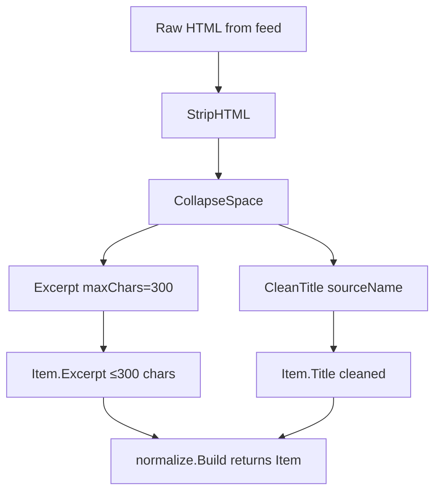
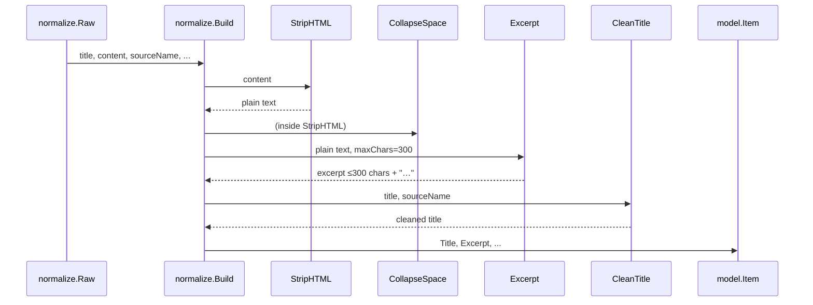

# Text Normalization & Excerpt Generation

This chapter documents the pure text-processing utilities in `agent/internal/normalize/text.go` that transform raw feed content into clean, bounded text for the `Item` model. These functions are called by `normalize.Build` and enforce the repository's content limits (R1): excerpt ≤ 300 characters, titles stripped of publication boilerplate, and whitespace normalized.

## Table of Contents

- [Architecture & Data Flow](#architecture--data-flow)
- [StripHTML: Tag Removal & Entity Decoding](#striphtml-tag-removal--entity-decoding)
- [CollapseSpace: Whitespace Normalization](#collapsespace-whitespace-normalization)
- [Excerpt: 300-Character Cap at Word Boundary](#excerpt-300-character-cap-at-word-boundary)
- [CleanTitle: Suffix Removal & Source-Specific Cleanup](#cleantitle-suffix-removal--source-specific-cleanup)
- [WordCount: Whitespace-Separated Word Count](#wordcount-whitespace-separated-word-count)
- [Integration with normalize.Build](#integration-with-normalizebuild)
- [Referenced Files](#referenced-files)

---

## Architecture & Data Flow

The text utilities are pure functions with no external dependencies. They form a pipeline inside `normalize.Build`:

```
Raw feed content (HTML) 
    │
    ▼
StripHTML ──────────────────► Plain text (tags→spaces, scripts/styles dropped, entities decoded)
    │
    ▼
CollapseSpace ──────────────► Single spaces, trimmed ends, ZWSP/BOM removed
    │
    ├───────────────────────► Excerpt(maxChars=300) ──► Capped plain text + "…"
    │
    └───────────────────────► CleanTitle(sourceName) ──► Title without site suffix
```



**Key invariants enforced:**
- Every `Item` passes through `Excerpt(..., 300)` — no code path can persist more than 300 characters of source text.
- `StripHTML` preserves word boundaries by inserting spaces for block-level tags only.
- `CleanTitle` uses `sourceName` to safely remove dash-separated suffixes that would otherwise be ambiguous.

---

## StripHTML: Tag Removal & Entity Decoding

**File:** `agent/internal/normalize/text.go:14-52`

```go
// StripHTML removes markup and returns readable plain text.
//
// Tags become spaces rather than nothing, so that "<p>one</p><p>two</p>" reads
// as "one two" and not "onetwo". Script and style bodies are dropped entirely.
func StripHTML(s string) string {
	var b strings.Builder
	b.Grow(len(s))

	for i := 0; i < len(s); {
		if s[i] != '<' {
			b.WriteByte(s[i])
			i++
			continue
		}

		close := strings.IndexByte(s[i:], '>')
		if close < 0 {
			// Unterminated tag. Everything after it is markup we cannot read.
			break
		}
		name := tagName(s[i+1 : i+close])
		end := i + close + 1

		if name == "script" || name == "style" {
			b.WriteByte(' ')
			if skip := skipElement(s, end, name); skip > 0 {
				i = skip
				continue
			}
			// No closing tag; the rest of the document is inside the element.
			break
		}

		// Only block-level boundaries separate words. An inline tag must not,
		// or "<b>summary</b>." would come out as "summary .".
		if !inlineTags[name] {
			b.WriteByte(' ')
		}
		i = end
	}

	return CollapseSpace(html.UnescapeString(b.String()))
}
```

### Behavior

| Aspect | Detail |
|--------|--------|
| **Tag handling** | Every tag (`<...>`) is removed. Block-level tags (not in `inlineTags`) insert a single space; inline tags insert nothing. |
| **Script/Style** | Entire contents of `<script>` and `<style>` elements are dropped. A single space is written in their place. |
| **Unterminated tags** | If `>` is not found, parsing stops — remainder is treated as unreadable markup. |
| **Entity decoding** | `html.UnescapeString` runs after tag removal, converting `&amp;`, `&lt;`, `&#8217;`, etc. |
| **Output** | Result passes through `CollapseSpace` before returning. |

### Inline Tag Set

**File:** `agent/internal/normalize/text.go:70-76`

```go
// inlineTags are elements that sit inside a run of text rather than breaking
// it. Removing one must not introduce a space.
var inlineTags = map[string]bool{
	"a": true, "abbr": true, "b": true, "bdi": true, "bdo": true, "cite": true,
	"code": true, "data": true, "dfn": true, "em": true, "i": true, "kbd": true,
	"mark": true, "q": true, "rp": true, "rt": true, "ruby": true, "s": true,
	"samp": true, "small": true, "span": true, "strong": true, "sub": true,
	"sup": true, "time": true, "tt": true, "u": true, "var": true,
}
```

All other tags (e.g., `p`, `div`, `h1`–`h6`, `li`, `br`, `blockquote`) are treated as block-level and produce a space.

### Helper: skipElement

**File:** `agent/internal/normalize/text.go:55-66`

```go
// skipElement returns the offset just past the closing tag for name, or -1.
func skipElement(s string, from int, name string) int {
	rest := strings.ToLower(s[from:])
	at := strings.Index(rest, "</"+name)
	if at < 0 {
		return -1
	}
	close := strings.IndexByte(s[from+at:], '>')
	if close < 0 {
		return -1
	}
	return from + at + close + 1
}
```

Case-insensitive search for `</name>`; returns byte offset after `>` or `-1` if no closing tag exists.

### Helper: tagName

**File:** `agent/internal/normalize/text.go:79-88`

```go
// tagName extracts the lowercase element name from the inside of a tag.
func tagName(inner string) string {
	inner = strings.TrimPrefix(strings.TrimSpace(inner), "/")
	end := strings.IndexFunc(inner, func(r rune) bool {
		return unicode.IsSpace(r) || r == '/' || r == '>'
	})
	if end >= 0 {
		inner = inner[:end]
	}
	return strings.ToLower(inner)
}
```

Strips leading `/` (closing tags), then reads until whitespace, `/`, or `>`. Handles `<br/>`, `< img src="x">`, `</div >`, etc.

---

## CollapseSpace: Whitespace Normalization

**File:** `agent/internal/normalize/text.go:99-103`

```go
// Runes that feeds emit but unicode.IsSpace does not cover.
const (
	zeroWidthSpace = rune(0x200B)
	byteOrderMark  = rune(0xFEFF)
)

// CollapseSpace reduces every run of whitespace to a single space and trims the
// ends. Non-breaking spaces are covered by unicode.IsSpace; zero-width spaces
// and byte-order marks are not, and feeds emit both.
func CollapseSpace(s string) string {
	return strings.Join(strings.FieldsFunc(s, func(r rune) bool {
		return unicode.IsSpace(r) || r == zeroWidthSpace || r == byteOrderMark
	}), " ")
}
```

### Behavior

| Input pattern | Output |
|---------------|--------|
| Multiple spaces/tabs/newlines | Single space |
| Leading/trailing whitespace | Removed |
| `U+200B` (zero-width space) | Treated as separator |
| `U+FEFF` (byte-order mark) | Treated as separator |
| Non-breaking space (`U+00A0`) | Covered by `unicode.IsSpace` → separator |

`strings.FieldsFunc` splits on the predicate; `strings.Join(..., " ")` reassembles with single spaces. Empty input → empty string.

---

## Excerpt: 300-Character Cap at Word Boundary

**File:** `agent/internal/normalize/text.go:109-130`

```go
// Excerpt turns raw feed content into plain text capped at maxChars runes.
//
// This is where R1 is enforced. Every Item is built through Build, which calls
// this, so no code path can persist more source text than the cap allows.
func Excerpt(s string, maxChars int) string {
	if maxChars <= 0 {
		return ""
	}
	text := StripHTML(s)

	runes := []rune(text)
	if len(runes) <= maxChars {
		return text
	}

	// Leave room for the ellipsis so the result never exceeds the cap.
	cut := runes[:maxChars-1]
	if at := lastSpace(cut); at > maxChars/2 {
		cut = cut[:at]
	}

	trimmed := strings.TrimRightFunc(string(cut), func(r rune) bool {
		return unicode.IsSpace(r) || strings.ContainsRune(",;:-–—(", r)
	})
	return trimmed + "…"
}
```

### Algorithm

1. **Strip HTML** → plain text via `StripHTML`.
2. **Rune slice** → `[]rune(text)` for correct Unicode handling.
3. **Early return** if already ≤ `maxChars`.
4. **Reserve 1 rune** for ellipsis (`…` = U+2026): `cut = runes[:maxChars-1]`.
5. **Find last space** in `cut` via `lastSpace`. If found **after halfway point** (`> maxChars/2`), truncate there to avoid mid-word cut.
6. **Trim trailing punctuation/space**: `TrimRightFunc` removes spaces, `, ; : - – — (`.
7. **Append ellipsis** → result length ≤ `maxChars`.

### Helper: lastSpace

**File:** `agent/internal/normalize/text.go:132-139`

```go
func lastSpace(rs []rune) int {
	for i := len(rs) - 1; i >= 0; i-- {
		if unicode.IsSpace(rs[i]) {
			return i
		}
	}
	return -1
}
```

Scans backward for any `unicode.IsSpace` rune. Returns index or `-1`.

### Invariant: R1 Enforcement

> **R1**: "Excerpt max 300 chars (`normalize.Excerpt`)."

`normalize.Build` calls `Excerpt(raw.Content, 300)` for every item. The cap is a **constant in the call site**, not a configurable parameter, guaranteeing no path bypasses it.

---

## CleanTitle: Suffix Removal & Source-Specific Cleanup

**File:** `agent/internal/normalize/text.go:160-185`

```go
var (
	// " ... (arXiv:2401.12345v1 [cs.LG])" — arXiv appends this to every title.
	arxivSuffixRE = regexp.MustCompile(`(?i)\s*\(\s*arxiv:[^)]*\)\s*\.?\s*$`)

	// A trailing " | Site Name". The pipe is a reliable site-name separator;
	// dashes are not, so they are only stripped when they match the source.
	pipeSuffixRE = regexp.MustCompile(`\s*[|·•]\s*[^|·•]{1,40}$`)
)

// titleSeparators are the characters a feed puts between an article title and
// its publication name.
var titleSeparators = []string{" | ", " - ", " – ", " — ", " · ", " • ", " :: "}

// CleanTitle strips the publication name and feed boilerplate that sources
// append to titles, so that two outlets covering one event produce comparable
// titles.
//
// sourceName may be empty; it makes dash-separated suffixes safe to remove,
// which they otherwise are not — "Llama 4 - faster and cheaper" must survive.
func CleanTitle(title, sourceName string) string {
	t := CollapseSpace(html.UnescapeString(title))
	t = arxivSuffixRE.ReplaceAllString(t, "")

	// An exact match on the source name is unambiguous, whatever the separator.
	if sourceName != "" {
		for _, sep := range titleSeparators {
			suffix := sep + sourceName
			if len(t) > len(suffix) && strings.EqualFold(t[len(t)-len(suffix):], suffix) {
				t = t[:len(t)-len(suffix)]
				break
			}
		}
	}

	// A pipe almost always separates the title from the site name, and a title
	// that is nothing but a site name is not worth salvaging.
	if loc := pipeSuffixRE.FindStringIndex(t); loc != nil && loc[0] > 0 {
		t = t[:loc[0]]
	}

	t = strings.TrimRightFunc(t, func(r rune) bool {
		return unicode.IsSpace(r) || strings.ContainsRune("|-–—·•", r)
	})
	return CollapseSpace(t)
}
```

### Processing Steps

| Step | Pattern | Condition |
|------|---------|-----------|
| 1 | `CollapseSpace(html.UnescapeString(title))` | Always |
| 2 | `arxivSuffixRE` → remove `(arXiv:...)` | Case-insensitive, end of string |
| 3 | `titleSeparators` + `sourceName` | Only if `sourceName != ""`; exact case-insensitive suffix match |
| 4 | `pipeSuffixRE` → remove ` | Site Name` / ` · Site` / ` • Site` | Only if match starts at position > 0 (preserves titles that *are* just a site name) |
| 5 | `TrimRightFunc` trailing separators/space | Removes `| - – — · •` and whitespace |
| 6 | `CollapseSpace` | Final normalization |

### Regex Details

| Regex | Pattern | Example Match |
|-------|---------|---------------|
| `arxivSuffixRE` | `(?i)\s*\(\s*arxiv:[^)]*\)\s*\.?\s*$` | ` (arXiv:2401.12345v1 [cs.LG])` |
| `pipeSuffixRE` | `\s*[|·•]\s*[^|·•]{1,40}$` | ` | The Verge`, ` · Ars Technica` |

### Source-Aware Dash Handling

The `titleSeparators` slice includes `" - "`, `" – "`, `" — "` (hyphen, en-dash, em-dash). These are **only** used when `sourceName` is provided and matches exactly. This prevents false positives like:

- `"Llama 4 - faster and cheaper"` → **preserved** (no sourceName match)
- `"Llama 4 - The Verge"` with `sourceName="The Verge"` → **stripped** to `"Llama 4"`

---

## WordCount: Whitespace-Separated Word Count

**File:** `agent/internal/normalize/text.go:189-191`

```go
// WordCount counts whitespace-separated words. Used by the summary limits in
// R1 and by the digest.
func WordCount(s string) int {
	return len(strings.Fields(s))
}
```

### Behavior

- `strings.Fields` splits on **any** `unicode.IsSpace` run (spaces, tabs, newlines, NBSP).
- Zero-width space (`U+200B`) and BOM (`U+FEFF`) are **not** separators here — they remain part of adjacent words unless `CollapseSpace` ran first.
- Used by:
  - Summary limits (R1: "Max one quote per source, <15 words")
  - Digest generation

---

## Integration with normalize.Build

The text utilities are composed in `normalize.Build` (in `agent/internal/normalize/build.go`, not in scope but called from pipeline):



**Resulting `model.Item` fields populated:**
- `Title` ← `CleanTitle(raw.Title, source.Name)`
- `Excerpt` ← `Excerpt(raw.Content, 300)`
- `Content` ← *not stored* (only excerpt persists)

---

## Referenced Files

| File | Declarations Covered |
|------|---------------------|
| `agent/internal/normalize/text.go` | `StripHTML`, `skipElement`, `inlineTags`, `tagName`, `zeroWidthSpace`, `byteOrderMark`, `CollapseSpace`, `Excerpt`, `lastSpace`, `arxivSuffixRE`, `pipeSuffixRE`, `titleSeparators`, `CleanTitle`, `WordCount` |

<!-- kaioken:files agent/internal/normalize/text.go -->
