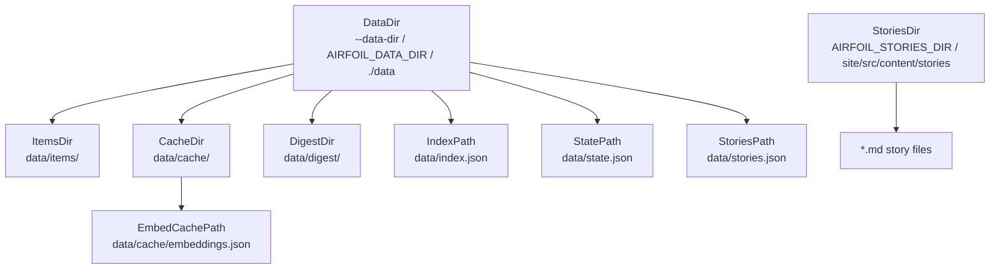
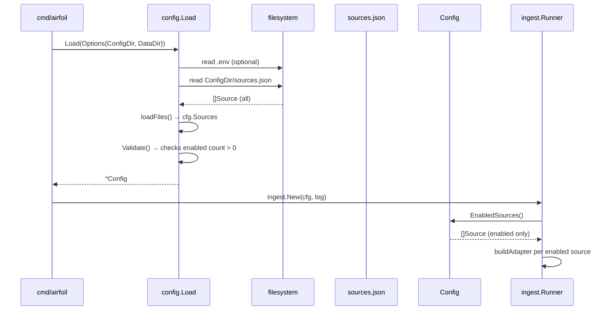

# Configuration-Driven Paths and Source Enablement

This chapter details how `config.Load` resolves all filesystem paths used by the agent pipeline and how it loads and filters enabled sources from `sources.json`. It covers the precedence chain for configuration values, the derived path methods on `Config`, the source loading and validation logic, and the `EnabledSources` filter used by the ingestion runner.

## Table of Contents

1. [Configuration Loading Overview](#configuration-loading-overview)
2. [Precedence Chain: CLI → Environment → Defaults](#precedence-chain-cli--environment--defaults)
3. [Derived Filesystem Paths](#derived-filesystem-paths)
4. [Source Loading from `sources.json`](#source-loading-from-sourcesjson)
5. [Source Enablement and Filtering](#source-enablement-and-filtering)
6. [Validation Rules](#validation-rules)
7. [Data Flow: Config into Pipeline](#data-flow-config-into-pipeline)

---

## Configuration Loading Overview

The `config.Load` function is the single entry point for all configuration. It reads a `.env` file (if present), environment variables, and three JSON files under the config directory (`sources.json`, `scoring.json`, `keywords.json`), then validates the combined result. The returned `*Config` struct is passed explicitly down the call chain — no globals, no `init()`.

```
agent/internal/config/config.go:115-175
```

```go
func Load(opts Options) (*Config, error) {
	// A .env file is convenience for local runs; CI supplies real env vars.
	// Values already present in the environment always win.
	if err := loadDotEnv(".env"); err != nil {
		return nil, err
	}

	cfg := &Config{
		DataDir:   firstNonEmpty(opts.DataDir, os.Getenv("AIRFOIL_DATA_DIR"), "./data"),
		ConfigDir: firstNonEmpty(opts.ConfigDir, os.Getenv("AIRFOIL_CONFIG_DIR"), "./config"),
		LogLevel:  firstNonEmpty(os.Getenv("AIRFOIL_LOG_LEVEL"), "info"),
		SiteURL:   os.Getenv("SITE_URL"),
		// ... LLM, Embed, Ingest initialization ...
	}

	cfg.StoriesDir = firstNonEmpty(
		os.Getenv("AIRFOIL_STORIES_DIR"),
		filepath.Join("site", "src", "content", "stories"),
	)

	if err := cfg.loadFiles(); err != nil {
		return nil, err
	}
	if err := cfg.Validate(); err != nil {
		return nil, err
	}
	return cfg, nil
}
```

The `Options` struct carries CLI flag values (`ConfigDir`, `DataDir`, `Verbose`). Empty fields fall back to environment variables, then to compiled-in defaults.

---

## Precedence Chain: CLI → Environment → Defaults

The helper `firstNonEmpty` implements the precedence logic used throughout `Load`.

```
agent/internal/config/config.go:246-253
```

```go
func firstNonEmpty(vals ...string) string {
	for _, v := range vals {
		if v != "" {
			return v
		}
	}
	return ""
}
```

| Config Field | CLI Flag | Environment Variable | Default |
|--------------|----------|---------------------|---------|
| `DataDir` | `--data-dir` | `AIRFOIL_DATA_DIR` | `./data` |
| `ConfigDir` | `--config-dir` | `AIRFOIL_CONFIG_DIR` | `./config` |
| `LogLevel` | `--verbose` (sets `debug`) | `AIRFOIL_LOG_LEVEL` | `info` |
| `SiteURL` | — | `SITE_URL` | (empty) |
| `StoriesDir` | — | `AIRFOIL_STORIES_DIR` | `site/src/content/stories` |
| `Embed.Provider` | — | `AIRFOIL_EMBEDDER` | `ollama` |
| `LLM.Gemini.Model` | — | `GEMINI_MODEL` | `gemini-2.0-flash` |
| `LLM.NvidiaNIM.Model` | — | `NVIDIA_NIM_MODEL` | `meta/llama-3.3-70b-instruct` |
| `LLM.OpenRouter.Model` | — | `OPENROUTER_MODEL` | `meta-llama/llama-3.3-70b-instruct:free` |
| `LLM.Ollama.Host` | — | `OLLAMA_HOST` | `http://localhost:11434` |
| `LLM.Ollama.ChatModel` | — | `OLLAMA_CHAT_MODEL` | `llama3.1` |
| `LLM.Ollama.EmbedModel` | — | `OLLAMA_EMBED_MODEL` | `nomic-embed-text` |
| `Embed.OllamaModel` | — | `OLLAMA_EMBED_MODEL` | `nomic-embed-text` |
| `Embed.GeminiModel` | — | `GEMINI_EMBED_MODEL` | `text-embedding-004` |
| `Embed.NIMModel` | — | `NVIDIA_NIM_EMBED_MODEL` | `nvidia/nv-embedqa-e5-v5` |
| `Embed.NIMBaseURL` | — | `NVIDIA_NIM_BASE_URL` | `https://integrate.api.nvidia.com/v1` |
| `Ingest.GitHubToken` | — | `GITHUB_TOKEN` | (empty) |
| `Ingest.RedditUserAgent` | — | `REDDIT_USER_AGENT` | `airfoil/0.1` |

> **Note**: The `.env` file is loaded first via `loadDotEnv(".env")`, but `os.Getenv` reads the *process environment* which already contains any variables exported in the shell. Since the code calls `os.Getenv` *after* `loadDotEnv`, variables set in the real environment take precedence over `.env` — the comment "Values already present in the environment always win" reflects this.

---

## Derived Filesystem Paths

All runtime filesystem locations are derived from `Config.DataDir` and `Config.StoriesDir` via methods on `Config`. This ensures a single source of truth and makes the agent relocatable by changing only `DataDir`.

```
agent/internal/config/config.go:81-89
```

```go
// Paths to the generated data files.
func (c Config) ItemsDir() string    { return filepath.Join(c.DataDir, "items") }
func (c Config) CacheDir() string    { return filepath.Join(c.DataDir, "cache") }
func (c Config) DigestDir() string   { return filepath.Join(c.DataDir, "digest") }
func (c Config) IndexPath() string   { return filepath.Join(c.DataDir, "index.json") }
func (c Config) StatePath() string   { return filepath.Join(c.DataDir, "state.json") }
func (c Config) StoriesPath() string { return filepath.Join(c.DataDir, "stories.json") }
func (c Config) EmbedCachePath() string {
	return filepath.Join(c.CacheDir(), "embeddings.json")
}
```

### Path Summary Table

| Method | Resolved Path | Purpose |
|--------|---------------|---------|
| `ItemsDir()` | `{DataDir}/items` | Per-item JSON files (`{itemID}.json`) |
| `CacheDir()` | `{DataDir}/cache` | Embedding cache directory (never committed) |
| `DigestDir()` | `{DataDir}/digest` | Digest output directory |
| `IndexPath()` | `{DataDir}/index.json` | Ranked `IndexEntry` list for site consumption |
| `StatePath()` | `{DataDir}/state.json` | Deduplication state (`Seen`/`MarkSeen`) |
| `StoriesPath()` | `{DataDir}/stories.json` | Serialized `Story` array for site |
| `EmbedCachePath()` | `{DataDir}/cache/embeddings.json` | Embedding vectors keyed by model + content hash |
| `StoriesDir` (field) | `{AIRFOIL_STORIES_DIR}` or `site/src/content/stories` | Markdown story files (committed to repo) |

### Mermaid: Path Derivation Graph



---

## Source Loading from `sources.json`

The `loadFiles` method reads three JSON files from `ConfigDir`. For sources, it calls `loadSources` which deserializes into `[]Source` (defined in `model.Source` — see Data Models chapter).

```
agent/internal/config/config.go:178-190
```

```go
func (c *Config) loadFiles() error {
	var err error
	if c.Sources, err = loadSources(filepath.Join(c.ConfigDir, "sources.json")); err != nil {
		return err
	}
	if c.Scoring, err = loadScoring(filepath.Join(c.ConfigDir, "scoring.json")); err != nil {
		return err
	}
	if c.Keywords, err = loadKeywords(filepath.Join(c.ConfigDir, "keywords.json")); err != nil {
		return err
	}
	return nil
}
```

### `sources.json` Structure

Each source entry maps to `model.Source` (imported as `Source` in config.go):

| Field | Type | Required | Description |
|-------|------|----------|-------------|
| `id` | string | yes | Unique identifier (validated for uniqueness) |
| `name` | string | yes | Human-readable name |
| `url` | string | yes | Feed / API endpoint |
| `type` | string | yes | One of: `rss`, `hn`, `reddit`, `hf_papers`, `github` |
| `enabled` | bool | no | Defaults to `false` if omitted |
| `tier` | int | yes | 1–5 (lower = more important) |
| `options` | object | no | Source-specific options (e.g., `subreddit`, `tags`) |

Example `sources.json` snippet (not in source but implied by validation):

```json
[
  {
    "id": "hn-front",
    "name": "Hacker News Front Page",
    "url": "https://hn.algolia.com/api/v1/search_by_date?tags=front_page",
    "type": "hn",
    "enabled": true,
    "tier": 1,
    "options": {}
  },
  {
    "id": "reddit-ml",
    "name": "r/MachineLearning",
    "url": "https://www.reddit.com/r/MachineLearning/.rss",
    "type": "reddit",
    "enabled": true,
    "tier": 2,
    "options": { "subreddit": "MachineLearning" }
  }
]
```

---

## Source Enablement and Filtering

The `EnabledSources` method filters `Config.Sources` to only those with `Enabled == true`. This is the list the ingestion `Runner` iterates over.

```
agent/internal/config/config.go:92-100
```

```go
// EnabledSources returns only the sources marked enabled in sources.json.
func (c Config) EnabledSources() []Source {
	out := make([]Source, 0, len(c.Sources))
	for _, s := range c.Sources {
		if s.Enabled {
			out = append(out, s)
		}
	}
	return out
}
```

### Usage in Ingestion Runner

The `ingest.Runner` receives the full `*Config` and calls `cfg.EnabledSources()` to build its adapter list:

```go
// internal/ingest/runner.go (not in scope but called from cmd/airfoil)
func New(cfg *config.Config, log *slog.Logger) *Runner {
    adapters := make([]Adapter, 0, len(cfg.EnabledSources()))
    for _, src := range cfg.EnabledSources() {
        adapters = append(adapters, buildAdapter(src, cfg))
    }
    return &Runner{adapters: adapters, ...}
}
```

### Mermaid: Source Loading and Filtering Flow



---

## Validation Rules

`Config.Validate` runs after `loadFiles` and gates the entire pipeline. It checks:

1. **At least one enabled source** — `len(c.EnabledSources()) > 0`
2. **Source ID uniqueness** — no duplicate `id` across all sources (enabled or not)
3. **Required source fields** — `id`, `name`, `url` non-empty
4. **Valid source type** — `type` must be one of `rss`, `hn`, `reddit`, `hf_papers`, `github`
5. **Tier range** — `1 <= tier <= 5`
6. **Scoring config** — delegated to `c.Scoring.problems()`
7. **Keywords non-empty** — `BuilderSignals` and `HypeSignals` must each have at least one entry
8. **Embedder provider** — must be `ollama`, `gemini`, or `nvidia_nim`

```
agent/internal/config/config.go:194-244
```

```go
func (c *Config) Validate() error {
	var problems []string

	if len(c.EnabledSources()) == 0 {
		problems = append(problems, "no enabled sources in sources.json")
	}
	seen := map[string]bool{}
	for i, s := range c.Sources {
		where := fmt.Sprintf("sources[%d]", i)
		if s.ID == "" {
			problems = append(problems, where+": missing id")
		} else if seen[s.ID] {
			problems = append(problems, where+": duplicate id "+s.ID)
		}
		seen[s.ID] = true

		if s.Name == "" {
			problems = append(problems, where+" ("+s.ID+"): missing name")
		}
		if s.URL == "" {
			problems = append(problems, where+" ("+s.ID+"): missing url")
		}
		if !validSourceTypes[s.Type] {
			problems = append(problems, fmt.Sprintf("%s (%s): unknown type %q", where, s.ID, s.Type))
		}
		if s.Tier < 1 || s.Tier > 5 {
			problems = append(problems, fmt.Sprintf("%s (%s): tier %d out of range 1-5", where, s.ID, s.Tier))
		}
	}

	problems = append(problems, c.Scoring.problems()...)

	if len(c.Keywords.BuilderSignals) == 0 {
		problems = append(problems, "keywords.json: builder_signals is empty")
	}
	if len(c.Keywords.HypeSignals) == 0 {
		problems = append(problems, "keywords.json: hype_signals is empty")
	}

	switch c.Embed.Provider {
	case EmbedderOllama, EmbedderGemini, EmbedderNvidiaNIM:
	default:
		problems = append(problems, fmt.Sprintf("AIRFOIL_EMBEDDER=%q: want one of %q, %q, %q",
			c.Embed.Provider, EmbedderOllama, EmbedderGemini, EmbedderNvidiaNIM))
	}

	if len(problems) > 0 {
		return fmt.Errorf("config: invalid:\n  - %s", strings.Join(problems, "\n  - "))
	}
	return nil
}
```

### Valid Source Types

The `validSourceTypes` map (not shown in source but referenced) accepts exactly these five types:

| Type | Adapter | Notes |
|------|---------|-------|
| `rss` | `rssAdapter` | Generic RSS/Atom; used for Reddit, HF Papers, GitHub |
| `hn` | `hnAdapter` | Hacker News Algolia API |
| `reddit` | `rssAdapter` | Reddit RSS endpoint (requires `User-Agent`) |
| `hf_papers` | `rssAdapter` | Hugging Face Papers RSS |
| `github` | `rssAdapter` | GitHub releases/commits RSS |

---

## Data Flow: Config into Pipeline

The validated `*Config` flows from the root command into every pipeline stage. Key injection points:

```
agent/cmd/airfoil/root.go (not in scope but described in architecture)
```

```go
func (a *app) run(cmd *cobra.Command, args []string) error {
    cfg, err := config.Load(config.Options{
        ConfigDir: a.configDir,
        DataDir:   a.dataDir,
        Verbose:   a.verbose,
    })
    if err != nil { return err }

    log := slog.New(...)
    runner := ingest.New(cfg, log)           // uses cfg.EnabledSources(), cfg.Ingest
    embedder := embed.New(cfg.Embed, log)    // uses cfg.Embed.Provider, Model(), keys
    clusterer := cluster.New(cfg, log)       // uses cfg.Scoring, cfg.Keywords
    scorer := score.New(cfg.Scoring, cfg.Keywords)
    summarizer := llm.New(cfg.LLM, log)      // uses cfg.LLM provider creds
    store := store.New(cfg)                  // uses cfg.ItemsDir(), cfg.IndexPath(), etc.
    // ... pipeline execution ...
}
```

### Config Fields Consumed by Stage

| Stage | Config Fields Used |
|-------|-------------------|
| Ingest | `EnabledSources()`, `Ingest.GitHubToken`, `Ingest.RedditUserAgent` |
| Embed | `Embed.Provider`, `Embed.Model()`, `Embed.OllamaHost`, `Embed.GeminiKey`, `Embed.NIMKey`, `Embed.NIMBaseURL`, `EmbedCachePath()` |
| Cluster | `Scoring`, `Keywords` (for tier assignment) |
| Score | `Scoring`, `Keywords` |
| Summarize | `LLM.Gemini`, `LLM.NvidiaNIM`, `LLM.OpenRouter`, `LLM.Ollama` |
| Write | `ItemsDir()`, `IndexPath()`, `StatePath()`, `StoriesPath()`, `StoriesDir` |
| Validate/Commit | `SiteURL` (for canonical links in generated markdown) |

---

## Referenced Files

- `agent/internal/config/config.go` — all configuration loading, path derivation, source filtering, and validation logic documented in this chapter.

<!-- kaioken:files agent/internal/config/config.go -->
