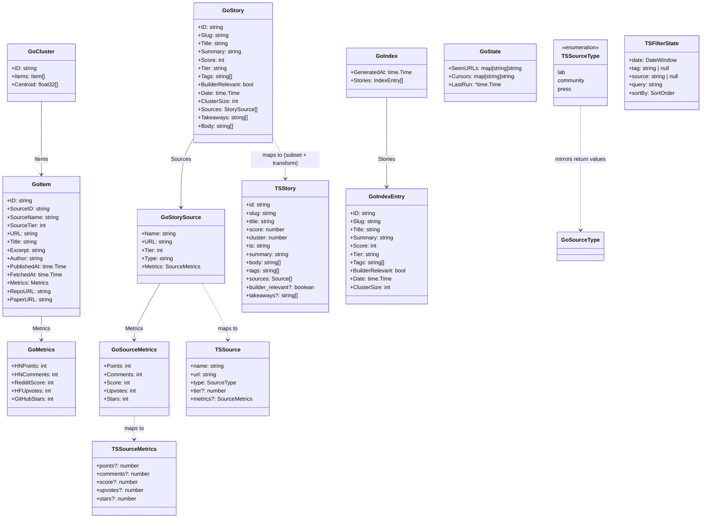

# Core Data Contracts: Go Types and TypeScript Mirrors

This chapter defines the shared data models that form the contract between the Go agent pipeline and the React site. Every type declared in `agent/internal/model/types.go` is documented alongside its TypeScript counterpart in `site/src/types/story.ts`, including serialization formats, field semantics, and the exact mapping rules the writer and site rely on.

## Table of Contents

- [Overview](#overview)
- [Go Type Definitions](#go-type-definitions)
  - [Item](#item)
  - [Metrics](#metrics)
  - [Cluster](#cluster)
  - [Tier Constants](#tier-constants)
  - [Story](#story)
  - [StorySource](#storysource)
  - [SourceMetrics](#sourcemetrics)
  - [SourceType Function](#sourcetype-function)
  - [IndexEntry](#indexentry)
  - [Index](#index)
  - [State](#state)
- [TypeScript Mirror Types](#typescript-mirror-types)
  - [SourceType](#sourcetype-1)
  - [Source](#source)
  - [Story](#story-1)
  - [DateWindow](#datewindow)
  - [SortOrder](#sortorder)
  - [FilterState](#filterstate)
- [Go ↔ TypeScript Mapping](#go--typescript-mapping)
- [Serialization Formats](#serialization-formats)
- [Key Constraints & Invariants](#key-constraints--invariants)
- [Referenced Files](#referenced-files)

---

## Overview

The agent pipeline produces three primary JSON artifacts consumed by the site at build time:

| Artifact | Path | Go Type | Purpose |
|----------|------|---------|---------|
| **Index** | `data/index.json` | `model.Index` | Ranked story list for feed/top/ship pages |
| **Stories** | `data/stories.json` | `[]model.Story` | Authoritative record of every published story |
| **State** | `data/state.json` | `model.State` | Deduplication tracker (idempotency) |

Individual items are written to `data/items/*.json` (one file per item) but are not directly read by the site. Markdown files under `site/src/content/stories/` are rendered from `stories.json` at build time — the writer never parses frontmatter back.

The TypeScript types in `site/src/types/story.ts` mirror the **frontmatter-equivalent** fields the site needs for rendering. They are not a 1:1 copy of every Go field; they omit pipeline-internal fields (e.g., `Item.FetchedAt`, `Cluster.Centroid`) and adapt date/time to ISO strings.

---

## Go Type Definitions

All Go types live in `agent/internal/model/types.go` (package `model`).

### Item

`agent/internal/model/types.go:11-25`

```go
type Item struct {
	ID          string    `json:"id"` // sha256(canonicalURL)[:16]
	SourceID    string    `json:"source_id"`
	SourceName  string    `json:"source_name"`
	SourceTier  int       `json:"source_tier"`
	URL         string    `json:"url"` // canonical
	Title       string    `json:"title"`
	Excerpt     string    `json:"excerpt"`
	Author      string    `json:"author,omitempty"`
	PublishedAt time.Time `json:"published_at"`
	FetchedAt   time.Time `json:"fetched_at"`
	Metrics     Metrics   `json:"metrics"`
	RepoURL     string    `json:"repo_url,omitempty"`
	PaperURL    string    `json:"paper_url,omitempty"`
}
```

**Field semantics:**

| Field | Description | Constraints |
|-------|-------------|-------------|
| `ID` | First 16 hex chars of SHA-256(canonical URL) | Stable identifier; used as dedup key in `State.SeenURLs` |
| `SourceID` | Machine-readable source key from `sources.json` | e.g., `hn`, `rss-reddit-ml` |
| `SourceName` | Human-readable source name | e.g., "Hacker News", "Reddit r/MachineLearning" |
| `SourceTier` | Integer tier from source config (1–5+) | Drives `SourceType` mapping; lower = more authoritative |
| `URL` | Canonical URL after normalization | Wrapper unwrapping, variant collapsing applied |
| `Title` | Cleaned title (HTML stripped, whitespace collapsed) | |
| `Excerpt` | Plain-text excerpt, **≤ 300 characters** | Enforced by `normalize.Excerpt`; see [Key Constraints](#key-constraints--invariants) |
| `Author` | Optional author name | Omitted if empty (`omitempty`) |
| `PublishedAt` | Original publication timestamp | Parsed from source; timezone normalized to UTC |
| `FetchedAt` | When the agent fetched this item | Pipeline-internal; not exposed to site |
| `Metrics` | Community validation signals | See [Metrics](#metrics) |
| `RepoURL` | Extracted GitHub/GitLab repository URL | Populated by `normalize.ExtractRepoURL` |
| `PaperURL` | Extracted arXiv/HuggingFace paper URL | Populated by `normalize.ExtractPaperURL` |

**Serialization:** Written as individual JSON files to `data/items/<id>.json` via `store.WriteJSON`. The `ID` field is the filename stem.

---

### Metrics

`agent/internal/model/types.go:28-34`

```go
type Metrics struct {
	HNPoints    int `json:"hn_points,omitempty"`
	HNComments  int `json:"hn_comments,omitempty"`
	RedditScore int `json:"reddit_score,omitempty"`
	HFUpvotes   int `json:"hf_upvotes,omitempty"`
	GitHubStars int `json:"github_stars,omitempty"`
}
```

Carries community-validation signals used by the scoring stage. Each field corresponds to a source type:

| Field | Source | Meaning |
|-------|--------|---------|
| `HNPoints` | Hacker News | Upvote count |
| `HNComments` | Hacker News | Comment count |
| `RedditScore` | Reddit | Net upvotes (up − down) |
| `HFUpvotes` | Hugging Face Papers | Upvote count |
| `GitHubStars` | GitHub | Star count at fetch time |

All fields use `omitempty` — absent when zero.

---

### Cluster

`agent/internal/model/types.go:37-41`

```go
type Cluster struct {
	ID       string    `json:"id"`
	Items    []Item    `json:"items"`
	Centroid []float32 `json:"-"`
}
```

**Field semantics:**

| Field | Description |
|-------|-------------|
| `ID` | Cluster identifier (typically `cluster-<timestamp>-<n>`) |
| `Items` | All `Item`s grouped by embedding similarity |
| `Centroid` | Mean embedding vector (excluded from JSON via `json:"-"`) |

The `Centroid` is used only during clustering (O(n²) similarity) and scoring; it is never persisted.

---

### Tier Constants

`agent/internal/model/types.go:45-47`

```go
const (
	TierMajor   = "major"
	TierNotable = "notable"
	TierMinor   = "minor"
)
```

Three importance tiers assigned to each `Cluster` → `Story`. They drive:

- **Scoring weight** via `config/scoring.json` tier weights
- **Visual presentation** on the site (badge color, sort priority)
- **SourceType mapping** via `SourceType(tier int)` (see below)

| Constant | Value | Numeric tier (for SourceType) |
|----------|-------|-------------------------------|
| `TierMajor` | `"major"` | 1 (highest) |
| `TierNotable` | `"notable"` | 2 |
| `TierMinor` | `"minor"` | 3 (lowest) |

> **Note:** The numeric tier used by `SourceType` is the *source* tier (1–5+), not the story tier. Story tier constants are strings; source tier is an integer from `sources.json`.

---

### Story

`agent/internal/model/types.go:55-69`

```go
type Story struct {
	ID              string        `json:"id"`
	Slug            string        `json:"slug"`
	Title           string        `json:"title"`
	Summary         string        `json:"summary"`
	Score           int           `json:"score"`
	Tier            string        `json:"tier"` // major | notable | minor
	Tags            []string      `json:"tags"`
	BuilderRelevant bool          `json:"builder_relevant"`
	Date            time.Time     `json:"date"`
	ClusterSize     int           `json:"cluster_size"`
	Sources         []StorySource `json:"sources"`
	Takeaways       []string      `json:"takeaways,omitempty"`
	Body            []string      `json:"body,omitempty"`
}
```

**Field semantics:**

| Field | Description | Source |
|-------|-------------|--------|
| `ID` | Same as cluster ID | `Cluster.ID` |
| `Slug` | URL-safe slug for story page | Derived from title + ID |
| `Title` | Story headline | LLM-generated or cluster representative |
| `Summary` | One-paragraph LLM summary | Original prose, not extracted sentences |
| `Score` | Final ranking score | Scoring stage output |
| `Tier` | One of `TierMajor`/`TierNotable`/`TierMinor` | Cluster tier assignment |
| `Tags` | Topic tags | LLM-extracted + keyword matching |
| `BuilderRelevant` | Whether relevant to builders/developers | Heuristic: repo/paper URLs present, technical tags |
| `Date` | Publication date (UTC midnight) | Earliest `Item.PublishedAt` in cluster |
| `ClusterSize` | Number of items in cluster | `len(Cluster.Items)` |
| `Sources` | All source links from cluster items | One per unique source; see [StorySource](#storysource) |
| `Takeaways` | Optional bullet-point takeaways | LLM-generated; `omitempty` |
| `Body` | Optional full markdown body paragraphs | LLM-generated; `omitempty` |

**Serialization:** Written to `data/stories.json` as an array. Also rendered to `site/src/content/stories/<slug>.md` with frontmatter + body.

---

### StorySource

`agent/internal/model/types.go:73-79`

```go
type StorySource struct {
	Name    string         `json:"name"`
	URL     string         `json:"url"`
	Tier    int            `json:"tier"`
	Type    string         `json:"type"` // lab | press | community
	Metrics *SourceMetrics `json:"metrics,omitempty"`
}
```

One outbound link on a story page. **R3 (from architecture): every source a cluster drew from appears here.**

| Field | Description |
|-------|-------------|
| `Name` | Source display name (e.g., "Hacker News") |
| `URL` | Canonical URL of the source item |
| `Tier` | Source tier integer (1–5+) from config |
| `Type` | Coarse category: `"lab"`, `"press"`, or `"community"` — computed by `SourceType(tier)` |
| `Metrics` | Optional per-source metrics for rendering | See [SourceMetrics](#sourcemetrics) |

---

### SourceMetrics

`agent/internal/model/types.go:82-88`

```go
type SourceMetrics struct {
	Points   int `json:"points,omitempty"`
	Comments int `json:"comments,omitempty"`
	Score    int `json:"score,omitempty"`
	Upvotes  int `json:"upvotes,omitempty"`
	Stars    int `json:"stars,omitempty"`
}
```

Mirrors the metrics block the site renders per source. Maps from `Item.Metrics` fields:

| SourceMetrics Field | Item.Metrics Field | Source Type |
|---------------------|-------------------|-------------|
| `Points` | `HNPoints` | Hacker News |
| `Comments` | `HNComments` | Hacker News |
| `Score` | `RedditScore` | Reddit |
| `Upvotes` | `HFUpvotes` | Hugging Face Papers |
| `Stars` | `GitHubStars` | GitHub |

---

### SourceType Function

`agent/internal/model/types.go:91-100`

```go
func SourceType(tier int) string {
	switch {
	case tier <= 3:
		return "lab"
	case tier == 4:
		return "press"
	default:
		return "community"
	}
}
```

Maps a source's integer tier (from `sources.json`) to the coarse category the site renders.

| Source Tier (config) | SourceType | Meaning |
|----------------------|------------|---------|
| 1–3 | `"lab"` | Primary research, official blogs, arXiv |
| 4 | `"press"` | Tech journalism, news outlets |
| 5+ | `"community"` | Aggregators, forums, social |

This is the **single source of truth** for the `type` field in `StorySource` and the TypeScript `Source.type`.

---

### IndexEntry

`agent/internal/model/types.go:103-114`

```go
type IndexEntry struct {
	ID              string    `json:"id"`
	Slug            string    `json:"slug"`
	Title           string    `json:"title"`
	Summary         string    `json:"summary"`
	Score           int       `json:"score"`
	Tier            string    `json:"tier"`
	Tags            []string  `json:"tags"`
	BuilderRelevant bool      `json:"builder_relevant"`
	Date            time.Time `json:"date"`
	ClusterSize     int       `json:"cluster_size"`
}
```

Slim record in `data/index.json` used by feed/top/ship pages. Subset of `Story` fields — omits `Sources`, `Takeaways`, `Body`.

---

### Index

`agent/internal/model/types.go:117-120`

```go
type Index struct {
	GeneratedAt time.Time    `json:"generated_at"`
	Stories     []IndexEntry `json:"stories"`
}
```

Whole of `data/index.json`. `GeneratedAt` is the pipeline run timestamp (UTC).

---

### State

`agent/internal/model/types.go:123-151`

```go
type State struct {
	SeenURLs map[string]string `json:"seen_urls"`
	Cursors  map[string]string `json:"cursors"`
	LastRun  *time.Time        `json:"last_run"`
}

func NewState() *State {
	return &State{
		SeenURLs: map[string]string{},
		Cursors:  map[string]string{},
	}
}

func (s *State) Seen(id string) bool {
	_, ok := s.SeenURLs[id]
	return ok
}

func (s *State) MarkSeen(id string, day time.Time) {
	if s.SeenURLs == nil {
		s.SeenURLs = map[string]string{}
	}
	s.SeenURLs[id] = day.UTC().Format(time.DateOnly)
}
```

**Idempotency mechanism (R7).** Persisted to `data/state.json`.

| Field | Description |
|-------|-------------|
| `SeenURLs` | Map: `Item.ID` → `YYYY-MM-DD` (date first seen). Key is SHA-256(canonicalURL)[:16]. |
| `Cursors` | Per-source high-water marks (e.g., HN max item ID, RSS etag/last-modified). |
| `LastRun` | Timestamp of last successful pipeline run. |

**Methods:**

- `Seen(id)` — returns true if item ID exists in `SeenURLs`
- `MarkSeen(id, day)` — records item as seen on given day (UTC date only)

**Deduplication flow:** `normalize.Dedupe` calls `state.Seen(item.ID)` for each new item. If true, item is dropped. If false, `state.MarkSeen(item.ID, now)` after successful write. This makes re-runs same-day produce zero new stories.

---

## TypeScript Mirror Types

All TypeScript types live in `site/src/types/story.ts`. These are the **only** types the site imports for story data.

### SourceType

`site/src/types/story.ts:1`

```typescript
export type SourceType = 'lab' | 'community' | 'press';
```

Direct mirror of Go `SourceType` return values. Used for `Source.type` and filter UI.

---

### Source

`site/src/types/story.ts:3-15`

```typescript
export interface Source {
  name: string;
  url: string;
  type: SourceType;
  tier?: number;
  metrics?: {
    points?: number;
    comments?: number;
    score?: number;
    upvotes?: number;
    stars?: number;
  };
}
```

Mirrors `StorySource` + `SourceMetrics`. Differences from Go:

| Go Field | TS Field | Notes |
|----------|----------|-------|
| `Name` | `name` | |
| `URL` | `url` | |
| `Tier` | `tier?` | Optional in TS (site doesn't require it) |
| `Type` | `type` | `SourceType` union |
| `Metrics` | `metrics?` | Optional; same field names but camelCase |

---

### Story

`site/src/types/story.ts:17-30`

```typescript
export interface Story {
  id: string;
  slug: string;
  title: string;
  score: number;
  cluster: number;
  ts: string; // ISO 8601 string
  summary: string;
  body: string[];
  tags: string[];
  sources: Source[];
  builder_relevant?: boolean;
  takeaways?: string[];
}
```

**Field-by-field mapping from Go `Story`:**

| Go Field | TS Field | Transformation |
|----------|----------|----------------|
| `ID` | `id` | Same |
| `Slug` | `slug` | Same |
| `Title` | `title` | Same |
| `Score` | `score` | `int` → `number` |
| `ClusterSize` | `cluster` | Renamed; `int` → `number` |
| `Date` | `ts` | `time.Time` → ISO 8601 string (`"2024-01-15T00:00:00Z"`) |
| `Summary` | `summary` | Same |
| `Body` | `body` | `[]string` → `string[]` |
| `Tags` | `tags` | Same |
| `Sources` | `sources` | `[]StorySource` → `Source[]` |
| `BuilderRelevant` | `builder_relevant?` | Optional in TS |
| `Takeaways` | `takeaways?` | Optional in TS |
| `Tier` | *(omitted)* | Not in TS; derived from `score`/`cluster` for sorting |
| `Summary` (duplicate) | *(omitted)* | — |

> **Note:** The site does not receive `Tier` in the Story type. Tier-based sorting/filtering uses `score` and `cluster` instead. The `FilterState.sortBy = 'cluster'` groups by cluster size.

---

### DateWindow

`site/src/types/story.ts:32`

```typescript
export type DateWindow = 'ALL' | '24H' | '7D';
```

Filter option for time-window selection in `useAirfoilSignals`.

---

### SortOrder

`site/src/types/story.ts:33`

```typescript
export type SortOrder = 'newest' | 'score' | 'cluster';
```

| Value | Meaning |
|-------|---------|
| `'newest'` | Sort by `ts` descending |
| `'score'` | Sort by `score` descending |
| `'cluster'` | Sort by `cluster` (size) descending |

---

### FilterState

`site/src/types/story.ts:35-41`

```typescript
export interface FilterState {
  date: DateWindow;
  tag: string | null;
  source: string | null;
  query: string;
  sortBy: SortOrder;
}
```

Complete filter combination managed by `useAirfoilSignals.ts`. All fields are required (non-optional) with `null` for "no filter" on tag/source.

---

## Go ↔ TypeScript Mapping



**Key mapping rules:**

1. **Date serialization:** Go `time.Time` → ISO 8601 string (`ts` field)
2. **Field renaming:** `ClusterSize` → `cluster`, `BuilderRelevant` → `builder_relevant`
3. **Omitted fields:** `Tier`, `FetchedAt`, `Centroid`, `Cursors`, `LastRun` — not needed by site
4. **Optional fields:** `Takeaways`, `Body`, `BuilderRelevant` are optional in TS (may be absent in older stories)
5. **Source metrics:** Flattened into `Source.metrics` object with camelCase keys

---

## Serialization Formats

### data/index.json (Go `Index`)

```json
{
  "generated_at": "2024-01-15T12:34:56Z",
  "stories": [
    {
      "id": "cluster-20240115-001",
      "slug": "new-llm-breakthrough",
      "title": "New LLM Breakthrough Announced",
      "summary": "Researchers unveil a novel architecture...",
      "score": 942,
      "tier": "major",
      "tags": ["llm", "research", "architecture"],
      "builder_relevant": true,
      "date": "2024-01-15T00:00:00Z",
      "cluster_size": 7
    }
  ]
}
```

### data/stories.json (Go `[]Story`)

```json
[
  {
    "id": "cluster-20240115-001",
    "slug": "new-llm-breakthrough",
    "title": "New LLM Breakthrough Announced",
    "summary": "Researchers unveil a novel architecture...",
    "score": 942,
    "tier": "major",
    "tags": ["llm", "research", "architecture"],
    "builder_relevant": true,
    "date": "2024-01-15T00:00:00Z",
    "cluster_size": 7,
    "sources": [
      {
        "name": "arXiv",
        "url": "https://arxiv.org/abs/2401.12345",
        "tier": 1,
        "type": "lab",
        "metrics": { "upvotes": 342 }
      },
      {
        "name": "Hacker News",
        "url": "https://news.ycombinator.com/item?id=39123456",
        "tier": 2,
        "type": "community",
        "metrics": { "points": 1240, "comments": 312 }
      }
    ],
    "takeaways": ["Novel attention mechanism reduces compute 40%", "Open weights released"],
    "body": ["## Background", "The new architecture...", "## Results", "Benchmarks show..."]
  }
]
```

### data/state.json (Go `State`)

```json
{
  "seen_urls": {
    "a1b2c3d4e5f67890": "2024-01-15",
    "f0e9d8c7b6a59876": "2024-01-14"
  },
  "cursors": {
    "hn": "39123456",
    "rss-reddit-ml": "2024-01-15T10:00:00Z"
  },
  "last_run": "2024-01-15T12:34:56Z"
}
```

### site/src/content/stories/<slug>.md (rendered from Story)

```markdown
---
id: "cluster-20240115-001"
slug: "new-llm-breakthrough"
title: "New LLM Breakthrough Announced"
summary: "Researchers unveil a novel architecture..."
score: 942
tier: "major"
tags: ["llm", "research", "architecture"]
builder_relevant: true
date: "2024-01-15T00:00:00Z"
cluster_size: 7
sources:
  - name: "arXiv"
    url: "https://arxiv.org/abs/2401.12345"
    tier: 1
    type: "lab"
    metrics:
      upvotes: 342
  - name: "Hacker News"
    url: "https://news.ycombinator.com/item?id=39123456"
    tier: 2
    type: "community"
    metrics:
      points: 1240
      comments: 312
takeaways:
  - "Novel attention mechanism reduces compute 40%"
  - "Open weights released"
---

## Background

The new architecture...

## Results

Benchmarks show...
```

---

## Key Constraints & Invariants

| Constraint | Enforced By | Description |
|------------|-------------|-------------|
| **Excerpt ≤ 300 chars** | `normalize.Excerpt` (called by `normalize.Build`) | Hard cap; no code path constructs `Item` with longer excerpt. See `agent/internal/normalize/text.go`. |
| **Item.ID = sha256(canonicalURL)[:16]** | `normalize.ItemID` | Stable dedup key; used in `State.SeenURLs`. |
| **One Story per Cluster** | Pipeline: cluster → score → summarize → write | 1:1 mapping; `Story.ID == Cluster.ID`. |
| **Every cluster source appears in Story.Sources** | Writer (R3) | `StorySource` constructed from unique `Item.SourceID` in cluster. |
| **Tier values** | Constants + validation | Only `"major"`, `"notable"`, `"minor"` allowed. `Config.Validate()` checks scoring.json references valid tiers. |
| **SourceType mapping** | `SourceType(tier int)` | Single source of truth for `lab`/`press`/`community`. |
| **State.SeenURLs key = Item.ID** | `State.Seen` / `State.MarkSeen` | Per-day granularity (YYYY-MM-DD). Same item re-ingested next day → new story possible. |
| **No `data/cache/` in git** | `.gitignore` + CI validation | Embeddings regenerable; cache can be huge. |
| **Atomic JSON writes** | `store.WriteJSON` (temp file + rename) | Prevents partial reads during concurrent site build. |

---

## Referenced Files

- `agent/internal/model/types.go` — All Go type definitions, constants, and State methods
- `site/src/types/story.ts` — All TypeScript mirror types
- `agent/internal/normalize/text.go` — `Excerpt` function (300-char cap enforcement)
- `agent/internal/normalize/urls.go` — `ItemID`, `CanonicalURL` (ID generation)
- `agent/internal/store/json.go` — `ReadJSON`, `WriteJSON` (atomic serialization)
- `config/scoring.json` — Tier weights referenced by `TierMajor`/`TierNotable`/`TierMinor`
- `config/sources.json` — Source tier integers that feed `SourceType()`

<!-- kaioken:files agent/internal/model/types.go,site/src/types/story.ts -->
