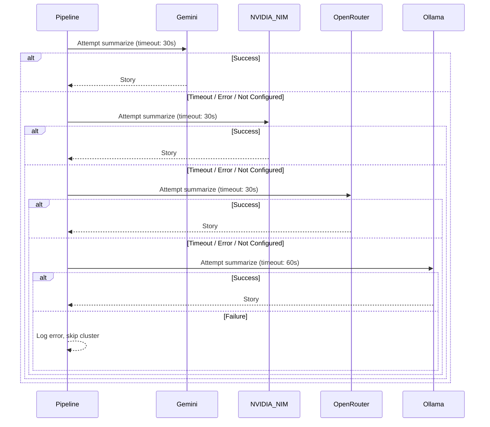
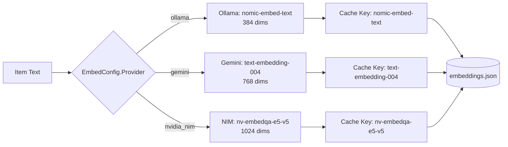

# Embedding and LLM Provider Fallback Chains

This chapter documents the two provider fallback systems in Airfoil: the **embedder selection** (Ollama local vs Gemini vs NVIDIA NIM for CI) and the **four-provider LLM summarization fallback chain** (Gemini → NVIDIA NIM → OpenRouter → Ollama). Both are configured entirely through environment variables and validated at startup.

## Table of Contents

- [Embedder Selection](#embedder-selection)
- [LLM Summarization Fallback Chain](#llm-summarization-fallback-chain)
- [Environment Variables Reference](#environment-variables-reference)
- [Validation and Startup Behavior](#validation-and-startup-behavior)
- [Cache Keying by Provider](#cache-keying-by-provider)

---

## Embedder Selection

The embedding step (pipeline stage 5) converts normalized `Item` texts into vectors for clustering. Airfoil supports three embedding providers, selected via `AIRFOIL_EMBEDDER`.

### Supported Providers

| Provider | Constant | Default Model | Use Case |
|----------|----------|---------------|----------|
| Ollama (local) | `EmbedderOllama` = `"ollama"` | `nomic-embed-text` | Local development, default |
| Gemini | `EmbedderGemini` = `"gemini"` | `text-embedding-004` | CI / cloud runs |
| NVIDIA NIM | `EmbedderNvidiaNIM` = `"nvidia_nim"` | `nvidia/nv-embedqa-e5-v5` | Alternative cloud provider |

### Configuration Structure

`agent/internal/config/config.go:66-72`

```go
type EmbedConfig struct {
	Provider    string // ollama (local) | gemini | nvidia_nim
	OllamaHost  string
	OllamaModel string
	GeminiKey   string
	GeminiModel string
	NIMKey      string
	NIMModel    string
	NIMBaseURL  string
}
```

The `Model()` method returns the model ID for the active provider:

`agent/internal/config/config.go:74-80`

```go
func (e EmbedConfig) Model() string {
	switch e.Provider {
	case EmbedderGemini:
		return e.GeminiModel
	case EmbedderNvidiaNIM:
		return e.NIMModel
	default:
		return e.OllamaModel
	}
}
```

### Provider Resolution at Load Time

`agent/internal/config/config.go:149-160`

```go
Embed: EmbedConfig{
	Provider:    firstNonEmpty(os.Getenv("AIRFOIL_EMBEDDER"), EmbedderOllama),
	OllamaHost:  firstNonEmpty(os.Getenv("OLLAMA_HOST"), "http://localhost:11434"),
	OllamaModel: firstNonEmpty(os.Getenv("OLLAMA_EMBED_MODEL"), "nomic-embed-text"),
	GeminiKey:   os.Getenv("GEMINI_API_KEY"),
	GeminiModel: firstNonEmpty(os.Getenv("GEMINI_EMBED_MODEL"), "text-embedding-004"),
	NIMKey:      os.Getenv("NVIDIA_NIM_API_KEY"),
	NIMModel:    firstNonEmpty(os.Getenv("NVIDIA_NIM_EMBED_MODEL"), "nvidia/nv-embedqa-e5-v5"),
	NIMBaseURL:  firstNonEmpty(os.Getenv("NVIDIA_NIM_BASE_URL"), "https://integrate.api.nvidia.com/v1"),
},
```

### Validation

`agent/internal/config/config.go:226-233`

```go
switch c.Embed.Provider {
case EmbedderOllama, EmbedderGemini, EmbedderNvidiaNIM:
default:
	problems = append(problems, fmt.Sprintf("AIRFOIL_EMBEDDER=%q: want one of %q, %q, %q",
		c.Embed.Provider, EmbedderOllama, EmbedderGemini, EmbedderNvidiaNIM))
}
```

### Embedding Cache

Vectors are cached at `data/cache/embeddings.json` (returned by `Config.EmbedCachePath()`). The cache is **keyed by model ID** so vectors from different providers never mix. The cache is never committed (`.gitignore` excludes `data/cache/`).

---

## LLM Summarization Fallback Chain

The summarization step (pipeline stage 7) calls an LLM to produce a `Story` from a `Cluster`. Airfoil attempts providers in a fixed priority order, falling back on timeout or error.

### Fallback Sequence



### Provider Configuration

Each provider is represented by `ProviderCreds` (API key + model ID). A provider is **attempted only if `Configured()` returns true** (both key and model present).

`agent/internal/config/config.go:34-50`

```go
type LLMConfig struct {
	Gemini     ProviderCreds
	NvidiaNIM  ProviderCreds
	OpenRouter ProviderCreds
	Ollama     OllamaConfig
}

type ProviderCreds struct {
	APIKey string
	Model  string
}

func (p ProviderCreds) Configured() bool {
	return p.APIKey != "" && p.Model != ""
}
```

### Default Models and Env Vars

`agent/internal/config/config.go:130-145`

```go
LLM: LLMConfig{
	Gemini: ProviderCreds{
		APIKey: os.Getenv("GEMINI_API_KEY"),
		Model:  firstNonEmpty(os.Getenv("GEMINI_MODEL"), "gemini-2.0-flash"),
	},
	NvidiaNIM: ProviderCreds{
		APIKey: os.Getenv("NVIDIA_NIM_API_KEY"),
		Model:  firstNonEmpty(os.Getenv("NVIDIA_NIM_MODEL"), "meta/llama-3.3-70b-instruct"),
	},
	OpenRouter: ProviderCreds{
		APIKey: os.Getenv("OPENROUTER_API_KEY"),
		Model:  firstNonEmpty(os.Getenv("OPENROUTER_MODEL"), "meta-llama/llama-3.3-70b-instruct:free"),
	},
	Ollama: OllamaConfig{
		Host:       firstNonEmpty(os.Getenv("OLLAMA_HOST"), "http://localhost:11434"),
		ChatModel:  firstNonEmpty(os.Getenv("OLLAMA_CHAT_MODEL"), "llama3.1"),
		EmbedModel: firstNonEmpty(os.Getenv("OLLAMA_EMBED_MODEL"), "nomic-embed-text"),
	},
},
```

### Ollama Uses Separate Config

Note: Ollama for **chat** (summarization) uses `OllamaConfig.ChatModel`, while Ollama for **embeddings** uses `OllamaConfig.EmbedModel`. They share the same `Host`.

---

## Environment Variables Reference

### Embedder Selection

| Variable | Default | Description |
|----------|---------|-------------|
| `AIRFOIL_EMBEDDER` | `ollama` | Provider: `ollama`, `gemini`, or `nvidia_nim` |
| `OLLAMA_HOST` | `http://localhost:11434` | Ollama daemon endpoint |
| `OLLAMA_EMBED_MODEL` | `nomic-embed-text` | Embedding model for Ollama |
| `GEMINI_API_KEY` | (required for Gemini) | Google AI Studio API key |
| `GEMINI_EMBED_MODEL` | `text-embedding-004` | Gemini embedding model |
| `NVIDIA_NIM_API_KEY` | (required for NIM) | NVIDIA NIM API key |
| `NVIDIA_NIM_EMBED_MODEL` | `nvidia/nv-embedqa-e5-v5` | NIM embedding model |
| `NVIDIA_NIM_BASE_URL` | `https://integrate.api.nvidia.com/v1` | NIM API base URL |

### LLM Summarization Chain

| Variable | Default | Provider | Purpose |
|----------|---------|----------|---------|
| `GEMINI_API_KEY` | — | Gemini (1st) | API key for Gemini |
| `GEMINI_MODEL` | `gemini-2.0-flash` | Gemini (1st) | Chat model for summarization |
| `NVIDIA_NIM_API_KEY` | — | NVIDIA NIM (2nd) | API key for NIM |
| `NVIDIA_NIM_MODEL` | `meta/llama-3.3-70b-instruct` | NVIDIA NIM (2nd) | Chat model for summarization |
| `OPENROUTER_API_KEY` | — | OpenRouter (3rd) | API key for OpenRouter |
| `OPENROUTER_MODEL` | `meta-llama/llama-3.3-70b-instruct:free` | OpenRouter (3rd) | Chat model for summarization |
| `OLLAMA_HOST` | `http://localhost:11434` | Ollama (4th) | Local Ollama daemon |
| `OLLAMA_CHAT_MODEL` | `llama3.1` | Ollama (4th) | Local chat model for summarization |

### Shared / General

| Variable | Default | Description |
|----------|---------|-------------|
| `AIRFOIL_CONFIG_DIR` | `./config` | Directory containing `sources.json`, `scoring.json`, `keywords.json` |
| `AIRFOIL_DATA_DIR` | `./data` | Root for generated data (`items/`, `cache/`, `index.json`, etc.) |
| `AIRFOIL_STORIES_DIR` | `site/src/content/stories` | Where Markdown story files are written |
| `AIRFOIL_LOG_LEVEL` | `info` | `slog` level: `debug`, `info`, `warn`, `error` |
| `SITE_URL` | — | Base URL for canonical links in generated content |
| `GITHUB_TOKEN` | — | Optional: raises GitHub API rate limit 60→5000/hr |
| `REDDIT_USER_AGENT` | `airfoil/0.1` | Required descriptive User-Agent for Reddit RSS |

---

## Validation and Startup Behavior

Configuration is loaded and validated **once at startup** in `config.Load()`. The pipeline never reads `os.Getenv` directly after that.

### Validation Rules

1. **At least one enabled source** in `sources.json`
2. **All sources** have unique `id`, non-empty `name`, `url`, valid `type`, `tier` 1–5
3. **Scoring config** passes its own validation (tier weights, recency half-life, etc.)
4. **Keywords config** has non-empty `builder_signals` and `hype_signals`
5. **Embedder provider** is one of the three constants
6. **No silent failures**: invalid config is a hard error before any I/O

`agent/internal/config/config.go:194-244` (excerpt)

```go
func (c *Config) Validate() error {
	var problems []string

	if len(c.EnabledSources()) == 0 {
		problems = append(problems, "no enabled sources in sources.json")
	}
	// ... source validation ...

	problems = append(problems, c.Scoring.problems()...)

	if len(c.Keywords.BuilderSignals) == 0 {
		problems = append(problems, "keywords.json: builder_signals is empty")
	}
	if len(c.Keywords.HypeSignals) == 0 {
		problems = append(problems, "keywords.json: hype_signals is empty")
	}

	switch c.Embed.Provider {
	case EmbedderOllama, EmbedderGemini, EmbedderNvidiaNIM:
	default:
		problems = append(problems, fmt.Sprintf("AIRFOIL_EMBEDDER=%q: want one of %q, %q, %q",
			c.Embed.Provider, EmbedderOllama, EmbedderGemini, EmbedderNvidiaNIM))
	}

	if len(problems) > 0 {
		return fmt.Errorf("config: invalid:\n  - %s", strings.Join(problems, "\n  - "))
	}
	return nil
}
```

### Implication for Fallback Chain

- If `GEMINI_API_KEY` is unset, `LLMConfig.Gemini.Configured()` returns `false` → **Gemini is skipped entirely** (not attempted, not timed out)
- Same for each subsequent provider
- If **no provider is configured**, the summarization step will fail for every cluster (logged, cluster skipped)
- The `doctor` command (`cmd/airfoil/doctor.go`) can be used to verify which providers are configured before a run

---

## Cache Keying by Provider

The embedding cache (`data/cache/embeddings.json`) is **keyed by model ID** (`EmbedConfig.Model()`). This prevents accidental mixing of vectors from different providers/dimensions.



**Practical consequence**: Switching `AIRFOIL_EMBEDDER` (or the model env var) automatically uses a fresh cache namespace. No manual cache clearing needed.

---

## Referenced Files

- `agent/internal/config/config.go` — Configuration loading, validation, provider structs, env var defaults, path derivation

---

*This document covers only the provider configuration and fallback logic as defined in `config.go`. The actual HTTP clients, request/response handling, prompt construction, and timeout implementation live in `internal/llm/` and `internal/embed/` (not in scope for this chapter).*

<!-- kaioken:files agent/internal/config/config.go -->
