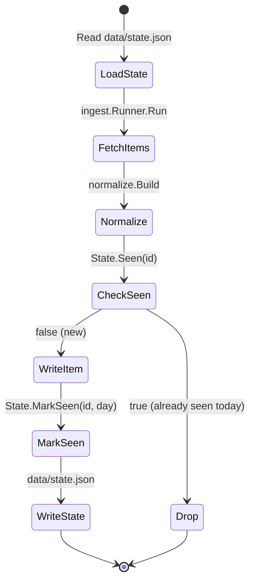

# Git as Storage Layer: Data Directories and Commit Protocol

This chapter details the on-disk layout that makes Git the system's storage layer: the `data/` directory generated by the Go agent, the `site/src/content/stories/` directory consumed by the React site, and the conventional commit message format used by the automated agent.

## Table of Contents

- [Data Directory Overview](#data-directory-overview)
- [data/items/ — Normalized Ingest Units](#dataitems--normalized-ingest-units)
- [data/cache/ — Embedding Vectors (Never Committed)](#datacache--embedding-vectors-never-committed)
- [data/index.json — Ranked Story Index for Site](#dataindexjson--ranked-story-index-for-site)
- [data/state.json — Idempotency Tracker](#datastatejson--idempotency-tracker)
- [data/stories.json — Authoritative Story Registry](#datastoriesjson--authoritative-story-registry)
- [data/digest/ — Digest Artifacts](#datadigest--digest-artifacts)
- [site/src/content/stories/ — Markdown Story Files](#sitesrccontentstories--markdown-story-files)
- [Commit Message Protocol](#commit-message-protocol)
- [Validation Gate Before Commit](#validation-gate-before-commit)
- [Referenced Files](#referenced-files)

---

## Data Directory Overview

The agent writes all generated artifacts into a `data/` directory (configurable via `AIRFOIL_DATA_DIR`, default `./data`). This directory is committed to Git, **except** `data/cache/`. The React site reads `data/index.json` and the Markdown files under `site/src/content/stories/` at build time.

```
data/
├── items/              # One JSON file per normalized Item
│   ├── <item-id>.json
│   └── ...
├── cache/              # Embedding vectors (gitignored, regenerable)
│   └── embeddings.json
├── index.json          # Ranked IndexEntry[] for feed/top/ship pages
├── state.json          # Dedup tracker: SeenURLs, Cursors, LastRun
├── stories.json        # Authoritative Story[] registry (all published stories)
└── digest/             # Digest artifacts (future use)
```

The `Config` struct exposes derived paths for every file:

`agent/internal/config/config.go:81-89`

```go
// Paths to the generated data files.
func (c Config) ItemsDir() string    { return filepath.Join(c.DataDir, "items") }
func (c Config) CacheDir() string    { return filepath.Join(c.DataDir, "cache") }
func (c Config) DigestDir() string   { return filepath.Join(c.DataDir, "digest") }
func (c Config) IndexPath() string   { return filepath.Join(c.DataDir, "index.json") }
func (c Config) StatePath() string   { return filepath.Join(c.DataDir, "state.json") }
func (c Config) StoriesPath() string { return filepath.Join(c.DataDir, "stories.json") }
func (c Config) EmbedCachePath() string {
	return filepath.Join(c.CacheDir(), "embeddings.json")
}
```

---

## data/items/ — Normalized Ingest Units

Each successful normalization produces one `Item` written to `data/items/<id>.json` where `<id>` is the first 16 hex chars of `sha256(canonicalURL)`. The `Item` struct is the contract between ingest, clustering, scoring, and writing.

`agent/internal/model/types.go:11-25`

```go
// Item is one article from one source, after normalization.
//
// R1: Excerpt is capped at 300 characters by the normalize package. No other
// code path constructs an Item, so nothing longer can reach disk.
type Item struct {
	ID          string    `json:"id"` // sha256(canonicalURL)[:16]
	SourceID    string    `json:"source_id"`
	SourceName  string    `json:"source_name"`
	SourceTier  int       `json:"source_tier"`
	URL         string    `json:"url"` // canonical
	Title       string    `json:"title"`
	Excerpt     string    `json:"excerpt"`
	Author      string    `json:"author,omitempty"`
	PublishedAt time.Time `json:"published_at"`
	FetchedAt   time.Time `json:"fetched_at"`
	Metrics     Metrics   `json:"metrics"`
	RepoURL     string    `json:"repo_url,omitempty"`
	PaperURL    string    `json:"paper_url,omitempty"`
}
```

**Key invariants enforced at write time:**
- `Excerpt` ≤ 300 characters (enforced in `normalize.Excerpt`)
- `URL` is canonical (wrapper unwrapped, variants collapsed)
- `ID` is deterministic from canonical URL → idempotent re-runs produce same filenames
- `Metrics` carries community signals (HN points, Reddit score, HF upvotes, GitHub stars) used by scoring

**File naming:** `<id>.json` where `id = sha256(canonicalURL)[:16]`. Example: `a1b2c3d4e5f67890.json`.

---

## data/cache/ — Embedding Vectors (Never Committed)

`data/cache/embeddings.json` stores vector embeddings keyed by `Item.ID` and embedding model. This directory is **never committed** — embeddings are regenerable, large, and provider-specific.

`agent/internal/config/config.go:87-89`

```go
func (c Config) EmbedCachePath() string {
	return filepath.Join(c.CacheDir(), "embeddings.json")
}
```

**Cache key structure:** `modelID:itemID` → `[]float32`. The `EmbedConfig.Model()` method returns the active model ID, so switching providers (Ollama ↔ Gemini ↔ NVIDIA NIM) automatically isolates caches.

`agent/internal/config/config.go:66-72`

```go
// EmbedConfig selects and configures the embedding provider.
//
// Dimensionality differs per provider, and the clustering threshold is tuned
// against one of them, so switching providers means retuning. The embedding
// cache is keyed by model to keep vectors from two providers from mixing.
type EmbedConfig struct {
	Provider    string // ollama (local) | gemini | nvidia_nim
	OllamaHost  string
	OllamaModel string
	GeminiKey   string
	GeminiModel string
	NIMKey      string
	NIMModel    string
	NIMBaseURL  string
}
```

**Operational note:** `data/cache/` is in `.gitignore`. CI and local runs regenerate embeddings on first run after cache clear.

---

## data/index.json — Ranked Story Index for Site

`data/index.json` is the primary consumption artifact for the React site. It contains an `Index` with a generation timestamp and a ranked list of `IndexEntry` — slim records with everything the feed/top/ship pages need without the full story body.

`agent/internal/model/types.go:103-120`

```go
// IndexEntry is the slim record in data/index.json used by feed/top/ship.
type IndexEntry struct {
	ID              string    `json:"id"`
	Slug            string    `json:"slug"`
	Title           string    `json:"title"`
	Summary         string    `json:"summary"`
	Score           int       `json:"score"`
	Tier            string    `json:"tier"`
	Tags            []string  `json:"tags"`
	BuilderRelevant bool      `json:"builder_relevant"`
	Date            time.Time `json:"date"`
	ClusterSize     int       `json:"cluster_size"`
}

// Index is the whole of data/index.json.
type Index struct {
	GeneratedAt time.Time    `json:"generated_at"`
	Stories     []IndexEntry `json:"stories"`
}
```

**Production flow:** After scoring ranks clusters, the writer serializes `Index` to `data/index.json` (atomic write via temp file + rename). The site's build step reads this file to populate `/feed`, `/top`, `/ship` pages.

---

## data/state.json — Idempotency Tracker

`data/state.json` is the dedup tracker that makes the agent idempotent. It persists `SeenURLs` (item ID → date first seen), per-source `Cursors` (high-water marks), and `LastRun` timestamp.

`agent/internal/model/types.go:123-151`

```go
// State is data/state.json — what makes the agent idempotent (R7).
type State struct {
	// SeenURLs maps an item ID to the date it was first seen, as YYYY-MM-DD.
	SeenURLs map[string]string `json:"seen_urls"`
	// Cursors holds per-source high-water marks.
	Cursors map[string]string `json:"cursors"`
	LastRun *time.Time        `json:"last_run"`
}

// NewState returns an empty, non-nil State.
func NewState() *State {
	return &State{
		SeenURLs: map[string]string{},
		Cursors:  map[string]string{},
	}
}

// Seen reports whether an item ID has already been ingested.
func (s *State) Seen(id string) bool {
	_, ok := s.SeenURLs[id]
	return ok
}

// MarkSeen records an item ID as ingested on the given day.
func (s *State) MarkSeen(id string, day time.Time) {
	if s.SeenURLs == nil {
		s.SeenURLs = map[string]string{}
	}
	s.SeenURLs[id] = day.UTC().Format(time.DateOnly)
}
```

**Idempotency guarantee:** On each run, `normalize.Dedupe` checks `State.Seen(id)` against `data/state.json`. Items already seen on the same day (key = `YYYY-MM-DD`) are dropped. Second run same day → zero new stories.

**Cursor usage:** Per-source cursors (e.g., HN `maxItemID`, Reddit `after` token) enable incremental fetches. Not all adapters implement cursors yet; the field is reserved.

---

## data/stories.json — Authoritative Story Registry

`data/stories.json` is the **authoritative record** of every published story. The Markdown files under `site/src/content/stories/` are rendered from it, so the writer never needs to parse frontmatter back.

`agent/internal/model/types.go:55-69`

```go
// Story is a cluster after scoring and summarization.
//
// data/stories.json is the authoritative record of every published story.
// The markdown files under site/src/content/stories/ are rendered from it, so
// the writer never needs to parse frontmatter back.
type Story struct {
	ID              string        `json:"id"`
	Slug            string        `json:"slug"`
	Title           string        `json:"title"`
	Summary         string        `json:"summary"`
	Score           int           `json:"score"`
	Tier            string        `json:"tier"`
	Tags            []string      `json:"tags"`
	BuilderRelevant bool          `json:"builder_relevant"`
	Date            time.Time     `json:"date"`
	ClusterSize     int           `json:"cluster_size"`
	Sources         []StorySource `json:"sources"`
	Takeaways       []string      `json:"takeaways,omitempty"`
	Body            []string      `json:"body,omitempty"`
}
```

**Tier constants** (used in `Tier` field):

`agent/internal/model/types.go:45-47`

```go
const (
	TierMajor   = "major"
	TierNotable = "notable"
	TierMinor   = "minor"
)
```

**StorySource** captures every outbound link a cluster drew from (R3: every source appears):

`agent/internal/model/types.go:73-79`

```go
// StorySource is one outbound link on a story page. R3: every source a cluster
// drew from appears here.
type StorySource struct {
	Name    string         `json:"name"`
	URL     string         `json:"url"`
	Tier    int            `json:"tier"`
	Type    string         `json:"type"` // lab | press | community
	Metrics *SourceMetrics `json:"metrics,omitempty"`
}
```

**SourceType mapping** (source tier → coarse category for site rendering):

`agent/internal/model/types.go:91-100`

```go
// SourceType maps a source tier to the coarse category the site renders.
func SourceType(tier int) string {
	switch {
	case tier <= 3:
		return "lab"
	case tier == 4:
		return "press"
	default:
		return "community"
	}
}
```

---

## data/digest/ — Digest Artifacts

`data/digest/` is exposed via `Config.DigestDir()` but not yet used in the current pipeline. Reserved for future digest/email artifacts.

`agent/internal/config/config.go:83`

```go
func (c Config) DigestDir() string   { return filepath.Join(c.DataDir, "digest") }
```

---

## site/src/content/stories/ — Markdown Story Files

The React site consumes Markdown files at `site/src/content/stories/<slug>.md`. These are **generated** by the agent's writer stage from `data/stories.json`. Each file contains frontmatter mirroring the `Story` struct and a body rendered from `Story.Body` (LLM-generated prose sections).

**Frontmatter schema** (mirrors `Story` fields):

```yaml
---
id: "abc123"
slug: "llm-cluster-breakthrough"
title: "LLM Cluster Breakthrough"
summary: "One-paragraph summary for cards."
score: 87
tier: "major"
tags: ["llm", "infrastructure"]
builder_relevant: true
date: "2025-01-15T10:30:00Z"
cluster_size: 3
sources:
  - name: "Hacker News"
    url: "https://news.ycombinator.com/item?id=12345"
    tier: 2
    type: "community"
    metrics: { points: 245, comments: 89 }
  - name: "GitHub"
    url: "https://github.com/org/repo"
    tier: 1
    type: "lab"
    metrics: { stars: 1200 }
takeaways:
  - "Key takeaway 1"
  - "Key takeaway 2"
---
```

**Body:** Follows frontmatter, rendered from `Story.Body[]` (each string = one prose section).

**Site consumption:** Vite + `tsc` reads these files at build time. The `Story` TypeScript type in `site/src/types/story.ts` mirrors the Go frontmatter exactly.

---

## Commit Message Protocol

The repository uses two distinct commit conventions:

| Committer | Format | Scope | Example |
|-----------|--------|-------|---------|
| **Human** | Conventional Commits | Any code/config change | `feat: add Reddit adapter`<br>`fix: handle HN 429 retry`<br>`chore: update dependencies` |
| **Agent** | Fixed content format | Only `data/` + `site/src/content/stories/` | `content: 2025-01-15 — 12 stories` |

### Agent Commit Format

```
content: YYYY-MM-DD — N stories
```

- **Prefix:** `content:` (literal)
- **Date:** UTC date of the run (`YYYY-MM-DD`)
- **Separator:** ` — ` (em dash with spaces)
- **Count:** Number of *new* stories written in this run

**Generated by:** The pipeline's final stage after validation passes. The commit includes:
- All new/updated files under `data/` (except `data/cache/`)
- All new/updated Markdown files under `site/src/content/stories/`

**Never committed:** `data/cache/` (embeddings regenerable, huge).

### Commit Flow (from architecture brief)

```
9. Validate → `git commit -m "content: YYYY-MM-DD — N stories"` → `git push`
```

**Validation gate:** If validation fails (schema, broken links, missing frontmatter), the agent aborts **before** commit. Never pushes broken site.

---

## Validation Gate Before Commit

Before the agent commits, it runs a validation step that checks:

1. **Schema validity** — All JSON files parse against their Go types
2. **Frontmatter completeness** — Every Markdown file has required fields
3. **Link integrity** — All `StorySource.URL` values are valid HTTP(S) URLs
4. **Cross-reference integrity** — Every `IndexEntry` in `index.json` has a corresponding story in `stories.json` and a Markdown file
5. **No cache leakage** — `data/cache/` not staged

Only on **zero validation errors** does the agent execute:

```bash
git add data/ site/src/content/stories/
git commit -m "content: 2025-01-15 — 12 stories"
git push
```

---

## Referenced Files

| File | Purpose |
|------|---------|
| `agent/internal/model/types.go` | Core data types: `Item`, `Cluster`, `Story`, `IndexEntry`, `Index`, `State`, tier constants, `SourceType` |
| `agent/internal/config/config.go` | `Config` struct with derived path methods (`ItemsDir`, `CacheDir`, `IndexPath`, `StatePath`, `StoriesPath`, `EmbedCachePath`, `DigestDir`), `EmbedConfig`, validation logic |

---

## Mermaid: Data Flow from Agent to Site

```mermaid
flowchart LR
    subgraph Agent["Go Agent (writes)"]
        A1[Ingest & Normalize] --> A2[data/items/*.json]
        A2 --> A3[Embed & Cluster]
        A3 --> A4[Score & Rank]
        A4 --> A5[LLM Summarize]
        A5 --> A6[Write Stories]
        A6 --> B1[data/index.json]
        A6 --> B2[data/state.json]
        A6 --> B3[data/stories.json]
        A6 --> B4[site/src/content/stories/*.md]
    end

    subgraph Git["Git Repository"]
        B1 --> C1[(data/index.json)]
        B2 --> C2[(data/state.json)]
        B3 --> C3[(data/stories.json)]
        B4 --> C4[(site/src/content/stories/)]
        C5[(data/cache/embeddings.json)] -.->|gitignored| Git
    end

    subgraph Site["React Site (build time)"]
        C1 --> D1[npm run build]
        C3 --> D1
        C4 --> D1
        D1 --> D2[Static HTML/JS]
    end

    style C5 fill:#f9f,stroke:#333,stroke-dasharray: 5 5
```

---

## Mermaid: State Machine for Idempotent Re-run



---

## Table: Data Files and Their Consumers

| File | Writer | Readers | Committed |
|------|--------|---------|-----------|
| `data/items/*.json` | Agent (normalize) | Agent (embed/cluster) | Yes |
| `data/cache/embeddings.json` | Agent (embed) | Agent (cluster) | **No** (gitignored) |
| `data/index.json` | Agent (write) | Site (build) | Yes |
| `data/state.json` | Agent (dedupe) | Agent (next run) | Yes |
| `data/stories.json` | Agent (write) | Agent (validation), Site (reference) | Yes |
| `site/src/content/stories/*.md` | Agent (write) | Site (build) | Yes |
| `data/digest/` | — (reserved) | — | Yes |

<!-- kaioken:files agent/internal/config/config.go,agent/internal/model/types.go -->
