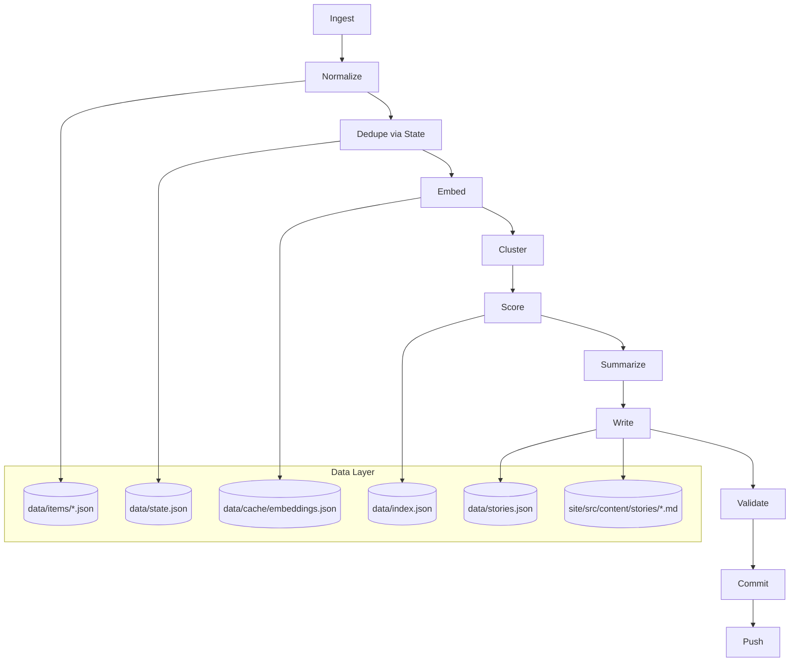
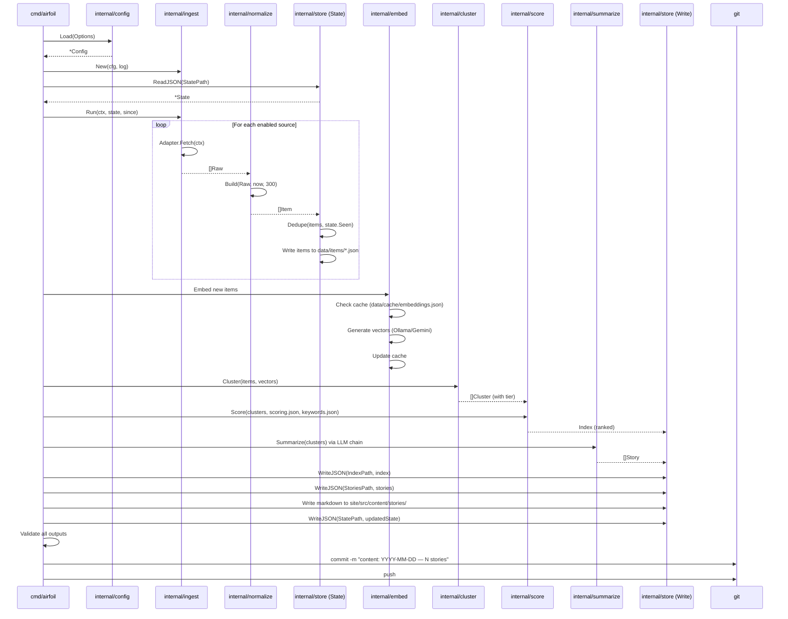

# Go Agent Pipeline: Nine Stages from Source to Story

This chapter walks through the sequential pipeline stages that transform raw source data into published stories on the static site. Each stage is a distinct Go package or function with a single responsibility, connected by well-typed data structures defined in `internal/model`.

## Table of Contents

1. [Pipeline Overview](#pipeline-overview)
2. [Stage 1: Ingest](#stage-1-ingest)
3. [Stage 2: Normalize](#stage-2-normalize)
4. [Stage 3: Embed](#stage-3-embed)
5. [Stage 4: Cluster](#stage-4-cluster)
6. [Stage 5: Score](#stage-5-score)
7. [Stage 6: Summarize](#stage-6-summarize)
8. [Stage 7: Write](#stage-7-write)
9. [Stage 8: Commit](#stage-8-commit)
10. [Stage 9: Push](#stage-9-push)
11. [Data Flow Diagram](#data-flow-diagram)
12. [Referenced Files](#referenced-files)

---

## Pipeline Overview

The agent runs as a single CLI command (`./airfoil run`) that executes all nine stages in sequence. The pipeline is **idempotent**: re-running on the same day produces zero new stories because `State.Seen` tracks every ingested item by its canonical URL hash.



**Entry point**: `cmd/airfoil/main.go` → `root.go` → `app.run()` loads config, creates `ingest.New(cfg, log)`, then orchestrates stages.

---

## Stage 1: Ingest

**Package**: `internal/ingest`  
**Orchestrator**: `Runner.Run(ctx, state, since)`  
**Adapters**: `hnAdapter`, `rssAdapter` (Reddit, HFPapers, GitHub use RSS)

The `Runner` iterates over `Config.EnabledSources()` and calls each `Adapter.Fetch(ctx)` to retrieve raw items. All HTTP calls use a shared fetcher with timeout and retry logic.

### Adapter Interface

```go
// internal/ingest/adapter.go (from STRUCTURE)
type Adapter interface {
    Fetch(ctx context.Context) ([]normalize.Raw, error)
    SourceID() string
}
```

### Source Types & Configuration

| Source Type | Adapter | Config Key | Rate Limit Handling |
|-------------|---------|------------|---------------------|
| Hacker News | `hnAdapter` | `sources.json` | Public API, no auth |
| RSS | `rssAdapter` | `sources.json` | Standard HTTP |
| Reddit | `rssAdapter` | `sources.json` | Requires `REDDIT_USER_AGENT` |
| HuggingFace Papers | `rssAdapter` | `sources.json` | Public RSS |
| GitHub | `rssAdapter` | `sources.json` | Optional `GITHUB_TOKEN` (60→5000/hr) |

Each source in `sources.json` has:
- `id`, `name`, `url`, `type` (RSS|HN|Reddit|HFPapers|GitHub)
- `tier` (1–5, maps to `SourceType`: lab|press|community)
- `enabled` boolean
- `options` (source-specific)

**Config validation** (`config.go:194-244`):
```go
// From config.go:194-244
func (c *Config) Validate() error {
    // ...
    for i, s := range c.Sources {
        where := fmt.Sprintf("sources[%d]", i)
        if s.Tier < 1 || s.Tier > 5 {
            problems = append(problems, fmt.Sprintf("%s (%s): tier %d out of range 1-5", where, s.ID, s.Tier))
        }
    }
    // ...
}
```

---

## Stage 2: Normalize

**Package**: `internal/normalize`  
**Core function**: `Build(Raw, now, maxExcerpt) → Item`  
**Pure functions**: `Dedupe`, `CanonicalURL`, `ItemID`, `ExtractRepoURL`, `ExtractPaperURL`, `StripHTML`, `Excerpt`

Normalization transforms each `Raw` item into a canonical `model.Item` with enforced limits.

### Item Construction

```go
// From model/types.go:11-25
type Item struct {
    ID          string    `json:"id"` // sha256(canonicalURL)[:16]
    SourceID    string    `json:"source_id"`
    SourceName  string    `json:"source_name"`
    SourceTier  int       `json:"source_tier"`
    URL         string    `json:"url"` // canonical
    Title       string    `json:"title"`
    Excerpt     string    `json:"excerpt"`
    Author      string    `json:"author,omitempty"`
    PublishedAt time.Time `json:"published_at"`
    FetchedAt   time.Time `json:"fetched_at"`
    Metrics     Metrics   `json:"metrics"`
    RepoURL     string    `json:"repo_url,omitempty"`
    PaperURL    string    `json:"paper_url,omitempty"`
}
```

### Normalization Rules (enforced in `normalize`, not edges)

| Rule | Enforcement |
|------|-------------|
| Excerpt ≤ 300 chars | `normalize.Excerpt` caps at 300 |
| Canonical URL | `CanonicalURL` unwraps wrappers, collapses variants, bounds recursion |
| Repo/Paper extraction | `ExtractRepoURL`, `ExtractPaperURL` from content |
| ID generation | `ItemID` = SHA256(canonicalURL)[:16] |
| HTML stripping | `StripHTML` before excerpting |

### Deduplication

```go
// From model/types.go:140-151
func (s *State) Seen(id string) bool {
    _, ok := s.SeenURLs[id]
    return ok
}

func (s *State) MarkSeen(id string, day time.Time) {
    if s.SeenURLs == nil {
        s.SeenURLs = map[string]string{}
    }
    s.SeenURLs[id] = day.UTC().Format(time.DateOnly)
}
```

`normalize.Dedupe(items, state)` drops any item where `state.Seen(item.ID)` is true. New items are written to `data/items/*.json` (one file per source per day).

---

## Stage 3: Embed

**Package**: `internal/embed` (implied by architecture)  
**Providers**: Ollama (local default) or Gemini (CI)  
**Cache**: `data/cache/embeddings.json` (never committed)

The embedder converts each new `Item` into a vector. The provider is selected by `AIRFOIL_EMBEDDER` env var.

### Embedder Configuration

```go
// From config.go:61-72
const (
    EmbedderOllama = "ollama"
    EmbedderGemini = "gemini"
)

type EmbedConfig struct {
    Provider    string // ollama (local default) | gemini (CI)
    OllamaHost  string
    OllamaModel string
    GeminiKey   string
    GeminiModel string
}
```

**Environment variables** (from config.go:149-153):
- `AIRFOIL_EMBEDDER` — "ollama" or "gemini"
- `OLLAMA_HOST`, `OLLAMA_EMBED_MODEL` — local Ollama
- `GEMINI_API_KEY`, `GEMINI_EMBED_MODEL` — Gemini

Vectors are cached keyed by `Item.ID`. Cache lives in `data/cache/` (gitignored). On re-run, cached vectors are reused.

---

## Stage 4: Cluster

**Algorithm**: O(n²) cosine similarity over all item vectors  
**Output**: `model.Cluster` with tier assignment

```go
// From model/types.go:37-41
type Cluster struct {
    ID       string    `json:"id"`
    Items    []Item    `json:"items"`
    Centroid []float32 `json:"-"` // not serialized
}
```

### Clustering Process

1. Load all new items + their vectors
2. Compute pairwise cosine similarity (O(n²), n≈600 typical)
3. Group items above similarity threshold into clusters
4. Compute centroid per cluster
5. Assign tier: **Major** (0), **Notable** (1), **Minor** (2) based on cluster size, source tiers, metrics

### Tier Constants

```go
// From model/types.go:45-47
const (
    TierMajor   = "major"
    TierNotable = "notable"
    TierMinor   = "minor"
)
```

Each cluster becomes one `Story` in the next stage.

---

## Stage 5: Score

**Input**: Clusters with tier assignments  
**Config**: `config/scoring.json` (tier weights), `config/keywords.json` (boosts)  
**Output**: Ranked `model.Index` serialized to `data/index.json`

### Scoring Factors

| Factor | Source | Weight |
|--------|--------|--------|
| Tier weight | `scoring.json` | `Scoring.TierWeight(tier)` |
| Keyword boost | `keywords.json` | `builder_signals` + `hype_signals` |
| Source type multiplier | Source tier (1–5) | Via `SourceType(tier)` |
| Recency decay | `PublishedAt` | Exponential decay |

### Index Structures

```go
// From model/types.go:103-120
type IndexEntry struct {
    ID              string    `json:"id"`
    Slug            string    `json:"slug"`
    Title           string    `json:"title"`
    Summary         string    `json:"summary"`
    Score           int       `json:"score"`
    Tier            string    `json:"tier"`
    Tags            []string  `json:"tags"`
    BuilderRelevant bool      `json:"builder_relevant"`
    Date            time.Time `json:"date"`
    ClusterSize     int       `json:"cluster_size"`
}

type Index struct {
    GeneratedAt time.Time    `json:"generated_at"`
    Stories     []IndexEntry `json:"stories"`
}
```

The ranked `Index` is written to `data/index.json` for site consumption at build time.

---

## Stage 6: Summarize

**Package**: `internal/summarize` (implied)  
**LLM Fallback Chain**: Gemini → NVIDIA NIM → OpenRouter → Ollama  
**Prompt**: Defined in `PROMPTS.md` (not in scope)  
**Output**: `model.Story`

### LLM Configuration

```go
// From config.go:34-60
type LLMConfig struct {
    Gemini     ProviderCreds
    NvidiaNIM  ProviderCreds
    OpenRouter ProviderCreds
    Ollama     OllamaConfig
}

type ProviderCreds struct {
    APIKey string
    Model  string
}

func (p ProviderCreds) Configured() bool {
    return p.APIKey != "" && p.Model != ""
}
```

**Environment variables** (from config.go:130-144):
- `GEMINI_API_KEY`, `GEMINI_MODEL`
- `NVIDIA_NIM_API_KEY`, `NVIDIA_NIM_MODEL`
- `OPENROUTER_API_KEY`, `OPENROUTER_MODEL`
- `OLLAMA_HOST`, `OLLAMA_CHAT_MODEL`

### Summarization Constraints

- **Original prose only** — not extracted sentences
- **Max one quote per source**, <15 words
- **Every source linked** — `Story.Sources` includes all cluster sources
- **Timeout + fallback** — each provider call has timeout; on failure, next provider tried

### Story Structure

```go
// From model/types.go:55-69
type Story struct {
    ID              string        `json:"id"`
    Slug            string        `json:"slug"`
    Title           string        `json:"title"`
    Summary         string        `json:"summary"`
    Score           int           `json:"score"`
    Tier            string        `json:"tier"`
    Tags            []string      `json:"tags"`
    BuilderRelevant bool          `json:"builder_relevant"`
    Date            time.Time     `json:"date"`
    ClusterSize     int           `json:"cluster_size"`
    Sources         []StorySource `json:"sources"`
    Takeaways       []string      `json:"takeaways,omitempty"`
    Body            []string      `json:"body,omitempty"`
}

type StorySource struct {
    Name    string         `json:"name"`
    URL     string         `json:"url"`
    Tier    int            `json:"tier"`
    Type    string         `json:"type"` // lab | press | community
    Metrics *SourceMetrics `json:"metrics,omitempty"`
}
```

`SourceType(tier int) string` maps source tier to coarse category:

```go
// From model/types.go:91-100
func SourceType(tier int) string {
    switch {
    case tier <= 3:
        return "lab"
    case tier == 4:
        return "press"
    default:
        return "community"
    }
}
```

---

## Stage 7: Write

**Outputs**: Four artifacts written atomically via `internal/store.WriteJSON`

| Artifact | Path | Purpose |
|----------|------|---------|
| Markdown stories | `site/src/content/stories/*.md` | One file per story, frontmatter + body |
| Index | `data/index.json` | Ranked `IndexEntry[]` for site feed/top/ship |
| State | `data/state.json` | Updated `SeenURLs` + `Cursors` + `LastRun` |
| Stories | `data/stories.json` | Authoritative `Story[]` record |

### Atomic Write Pattern

```go
// internal/store/store.go (from STRUCTURE)
func WriteJSON[T any](path string, v T) error {
    // Write to temp file, then rename for atomicity
}
```

**Markdown frontmatter** mirrors `Story` struct exactly. The site reads `data/index.json` + markdown files at build time — never parses frontmatter back.

**Derived paths** (from config.go:81-89):
```go
func (c Config) ItemsDir() string    { return filepath.Join(c.DataDir, "items") }
func (c Config) CacheDir() string    { return filepath.Join(c.DataDir, "cache") }
func (c Config) IndexPath() string   { return filepath.Join(c.DataDir, "index.json") }
func (c Config) StatePath() string   { return filepath.Join(c.DataDir, "state.json") }
func (c Config) StoriesPath() string { return filepath.Join(c.DataDir, "stories.json") }
func (c Config) EmbedCachePath() string {
    return filepath.Join(c.CacheDir(), "embeddings.json")
}
```

---

## Stage 8: Commit

**Validation gate**: Runs before commit; failure aborts pipeline  
**Commit message**: `content: YYYY-MM-DD — N stories`  
**Files committed**: Only `data/` and `site/src/content/stories/`  
**Never committed**: `data/cache/` (embeddings regenerable, huge)

The agent validates:
- All JSON files parse correctly
- Every story has required fields
- No broken links in generated markdown
- `index.json` and `stories.json` are consistent

---

## Stage 9: Push

**Trigger**: Successful commit pushes to remote  
**Effect**: Triggers static site rebuild (GitHub Pages / Netlify / Vercel)  
**Secrets**: API keys via GitHub Secrets (never in repo)

---

## Data Flow Diagram



---

## Referenced Files

| File | Purpose |
|------|---------|
| `agent/internal/model/types.go` | Core types: `Item`, `Cluster`, `Story`, `IndexEntry`, `Index`, `State`, `Metrics`, tier constants |
| `agent/internal/config/config.go` | `Config` struct, `Load`, `Validate`, derived paths, env var mapping, JSON config loading |
| `agent/internal/ingest/` | `Adapter` interface, `Runner`, `hnAdapter`, `rssAdapter` (not in source but in STRUCTURE) |
| `agent/internal/normalize/` | `Build`, `Dedupe`, `CanonicalURL`, `ItemID`, `ExtractRepoURL`, `ExtractPaperURL`, `StripHTML`, `Excerpt` |
| `agent/internal/embed/` | Embedder implementations (Ollama, Gemini), cache at `data/cache/embeddings.json` |
| `agent/internal/cluster/` | O(n²) clustering, tier assignment |
| `agent/internal/score/` | Scoring algorithm using `scoring.json` + `keywords.json` |
| `agent/internal/summarize/` | LLM fallback chain (Gemini → NVIDIA NIM → OpenRouter → Ollama) |
| `agent/internal/store/` | `ReadJSON[T]`, `WriteJSON`, atomic writes |
| `config/sources.json` | Source definitions (id, name, url, type, tier, enabled, options) |
| `config/scoring.json` | Tier weights, recency decay parameters |
| `config/keywords.json` | `builder_signals`, `hype_signals` for boosting |
| `site/src/types/story.ts` | TypeScript mirror of Go `Story` frontmatter |

<!-- kaioken:files agent/internal/model/types.go,agent/internal/config/config.go -->
