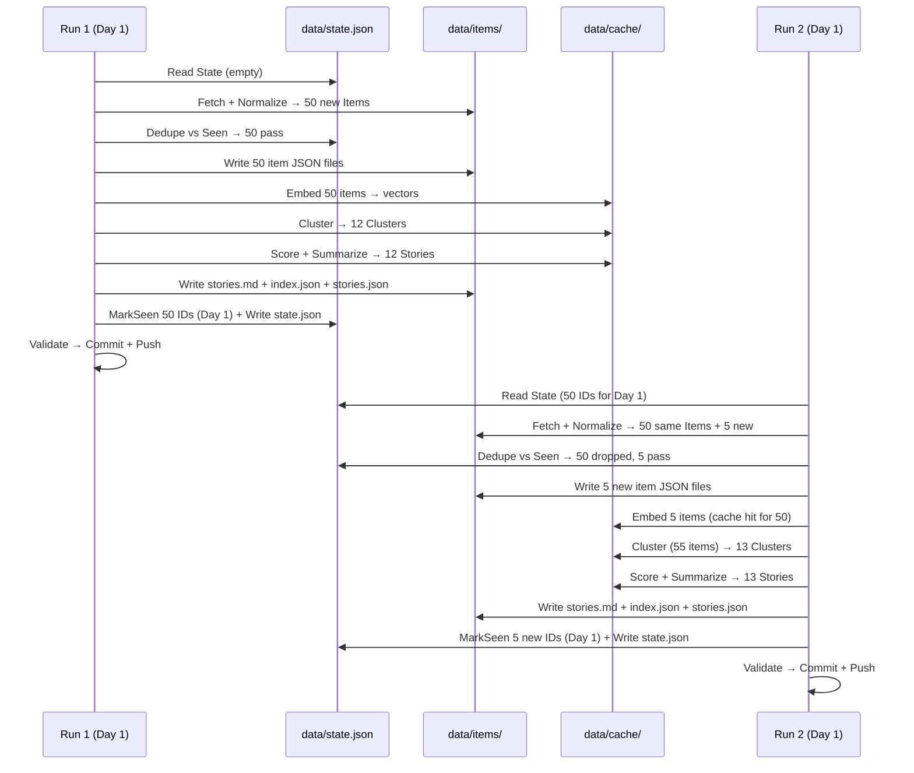

# Idempotent Data Flow: From Raw Fetch to Published Story

This chapter traces a single item through the Airfoil agent pipeline: from raw ingestion through normalization, deduplication, embedding, clustering, scoring, summarization, and final publication as a Markdown story with JSON indexes. It covers the data transformations at each stage, the types that carry data between stages, and the idempotency guarantees provided by the `State` mechanism.

## Table of Contents

- [Pipeline Overview](#pipeline-overview)
- [Stage 1: Ingestion — Raw Items](#stage-1-ingestion--raw-items)
- [Stage 2: Normalization — Item Construction](#stage-2-normalization--item-construction)
- [Stage 3: Deduplication — State.Seen Gate](#stage-3-deduplication--stateseen-gate)
- [Stage 4: Persistence — Items to Disk](#stage-4-persistence--items-to-disk)
- [Stage 5: Embedding — Vector Generation](#stage-5-embedding--vector-generation)
- [Stage 6: Clustering — Similarity Grouping](#stage-6-clustering--similarity-grouping)
- [Stage 7: Scoring — Rank Computation](#stage-7-scoring--rank-computation)
- [Stage 8: Summarization — LLM Story Generation](#stage-8-summarization--llm-story-generation)
- [Stage 9: Write & Commit — Publication](#stage-9-write--commit--publication)
- [Idempotency Guarantees](#idempotency-guarantees)
- [Configuration-Driven Behavior](#configuration-driven-behavior)
- [Data Model Evolution](#data-model-evolution)
- [Referenced Files](#referenced-files)

---

## Pipeline Overview

The agent pipeline is a linear sequence of pure functions and orchestrated I/O stages. Each stage consumes the output of the previous stage and produces a new artifact. The pipeline is invoked via `./airfoil run` (see `cmd/airfoil`), which loads configuration, constructs the ingest runner, and drives the full sequence.

```mermaid
flowchart TD
    A[Config.Load] --> B[ingest.Runner.Run]
    B --> C[Adapter.Fetch → normalize.Raw]
    C --> D[normalize.Build → model.Item]
    D --> E[normalize.Dedupe vs State.Seen]
    E --> F[New items → data/items/*.json]
    F --> G[Embedder → vectors cached in data/cache/]
    G --> H[Cluster O(n²) → model.Cluster + tier]
    H --> I[Score with scoring.json + keywords.json + decay]
    I --> J[Ranked model.Index → data/index.json]
    J --> K[LLM summarize fallback chain → model.Story]
    K --> L[Write stories.md + index.json + state.json + stories.json]
    L --> M[Validate → git commit + push]
```

**Key principle**: Every stage is idempotent when re-run with the same inputs. The `State` object (persisted to `data/state.json`) is the linchpin — it records which item IDs have been seen on which day, so a second run on the same day produces zero new stories.

---

## Stage 1: Ingestion — Raw Items

The pipeline begins with `ingest.Runner.Run(ctx, state, since)`. The runner iterates over `Config.EnabledSources()` and invokes each source's `Adapter.Fetch(ctx)` method. Two adapter implementations exist:

- **`hnAdapter`** — Hacker News API (algolia/official)
- **`rssAdapter`** — Used for RSS, Reddit, Hugging Face Papers, and GitHub (all via RSS feeds)

Each `Fetch` returns `[]normalize.Raw`, a pre-normalization struct containing:

```go
// normalize.Raw (not in provided source; described in architecture brief)
type Raw struct {
    Title       string
    Link        string
    Content     string
    Published   time.Time
    SourceName  string
    SourceType  string
}
```

The HTTP fetcher used by adapters implements timeout and retry logic. Rate limits are handled per-source:
- GitHub: optional `GITHUB_TOKEN` raises limit from 60→5000/hr
- Reddit: requires descriptive `User-Agent` (configured via `REDDIT_USER_AGENT` env, default `airfoil/0.1`) or returns 429

**Configuration linkage**: `Config.Ingest.GitHubToken` and `Config.Ingest.RedditUserAgent` are populated from environment variables in `config.Load` and passed to adapters.

---

## Stage 2: Normalization — Item Construction

Each `Raw` item passes through `normalize.Build(raw, now, maxExcerpt) → model.Item`. This pure function performs:

1. **HTML stripping** — `StripHTML` removes tags from content
2. **Space collapsing** — consecutive whitespace normalized
3. **Excerpt capping** — `Excerpt(text, 300)` enforces the 300-character limit (R1 in `model.Item` doc comment)
4. **URL canonicalization** — `CanonicalURL` unwraps tracking parameters, collapses variants, with recursion bounds
5. **Repo/Paper extraction** — `ExtractRepoURL` (GitHub) and `ExtractPaperURL` (arXiv, HF, etc.) populate optional fields
6. **ID generation** — `ItemID(canonicalURL)` = `sha256(canonicalURL)[:16]`

The resulting `model.Item` (from `agent/internal/model/types.go:11-25`):

```go
// Item is one article from one source, after normalization.
//
// R1: Excerpt is capped at 300 characters by the normalize package. No other
// code path constructs an Item, so nothing longer can reach disk.
type Item struct {
	ID          string    `json:"id"` // sha256(canonicalURL)[:16]
	SourceID    string    `json:"source_id"`
	SourceName  string    `json:"source_name"`
	SourceTier  int       `json:"source_tier"`
	URL         string    `json:"url"` // canonical
	Title       string    `json:"title"`
	Excerpt     string    `json:"excerpt"`
	Author      string    `json:"author,omitempty"`
	PublishedAt time.Time `json:"published_at"`
	FetchedAt   time.Time `json:"fetched_at"`
	Metrics     Metrics   `json:"metrics"`
	RepoURL     string    `json:"repo_url,omitempty"`
	PaperURL    string    `json:"paper_url,omitempty"`
}
```

`Metrics` carries community signals used later in scoring:

```go
// Metrics carries community-validation signals used by scoring.
type Metrics struct {
	HNPoints    int `json:"hn_points,omitempty"`
	HNComments  int `json:"hn_comments,omitempty"`
	RedditScore int `json:"reddit_score,omitempty"`
	HFUpvotes   int `json:"hf_upvotes,omitempty"`
	GitHubStars int `json:"github_stars,omitempty"`
}
```

**Source tier** comes from `sources.json` (loaded into `Config.Sources`); each source has a `Tier` (1–5) that maps to `SourceType` (lab/press/community) via `model.SourceType` (`agent/internal/model/types.go:91-100`):

```go
// SourceType maps a source tier to the coarse category the site renders.
func SourceType(tier int) string {
	switch {
	case tier <= 3:
		return "lab"
	case tier == 4:
		return "press"
	default:
		return "community"
	}
}
```

---

## Stage 3: Deduplication — State.Seen Gate

After normalization, `normalize.Dedupe(items, state)` filters the slice against `State.Seen(id)`. The `State` type (`agent/internal/model/types.go:123-151`):

```go
// State is data/state.json — what makes the agent idempotent (R7).
type State struct {
	// SeenURLs maps an item ID to the date it was first seen, as YYYY-MM-DD.
	SeenURLs map[string]string `json:"seen_urls"`
	// Cursors holds per-source high-water marks.
	Cursors map[string]string `json:"cursors"`
	LastRun *time.Time        `json:"last_run"`
}

// NewState returns an empty, non-nil State.
func NewState() *State {
	return &State{
		SeenURLs: map[string]string{},
		Cursors:  map[string]string{},
	}
}

// Seen reports whether an item ID has already been ingested.
func (s *State) Seen(id string) bool {
	_, ok := s.SeenURLs[id]
	return ok
}

// MarkSeen records an item ID as ingested on the given day.
func (s *State) MarkSeen(id string, day time.Time) {
	if s.SeenURLs == nil {
		s.SeenURLs = map[string]string{}
	}
	s.SeenURLs[id] = day.UTC().Format(time.DateOnly)
}
```

**Deduplication logic**:
- `State.SeenURLs` key = `Item.ID` (sha256 of canonical URL, 16 hex chars)
- Value = date string `YYYY-MM-DD` (UTC)
- `Dedupe` drops any item where `state.Seen(item.ID)` returns true
- New items are passed forward; `state.MarkSeen(item.ID, now)` is called for each accepted item **after** the full pipeline succeeds (see Stage 9)

This design means:
- Re-running the agent on the same calendar day produces **zero new items** — all previously seen IDs are filtered out
- Items seen on previous days are **not** re-filtered (the date value is informational; the key presence is the gate)
- `Cursors` map holds per-source high-water marks for incremental fetch (not used for dedup)

---

## Stage 4: Persistence — Items to Disk

Accepted new items are written to `data/items/*.json` via `store.WriteJSON` (atomic temp-file + rename). The `Config.ItemsDir()` path (`agent/internal/config/config.go:81-87`):

```go
// Paths to the generated data files.
func (c Config) ItemsDir() string    { return filepath.Join(c.DataDir, "items") }
func (c Config) CacheDir() string    { return filepath.Join(c.DataDir, "cache") }
func (c Config) DigestDir() string   { return filepath.Join(c.DataDir, "digest") }
func (c Config) IndexPath() string   { return filepath.Join(c.DataDir, "index.json") }
func (c Config) StatePath() string   { return filepath.Join(c.DataDir, "state.json") }
func (c Config) StoriesPath() string { return filepath.Join(c.DataDir, "stories.json") }
func (c Config) EmbedCachePath() string {
	return filepath.Join(c.CacheDir(), "embeddings.json")
}
```

Each item file is named `<item.ID>.json`. This on-disk cache serves as the input for the embedding stage and allows re-running clustering/scoring without re-fetching.

---

## Stage 5: Embedding — Vector Generation

The embedder reads all new items from `data/items/`, computes vectors, and caches them in `data/cache/embeddings.json` (path from `Config.EmbedCachePath()`). The embedding provider is selected by `AIRFOIL_EMBEDDER` env var (loaded into `Config.Embed.Provider`):

| Provider | Constant | Model Config | Use Case |
|----------|----------|--------------|----------|
| Ollama (local) | `EmbedderOllama` | `OLLAMA_EMBED_MODEL` (default `nomic-embed-text`) | Local development |
| Gemini | `EmbedderGemini` | `GEMINI_EMBED_MODEL` (default `text-embedding-004`) | CI / production |
| NVIDIA NIM | `EmbedderNvidiaNIM` | `NVIDIA_NIM_EMBED_MODEL` (default `nvidia/nv-embedqa-e5-v5`) | Alternative cloud |

`Config.Embed.Model()` returns the model ID for the active provider (`agent/internal/config/config.go:66-72`):

```go
// Model returns the model ID for the selected provider.
func (e EmbedConfig) Model() string {
	switch e.Provider {
	case EmbedderGemini:
		return e.GeminiModel
	case EmbedderNvidiaNIM:
		return e.NIMModel
	default:
		return e.OllamaModel
	}
}
```

**Cache keying**: The embedding cache is keyed by model ID so vectors from different providers never mix. Switching providers requires cache invalidation (delete `data/cache/embeddings.json`).

**Dimensionality note**: Different providers produce different vector dimensions. The clustering threshold is tuned against one provider; switching providers means retuning the similarity threshold.

---

## Stage 6: Clustering — Similarity Grouping

Clustering runs an **O(n²) pairwise cosine similarity** over all item vectors (new + recent existing items). Items with similarity above a threshold are grouped into a `model.Cluster` (`agent/internal/model/types.go:37-41`):

```go
// Cluster is a group of Items covering the same event.
type Cluster struct {
	ID       string    `json:"id"`
	Items    []Item    `json:"items"`
	Centroid []float32 `json:"-"`
}
```

- `Centroid` is the mean vector of the cluster (not serialized to JSON, hence `json:"-"`)
- Each cluster receives a **tier assignment** (Major/Notable/Minor) based on the highest-tier source in the cluster and cluster size
- Tier constants (`agent/internal/model/types.go:45-47`):

```go
// Story tiers.
const (
	TierMajor   = "major"
	TierNotable = "notable"
	TierMinor   = "minor"
)
```

**Performance**: At n≈600 items, O(n²) is ~360k comparisons — acceptable for scheduled runs. See Troubleshooting chapter for scaling considerations.

---

## Stage 7: Scoring — Rank Computation

Each cluster is scored using a weighted formula from `config/scoring.json` (loaded into `Config.Scoring`):

1. **Tier weight** — `Scoring.TierWeight(tier)` (Major > Notable > Minor)
2. **Keyword boosts** — `keywords.json` provides `builder_signals` (positive) and `hype_signals` (negative) matched against title/excerpt
3. **Source type multipliers** — lab/press/community weights
4. **Recency decay** — exponential decay based on `PublishedAt` age

The output is a ranked `model.Index` (`agent/internal/model/types.go:117-120`):

```go
// Index is the whole of data/index.json.
type Index struct {
	GeneratedAt time.Time    `json:"generated_at"`
	Stories     []IndexEntry `json:"stories"`
}
```

Each `IndexEntry` (`agent/internal/model/types.go:103-114`) is a slim record for the site's feed/top/ship pages:

```go
// IndexEntry is the slim record in data/index.json used by feed/top/ship.
type IndexEntry struct {
	ID              string    `json:"id"`
	Slug            string    `json:"slug"`
	Title           string    `json:"title"`
	Summary         string    `json:"summary"`
	Score           int       `json:"score"`
	Tier            string    `json:"tier"`
	Tags            []string  `json:"tags"`
	BuilderRelevant bool      `json:"builder_relevant"`
	Date            time.Time `json:"date"`
	ClusterSize     int       `json:"cluster_size"`
}
```

The full `Index` is written to `data/index.json` (path from `Config.IndexPath()`).

---

## Stage 8: Summarization — LLM Story Generation

For each cluster (now ranked), the agent calls the LLM summarization chain with a **provider fallback sequence**:

1. **Gemini** — `Config.LLM.Gemini` (requires `GEMINI_API_KEY` + `GEMINI_MODEL`)
2. **NVIDIA NIM** — `Config.LLM.NvidiaNIM` (requires `NVIDIA_NIM_API_KEY` + `NVIDIA_NIM_MODEL`)
3. **OpenRouter** — `Config.LLM.OpenRouter` (requires `OPENROUTER_API_KEY` + `OPENROUTER_MODEL`)
4. **Ollama** — `Config.LLM.Ollama` (local, `OLLAMA_HOST` + `OLLAMA_CHAT_MODEL`)

Each provider is attempted with a timeout; on failure, the next in chain is tried. The prompt chain (documented in `PROMPTS.md`) instructs the LLM to produce:
- Original prose summary (not extracted sentences)
- Max one quote per source, <15 words
- Key takeaways (bullet points)
- Tags
- Builder relevance flag

The result is a `model.Story` (`agent/internal/model/types.go:55-69`):

```go
// Story is a cluster after scoring and summarization.
//
// data/stories.json is the authoritative record of every published story.
// The markdown files under site/src/content/stories/ are rendered from it, so
// the writer never needs to parse frontmatter back.
type Story struct {
	ID              string        `json:"id"`
	Slug            string        `json:"slug"`
	Title           string        `json:"title"`
	Summary         string        `json:"summary"`
	Score           int           `json:"score"`
	Tier            string        `json:"tier"`
	Tags            []string      `json:"tags"`
	BuilderRelevant bool          `json:"builder_relevant"`
	Date            time.Time     `json:"date"`
	ClusterSize     int           `json:"cluster_size"`
	Sources         []StorySource `json:"sources"`
	Takeaways       []string      `json:"takeaways,omitempty"`
	Body            []string      `json:"body,omitempty"`
}
```

`StorySource` (`agent/internal/model/types.go:73-79`) ensures **every source a cluster drew from appears as an outbound link** (R3):

```go
// StorySource is one outbound link on a story page. R3: every source a cluster
// drew from appears here.
type StorySource struct {
	Name    string         `json:"name"`
	URL     string         `json:"url"`
	Tier    int            `json:"tier"`
	Type    string         `json:"type"` // lab | press | community
	Metrics *SourceMetrics `json:"metrics,omitempty"`
}
```

---

## Stage 9: Write & Commit — Publication

The writer produces four artifacts atomically:

| Artifact | Path | Purpose |
|----------|------|---------|
| Markdown stories | `site/src/content/stories/<slug>.md` | Rendered by Vite at build time |
| `index.json` | `data/index.json` | Site feed/top/ship pages |
| `stories.json` | `data/stories.json` | Authoritative record of all stories (mirrors Markdown frontmatter) |
| `state.json` | `data/state.json` | Updated `State.SeenURLs` + `Cursors` + `LastRun` |

**Markdown frontmatter** matches `Story` fields exactly. The site's TypeScript types (`site/src/types/story.ts`) mirror the Go structs.

**Validation gate**: Before commit, the agent validates:
- All story files exist and parse
- `index.json` and `stories.json` are consistent
- No broken links in `StorySource.URL`

On validation failure, the run aborts — **no commit, no push**.

**Commit message format** (agent commits only):
```
content: YYYY-MM-DD — N stories
```
Only `data/` and `site/src/content/stories/` are committed. `data/cache/` (embeddings) is **never committed** (gitignored, regenerable, large).

---

## Idempotency Guarantees

The pipeline achieves idempotency through three mechanisms:

### 1. State.Seen Gate (Primary)
- `State.SeenURLs` key = `Item.ID` (sha256(canonicalURL)[:16])
- Checked in `normalize.Dedupe` **before** any expensive work (embedding, clustering, LLM)
- Second run same day → all items filtered → zero new stories

### 2. Deterministic IDs & Paths
- `Item.ID` = hash of canonical URL → stable across runs
- Story `Slug` derived from title + ID → stable file names
- Cluster `ID` derived from member item IDs → stable grouping

### 3. Atomic Writes + Validation Gate
- `store.WriteJSON` uses temp file + rename → no partial files
- Validation runs **after** all writes, **before** git commit
- Failed validation → no commit → next run re-processes cleanly



---

## Configuration-Driven Behavior

The pipeline behavior is controlled by `Config` (loaded via `config.Load`). Key config sections affecting the data flow:

| Config Section | Source | Pipeline Impact |
|----------------|--------|-----------------|
| `Sources` | `sources.json` | Which adapters run, their tier (scoring weight), type (lab/press/community) |
| `Scoring` | `scoring.json` | Tier weights, keyword boost multipliers, recency decay half-life |
| `Keywords` | `keywords.json` | `builder_signals` (positive), `hype_signals` (negative) for scoring |
| `Embed` | Env vars | Provider selection, model IDs, cache keying |
| `LLM` | Env vars | Fallback chain order, model IDs, timeouts |
| `Ingest` | Env vars | GitHub token, Reddit User-Agent for rate limits |

`Config.Validate()` (`agent/internal/config/config.go:194-244`) gates the pipeline at startup:

```go
func (c *Config) Validate() error {
	var problems []string

	if len(c.EnabledSources()) == 0 {
		problems = append(problems, "no enabled sources in sources.json")
	}
	// ... source validation (id, name, url, type, tier 1-5) ...
	problems = append(problems, c.Scoring.problems()...)

	if len(c.Keywords.BuilderSignals) == 0 {
		problems = append(problems, "keywords.json: builder_signals is empty")
	}
	if len(c.Keywords.HypeSignals) == 0 {
		problems = append(problems, "keywords.json: hype_signals is empty")
	}

	switch c.Embed.Provider {
	case EmbedderOllama, EmbedderGemini, EmbedderNvidiaNIM:
	default:
		problems = append(problems, fmt.Sprintf("AIRFOIL_EMBEDDER=%q: want one of %q, %q, %q",
			c.Embed.Provider, EmbedderOllama, EmbedderGemini, EmbedderNvidiaNIM))
	}

	if len(problems) > 0 {
		return fmt.Errorf("config: invalid:\n  - %s", strings.Join(problems, "\n  - "))
	}
	return nil
}
```

**Derived paths** (all under `Config.DataDir` except `StoriesDir`):
- `ItemsDir` → `data/items/`
- `CacheDir` → `data/cache/` (gitignored)
- `IndexPath` → `data/index.json`
- `StatePath` → `data/state.json`
- `StoriesPath` → `data/stories.json`
- `EmbedCachePath` → `data/cache/embeddings.json`
- `StoriesDir` → `site/src/content/stories/` (markdown output)

---

## Data Model Evolution

The item transforms through these types as it flows:

| Stage | Type | Key Fields | Location |
|-------|------|------------|----------|
| Ingest | `normalize.Raw` | Title, Link, Content, Published, SourceName, SourceType | `internal/normalize` (not in provided source) |
| Normalize | `model.Item` | ID, URL (canonical), Excerpt (≤300), Metrics, RepoURL, PaperURL | `agent/internal/model/types.go:11-25` |
| Cluster | `model.Cluster` | ID, Items[], Centroid | `agent/internal/model/types.go:37-41` |
| Score | `model.IndexEntry` | ID, Slug, Title, Summary, Score, Tier, Tags, Date, ClusterSize | `agent/internal/model/types.go:103-114` |
| Summarize | `model.Story` | + Body, Takeaways, Sources[] | `agent/internal/model/types.go:55-69` |
| Publish | Markdown + JSON | Frontmatter = Story fields | `site/src/content/stories/` + `data/` |

**Critical invariants**:
- `Item.Excerpt` never exceeds 300 chars (enforced in `normalize.Build`, R1)
- `Story.Sources` includes every source from the cluster (R3)
- `IndexEntry` is a strict subset of `Story` for site consumption
- `data/stories.json` is the **authoritative record**; Markdown is derived from it

---

## Referenced Files

| File | Role |
|------|------|
| `agent/internal/model/types.go` | Core data types: Item, Cluster, Story, IndexEntry, Index, State, Metrics, tier constants |
| `agent/internal/config/config.go` | Config struct, Load/Validate, derived paths (ItemsDir, CacheDir, IndexPath, StatePath, StoriesPath, EmbedCachePath), provider constants |

---

*This chapter covers the data flow as implemented in the provided source files. For details on ingestion adapters, normalization functions, embedding implementation, clustering algorithm, scoring formula, LLM prompt chain, and write/commit logic, see the respective sibling chapters (Ingestion Sources, Normalization & Deduplication, Embedding & Clustering, Scoring & Ranking, LLM Summarization & Provider Fallback, Deployment & CI/CD).*

<!-- kaioken:files agent/internal/model/types.go,agent/internal/config/config.go -->
