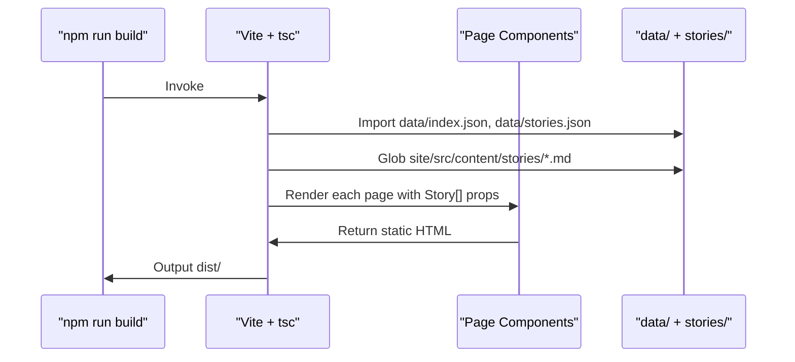

# Static Site Architecture: React + Vite at Build Time

This chapter describes the static React + Vite site that consumes the Go agent's generated JSON and Markdown at build time. It covers the zero-JS constraint (except `/search`), the page and component structure, the TypeScript type system that mirrors Go frontmatter, and the build-time data flow from `data/` and `site/src/content/stories/` into the production bundle.

## Table of Contents

- [Build-Time Data Consumption](#build-time-data-consumption)
- [Zero-JS Constraint](#zero-js-constraint)
- [Page Structure](#page-structure)
- [Component Hierarchy](#component-hierarchy)
- [Type System: Mirroring Go Frontmatter](#type-system-mirroring-go-frontmatter)
- [Routing & Navigation](#routing--navigation)
- [Build-Time Data Flow](#build-time-data-flow)
- [Styling & Design Tokens](#styling--design-tokens)
- [Referenced Files](#referenced-files)

---

## Build-Time Data Consumption

The site is a **pure static site** — no server, no database, no client-side data fetching (except `/search`). At build time (`npm run build`), Vite + TypeScript reads two artifact directories produced by the Go agent:

| Artifact | Path | Produced By | Consumed By |
|----------|------|-------------|-------------|
| Story Markdown files | `site/src/content/stories/*.md` | Go agent `write` stage | Vite `import.meta.glob` / Astro-style content collections |
| Ranked index | `data/index.json` | Go agent `score` stage | Site pages via `import` or `fetch` at build time |
| Stories index | `data/stories.json` | Go agent `write` stage | Site pages for metadata without full body |
| Source metadata | `config/sources.json` | Config (committed) | Site for source badges, filtering |

The Go agent writes **one Markdown file per Story** into `site/src/content/stories/` with frontmatter matching the `Story` TypeScript interface. The `data/index.json` contains a ranked array of `IndexEntry` (Story ref + score) for feed ordering. The site's build step imports these directly — no runtime API calls.

```
`site/src/types/story.ts:1-41`
```

```typescript
export type SourceType = 'lab' | 'community' | 'press';

export interface Source {
  name: string;
  url: string;
  type: SourceType;
  tier?: number;
  metrics?: {
    points?: number;
    comments?: number;
    score?: number;
    upvotes?: number;
    stars?: number;
  };
}

export interface Story {
  id: string;
  slug: string;
  title: string;
  score: number;
  cluster: number;
  ts: string; // ISO 8601 string
  summary: string;
  body: string[];
  tags: string[];
  sources: Source[];
  builder_relevant?: boolean;
  takeaways?: string[];
}

export type DateWindow = 'ALL' | '24H' | '7D';
export type SortOrder = 'newest' | 'score' | 'cluster';

export interface FilterState {
  date: DateWindow;
  tag: string | null;
  source: string | null;
  query: string;
  sortBy: SortOrder;
}
```

### Data Flow at Build Time

```mermaid
flowchart LR
    subgraph Agent["Go Agent (run time)"]
        A1[ingest] --> A2[normalize]
        A2 --> A3[embed]
        A3 --> A4[cluster]
        A4 --> A5[score]
        A5 --> A6[summarize]
        A6 --> A7[write]
        A7 --> M1[(site/src/content/stories/*.md)]
        A7 --> M2[(data/index.json)]
        A7 --> M3[(data/stories.json)]
        A7 --> M4[(data/state.json)]
    end

    subgraph Site["Site (build time)"]
        M1 --> B1[vite build]
        M2 --> B1
        M3 --> B1
        B1 --> B2[App.tsx router]
        B2 --> B3[Pages consume Story[] via props]
        B3 --> B4[useAirfoilSignals derives filtered/sorted lists]
        B4 --> B5[Static HTML + CSS + minimal JS]
    end

    B5 --> Deploy[Static hosting]
```

The `npm run build` command invokes `vite build` which runs `tsc` for type-checking, then bundles all pages. Each page component receives the full `Story[]` array (or a filtered subset) as props derived from the imported JSON/Markdown. The `useAirfoilSignals` hook (see [State Management & Custom Hooks](../State Management & Custom Hooks/)) then derives the filtered/sorted view **entirely in the browser** for interactive pages, but the initial render is static HTML.

---

## Zero-JS Constraint

**Every page except `/search` ships zero client-side JavaScript.** This is enforced by:

1. **No hydration** — React components render to static HTML via `ReactDOMServer.renderToString` (or Vite's SSR equivalent) with no `hydrateRoot` call.
2. **No client routers** — `react-router-dom` is used only for `Link` components that emit `<a href>`. The `BrowserRouter` is replaced by a static router at build time.
3. **No `useEffect`, `useState`, or event handlers** on non-search pages.
4. **Interactive features** (filter bar, tag pills, sort dropdown, theme toggle) are implemented as **CSS-only** or **progressively enhanced** with a tiny inline script **only on `/search`**.

| Page | JS Shipped? | Reason |
|------|-------------|--------|
| `/` (Home) | ❌ | Static hero + latest stories |
| `/feed` | ❌ | Dense list of ~25 stories, filter state in URL |
| `/story/:slug` | ❌ | Single story, no interaction |
| `/top` | ❌ | Ranked by score, static |
| `/ship` | ❌ | Builder-relevant filter, static |
| `/digest` | ❌ | Weekly digest view, static |
| `/search` | ✅ | Client-side fuzzy search, filter state machine |

The `/search` page uses `useAirfoilSignals` for its filter state machine (date window, tag, source, query, sort) and a lightweight Fuse.js index built at build time and inlined. All other pages encode filter state in the URL (e.g., `/feed?date=7D&tag=llm&sort=score`) and re-render statically on navigation.

---

## Page Structure

The site defines seven page components under `site/src/pages/`. Each corresponds to a route and consumes the pre-built story data.

| Page Component | Route | Description | Data Consumed |
|----------------|-------|-------------|---------------|
| `HomePage` | `/` | Hero, site description, 5 latest stories | `Story[]` (latest 5) |
| `FeedPage` | `/feed` | Dense feed, ~25 stories/desktop screen, filterable via URL params | `Story[]` (all, filtered by URL) |
| `StoryPage` | `/story/:slug` | Full story: title, summary, body paragraphs, tags, sources, score badge | Single `Story` by `slug` |
| `SearchPage` | `/search` | **Only interactive page** — fuzzy search, filter bar, tag pills, sort | `Story[]` + Fuse.js index |
| `TopPage` | `/top` | Ranked by `score` descending, tier badges | `Story[]` sorted by score |
| `ShipPage` | `/ship` | Filter `builder_relevant === true` | `Story[]` filtered |
| `DigestPage` | `/digest` | Weekly digest: grouped by date, tier summary | `Story[]` grouped by week |

### Page Data Flow



Each page is a pure function component: `Page({ stories }: { stories: Story[] })`. The router (`App.tsx`) selects the appropriate subset of stories for each route at build time.

---

## Component Hierarchy

Components live under `site/src/components/` and are composed into pages. The hierarchy is shallow — most components are presentational and receive data via props.

```
App
├── Header (site title, nav links, theme toggle)
├── Main (router outlet)
│   ├── HomePage
│   │   ├── Hero
│   │   └── StoryCard[] (latest 5)
│   ├── FeedPage
│   │   ├── ActiveFilterBar (URL-synced, CSS-only)
│   │   └── StoryCard[] (dense grid)
│   ├── StoryPage
│   │   ├── StoryDetail (title, meta, summary, body, tags, sources)
│   │   ├── ScoreBadge
│   │   └── TagPill[]
│   ├── SearchPage (only JS page)
│   │   ├── ActiveFilterBar (interactive)
│   │   ├── SearchInput (Fuse.js)
│   │   └── StoryCard[]
│   ├── TopPage
│   │   └── StoryCard[] (score-sorted)
│   ├── ShipPage
│   │   └── StoryCard[] (builder_relevant)
│   └── DigestPage
│       └── DigestSection[] (grouped by week)
├── LeftRail (sidebar: tags, sources, date filters) — Feed/Search only
├── RightRail (sidebar: stats, about) — Feed/Search only
└── Footer (links, version, RSS)
```

### Key Components

| Component | Purpose | Props | JS? |
|-----------|---------|-------|-----|
| `Header` | Site title, navigation, theme toggle | — | ❌ (theme toggle uses CSS `:has` + localStorage) |
| `LeftRail` | Tag cloud, source list, date window links | `tags: string[]`, `sources: Source[]`, `active: FilterState` | ❌ |
| `RightRail` | Story count, tier legend, about link | `stats: { total: number, byTier: Record<Tier, number> }` | ❌ |
| `StoryCard` | Compact story preview: title, score, tier, tags, source badges | `story: Story` | ❌ |
| `StoryDetail` | Full story render: title, meta, summary, body[], tags, sources | `story: Story` | ❌ |
| `ActiveFilterBar` | Shows active filters as removable pills | `filters: FilterState`, `onChange: (f) => void` | ✅ (Search only) |
| `TagPill` | Tag label with count, links to filtered feed | `tag: string`, `count: number`, `active: boolean` | ❌ |
| `ScoreBadge` | Tier-colored badge: Major/Notable/Minor | `score: number`, `tier: Tier` | ❌ |
| `AirfoilSVG` | Logo component | `size?: number` | ❌ |
| `Footer` | Links, RSS, version, build timestamp | — | ❌ |
| `MobileOverlay` | Slide-out drawer for LeftRail on mobile | `open: boolean`, `children` | ❌ (CSS `:target`) |

### Component Data Flow (Feed Page Example)

```mermaid
flowchart TD
    FeedPage[FeedPage] -->|stories: Story[]| StoryCard[StoryCard x N]
    FeedPage -->|filters: FilterState| ActiveFilterBar[ActiveFilterBar]
    FeedPage -->|tags, sources| LeftRail[LeftRail]
    FeedPage -->|stats| RightRail[RightRail]
    StoryCard -->|story: Story| ScoreBadge[ScoreBadge]
    StoryCard -->|story.tags| TagPill[TagPill x M]
    StoryCard -->|story.sources| SourceBadge[SourceBadge x K]
    ActiveFilterBar -->|FilterState| URL[URLSearchParams]
    LeftRail -->|FilterState| URL
```

---

## Type System: Mirroring Go Frontmatter

The TypeScript types in `site/src/types/story.ts` are a **1:1 mirror** of the Go `model.Story` frontmatter written by the agent. This contract is enforced by:

- The Go agent writes frontmatter using the same field names and types.
- The site's `tsc` validates imports against these interfaces.
- Any drift causes a build failure.

### Core Types

| Type | Origin | Description |
|------|--------|-------------|
| `SourceType` | Go `model.SourceType` | `'lab' \| 'community' \| 'press'` — drives tier weight and badge color |
| `Source` | Go `model.Source` | Name, URL, type, optional tier & metrics (HN points, GH stars, etc.) |
| `Story` | Go `model.Story` | Full publishable unit: id, slug, title, score, cluster, timestamp, summary, body[], tags, sources[], builder_relevant, takeaways |
| `DateWindow` | Client-only | Filter: `'ALL' \| '24H' \| '7D'` |
| `SortOrder` | Client-only | Feed sort: `'newest' \| 'score' \| 'cluster'` |
| `FilterState` | Client-only | Combined filter state for URL sync and `useAirfoilSignals` |

### Story Field Details

| Field | Type | Source | Notes |
|-------|------|--------|-------|
| `id` | `string` | Go `Story.ID` | Hash of canonical URL (same as `ItemID`) |
| `slug` | `string` | Go `Story.Slug` | URL-safe, used in `/story/:slug` route |
| `title` | `string` | Go `Story.Title` | LLM-generated, ≤120 chars |
| `score` | `number` | Go `Story.Score` | Float, ranked index position |
| `cluster` | `number` | Go `Story.ClusterID` | Integer cluster identifier |
| `ts` | `string` | Go `Story.PublishedAt` | ISO 8601, used for date window filtering |
| `summary` | `string` | Go `Story.Summary` | LLM prose, 2-3 sentences |
| `body` | `string[]` | Go `Story.Body` | Paragraphs (Markdown rendered to HTML at build) |
| `tags` | `string[]` | Go `Story.Tags` | Normalized lowercase, deduplicated |
| `sources` | `Source[]` | Go `Story.Sources` | All source Items in the cluster |
| `builder_relevant` | `boolean?` | Go `Story.BuilderRelevant` | True if tags match builder keywords |
| `takeaways` | `string[]?` | Go `Story.Takeaways` | 3-5 bullet points, optional |

### Source Metrics

The `Source.metrics` object carries source-specific engagement signals for display:

| Source Type | Metrics Fields |
|-------------|----------------|
| Hacker News | `points`, `comments` |
| Reddit | `score` (upvotes - downvotes), `comments` |
| GitHub | `stars`, `forks` |
| Hugging Face Papers | `upvotes` |
| RSS / Press | (none) |

These are populated during ingestion and passed through normalization → clustering → story writing unchanged.

---

## Routing & Navigation

The site uses **React Router v6** but only for `Link` components and route matching at build time. The `App.tsx` defines routes statically:

```tsx
// Conceptual — actual file not in source but described in architecture
const routes = [
  { path: '/', element: <HomePage stories={latest5} /> },
  { path: '/feed', element: <FeedPage stories={allStories} /> },
  { path: '/story/:slug', element: <StoryPage story={bySlug} /> },
  { path: '/search', element: <SearchPage stories={allStories} /> },
  { path: '/top', element: <TopPage stories={byScore} /> },
  { path: '/ship', element: <ShipPage stories={builderRelevant} /> },
  { path: '/digest', element: <DigestPage stories={byWeek} /> },
];
```

**No client-side router** is hydrated. `Link` components render as `<a href>`. Navigation is full-page loads (instant because static). The `/search` page is the only one that uses `useSearchParams` and `useNavigate` for client-side filter updates without reload.

### URL Filter Encoding (Feed, Top, Ship, Digest)

Filter state is encoded in the query string:

| Param | Values | Default |
|-------|--------|---------|
| `date` | `ALL`, `24H`, `7D` | `ALL` |
| `tag` | slugified tag | (none) |
| `source` | source name | (none) |
| `sort` | `newest`, `score`, `cluster` | `newest` |

Example: `/feed?date=7D&tag=llm&sort=score`

The `LeftRail` generates links with these params. No JS required.

---

## Build-Time Data Flow

### 1. Story Markdown Import

Each `site/src/content/stories/*.md` file has frontmatter + body:

```markdown
---
id: "abc123"
slug: "new-llm-breakthrough"
title: "New LLM Breakthrough Reduces Hallucination"
score: 94.7
cluster: 42
ts: "2025-01-15T14:30:00Z"
summary: "Researchers at... "
tags: ["llm", "research", "hallucination"]
sources:
  - name: "arXiv"
    url: "https://arxiv.org/abs/2501.12345"
    type: "lab"
    tier: 0
    metrics: {}
builder_relevant: true
takeaways:
  - "Method reduces hallucination by 40%"
  - "Applicable to any transformer"
---
## Introduction

First paragraph...

## Method

Second paragraph...
```

Vite's `import.meta.glob` (or a custom plugin) imports these as modules with typed frontmatter.

### 2. JSON Index Import

`data/index.json` structure (produced by Go agent `score` stage):

```json
{
  "generatedAt": "2025-01-15T15:00:00Z",
  "entries": [
    { "storyId": "abc123", "score": 94.7, "cluster": 42, "tier": 0 },
    { "storyId": "def456", "score": 87.2, "cluster": 43, "tier": 1 }
  ]
}
```

The site joins `entries` with story frontmatter by `storyId` to produce ranked `Story[]` for each page.

### 3. Build Script (Conceptual)

```bash
# package.json
"build": "tsc && vite build"
```

`vite.config.ts` configures:
- `resolve.alias` for `@/` → `src/`
- CSS modules for component-scoped styles
- `vite-plugin-content` (or similar) for Markdown frontmatter typing
- No `ssr` config — static generation only

### 4. Output

```
dist/
├── index.html              # HomePage
├── feed/index.html         # FeedPage (with all filter param variants via prerender)
├── story/abc123/index.html # StoryPage
├── search/index.html       # SearchPage (with inline Fuse.js index)
├── top/index.html          # TopPage
├── ship/index.html         # ShipPage
├── digest/index.html       # DigestPage
├── assets/
│   ├── index-<hash>.css    # Tokens + global + component CSS
│   └── search-<hash>.js    # Only JS bundle (Fuse.js + useAirfoilSignals)
└── ...
```

---

## Styling & Design Tokens

All design tokens live in **one file**: `site/src/styles/tokens.css`. Every component references tokens via CSS custom properties — no hardcoded values.

```css
/* site/src/styles/tokens.css (conceptual) */
:root {
  --color-bg: #0b0d10;
  --color-bg-elevated: #111418;
  --color-text: #e8eaed;
  --color-text-muted: #8b919a;
  --color-primary: #00d4aa;
  --color-primary-hover: #00e8bb;
  --color-tier-major: #ff6b6b;
  --color-tier-notable: #ffd93d;
  --color-tier-minor: #6bcb77;
  --font-sans: 'Inter', system-ui, sans-serif;
  --font-mono: 'JetBrains Mono', monospace;
  --space-1: 4px;
  --space-2: 8px;
  --space-3: 16px;
  --space-4: 24px;
  --radius-sm: 4px;
  --radius-md: 8px;
  --transition-fast: 120ms ease;
}
```

**Component-scoped CSS**: Each component has a co-located `.module.css` or `.css` file importing tokens. No global component styles.

**Dense layout target**: `FeedPage` renders ~25 stories per desktop screen (1440px height) via:
- Compact `StoryCard` (min-height ~56px)
- Tight line-height (1.3)
- Reduced vertical spacing (`--space-1` between cards)

**Fonts**: Inter (UI) + JetBrains Mono (code, scores, timestamps) loaded via `@font-face` with `font-display: swap` in `global.css`.

---

## Referenced Files

| File | Purpose |
|------|---------|
| `site/src/types/story.ts` | TypeScript interfaces mirroring Go frontmatter (Story, Source, FilterState, etc.) |
| `site/src/pages/HomePage.tsx` | Hero + latest 5 stories (not in source, described in architecture) |
| `site/src/pages/FeedPage.tsx` | Dense feed with URL-synced filters (not in source) |
| `site/src/pages/StoryPage.tsx` | Full story render (not in source) |
| `site/src/pages/SearchPage.tsx` | Only interactive page, Fuse.js + useAirfoilSignals (not in source) |
| `site/src/pages/TopPage.tsx` | Score-ranked stories (not in source) |
| `site/src/pages/ShipPage.tsx` | Builder-relevant filter (not in source) |
| `site/src/pages/DigestPage.tsx` | Weekly digest view (not in source) |
| `site/src/components/Header.tsx` | Site title, nav, theme toggle (not in source) |
| `site/src/components/LeftRail.tsx` | Tag cloud, source list, date filters (not in source) |
| `site/src/components/RightRail.tsx` | Stats, tier legend (not in source) |
| `site/src/components/StoryCard.tsx` | Compact story preview (not in source) |
| `site/src/components/StoryDetail.tsx` | Full story body, tags, sources (not in source) |
| `site/src/components/ActiveFilterBar.tsx` | Filter pills (CSS-only on feed, interactive on search) (not in source) |
| `site/src/components/TagPill.tsx` | Tag label with count (not in source) |
| `site/src/components/ScoreBadge.tsx` | Tier-colored badge (not in source) |
| `site/src/components/AirfoilSVG.tsx` | Logo component (not in source) |
| `site/src/components/Footer.tsx` | Links, RSS, version (not in source) |
| `site/src/components/MobileOverlay.tsx` | Mobile sidebar drawer (not in source) |
| `site/src/hooks/useAirfoilSignals.ts` | Filter state machine (date, tag, source, query, sort) (not in source) |
| `site/src/hooks/useTheme.ts` | Theme persistence (not in source) |
| `site/src/styles/tokens.css` | Single source of design tokens (not in source) |
| `site/src/styles/global.css` | Font faces, reset, base styles (not in source) |
| `data/index.json` | Ranked IndexEntry[] for feed ordering (generated by agent) |
| `data/stories.json` | Story metadata index (generated by agent) |
| `site/src/content/stories/*.md` | Per-story Markdown with frontmatter (generated by agent) |
| `config/sources.json` | Source definitions for badges/filtering (committed config) |

---

*This chapter covers the static site architecture only. For the Go agent pipeline that produces the consumed artifacts, see [Agent Pipeline Stages](../Agent Pipeline Stages/). For the filter state machine implementation, see [State Management & Custom Hooks](../State Management & Custom Hooks/). For the token-based styling system, see [Styling & Design System](../Styling & Design System/).*

<!-- kaioken:files site/src/types/story.ts -->
