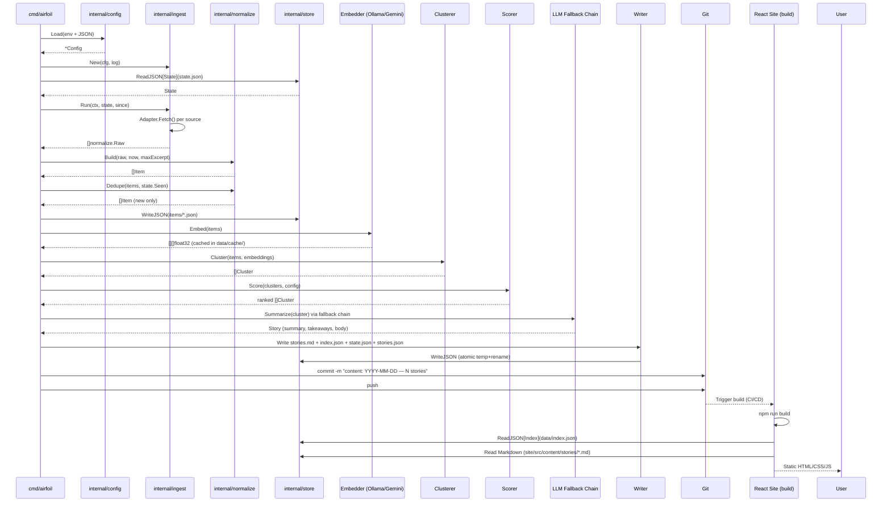
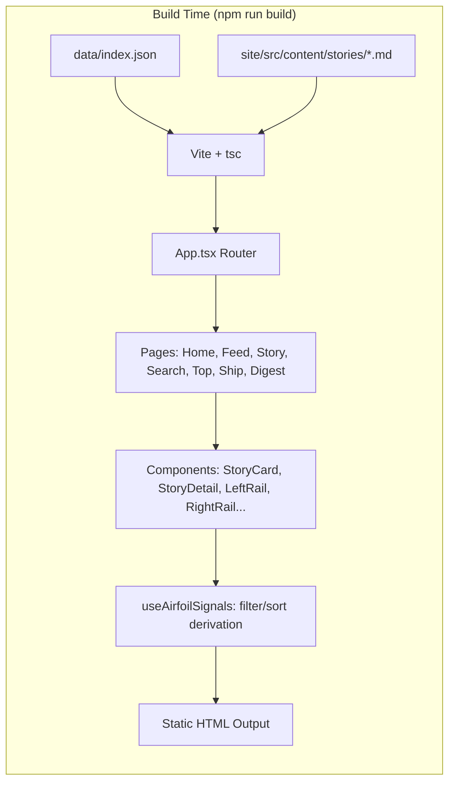

# System Topology: Two Processes, One Repository

This chapter explains the high-level architectural split between the Go agent (data pipeline) and the React + Vite site (presentation layer), with Git serving as the shared storage layer. It covers the core data models that flow between the two processes, the directory layout that defines their contract, and the idempotency guarantees that make the system reliable.

## Table of Contents

- [Two-Process Architecture](#two-process-architecture)
- [Git as the Storage Layer](#git-as-the-storage-layer)
- [Directory Contract](#directory-contract)
- [Core Data Models](#core-data-models)
  - [Go Agent Types (`agent/internal/model/types.go`)](#go-agent-types-agentinternalmodeltypesgo)
  - [Site Types (`site/src/types/story.ts`)](#site-types-sitesrctypesstoryts)
  - [Model Correspondence](#model-correspondence)
- [Data Flow: Agent → Git → Site](#data-flow-agent--git--site)
- [Idempotency via State](#idempotency-via-state)
- [Referenced Files](#referenced-files)

---

## Two-Process Architecture

Airfoil consists of two independent processes that share a single Git repository:

```
┌─────────────────────────────────────────────────────────────────────────────┐
│                            AIRFOIL REPOSITORY                                │
│  ┌──────────────────────────┐          ┌────────────────────────────────┐   │
│  │      GO AGENT            │          │      REACT + VITE SITE         │   │
│  │  (cmd/airfoil)           │          │      (site/)                   │   │
│  │                          │          │                                │   │
│  │  • Ingest (RSS, HN,      │          │  • Static build (npm run       │   │
│  │    Reddit, HFPapers,     │   Git    │    build)                      │   │
│  │    GitHub)               │  ──────► │  • Reads data/index.json       │   │
│  │  • Normalize & Dedupe    │  commits │  • Reads site/src/content/     │   │
│  │  • Embed & Cluster       │  + push  │    stories/*.md                │   │
│  │  • Score & Rank          │          │  • Zero client JS (except      │   │
│  │  • LLM Summarize         │          │    /search)                    │   │
│  │  • Write Markdown + JSON │          │  • React Router SPA            │   │
│  │  • Commit & Push         │          │                                │   │
│  └──────────────────────────┘          └────────────────────────────────┘   │
│                                                                             │
│  Shared: config/, data/, site/src/content/stories/                          │
│  Agent-only: data/cache/ (embeddings, never committed)                      │
└─────────────────────────────────────────────────────────────────────────────┘
```

**Key principle**: The Go agent is the *writer*; the React site is the *reader*. They communicate exclusively through committed files in the repository. No RPC, no shared memory, no database.

---

## Git as the Storage Layer

Git provides:
- **Durability**: Every pipeline run produces a commit with a full snapshot of `data/` and `site/src/content/stories/`.
- **History**: Rollback to any prior state via `git revert` or `git checkout`.
- **Distribution**: The site builds from the same commit the agent just pushed; CI/CD simply checks out and runs `npm run build`.
- **Concurrency safety**: The agent runs single-threaded (scheduled or on-demand); the site builds are triggered by pushes, so there is no write/write conflict.

**Commit convention**:
- Human commits: conventional (`feat:`, `fix:`, `chore:`)
- Agent commits: `content: YYYY-MM-DD — N stories` — only touching `data/` and `site/src/content/stories/`
- `data/cache/` is **never committed** (embeddings are regenerable and large)

---

## Directory Contract

The following directories form the explicit contract between agent and site:

| Path | Owner | Purpose | Committed? |
|------|-------|---------|------------|
| `config/` | Human | JSON configs (`sources.json`, `scoring.json`, `keywords.json`) | Yes |
| `data/items/` | Agent | Per-source normalized `Item` JSON files | Yes |
| `data/index.json` | Agent | Ranked `Index` (slim `IndexEntry` list) for site consumption | Yes |
| `data/state.json` | Agent | `State` dedup tracker (`SeenURLs`, `Cursors`, `LastRun`) | Yes |
| `data/stories.json` | Agent | Full `Story[]` authoritative record | Yes |
| `data/cache/` | Agent | Embedding vectors (Ollama/Gemini) — **never committed** | **No** |
| `site/src/content/stories/` | Agent | Markdown files (one per `Story`, frontmatter + body) | Yes |
| `site/src/types/story.ts` | Site | TypeScript mirrors of Go frontmatter types | Yes |

---

## Core Data Models

### Go Agent Types (`agent/internal/model/types.go`)

The Go agent defines the canonical types that flow through the pipeline. These are the source of truth; the site's TypeScript types mirror them.

#### Item — Normalized Ingest Unit

```go
// Item is one article from one source, after normalization.
//
// R1: Excerpt is capped at 300 characters by the normalize package. No other
// code path constructs an Item, so nothing longer can reach disk.
type Item struct {
	ID          string    `json:"id"` // sha256(canonicalURL)[:16]
	SourceID    string    `json:"source_id"`
	SourceName  string    `json:"source_name"`
	SourceTier  int       `json:"source_tier"`
	URL         string    `json:"url"` // canonical
	Title       string    `json:"title"`
	Excerpt     string    `json:"excerpt"`
	Author      string    `json:"author,omitempty"`
	PublishedAt time.Time `json:"published_at"`
	FetchedAt   time.Time `json:"fetched_at"`
	Metrics     Metrics   `json:"metrics"`
	RepoURL     string    `json:"repo_url,omitempty"`
	PaperURL    string    `json:"paper_url,omitempty"`
}
```

`agent/internal/model/types.go:11-25`

**Fields of note**:
- `ID`: SHA-256 of canonical URL, truncated to 16 hex chars — stable identity for deduplication.
- `SourceTier`: Integer tier from `sources.json` (1–5+); maps to `SourceType` via `SourceType(tier)`.
- `Excerpt`: Hard-capped at 300 characters by `normalize.Excerpt` (enforced in normalization, not at edges).
- `RepoURL` / `PaperURL`: Extracted during normalization from content (GitHub repo links, arXiv/HF paper links).

#### Metrics — Community Validation Signals

```go
// Metrics carries community-validation signals used by scoring.
type Metrics struct {
	HNPoints    int `json:"hn_points,omitempty"`
	HNComments  int `json:"hn_comments,omitempty"`
	RedditScore int `json:"reddit_score,omitempty"`
	HFUpvotes   int `json:"hf_upvotes,omitempty"`
	GitHubStars int `json:"github_stars,omitempty"`
}
```

`agent/internal/model/types.go:28-34`

Each source contributes its own metric; scoring combines them with tier weights.

#### Cluster — Group of Similar Items

```go
// Cluster is a group of Items covering the same event.
type Cluster struct {
	ID       string    `json:"id"`
	Items    []Item    `json:"items"`
	Centroid []float32 `json:"-"`
}
```

`agent/internal/model/types.go:37-41`

- `Centroid` is the mean embedding vector (excluded from JSON via `json:"-"`).
- Clusters are formed by O(n²) cosine similarity on embeddings.

#### Tier Constants

```go
// Story tiers.
const (
	TierMajor   = "major"
	TierNotable = "notable"
	TierMinor   = "minor"
)
```

`agent/internal/model/types.go:45-47`

Tiers drive scoring weights (`config/scoring.json` → `Scoring.TierWeight(tier)`) and site presentation.

#### Story — Publishable Unit

```go
// Story is a cluster after scoring and summarization.
//
// data/stories.json is the authoritative record of every published story.
// The markdown files under site/src/content/stories/ are rendered from it, so
// the writer never needs to parse frontmatter back.
type Story struct {
	ID              string        `json:"id"`
	Slug            string        `json:"slug"`
	Title           string        `json:"title"`
	Summary         string        `json:"summary"`
	Score           int           `json:"score"`
	Tier            string        `json:"tier"`
	Tags            []string      `json:"tags"`
	BuilderRelevant bool          `json:"builder_relevant"`
	Date            time.Time     `json:"date"`
	ClusterSize     int           `json:"cluster_size"`
	Sources         []StorySource `json:"sources"`
	Takeaways       []string      `json:"takeaways,omitempty"`
	Body            []string      `json:"body,omitempty"`
}
```

`agent/internal/model/types.go:55-69`

- `Sources` includes **every** source the cluster drew from (requirement R3).
- `Body` holds the LLM-generated prose paragraphs; `Takeaways` are bullet points.
- `Slug` is derived from title for the Markdown filename (`site/src/content/stories/{slug}.md`).

#### StorySource — Outbound Link on Story Page

```go
// StorySource is one outbound link on a story page. R3: every source a cluster
// drew from appears here.
type StorySource struct {
	Name    string         `json:"name"`
	URL     string         `json:"url"`
	Tier    int            `json:"tier"`
	Type    string         `json:"type"` // lab | press | community
	Metrics *SourceMetrics `json:"metrics,omitempty"`
}
```

`agent/internal/model/types.go:73-79`

#### SourceMetrics — Per-Source Metrics for Rendering

```go
// SourceMetrics mirrors the metrics block the site renders per source.
type SourceMetrics struct {
	Points   int `json:"points,omitempty"`
	Comments int `json:"comments,omitempty"`
	Score    int `json:"score,omitempty"`
	Upvotes  int `json:"upvotes,omitempty"`
	Stars    int `json:"stars,omitempty"`
}
```

`agent/internal/model/types.go:82-88`

#### SourceType — Tier to Coarse Category Mapping

```go
// SourceType maps a source tier to the coarse category the site renders.
func SourceType(tier int) string {
	switch {
	case tier <= 3:
		return "lab"
	case tier == 4:
		return "press"
	default:
		return "community"
	}
}
```

`agent/internal/model/types.go:91-100`

Maps the numeric `SourceTier` (from `sources.json`) to the three `SourceType` values used by the site.

#### IndexEntry — Slim Record for Site Feeds

```go
// IndexEntry is the slim record in data/index.json used by feed/top/ship.
type IndexEntry struct {
	ID              string    `json:"id"`
	Slug            string    `json:"slug"`
	Title           string    `json:"title"`
	Summary         string    `json:"summary"`
	Score           int       `json:"score"`
	Tier            string    `json:"tier"`
	Tags            []string  `json:"tags"`
	BuilderRelevant bool      `json:"builder_relevant"`
	Date            time.Time `json:"date"`
	ClusterSize     int       `json:"cluster_size"`
}
```

`agent/internal/model/types.go:103-114`

Excludes `Sources`, `Takeaways`, `Body` — kept small for fast feed loading.

#### Index — Full Feed Index

```go
// Index is the whole of data/index.json.
type Index struct {
	GeneratedAt time.Time    `json:"generated_at"`
	Stories     []IndexEntry `json:"stories"`
}
```

`agent/internal/model/types.go:117-120`

#### State — Idempotency Tracker

```go
// State is data/state.json — what makes the agent idempotent (R7).
type State struct {
	// SeenURLs maps an item ID to the date it was first seen, as YYYY-MM-DD.
	SeenURLs map[string]string `json:"seen_urls"`
	// Cursors holds per-source high-water marks.
	Cursors map[string]string `json:"cursors"`
	LastRun *time.Time        `json:"last_run"`
}
```

`agent/internal/model/types.go:123-129`

```go
// NewState returns an empty, non-nil State.
func NewState() *State {
	return &State{
		SeenURLs: map[string]string{},
		Cursors:  map[string]string{},
	}
}

// Seen reports whether an item ID has already been ingested.
func (s *State) Seen(id string) bool {
	_, ok := s.SeenURLs[id]
	return ok
}

// MarkSeen records an item ID as ingested on the given day.
func (s *State) MarkSeen(id string, day time.Time) {
	if s.SeenURLs == nil {
		s.SeenURLs = map[string]string{}
	}
	s.SeenURLs[id] = day.UTC().Format(time.DateOnly)
}
```

`agent/internal/model/types.go:132-151`

- `SeenURLs` key = `Item.ID` (hash of canonical URL), value = `YYYY-MM-DD`.
- `Cursors` tracks per-source high-water marks (e.g., HN max item ID, RSS GUID).
- `LastRun` records the last successful pipeline completion.

---

### Site Types (`site/src/types/story.ts`)

The React site defines TypeScript interfaces that **mirror the Go frontmatter exactly**. This is a deliberate contract: the agent writes JSON/Markdown; the site reads it without transformation.

```typescript
export type SourceType = 'lab' | 'community' | 'press';

export interface Source {
  name: string;
  url: string;
  type: SourceType;
  tier?: number;
  metrics?: {
    points?: number;
    comments?: number;
    score?: number;
    upvotes?: number;
    stars?: number;
  };
}

export interface Story {
  id: string;
  slug: string;
  title: string;
  score: number;
  cluster: number;
  ts: string; // ISO 8601 string
  summary: string;
  body: string[];
  tags: string[];
  sources: Source[];
  builder_relevant?: boolean;
  takeaways?: string[];
}

export type DateWindow = 'ALL' | '24H' | '7D';
export type SortOrder = 'newest' | 'score' | 'cluster';

export interface FilterState {
  date: DateWindow;
  tag: string | null;
  source: string | null;
  query: string;
  sortBy: SortOrder;
}
```

`site/src/types/story.ts:1-41`

**Key differences from Go types**:
- `cluster` (number) ↔ `ClusterSize` (int) — same concept, different naming convention.
- `ts` (string) ↔ `Date` (time.Time) — site uses ISO 8601 strings; Go uses `time.Time` (JSON serializes to RFC3339).
- `builder_relevant` (snake_case) ↔ `BuilderRelevant` (PascalCase) — JSON tags handle the mapping.
- `Source.type` is `SourceType` enum (`lab|community|press`); Go computes it via `SourceType(tier)`.

---

### Model Correspondence

| Go Type / Field | TypeScript Type / Field | Notes |
|-----------------|-------------------------|-------|
| `Story.ID` | `Story.id` | Identical |
| `Story.Slug` | `Story.slug` | Identical |
| `Story.Title` | `Story.title` | Identical |
| `Story.Summary` | `Story.summary` | Identical |
| `Story.Score` | `Story.score` | Identical |
| `Story.Tier` | (not in TS) | Site derives tier from score thresholds |
| `Story.Tags` | `Story.tags` | Identical |
| `Story.BuilderRelevant` | `Story.builder_relevant` | JSON tag maps PascalCase → snake_case |
| `Story.Date` | `Story.ts` | Go `time.Time` → ISO 8601 string |
| `Story.ClusterSize` | `Story.cluster` | Renamed |
| `Story.Sources[]` | `Story.sources[]` | `StorySource` → `Source` |
| `Story.Takeaways` | `Story.takeaways` | Identical |
| `Story.Body` | `Story.body` | Identical |
| `StorySource.Name` | `Source.name` | Identical |
| `StorySource.URL` | `Source.url` | Identical |
| `StorySource.Type` | `Source.type` | Go computes via `SourceType(tier)` |
| `StorySource.Tier` | `Source.tier` | Optional in TS |
| `StorySource.Metrics` | `Source.metrics` | `SourceMetrics` → inline object |
| `IndexEntry` | (not a TS type) | Site reads `data/index.json` as `IndexEntry[]` directly |
| `State` | (not in TS) | Agent-internal only |

---

## Data Flow: Agent → Git → Site

### Full Pipeline Sequence



### Site Build-Time Consumption



The site **never** calls the agent at runtime. All data is baked into the static build.

---

## Idempotency via State

The `State` type and its methods are the linchpin of idempotent re-runs:

```go
// Seen reports whether an item ID has already been ingested.
func (s *State) Seen(id string) bool {
	_, ok := s.SeenURLs[id]
	return ok
}

// MarkSeen records an item ID as ingested on the given day.
func (s *State) MarkSeen(id string, day time.Time) {
	if s.SeenURLs == nil {
		s.SeenURLs = map[string]string{}
	}
	s.SeenURLs[id] = day.UTC().Format(time.DateOnly)
}
```

`agent/internal/model/types.go:140-151`

**Flow**:
1. Agent loads `data/state.json` → `State` struct at startup.
2. After normalization, `normalize.Dedupe(items, state.Seen)` drops any `Item` whose `ID` exists in `SeenURLs`.
3. New items are written to `data/items/*.json` and `MarkSeen` is called for each.
4. Updated `State` is written back to `data/state.json` at pipeline end.
5. Second run same day: `Seen(id)` returns `true` for all previously ingested items → zero new stories.

**Per-day granularity**: The value stored is `YYYY-MM-DD`. This allows re-ingestion on a new day if the same URL appears again (e.g., updated article), while preventing duplicates within a single day.

---

## Referenced Files

| File | Role |
|------|------|
| `agent/internal/model/types.go` | Canonical Go data types (Item, Cluster, Story, Index, State, Metrics, tier constants, SourceType, State methods) |
| `site/src/types/story.ts` | TypeScript mirrors of Go frontmatter (Story, Source, FilterState, DateWindow, SortOrder, SourceType) |

These two files define the **entire data contract** between the Go agent and the React site. Every other component in the system (ingest, normalize, embed, cluster, score, summarize, write, site pages, hooks, components) operates on or transforms these types.

<!-- kaioken:files agent/internal/model/types.go,site/src/types/story.ts -->
