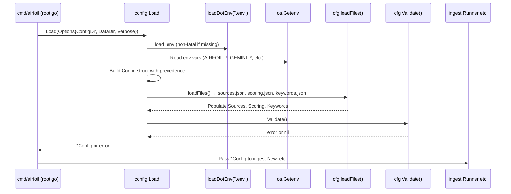

# Configuration Architecture Overview

This chapter documents the high-level configuration structure of the Airfoil agent: the `Config` struct composition, the file loading order and precedence rules, how configuration flows into the pipeline, and the validation gates that prevent silently wrong runs.

## Table of Contents

- [Config Struct Composition](#config-struct-composition)
- [Loading Order and Precedence](#loading-order-and-precedence)
- [Environment Variables](#environment-variables)
- [JSON Configuration Files](#json-configuration-files)
- [Derived Paths](#derived-paths)
- [Source Enablement and Filtering](#source-enablement-and-filtering)
- [Validation Rules](#validation-rules)
- [Flow into the Pipeline](#flow-into-the-pipeline)
- [Referenced Files](#referenced-files)

---

## Config Struct Composition

The `Config` struct is the single, fully resolved configuration object for a run. It is constructed in `config.Load` and passed explicitly down the call chain — no globals, no `init()`, no ambient `os.Getenv` reads outside this package.

```
agent/internal/config/config.go:14-30
```

```go
type Config struct {
	// Paths
	DataDir    string
	ConfigDir  string
	StoriesDir string // where the markdown files are written

	LogLevel string
	SiteURL  string

	LLM    LLMConfig
	Embed  EmbedConfig
	Ingest IngestConfig

	Sources  []Source
	Scoring  Scoring
	Keywords Keywords
}
```

### Sub-structures

| Sub-struct | Purpose | Defined at |
|------------|---------|------------|
| `LLMConfig` | Credentials and model IDs for the summarization fallback chain (Gemini → NVIDIA NIM → OpenRouter → Ollama) | `config.go:34-39` |
| `ProviderCreds` | API key + model ID pair; `Configured()` reports readiness | `config.go:42-50` |
| `OllamaConfig` | Local Ollama daemon host, chat model, embed model | `config.go:53-57` |
| `EmbedConfig` | Embedding provider selection (`ollama` | `gemini` | `nvidia_nim`) and per-provider settings; `Model()` returns the active model ID | `config.go:66-72` |
| `IngestConfig` | Credentials needed by ingest adapters (GitHub token, Reddit User-Agent) | `config.go:75-78` |
| `Source` | One entry from `sources.json` (ID, name, type, URL, tier, tags, enabled, options) | `files.go:27-36` |
| `Scoring` | All ranking knobs from `scoring.json` (weights, thresholds, caps, limits, retention) | `files.go:73-122` |
| `Keywords` | Signal word lists and topic tags from `keywords.json` | `files.go:198-203` |

### Embedding Provider Constants

```
agent/internal/config/config.go:61-62
```

```go
const (
	EmbedderOllama    = "ollama"
	EmbedderGemini    = "gemini"
	EmbedderNvidiaNIM = "nvidia_nim"
)
```

---

## Loading Order and Precedence

`config.Load(opts Options)` resolves configuration in a single pass at startup. The precedence chain is:

1. **CLI flags** (via `Options` struct) — highest
2. **Process environment variables** — middle
3. **`.env` file** (loaded via `loadDotEnv`, convenience for local runs) — lower
4. **Hard-coded defaults** — lowest

```
agent/internal/config/config.go:115-175
```

```go
func Load(opts Options) (*Config, error) {
	// A .env file is convenience for local runs; CI supplies real env vars.
	// Values already present in the environment always win.
	if err := loadDotEnv(".env"); err != nil {
		return nil, err
	}

	cfg := &Config{
		DataDir:   firstNonEmpty(opts.DataDir, os.Getenv("AIRFOIL_DATA_DIR"), "./data"),
		ConfigDir: firstNonEmpty(opts.ConfigDir, os.Getenv("AIRFOIL_CONFIG_DIR"), "./config"),
		LogLevel:  firstNonEmpty(os.Getenv("AIRFOIL_LOG_LEVEL"), "info"),
		SiteURL:   os.Getenv("SITE_URL"),
		// ... LLM, Embed, Ingest sub-structs populated similarly ...
	}

	cfg.StoriesDir = firstNonEmpty(
		os.Getenv("AIRFOIL_STORIES_DIR"),
		filepath.Join("site", "src", "content", "stories"),
	)

	if err := cfg.loadFiles(); err != nil {
		return nil, err
	}
	if err := cfg.Validate(); err != nil {
		return nil, err
	}
	return cfg, nil
}
```

The helper `firstNonEmpty` returns the first non-empty string in its variadic arguments, implementing the precedence.

```
agent/internal/config/config.go:246-253
```

```go
func firstNonEmpty(vals ...string) string {
	for _, v := range vals {
		if v != "" {
			return v
		}
	}
	return ""
}
```

### Load Sequence Diagram



---

## Environment Variables

All environment variables recognized by the configuration system. CI uses GitHub Secrets; local development copies `.env.example` to `.env` (gitignored).

| Variable | Purpose | Default | Source |
|----------|---------|---------|--------|
| `AIRFOIL_CONFIG_DIR` | Directory containing `sources.json`, `scoring.json`, `keywords.json` | `./config` | `config.go:124` |
| `AIRFOIL_DATA_DIR` | Root for generated data (`items/`, `cache/`, `index.json`, `state.json`, `stories.json`) | `./data` | `config.go:123` |
| `AIRFOIL_EMBEDDER` | Embedding provider: `ollama` \| `gemini` \| `nvidia_nim` | `ollama` | `config.go:149` |
| `AIRFOIL_LOG_LEVEL` | `slog` level (`debug`, `info`, `warn`, `error`) | `info` | `config.go:125` |
| `AIRFOIL_STORIES_DIR` | Where Markdown story files are written | `site/src/content/stories` | `config.go:164` |
| `SITE_URL` | Base URL of the deployed site (used in frontmatter/links) | (empty) | `config.go:126` |
| `GEMINI_API_KEY` | Google Gemini API key (summarization + embeddings) | — | `config.go:130` |
| `GEMINI_MODEL` | Gemini chat model for summarization | `gemini-2.0-flash` | `config.go:131` |
| `GEMINI_EMBED_MODEL` | Gemini embedding model | `text-embedding-004` | `config.go:153` |
| `NVIDIA_NIM_API_KEY` | NVIDIA NIM API key | — | `config.go:134` |
| `NVIDIA_NIM_MODEL` | NVIDIA NIM chat model | `meta/llama-3.3-70b-instruct` | `config.go:135` |
| `NVIDIA_NIM_EMBED_MODEL` | NVIDIA NIM embedding model | `nvidia/nv-embedqa-e5-v5` | `config.go:153` (via `EmbedConfig`) |
| `NVIDIA_NIM_BASE_URL` | NVIDIA NIM base URL | `https://integrate.api.nvidia.com/v1` | `config.go:153` (via `EmbedConfig`) |
| `OPENROUTER_API_KEY` | OpenRouter API key | — | `config.go:138` |
| `OPENROUTER_MODEL` | OpenRouter chat model | `meta-llama/llama-3.3-70b-instruct:free` | `config.go:139` |
| `OLLAMA_HOST` | Local Ollama daemon URL | `http://localhost:11434` | `config.go:142` |
| `OLLAMA_CHAT_MODEL` | Ollama chat model for summarization | `llama3.1` | `config.go:143` |
| `OLLAMA_EMBED_MODEL` | Ollama embedding model | `nomic-embed-text` | `config.go:144` |
| `GITHUB_TOKEN` | GitHub PAT (raises rate limit 60→5000/hr) | (empty) | `config.go:157` |
| `REDDIT_USER_AGENT` | Descriptive User-Agent for Reddit API (required to avoid 429) | `airfoil/0.1` | `config.go:158` |

> **Note**: The LLM fallback chain order is **Gemini → NVIDIA NIM → OpenRouter → Ollama**. Each provider is attempted only if `ProviderCreds.Configured()` returns true (both API key and model present).

---

## JSON Configuration Files

Three JSON files under `ConfigDir` (default `./config/`) are loaded by `cfg.loadFiles()`:

```
agent/internal/config/config.go:178-190
```

```go
func (c *Config) loadFiles() error {
	var err error
	if c.Sources, err = loadSources(filepath.Join(c.ConfigDir, "sources.json")); err != nil {
		return err
	}
	if c.Scoring, err = loadScoring(filepath.Join(c.ConfigDir, "scoring.json")); err != nil {
		return err
	}
	if c.Keywords, err = loadKeywords(filepath.Join(c.ConfigDir, "keywords.json")); err != nil {
		return err
	}
	return nil
}
```

### sources.json

Defines the ingest sources. Each entry becomes a `Source` struct.

```
agent/internal/config/files.go:11-24
```

```go
const (
	SourceRSS      = "rss"
	SourceHN       = "hn"
	SourceReddit   = "reddit"
	SourceHFPapers = "hf_papers"
	SourceGitHub   = "github"
)

var validSourceTypes = map[string]bool{
	SourceRSS:      true,
	SourceHN:       true,
	SourceReddit:   true,
	SourceHFPapers: true,
	SourceGitHub:   true,
}
```

```
agent/internal/config/files.go:27-36
```

```go
type Source struct {
	Comment string        `json:"$comment,omitempty"`
	ID      string        `json:"id"`
	Name    string        `json:"name"`
	Type    string        `json:"type"`
	URL     string        `json:"url"`
	Tier    int           `json:"tier"`
	Tags    []string      `json:"tags"`
	Enabled bool          `json:"enabled"`
	Options SourceOptions `json:"options"`
}
```

**SourceOptions** is a union of per-adapter fields; each adapter reads only what it needs:

```
agent/internal/config/files.go:40-57
```

```go
type SourceOptions struct {
	// hn
	Queries   []string `json:"queries"`
	MinPoints int      `json:"min_points"`
	HoursBack int      `json:"hours_back"`

	// reddit
	Limit    int `json:"limit"`
	MinScore int `json:"min_score"`

	// hf_papers
	MinUpvotes int `json:"min_upvotes"`

	// github
	CreatedWithinDays int `json:"created_within_days"`
	MinStars          int `json:"min_stars"`
	MaxPerQuery       int `json:"max_per_query"`
}
```

**Example `sources.json` structure:**

```json
{
  "$comment": "Airfoil ingest sources",
  "sources": [
    {
      "id": "hn-frontpage",
      "name": "Hacker News Front Page",
      "type": "hn",
      "url": "https://hacker-news.firebaseio.com/v0",
      "tier": 1,
      "tags": ["tech", "startups"],
      "enabled": true,
      "options": {
        "queries": ["frontpage"],
        "min_points": 50,
        "hours_back": 24
      }
    },
    {
      "id": "github-trending",
      "name": "GitHub Trending",
      "type": "github",
      "url": "https://api.github.com",
      "tier": 2,
      "tags": ["opensource"],
      "enabled": true,
      "options": {
        "created_within_days": 7,
        "min_stars": 100,
        "max_per_query": 25
      }
    }
  ]
}
```

### scoring.json

All ranking knobs live here so they can be tuned without a rebuild.

```
agent/internal/config/files.go:73-122
```

```go
type Scoring struct {
	Comment string `json:"$comment,omitempty"`

	Clustering struct {
		SimilarityThreshold float64    `json:"similarity_threshold"`
		WindowHours         int        `json:"window_hours"`
		DebugRange          [2]float64 `json:"debug_range"`
	} `json:"clustering"`

	Weights struct {
		Sources float64 `json:"sources"`
		Tier    float64 `json:"tier"`
		HN      float64 `json:"hn"`
		Reddit  float64 `json:"reddit"`
		Builder float64 `json:"builder"`
		Hype    float64 `json:"hype"`
	} `json:"weights"`

	TierWeights map[string]float64 `json:"tier_weights"`

	Recency struct {
		HalfLifeHours float64 `json:"half_life_hours"`
	} `json:"recency"`

	Caps struct {
		BuilderSignalMax int `json:"builder_signal_max"`
		HypeSignalMax    int `json:"hype_signal_max"`
		LLMCallsPerRun   int `json:"llm_calls_per_run"`
	} `json:"caps"`

	Tiers struct {
		MajorMinScore   int `json:"major_min_score"`
		NotableMinScore int `json:"notable_min_score"`
	} `json:"tiers"`

	BuilderRelevantMinSignals int `json:"builder_relevant_min_signals"`

	Limits struct {
		ExcerptMaxChars         int `json:"excerpt_max_chars"`
		SummaryMaxWords         int `json:"summary_max_words"`
		TakeawaysMax            int `json:"takeaways_max"`
		VerbatimOverlapMaxWords int `json:"verbatim_overlap_max_words"`
		QuotesMax               int `json:"quotes_max"`
		QuoteMaxWords           int `json:"quote_max_words"`
	} `json:"limits"`

	Retention struct {
		ItemsDays          int `json:"items_days"`
		SeenURLsDays       int `json:"seen_urls_days"`
		EmbeddingCacheDays int `json:"embedding_cache_days"`
	} `json:"retention"`
}
```

**Key methods:**

```
agent/internal/config/files.go:126-128
```

```go
func (s Scoring) TierWeight(tier int) float64 {
	return s.TierWeights[fmt.Sprint(tier)]
}
```

```
agent/internal/config/files.go:139-194
```

```go
func (s Scoring) problems() []string {
	// Validates all scoring values; returns slice of problem strings
}
```

### keywords.json

Signal word lists for builder/hype detection and topic tag mapping.

```
agent/internal/config/files.go:198-211
```

```go
type Keywords struct {
	Comment string `json:"$comment,omitempty"`

	BuilderSignals           []string            `json:"builder_signals"`
	BuilderStructuralSignals []string            `json:"builder_structural_signals"`
	HypeSignals              []string            `json:"hype_signals"`
	TopicTags                map[string][]string `json:"topic_tags"`
}
```

**Example `keywords.json` structure:**

```json
{
  "$comment": "Keyword signals for scoring",
  "builder_signals": ["open source", "release", "launch", "v1.0", "beta"],
  "builder_structural_signals": ["github.com", "gitlab.com", "source code", "repository"],
  "hype_signals": ["breakthrough", "revolutionary", "game changer", "massive", "unprecedented"],
  "topic_tags": {
    "ai": ["llm", "transformer", "gpt", "bert", "fine-tun"],
    "rust": ["rust", "cargo", "tokio", "async"],
    "wasm": ["webassembly", "wasm", "wasi"]
  }
}
```

---

## Derived Paths

The `Config` struct provides methods that compute absolute paths from `DataDir` and `StoriesDir`. These are used throughout the pipeline (store, ingest, embed, write stages).

```
agent/internal/config/config.go:81-89
```

```go
func (c Config) ItemsDir() string    { return filepath.Join(c.DataDir, "items") }
func (c Config) CacheDir() string    { return filepath.Join(c.DataDir, "cache") }
func (c Config) DigestDir() string   { return filepath.Join(c.DataDir, "digest") }
func (c Config) IndexPath() string   { return filepath.Join(c.DataDir, "index.json") }
func (c Config) StatePath() string   { return filepath.Join(c.DataDir, "state.json") }
func (c Config) StoriesPath() string { return filepath.Join(c.DataDir, "stories.json") }
func (c Config) EmbedCachePath() string {
	return filepath.Join(c.CacheDir(), "embeddings.json")
}
```

| Method | Path | Purpose |
|--------|------|---------|
| `ItemsDir()` | `data/items/` | Per-item JSON files (one per ingested item) |
| `CacheDir()` | `data/cache/` | Embedding cache, never committed |
| `DigestDir()` | `data/digest/` | Digest-related outputs |
| `IndexPath()` | `data/index.json` | Ranked `IndexEntry` list for site consumption |
| `StatePath()` | `data/state.json` | Dedup tracker (`State.Seen`/`MarkSeen`) |
| `StoriesPath()` | `data/stories.json` | Serialized `Story` slice for site |
| `EmbedCachePath()` | `data/cache/embeddings.json` | Embedding vectors keyed by model |
| `StoriesDir` (field) | `site/src/content/stories/` | Markdown story files (frontmatter + body) |

---

## Source Enablement and Filtering

Only sources with `"enabled": true` in `sources.json` participate in a run. The `EnabledSources()` method filters the loaded list.

```
agent/internal/config/config.go:92-100
```

```go
func (c Config) EnabledSources() []Source {
	out := make([]Source, 0, len(c.Sources))
	for _, s := range c.Sources {
		if s.Enabled {
			out = append(out, s)
		}
	}
	return out
}
```

This is called by `ingest.New` to build the adapter list:

```mermaid
graph TD
    A[config.Load] --> B[loadSources → Config.Sources]
    B --> C[Config.EnabledSources()]
    C --> D[ingest.New(cfg, log)]
    D --> E[For each enabled Source]
    E --> F{Source.Type}
    F -->|rss| G[rssAdapter]
    F -->|hn| H[hnAdapter]
    F -->|reddit| I[rssAdapter]
    F -->|hf_papers| J[rssAdapter]
    F -->|github| K[rssAdapter]
    G --> L[ingest.Runner.Run]
    H --> L
    I --> L
    J --> L
    K --> L
```

---

## Validation Rules

`Config.Validate()` runs after file loading and before the pipeline starts. It aggregates all problems and returns a single error with a formatted list — a hard failure at startup rather than a surprise mid-run.

```
agent/internal/config/config.go:194-244
```

```go
func (c *Config) Validate() error {
	var problems []string

	if len(c.EnabledSources()) == 0 {
		problems = append(problems, "no enabled sources in sources.json")
	}
	seen := map[string]bool{}
	for i, s := range c.Sources {
		where := fmt.Sprintf("sources[%d]", i)
		if s.ID == "" {
			problems = append(problems, where+": missing id")
		} else if seen[s.ID] {
			problems = append(problems, where+": duplicate id "+s.ID)
		}
		seen[s.ID] = true

		if s.Name == "" {
			problems = append(problems, where+" ("+s.ID+"): missing name")
		}
		if s.URL == "" {
			problems = append(problems, where+" ("+s.ID+"): missing url")
		}
		if !validSourceTypes[s.Type] {
			problems = append(problems, fmt.Sprintf("%s (%s): unknown type %q", where, s.ID, s.Type))
		}
		if s.Tier < 1 || s.Tier > 5 {
			problems = append(problems, fmt.Sprintf("%s (%s): tier %d out of range 1-5", where, s.ID, s.Tier))
		}
	}

	problems = append(problems, c.Scoring.problems()...)

	if len(c.Keywords.BuilderSignals) == 0 {
		problems = append(problems, "keywords.json: builder_signals is empty")
	}
	if len(c.Keywords.HypeSignals) == 0 {
		problems = append(problems, "keywords.json: hype_signals is empty")
	}

	switch c.Embed.Provider {
	case EmbedderOllama, EmbedderGemini, EmbedderNvidiaNIM:
	default:
		problems = append(problems, fmt.Sprintf("AIRFOIL_EMBEDDER=%q: want one of %q, %q, %q",
			c.Embed.Provider, EmbedderOllama, EmbedderGemini, EmbedderNvidiaNIM))
	}

	if len(problems) > 0 {
		return fmt.Errorf("config: invalid:\n  - %s", strings.Join(problems, "\n  - "))
	}
	return nil
}
```

### Validation Categories

| Category | Checks |
|----------|--------|
| **Sources** | At least one enabled; each has non-empty `id`, `name`, `url`; unique `id`; `type` in valid set; `tier` in 1..5 |
| **Scoring** | Delegated to `Scoring.problems()` — see below |
| **Keywords** | `builder_signals` and `hype_signals` non-empty |
| **Embedder** | Provider is one of `ollama`, `gemini`, `nvidia_nim` |

### Scoring Validation Details (`Scoring.problems()`)

```
agent/internal/config/files.go:139-194
```

| Check | Condition |
|-------|-----------|
| `clustering.similarity_threshold` | Must be in (0, 1] |
| `clustering.window_hours` | Must be > 0 |
| `recency.half_life_hours` | Must be > 0 |
| `tier_weights` | Must have entries for tiers "1" through "5" |
| `tiers.major_min_score` | Must exceed `tiers.notable_min_score` |
| `caps.llm_calls_per_run` | Must be > 0 |
| `limits.excerpt_max_chars` | Must be > 0 (enforces R1) |
| `limits.summary_max_words` | Must be > 0 (enforces R1) |
| `limits.verbatim_overlap_max_words` | Must be > 0 (enforces R1) |
| `limits.quote_max_words` | Must be > 0 (enforces R2) |
| Retention days (`items_days`, `seen_urls_days`, `embedding_cache_days`) | All must be > 0 |

---

## Flow into the Pipeline

The resolved `*Config` flows from the CLI root command into every pipeline stage. No component reads environment variables directly.

```
agent/cmd/airfoil/root.go (not in scope, but described in architecture)
```

```mermaid
graph TD
    CLI[cmd/airfoil/main.go → root.go] --> Load[config.Load]
    Load --> Cfg[*Config]
    
    Cfg --> IngestNew[ingest.New(cfg, log)]
    IngestNew --> Runner[ingest.Runner]
    Runner --> Adapters[Adapters per EnabledSources()]
    
    Cfg --> Normalize[normalize.Build uses Scoring.Limits.ExcerptMaxChars]
    Cfg --> Embed[embedder uses EmbedConfig]
    Cfg --> Cluster[clustering uses Scoring.Clustering]
    Cfg --> Score[scoring uses Scoring weights, TierWeights, Keywords]
    Cfg --> Summarize[LLM chain uses LLMConfig]
    Cfg --> Write[store.WriteJSON uses ItemsDir, IndexPath, StatePath, StoriesPath, StoriesDir]
    
    Cfg --> ValidateGate[Validate() gates all above]
```

### Key Injection Points

| Stage | Config Fields Used |
|-------|-------------------|
| **Ingest** | `EnabledSources()`, `Ingest.GitHubToken`, `Ingest.RedditUserAgent`, `Source.Options` per adapter |
| **Normalize** | `Scoring.Limits.ExcerptMaxChars` (300 default) |
| **Embed** | `EmbedConfig` (provider, model, host, keys) → `EmbedCachePath()` |
| **Cluster** | `Scoring.Clustering.SimilarityThreshold`, `WindowHours` |
| **Score** | `Scoring.Weights`, `TierWeights`, `Recency.HalfLifeHours`, `Caps`, `Keywords` |
| **Summarize** | `LLMConfig` (provider creds + models), `Scoring.Limits` (summary words, quotes, etc.) |
| **Write** | `ItemsDir()`, `IndexPath()`, `StatePath()`, `StoriesPath()`, `StoriesDir` |
| **Validation** | All of the above via `Validate()` |

---

## Referenced Files

| File | Role |
|------|------|
| `agent/internal/config/config.go` | `Config` struct, `Load`, `Validate`, derived paths, env var bindings, LLM/Embed/Ingest sub-configs |
| `agent/internal/config/files.go` | `Source`/`SourceOptions`/`Scoring`/`Keywords` types, JSON loading (`loadSources`, `loadScoring`, `loadKeywords`), validation helpers (`Scoring.problems`), source type constants |

<!-- kaioken:files agent/internal/config/config.go,agent/internal/config/files.go -->
