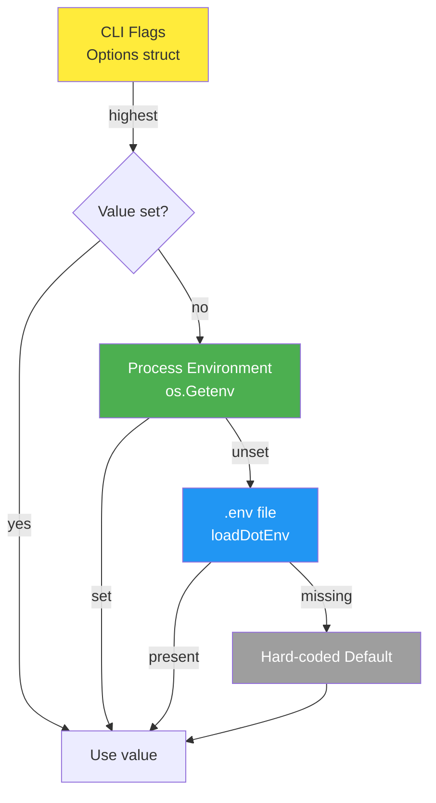
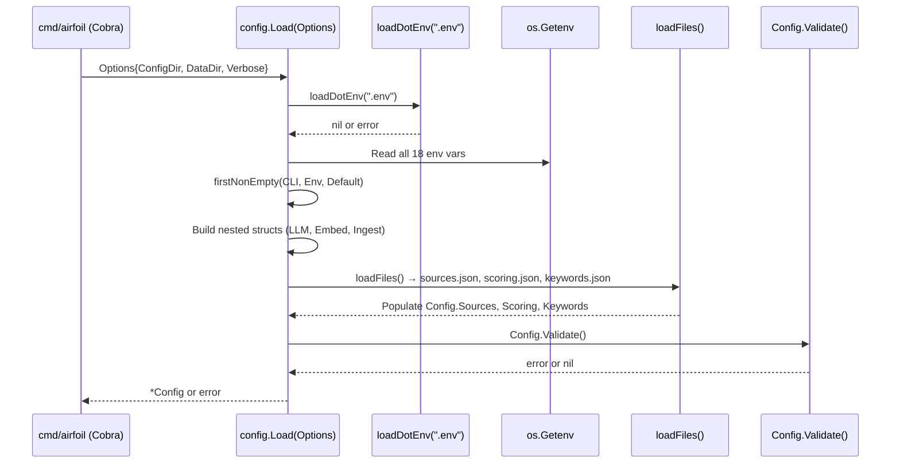

# Environment Variable Precedence & .env Files

This chapter documents the configuration precedence chain, every supported environment variable, and the behavior of the built-in dotenv parser. It is a child of the **Configuration System** section.

## Table of Contents

- [Precedence Chain](#precedence-chain)
- [Supported Environment Variables](#supported-environment-variables)
- [Dotenv Parser Behavior](#dotenv-parser-behavior)
- [Configuration Loading Flow](#configuration-loading-flow)
- [Referenced Files](#referenced-files)

---

## Precedence Chain

The configuration system resolves values in a strict order. Higher-precedence sources **always win** over lower ones.

```
CLI flags (Options)  >  Process environment  >  .env file  >  Hard-coded defaults
```

**Key rules:**

1. **CLI flags** (`Options.ConfigDir`, `Options.DataDir`, `Options.Verbose`) are passed explicitly from the Cobra command layer and take absolute priority.
2. **Process environment** variables are read via `os.Getenv`. If a variable is already set in the process environment (e.g., injected by CI/CD), it is **never overwritten** by the `.env` file.
3. **`.env` file** is loaded once at startup via `loadDotEnv(".env")`. A missing file is not an error — this is the normal case in CI.
4. **Hard-coded defaults** are the final fallback, embedded directly in `Load()`.

The helper `firstNonEmpty` implements this logic for string values:

`agent/internal/config/config.go:246-253`

```go
func firstNonEmpty(vals ...string) string {
	for _, v := range vals {
		if v != "" {
			return v
		}
	}
	return ""
}
```

### Mermaid: Precedence Resolution



---

## Supported Environment Variables

The following 18 environment variables are recognized. They are grouped by functional area.

### Paths & Runtime

| Variable | Default | Purpose | Source |
|----------|---------|---------|--------|
| `AIRFOIL_CONFIG_DIR` | `./config` | Directory containing `sources.json`, `scoring.json`, `keywords.json` | `config.go:124` |
| `AIRFOIL_DATA_DIR` | `./data` | Root for generated data (`items/`, `cache/`, `index.json`, `state.json`, `stories.json`) | `config.go:123` |
| `AIRFOIL_STORIES_DIR` | `site/src/content/stories` | Where Markdown story files are written (site content directory) | `config.go:164` |
| `AIRFOIL_LOG_LEVEL` | `info` | Log level for `slog` (`debug`, `info`, `warn`, `error`) | `config.go:125` |
| `SITE_URL` | *empty* | Base URL of the deployed site; used in generated metadata | `config.go:126` |

### Embedder Selection

| Variable | Default | Purpose | Source |
|----------|---------|---------|--------|
| `AIRFOIL_EMBEDDER` | `ollama` | Embedding provider: `ollama`, `gemini`, or `nvidia_nim` | `config.go:149` |

### LLM Provider Credentials & Models (Summarization Chain)

The summarization fallback chain is **Gemini → NVIDIA NIM → OpenRouter → Ollama**. Each provider requires an API key and a model ID.

| Variable | Default | Purpose | Source |
|----------|---------|---------|--------|
| `GEMINI_API_KEY` | *empty* | Google Gemini API key | `config.go:130` |
| `GEMINI_MODEL` | `gemini-2.0-flash` | Gemini chat model for summarization | `config.go:131` |
| `NVIDIA_NIM_API_KEY` | *empty* | NVIDIA NIM API key | `config.go:134` |
| `NVIDIA_NIM_MODEL` | `meta/llama-3.3-70b-instruct` | NIM chat model for summarization | `config.go:135` |
| `OPENROUTER_API_KEY` | *empty* | OpenRouter API key | `config.go:138` |
| `OPENROUTER_MODEL` | `meta-llama/llama-3.3-70b-instruct:free` | OpenRouter chat model for summarization | `config.go:139` |
| `OLLAMA_HOST` | `http://localhost:11434` | Ollama daemon endpoint | `config.go:142` |
| `OLLAMA_CHAT_MODEL` | `llama3.1` | Ollama chat model for summarization | `config.go:143` |

### Embedding Models (Vector Generation)

Separate model IDs are used for embeddings (distinct from chat models above).

| Variable | Default | Purpose | Source |
|----------|---------|---------|--------|
| `OLLAMA_EMBED_MODEL` | `nomic-embed-text` | Ollama embedding model | `config.go:144` |
| `GEMINI_EMBED_MODEL` | `text-embedding-004` | Gemini embedding model | `config.go:153` |
| `NVIDIA_NIM_EMBED_MODEL` | `nvidia/nv-embedqa-e5-v5` | NIM embedding model | `config.go:153` (via `EmbedConfig`) |
| `NVIDIA_NIM_BASE_URL` | `https://integrate.api.nvidia.com/v1` | NIM API base URL | `config.go:153` (via `EmbedConfig`) |

### Ingest Credentials

| Variable | Default | Purpose | Source |
|----------|---------|---------|--------|
| `GITHUB_TOKEN` | *empty* | GitHub PAT (raises rate limit from 60→5000/hr) | `config.go:157` |
| `REDDIT_USER_AGENT` | `airfoil/0.1` | User-Agent string for Reddit API (required to avoid 429) | `config.go:158` |

### Configuration Struct Mapping

The `Load` function maps these variables into nested structs:

`agent/internal/config/config.go:115-175`

```go
func Load(opts Options) (*Config, error) {
	// A .env file is convenience for local runs; CI supplies real env vars.
	// Values already present in the environment always win.
	if err := loadDotEnv(".env"); err != nil {
		return nil, err
	}

	cfg := &Config{
		DataDir:   firstNonEmpty(opts.DataDir, os.Getenv("AIRFOIL_DATA_DIR"), "./data"),
		ConfigDir: firstNonEmpty(opts.ConfigDir, os.Getenv("AIRFOIL_CONFIG_DIR"), "./config"),
		LogLevel:  firstNonEmpty(os.Getenv("AIRFOIL_LOG_LEVEL"), "info"),
		SiteURL:   os.Getenv("SITE_URL"),

		LLM: LLMConfig{
			Gemini: ProviderCreds{
				APIKey: os.Getenv("GEMINI_API_KEY"),
				Model:  firstNonEmpty(os.Getenv("GEMINI_MODEL"), "gemini-2.0-flash"),
			},
			NvidiaNIM: ProviderCreds{
				APIKey: os.Getenv("NVIDIA_NIM_API_KEY"),
				Model:  firstNonEmpty(os.Getenv("NVIDIA_NIM_MODEL"), "meta/llama-3.3-70b-instruct"),
			},
			OpenRouter: ProviderCreds{
				APIKey: os.Getenv("OPENROUTER_API_KEY"),
				Model:  firstNonEmpty(os.Getenv("OPENROUTER_MODEL"), "meta-llama/llama-3.3-70b-instruct:free"),
			},
			Ollama: OllamaConfig{
				Host:       firstNonEmpty(os.Getenv("OLLAMA_HOST"), "http://localhost:11434"),
				ChatModel:  firstNonEmpty(os.Getenv("OLLAMA_CHAT_MODEL"), "llama3.1"),
				EmbedModel: firstNonEmpty(os.Getenv("OLLAMA_EMBED_MODEL"), "nomic-embed-text"),
			},
		},

		Embed: EmbedConfig{
			Provider:    firstNonEmpty(os.Getenv("AIRFOIL_EMBEDDER"), EmbedderOllama),
			OllamaHost:  firstNonEmpty(os.Getenv("OLLAMA_HOST"), "http://localhost:11434"),
			OllamaModel: firstNonEmpty(os.Getenv("OLLAMA_EMBED_MODEL"), "nomic-embed-text"),
			GeminiKey:   os.Getenv("GEMINI_API_KEY"),
			GeminiModel: firstNonEmpty(os.Getenv("GEMINI_EMBED_MODEL"), "text-embedding-004"),
			NIMKey:      os.Getenv("NVIDIA_NIM_API_KEY"),
			NIMModel:    firstNonEmpty(os.Getenv("NVIDIA_NIM_EMBED_MODEL"), "nvidia/nv-embedqa-e5-v5"),
			NIMBaseURL:  firstNonEmpty(os.Getenv("NVIDIA_NIM_BASE_URL"), "https://integrate.api.nvidia.com/v1"),
		},

		Ingest: IngestConfig{
			GitHubToken:     os.Getenv("GITHUB_TOKEN"),
			RedditUserAgent: firstNonEmpty(os.Getenv("REDDIT_USER_AGENT"), "airfoil/0.1"),
		},
	}

	// The markdown collection lives in the site, not in data/.
	cfg.StoriesDir = firstNonEmpty(
		os.Getenv("AIRFOIL_STORIES_DIR"),
		filepath.Join("site", "src", "content", "stories"),
	)

	if err := cfg.loadFiles(); err != nil {
		return nil, err
	}
	if err := cfg.Validate(); err != nil {
		return nil, err
	}
	return cfg, nil
}
```

---

## Dotenv Parser Behavior

The parser is intentionally minimal — **no external dependency** — and handles the common subset of `.env` syntax used in practice.

### Loading Rules

`agent/internal/config/dotenv.go:21-51`

```go
func loadDotEnv(path string) error {
	f, err := os.Open(path)
	if err != nil {
		if errors.Is(err, fs.ErrNotExist) {
			return nil
		}
		return fmt.Errorf("config: open %s: %w", path, err)
	}
	defer f.Close()

	sc := bufio.NewScanner(f)
	for line := 1; sc.Scan(); line++ {
		key, val, ok := parseDotEnvLine(sc.Text())
		if !ok {
			continue
		}
		if key == "" {
			return fmt.Errorf("config: %s:%d: malformed line", path, line)
		}
		if _, set := os.LookupEnv(key); set {
			continue
		}
		if err := os.Setenv(key, val); err != nil {
			return fmt.Errorf("config: set %s: %w", key, err)
		}
	}
	if err := sc.Err(); err != nil {
		return fmt.Errorf("config: read %s: %w", path, err)
	}
	return nil
}
```

**Behavior summary:**

| Rule | Description |
|------|-------------|
| Missing file | Not an error; returns `nil` (normal in CI) |
| Existing env vars | **Never overwritten** — `os.LookupEnv` check before `os.Setenv` |
| Line parsing | Delegated to `parseDotEnvLine` |
| Malformed line (empty key) | Returns error with file:line |
| Blank lines / comments | Skipped silently (`ok=false`) |

### Line Parsing Rules

`agent/internal/config/dotenv.go:55-84`

```go
func parseDotEnvLine(raw string) (key, val string, ok bool) {
	line := strings.TrimSpace(raw)
	if line == "" || strings.HasPrefix(line, "#") {
		return "", "", false
	}
	line = strings.TrimPrefix(line, "export ")

	name, value, found := strings.Cut(line, "=")
	if !found {
		return "", "", true // malformed
	}
	name = strings.TrimSpace(name)
	if name == "" {
		return "", "", true
	}

	value = strings.TrimSpace(value)
	switch {
	case len(value) >= 2 && strings.HasPrefix(value, `"`) && strings.HasSuffix(value, `"`):
		value = value[1 : len(value)-1]
	case len(value) >= 2 && strings.HasPrefix(value, `'`) && strings.HasSuffix(value, `'`):
		value = value[1 : len(value)-1]
	default:
		// An unquoted trailing comment is not part of the value.
		if i := strings.Index(value, " #"); i >= 0 {
			value = strings.TrimSpace(value[:i])
		}
	}
	return name, value, true
}
```

**Supported syntax:**

| Feature | Example | Result |
|---------|---------|--------|
| Basic | `KEY=value` | `KEY="value"` |
| Export prefix | `export KEY=value` | `KEY="value"` |
| Double-quoted | `KEY="value with spaces"` | `KEY="value with spaces"` |
| Single-quoted | `KEY='value with spaces'` | `KEY="value with spaces"` |
| Trailing comment (unquoted) | `KEY=value # comment` | `KEY="value"` |
| Full-line comment | `# this is a comment` | Skipped |
| Blank line | | Skipped |

**Not supported:**

- Variable interpolation (`${VAR}` or `$VAR`)
- Multiline values
- Escape sequences inside quotes
- Inline comments on quoted values (`KEY="value" # comment` → the `#` becomes part of the value)

### Mermaid: Dotenv Load & Parse Flow

```mermaid
flowchart TD
    A[loadDotEnv(".env")] --> B{File exists?}
    B -->|No| C[Return nil<br/>Normal in CI]
    B -->|Yes| D[Open file<br/>bufio.Scanner]
    D --> E[For each line]
    E --> F[parseDotEnvLine]
    F --> G{ok?}
    G -->|false| H[Skip<br/>blank or comment]
    G -->|true| I{key empty?}
    I -->|yes| J[Error: malformed line]
    I -->|no| K{Already in env?}
    K -->|yes| L[Skip<br/>CI wins]
    K -->|no| M[os.Setenv(key, val)]
    M --> N[Next line]
    N --> E
    E --> O[Scanner error?]
    O -->|yes| P[Return read error]
    O -->|no| Q[Return nil]
```

---

## Configuration Loading Flow

The complete startup sequence from CLI entry to validated `*Config`:



### Validation Gates

`Validate()` enforces:

- At least one enabled source in `sources.json`
- Unique, non-empty `Source.ID`
- Required fields per source: `Name`, `URL`, valid `Type`, `Tier` in 1–5
- `Scoring` internal consistency
- `Keywords.BuilderSignals` and `HypeSignals` non-empty
- `AIRFOIL_EMBEDDER` ∈ {`ollama`, `gemini`, `nvidia_nim`}

`agent/internal/config/config.go:194-244`

```go
func (c *Config) Validate() error {
	var problems []string

	if len(c.EnabledSources()) == 0 {
		problems = append(problems, "no enabled sources in sources.json")
	}
	seen := map[string]bool{}
	for i, s := range c.Sources {
		where := fmt.Sprintf("sources[%d]", i)
		if s.ID == "" {
			problems = append(problems, where+": missing id")
		} else if seen[s.ID] {
			problems = append(problems, where+": duplicate id "+s.ID)
		}
		seen[s.ID] = true

		if s.Name == "" {
			problems = append(problems, where+" ("+s.ID+"): missing name")
		}
		if s.URL == "" {
			problems = append(problems, where+" ("+s.ID+"): missing url")
		}
		if !validSourceTypes[s.Type] {
			problems = append(problems, fmt.Sprintf("%s (%s): unknown type %q", where, s.ID, s.Type))
		}
		if s.Tier < 1 || s.Tier > 5 {
			problems = append(problems, fmt.Sprintf("%s (%s): tier %d out of range 1-5", where, s.ID, s.Tier))
		}
	}

	problems = append(problems, c.Scoring.problems()...)

	if len(c.Keywords.BuilderSignals) == 0 {
		problems = append(problems, "keywords.json: builder_signals is empty")
	}
	if len(c.Keywords.HypeSignals) == 0 {
		problems = append(problems, "keywords.json: hype_signals is empty")
	}

	switch c.Embed.Provider {
	case EmbedderOllama, EmbedderGemini, EmbedderNvidiaNIM:
	default:
		problems = append(problems, fmt.Sprintf("AIRFOIL_EMBEDDER=%q: want one of %q, %q, %q",
			c.Embed.Provider, EmbedderOllama, EmbedderGemini, EmbedderNvidiaNIM))
	}

	if len(problems) > 0 {
		return fmt.Errorf("config: invalid:\n  - %s", strings.Join(problems, "\n  - "))
	}
	return nil
}
```

---

## Referenced Files

- `agent/internal/config/config.go` — Configuration structs, `Load`, `Validate`, `firstNonEmpty`, derived path methods
- `agent/internal/config/dotenv.go` — `loadDotEnv`, `parseDotEnvLine`

<!-- kaioken:files agent/internal/config/config.go,agent/internal/config/dotenv.go -->
