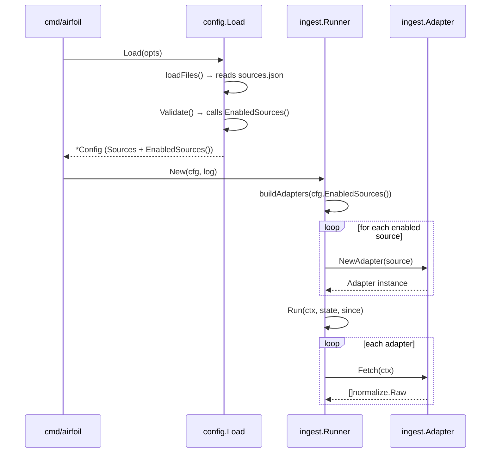

# Source Enabling & Disabling

This chapter documents how Airfoil controls which configured sources participate in ingestion. It covers the `Source.Enabled` field in `sources.json`, the `Config.EnabledSources()` filter method, validation rules that require at least one enabled source, and how the ingestion pipeline consumes only enabled sources.

## Table of Contents

- [Source Configuration Model](#source-configuration-model)
- [The `Enabled` Field](#the-enabled-field)
- [Filtering with `EnabledSources()`](#filtering-with-enabledsources)
- [Validation Rules](#validation-rules)
- [Ingestion Pipeline Integration](#ingestion-pipeline-integration)
- [sources.json Examples](#sourcesjson-examples)
- [Referenced Files](#referenced-files)

---

## Source Configuration Model

Each entry in `config/sources.json` deserializes into a `Source` struct. The struct carries all metadata the ingest adapters need, plus the `Enabled` flag that gates participation.

`agent/internal/config/files.go:27-36`

```go
type Source struct {
	Comment string        `json:"$comment,omitempty"`
	ID      string        `json:"id"`
	Name    string        `json:"name"`
	Type    string        `json:"type"`
	URL     string        `json:"url"`
	Tier    int           `json:"tier"`
	Tags    []string      `json:"tags"`
	Enabled bool          `json:"enabled"`
	Options SourceOptions `json:"options"`
}
```

**Field reference**

| Field | JSON key | Purpose |
|-------|----------|---------|
| `ID` | `id` | Unique machine identifier; must be unique across all sources |
| `Name` | `name` | Human-readable label shown in the UI |
| `Type` | `type` | One of `rss`, `hn`, `reddit`, `hf_papers`, `github` |
| `URL` | `url` | Base endpoint for the adapter (RSS feed URL, HN API root, etc.) |
| `Tier` | `tier` | Integer 1–5; feeds into scoring via `Scoring.TierWeight(tier)` |
| `Tags` | `tags` | Free-form tags for filtering/display |
| `Enabled` | `enabled` | **Gate** — when `false`, the source is excluded from ingestion |
| `Options` | `options` | Per-adapter knobs (see `SourceOptions`) |

The `$comment` field is ignored by Go but preserved for human readers of the JSON file.

---

## The `Enabled` Field

`Enabled` is a plain `bool` with no default in the struct definition. The JSON file **must** supply it explicitly for every source. There is no implicit "enabled by default" behavior — a missing key decodes to `false`.

`agent/internal/config/files.go:27-36`

```go
type Source struct {
	// ...
	Enabled bool          `json:"enabled"`
	// ...
}
```

Because the field is unexported from the JSON perspective (lowercase `enabled`), the only way to toggle a source is to edit `sources.json` directly or generate it programmatically. No CLI flag or environment variable overrides this per-source setting.

---

## Filtering with `EnabledSources()`

`Config.EnabledSources()` is the single accessor the rest of the agent uses to obtain the active source set. It returns a new slice containing only sources where `Enabled == true`.

`agent/internal/config/config.go:92-100`

```go
// EnabledSources returns only the sources marked enabled in sources.json.
func (c Config) EnabledSources() []Source {
	out := make([]Source, 0, len(c.Sources))
	for _, s := range c.Sources {
		if s.Enabled {
			out = append(out, s)
		}
	}
	return out
}
```

**Behavioral notes**

- Returns a **new slice** (capacity pre-allocated to `len(c.Sources)`), so callers can mutate the slice without affecting the original `Config.Sources`.
- Preserves the original order from `sources.json`.
- Zero-allocation when no sources are enabled (returns empty slice with capacity `len(c.Sources)`).
- Called at startup during validation and again when the ingest runner builds its adapter list.

---

## Validation Rules

`Config.Validate()` enforces two rules around enabled sources:

1. **At least one source must be enabled** — otherwise the pipeline would produce no items.
2. **All sources (enabled or not) must be well-formed** — duplicate IDs, missing names/URLs, unknown types, and out-of-range tiers are rejected regardless of `Enabled`.

`agent/internal/config/config.go:194-244`

```go
func (c *Config) Validate() error {
	var problems []string

	if len(c.EnabledSources()) == 0 {
		problems = append(problems, "no enabled sources in sources.json")
	}
	seen := map[string]bool{}
	for i, s := range c.Sources {
		where := fmt.Sprintf("sources[%d]", i)
		if s.ID == "" {
			problems = append(problems, where+": missing id")
		} else if seen[s.ID] {
			problems = append(problems, where+": duplicate id "+s.ID)
		}
		seen[s.ID] = true

		if s.Name == "" {
			problems = append(problems, where+" ("+s.ID+"): missing name")
		}
		if s.URL == "" {
			problems = append(problems, where+" ("+s.ID+"): missing url")
		}
		if !validSourceTypes[s.Type] {
			problems = append(problems, fmt.Sprintf("%s (%s): unknown type %q", where, s.ID, s.Type))
		}
		if s.Tier < 1 || s.Tier > 5 {
			problems = append(problems, fmt.Sprintf("%s (%s): tier %d out of range 1-5", where, s.ID, s.Tier))
		}
	}
	// ... scoring, keywords, embedder validation follows
}
```

**Implications**

- A disabled source with an invalid `Type` or duplicate `ID` still fails validation. This prevents "commented-out" broken entries from rotting in the file.
- The `EnabledSources()` call inside `Validate()` means the check runs **after** `loadFiles()` populates `Config.Sources`.

---

## Ingestion Pipeline Integration

The ingest runner constructs its adapter list by iterating `cfg.EnabledSources()`. Only enabled sources produce an adapter instance.



**Adapter construction** (not shown in provided files but implied by architecture):

- `ingest.New(cfg, log)` receives the full `Config`.
- It calls `cfg.EnabledSources()` to get the active set.
- For each `Source`, it instantiates the appropriate adapter (`hnAdapter`, `rssAdapter`, etc.) using `Source.Type`, `Source.URL`, and `Source.Options`.
- Disabled sources never reach adapter construction, so they incur **zero** HTTP requests, parsing, or embedding work.

---

## sources.json Examples

### Minimal enabled source

```json
{
  "sources": [
    {
      "id": "hn-front",
      "name": "Hacker News Front Page",
      "type": "hn",
      "url": "https://hacker-news.firebaseio.com/v0",
      "tier": 1,
      "tags": ["community"],
      "enabled": true,
      "options": {
        "queries": ["front"],
        "min_points": 50,
        "hours_back": 24
      }
    }
  ]
}
```

### Mixed enabled/disabled

```json
{
  "sources": [
    {
      "id": "hn-front",
      "name": "Hacker News Front Page",
      "type": "hn",
      "url": "https://hacker-news.firebaseio.com/v0",
      "tier": 1,
      "tags": ["community"],
      "enabled": true,
      "options": { "queries": ["front"], "min_points": 50, "hours_back": 24 }
    },
    {
      "id": "hn-new",
      "name": "Hacker News New",
      "type": "hn",
      "url": "https://hacker-news.firebaseio.com/v0",
      "tier": 2,
      "tags": ["community"],
      "enabled": false,
      "options": { "queries": ["new"], "min_points": 10, "hours_back": 12 }
    },
    {
      "id": "rss-theverge",
      "name": "The Verge",
      "type": "rss",
      "url": "https://www.theverge.com/rss/index.xml",
      "tier": 3,
      "tags": ["press"],
      "enabled": true,
      "options": {}
    }
  ]
}
```

In this example, only `hn-front` and `rss-theverge` participate in ingestion. `hn-new` is validated (ID unique, type known, tier in range) but skipped at runtime.

### All disabled → validation error

```json
{
  "sources": [
    {
      "id": "only-source",
      "name": "Only Source",
      "type": "rss",
      "url": "https://example.com/feed.xml",
      "tier": 1,
      "tags": [],
      "enabled": false,
      "options": {}
    }
  ]
}
```

Running the agent with this config produces:

```
config: invalid:
  - no enabled sources in sources.json
```

---

## Referenced Files

| File | Role |
|------|------|
| `agent/internal/config/config.go` | `Config` struct, `EnabledSources()`, `Load()`, `Validate()`, derived paths |
| `agent/internal/config/files.go` | `Source` struct, `SourceOptions`, `loadSources()`, valid source type constants |

<!-- kaioken:files agent/internal/config/config.go,agent/internal/config/files.go -->
