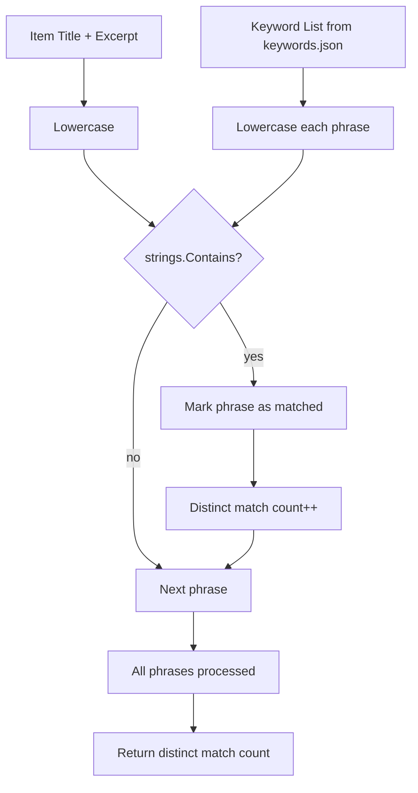

# keywords.json — Keyword Boosting Rules

This chapter documents the `Keywords` configuration structure (`config/keywords.json`), the Go `Keywords` type that loads it, the four keyword categories it defines, the case-insensitive matching semantics, and how those matches translate into scoring boosts during the ranking pipeline.

## Table of Contents

- [Keywords Struct](#keywords-struct)
- [Keyword Categories](#keyword-categories)
  - [Builder Signals](#builder-signals)
  - [Builder Structural Signals](#builder-structural-signals)
  - [Hype Signals](#hype-signals)
  - [Topic Tags](#topic-tags)
- [Matching Semantics](#matching-semantics)
- [Scoring Integration](#scoring-integration)
- [Validation & Constraints](#validation--constraints)
- [Referenced Files](#referenced-files)

---

## Keywords Struct

The `Keywords` struct is defined in `agent/internal/config/files.go` and loaded from `config/keywords.json` by `loadKeywords`.

```
`agent/internal/config/files.go:198-211`
```

```go
// Keywords is config/keywords.json. Matched case-insensitively against
// title + excerpt.
type Keywords struct {
	Comment string `json:"$comment,omitempty"`

	BuilderSignals           []string            `json:"builder_signals"`
	BuilderStructuralSignals []string            `json:"builder_structural_signals"`
	HypeSignals              []string            `json:"hype_signals"`
	TopicTags                map[string][]string `json:"topic_tags"`
}

func loadKeywords(path string) (Keywords, error) {
	k, err := store.ReadJSON[Keywords](path)
	if err != nil {
		return Keywords{}, fmt.Errorf("config: keywords: %w", err)
	}
	return k, nil
}
```

**Fields**

| Field | JSON Key | Type | Purpose |
|-------|----------|------|---------|
| `Comment` | `$comment` | `string` | Ignored; allows comments in JSON |
| `BuilderSignals` | `builder_signals` | `[]string` | Positive signals indicating a builder-oriented release / launch / tooling item |
| `BuilderStructuralSignals` | `builder_structural_signals` | `[]string` | Structural markers (repo URL present, paper URL present, source tier) |
| `HypeSignals` | `hype_signals` | `[]string` | Negative signals indicating clickbait / hype language |
| `TopicTags` | `topic_tags` | `map[string][]string` | Mapping from tag name → list of keywords that assign that tag |

The struct is instantiated once at startup via `config.Load` (see parent chapter *Configuration System*) and passed downstream to the scoring stage.

---

## Keyword Categories

### Builder Signals

`builder_signals` is a flat list of phrases that, when matched, contribute to the **builder signal** score component. Each distinct match counts once per item, and the total is capped by `scoring.json → caps.builder_signal_max`.

```
`config/keywords.json:7-28`
```

```json
"builder_signals": [
  "release", "released", "launches", "now available", "general availability",
  "open source", "open-source", "open weights", "open-weight",
  "api", "sdk", "cli", "endpoint", "self-host", "self-hosted",
  "benchmark", "benchmarks", "evals", "leaderboard",
  "deprecated", "deprecation", "breaking change", "migration guide",
  "pricing", "price cut", "cheaper", "per million tokens",
  "context window", "context length",
  "quantized", "gguf", "fine-tune", "fine-tuning", "lora",
  "inference", "throughput", "latency",
  "model card", "weights", "checkpoint",
  "docs", "documentation", "changelog"
]
```

**Characteristics**
- All lowercase in the file; matching is case-insensitive (see [Matching Semantics](#matching-semantics)).
- Phrases may contain spaces; matching is substring-based against the concatenated `title + " " + excerpt`.
- Duplicate matches of the same phrase do **not** increase the count — only distinct phrases matter.

### Builder Structural Signals

`builder_structural_signals` are not free-text phrases; they are **predicate keys** evaluated by the scoring logic against item metadata.

```
`config/keywords.json:30-35`
```

```json
"builder_structural_signals": [
  "has_repo_url",
  "has_paper_url",
  "source_tier_1",
  "source_tier_3"
]
```

| Signal | Evaluated As |
|--------|--------------|
| `has_repo_url` | `item.RepoURL != ""` (set by `normalize.ExtractRepoURL`) |
| `has_paper_url` | `item.PaperURL != ""` (set by `normalize.ExtractPaperURL`) |
| `source_tier_1` | `source.Tier == 1` |
| `source_tier_3` | `source.Tier == 3` |

Each satisfied predicate counts as one distinct builder structural signal, subject to the same `builder_signal_max` cap.

### Hype Signals

`hype_signals` are negative indicators. Each distinct match **subtracts** from the builder signal total (or applies a separate penalty weight — see [Scoring Integration](#scoring-integration)).

```
`config/keywords.json:37-52`
```

```json
"hype_signals": [
  "shocking", "shocked", "you won't believe", "you wont believe",
  "game-changer", "game changer", "changes everything",
  "will replace all", "replace all human", "end of programming",
  "the end of", "nobody is talking about", "no one is talking about",
  "insane", "mind-blowing", "mind blowing", "jaw-dropping",
  "this is huge", "terrifying", "we're doomed", "we are doomed",
  "secretly", "they don't want you to know", "hidden feature nobody"
]
```

- Matched case-insensitively against `title + excerpt`.
- Each distinct phrase matched counts once.
- The scoring stage applies a negative weight (configured in `scoring.json → weights.hype`).

### Topic Tags

`topic_tags` maps a **canonical tag name** to a list of trigger phrases. When any phrase for a tag matches, that tag is added to the item's `Tags` field (used for filtering on the site).

```
`config/keywords.json:54-64`
```

```json
"topic_tags": {
  "models": ["model", "gpt", "claude", "gemini", "llama", "mistral", "qwen", "deepseek"],
  "agents": ["agent", "agentic", "tool use", "mcp", "function calling"],
  "rag": ["rag", "retrieval", "vector", "embedding", "reranker"],
  "infra": ["inference", "serving", "vllm", "gpu", "cuda", "tpu", "datacenter"],
  "open-source": ["open source", "open-source", "open weights", "apache 2.0", "mit license"],
  "research": ["paper", "arxiv", "we propose", "state of the art", "sota"],
  "policy": ["regulation", "eu ai act", "executive order", "compliance", "export control"],
  "business": ["funding", "raises", "valuation", "acquisition", "revenue", "ipo"],
  "safety": ["alignment", "red team", "jailbreak", "interpretability", "safety"],
  "coding": ["copilot", "code", "ide", "developer tool", "programming"]
}
```

- Matching is case-insensitive substring against `title + excerpt`.
- Multiple phrases for the same tag still yield **one** tag assignment.
- Tags are additive; an item can receive multiple topic tags.

---

## Matching Semantics

All keyword matching follows these rules:

1. **Haystack**: The concatenated string `strings.ToLower(item.Title + " " + item.Excerpt)`.
2. **Needle**: Each keyword phrase from the JSON, lowercased.
3. **Match**: `strings.Contains(haystack, needle)` — simple substring, no word-boundary requirement.
4. **Distinct counting**: A `map[string]bool` (or equivalent) tracks which phrases/predicates have already matched for the current item; duplicates are ignored.
5. **Case insensitivity**: Achieved by lowercasing both sides before `Contains`.



---

## Scoring Integration

The `Keywords` struct is consumed by the scoring stage (`internal/score` — not in scope here but referenced). The integration points are:

| Keyword Category | Scoring Weight Key (from `scoring.json → weights`) | Cap |
|------------------|----------------------------------------------------|-----|
| Builder signals (text + structural) | `weights.builder` | `caps.builder_signal_max` |
| Hype signals | `weights.hype` (negative) | `caps.hype_signal_max` |
| Topic tags | No direct score; used for filtering & display | N/A |

**Pseudocode of the builder signal computation**

```go
// Simplified representation of the scoring logic
func computeBuilderSignals(item *model.Item, kw Keywords, scoring Scoring) float64 {
    haystack := strings.ToLower(item.Title + " " + item.Excerpt)
    matched := make(map[string]bool)

    // Text builder signals
    for _, phrase := range kw.BuilderSignals {
        if strings.Contains(haystack, strings.ToLower(phrase)) {
            matched[phrase] = true
        }
    }

    // Structural signals
    if item.RepoURL != "" { matched["has_repo_url"] = true }
    if item.PaperURL != "" { matched["has_paper_url"] = true }
    if item.SourceTier == 1 { matched["source_tier_1"] = true }
    if item.SourceTier == 3 { matched["source_tier_3"] = true }

    // Cap distinct matches
    count := len(matched)
    if count > scoring.Caps.BuilderSignalMax {
        count = scoring.Caps.BuilderSignalMax
    }
    return float64(count) * scoring.Weights.Builder
}
```

**Hype penalty** is computed analogously and subtracted (or added with a negative weight).

---

## Validation & Constraints

`Keywords` itself has **no validation method** in `files.go` (unlike `Scoring.problems()`). Constraints are enforced implicitly:

| Constraint | Enforced By |
|------------|-------------|
| `builder_signal_max > 0` | `Scoring.problems()` validates `caps.builder_signal_max` |
| `hype_signal_max > 0` | `Scoring.problems()` validates `caps.hype_signal_max` |
| JSON well-formedness | `store.ReadJSON` at load time |
| Distinct match counting | Scoring implementation (not configurable) |

If `keywords.json` is missing or malformed, `config.Load` returns an error and the pipeline aborts before ingest.

---

## Referenced Files

| File | Role |
|------|------|
| `agent/internal/config/files.go:198-211` | `Keywords` struct definition + `loadKeywords` |
| `config/keywords.json` | Source-of-truth keyword lists |
| `agent/internal/config/files.go:73-122` | `Scoring` struct (weights & caps referenced here) |
| `agent/internal/config/files.go:139-194` | `Scoring.problems()` (validates caps used by keyword scoring) |

---

<!-- kaioken:files agent/internal/config/files.go,config/keywords.json -->
