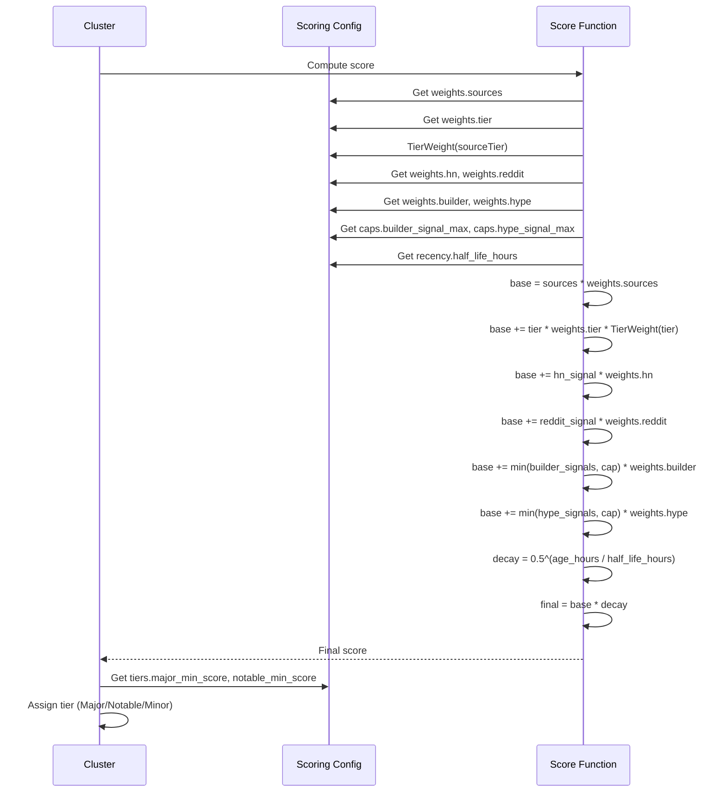

# scoring.json — Tier Weights & Multipliers

This chapter documents the `Scoring` configuration struct loaded from `config/scoring.json`. It defines every numeric knob that influences how clusters are ranked into the final `Index`: tier weights, source-type multipliers, keyword boosts, recency decay, clustering thresholds, caps, limits, and retention windows. The `TierWeight` method provides tier-based weight lookup with graceful fallback.

## Table of Contents

- [Scoring Struct Overview](#scoring-struct-overview)
- [Tier Weights & `TierWeight` Method](#tier-weights--tierweight-method)
- [Source-Type Multipliers (Weights)](#source-type-multipliers-weights)
- [Keyword Boosts](#keyword-boosts)
- [Recency Decay](#recency-decay)
- [Clustering Parameters](#clustering-parameters)
- [Caps & Limits](#caps--limits)
- [Tier Thresholds](#tier-thresholds)
- [Retention Windows](#retention-windows)
- [Validation Rules](#validation-rules)
- [Loading & Integration](#loading--integration)
- [Referenced Files](#referenced-files)

---

## Scoring Struct Overview

The `Scoring` struct is the root of `config/scoring.json`. Every field is a tunable parameter; no scoring logic is hard-coded in Go. The struct is loaded via `loadScoring` and validated via `Scoring.problems()` before the pipeline runs.

```
agent/internal/config/files.go:73-122
```

```go
// Scoring is config/scoring.json. Every knob the ranking depends on lives here
// so it can be tuned without a rebuild.
type Scoring struct {
	Comment string `json:"$comment,omitempty"`

	Clustering struct {
		SimilarityThreshold float64    `json:"similarity_threshold"`
		WindowHours         int        `json:"window_hours"`
		DebugRange          [2]float64 `json:"debug_range"`
	} `json:"clustering"`

	Weights struct {
		Sources float64 `json:"sources"`
		Tier    float64 `json:"tier"`
		HN      float64 `json:"hn"`
		Reddit  float64 `json:"reddit"`
		Builder float64 `json:"builder"`
		Hype    float64 `json:"hype"`
	} `json:"weights"`

	TierWeights map[string]float64 `json:"tier_weights"`

	Recency struct {
		HalfLifeHours float64 `json:"half_life_hours"`
	} `json:"recency"`

	Caps struct {
		BuilderSignalMax int `json:"builder_signal_max"`
		HypeSignalMax    int `json:"hype_signal_max"`
		LLMCallsPerRun   int `json:"llm_calls_per_run"`
	} `json:"caps"`

	Tiers struct {
		MajorMinScore   int `json:"major_min_score"`
		NotableMinScore int `json:"notable_min_score"`
	} `json:"tiers"`

	BuilderRelevantMinSignals int `json:"builder_relevant_min_signals"`

	Limits struct {
		ExcerptMaxChars         int `json:"excerpt_max_chars"`
		SummaryMaxWords         int `json:"summary_max_words"`
		TakeawaysMax            int `json:"takeaways_max"`
		VerbatimOverlapMaxWords int `json:"verbatim_overlap_max_words"`
		QuotesMax               int `json:"quotes_max"`
		QuoteMaxWords           int `json:"quote_max_words"`
	} `json:"limits"`

	Retention struct {
		ItemsDays          int `json:"items_days"`
		SeenURLsDays       int `json:"seen_urls_days"`
		EmbeddingCacheDays int `json:"embedding_cache_days"`
	} `json:"retention"`
}
```

### Current Values (from `config/scoring.json`)

```
config/scoring.json:1-73
```

```json
{
  "$comment": "Tune these against real data. Never guess — run `airfoil rank` and look at the top 20 before changing anything.",

  "clustering": {
    "similarity_threshold": 0.82,
    "window_hours": 48,
    "debug_range": [0.75, 0.90]
  },

  "weights": {
    "sources": 22.0,
    "tier": 25.0,
    "hn": 6.0,
    "reddit": 5.0,
    "builder": 4.0,
    "hype": 6.0
  },

  "tier_weights": {
    "1": 1.00,
    "2": 0.85,
    "3": 0.80,
    "4": 0.50,
    "5": 0.30
  },

  "recency": {
    "half_life_hours": 48
  },

  "caps": {
    "builder_signal_max": 5,
    "hype_signal_max": 5,
    "llm_calls_per_run": 15
  },

  "tiers": {
    "major_min_score": 70,
    "notable_min_score": 40
  },

  "builder_relevant_min_signals": 2,

  "limits": {
    "excerpt_max_chars": 300,
    "summary_max_words": 80,
    "takeaways_max": 3,
    "verbatim_overlap_max_words": 12,
    "quotes_max": 1,
    "quote_max_words": 15
  },

  "retention": {
    "items_days": 30,
    "seen_urls_days": 30,
    "embedding_cache_days": 7
  }
}
```

---

## Tier Weights & `TierWeight` Method

### Tier Weight Map

The `tier_weights` object maps **source tier** (as configured in `sources.json` per `Source.Tier`) to a multiplicative weight. Tiers are 1–5 in the current config, where **tier 1 = highest priority**.

| Tier | Weight | Interpretation |
|------|--------|----------------|
| 1 | 1.00 | Full weight (top-tier sources) |
| 2 | 0.85 | Slightly reduced |
| 3 | 0.80 | Moderate |
| 4 | 0.50 | Half weight |
| 5 | 0.30 | Low weight |

The map keys are **strings** (`"1"`, `"2"`, …) because JSON object keys are always strings. The Go method handles the conversion.

### `TierWeight` Method

```
agent/internal/config/files.go:126-128
```

```go
// TierWeight returns the scoring weight for a source tier, or 0 if the tier is
// not configured.
func (s Scoring) TierWeight(tier int) float64 {
	return s.TierWeights[fmt.Sprint(tier)]
}
```

**Behavior:**
- Input: `tier` as `int` (the `Source.Tier` value from `sources.json`)
- Lookup: `fmt.Sprint(tier)` converts to string key
- Returns: configured weight, or **0.0** if tier not present in map
- No panic on missing tier; callers must decide if 0 is acceptable

**Usage in scoring pipeline:** The tier weight multiplies the base `weights.tier` value (25.0) when computing a cluster's tier component. A missing tier effectively zeroes that component.

### Validation of Tier Weights

The `problems()` method enforces that tiers 1–5 all exist:

```
agent/internal/config/files.go:150-154
```

```go
for tier := 1; tier <= 5; tier++ {
	if _, ok := s.TierWeights[fmt.Sprint(tier)]; !ok {
		add("tier_weights is missing tier %d", tier)
	}
}
```

If any tier 1–5 is missing, `Config.Validate()` will fail and the pipeline aborts.

---

## Source-Type Multipliers (Weights)

The `weights` object contains additive multipliers for different signal categories. Each is a `float64` applied during score computation.

| Field | Value | Purpose |
|-------|-------|---------|
| `sources` | 22.0 | Base weight for number of unique sources covering a cluster |
| `tier` | 25.0 | Base weight for source tier (multiplied by `TierWeight(tier)`) |
| `hn` | 6.0 | Bonus for Hacker News presence (points, comments) |
| `reddit` | 5.0 | Bonus for Reddit presence (score, comments) |
| `builder` | 4.0 | Bonus for builder-signal keyword matches (capped) |
| `hype` | 6.0 | Bonus for hype-signal keyword matches (capped) |

**Formula sketch (conceptual):**

```
score = sources * weights.sources
      + tier * weights.tier * TierWeight(tier)
      + hn_signal * weights.hn
      + reddit_signal * weights.reddit
      + min(builder_signals, caps.builder_signal_max) * weights.builder
      + min(hype_signals, caps.hype_signal_max) * weights.hype
      * recency_decay_factor
```

The exact formula lives in the scoring stage (outside this config chapter), but every coefficient is defined here.

---

## Keyword Boosts

Keyword boosts are **not** in `scoring.json` — they are defined in `config/keywords.json` and loaded into the `Keywords` struct. However, the **caps** that limit their contribution live in `scoring.json`.

### Keyword Categories (from `keywords.json`)

| Category | Struct Field | Description |
|----------|--------------|-------------|
| Builder signals | `BuilderSignals` | Keywords indicating hands-on building (e.g., "open source", "release", "launch") |
| Builder structural signals | `BuilderStructuralSignals` | Stronger builder indicators (e.g., "github.com", "docker", "kubernetes") |
| Hype signals | `HypeSignals` | Keywords indicating buzz (e.g., "viral", "trending", "breakthrough") |
| Topic tags | `TopicTags` | Mapping tag → keywords for auto-tagging |

### Caps on Keyword Contributions

```
agent/internal/config/files.go:97-101
```

```go
Caps struct {
	BuilderSignalMax int `json:"builder_signal_max"`
	HypeSignalMax    int `json:"hype_signal_max"`
	LLMCallsPerRun   int `json:"llm_calls_per_run"`
} `json:"caps"`
```

| Cap | Value | Effect |
|-----|-------|--------|
| `builder_signal_max` | 5 | Maximum builder signal count that contributes to score |
| `hype_signal_max` | 5 | Maximum hype signal count that contributes to score |
| `llm_calls_per_run` | 15 | Hard limit on LLM summarization calls per pipeline run |

**Validation:**

```
agent/internal/config/files.go:162-164
```

```go
if s.Caps.LLMCallsPerRun <= 0 {
	add("caps.llm_calls_per_run must be > 0")
}
```

Only `llm_calls_per_run` is validated > 0; the signal caps could be 0 (disabling that signal entirely).

---

## Recency Decay

Recency uses **exponential decay** with a configurable half-life.

```
agent/internal/config/files.go:103-106
```

```go
Recency struct {
	HalfLifeHours float64 `json:"half_life_hours"`
} `json:"recency"`
```

| Parameter | Value | Meaning |
|-----------|-------|---------|
| `half_life_hours` | 48 | Score halves every 48 hours after publication |

**Decay factor formula:**

```
decay = 0.5 ^ (age_hours / half_life_hours)
```

- Age = `now - item.published_at`
- Applied as a multiplier to the total pre-decay score
- Items older than ~7 half-lives (336 hours / 14 days) contribute negligible recency

**Validation:**

```
agent/internal/config/files.go:147-149
```

```go
if s.Recency.HalfLifeHours <= 0 {
	add("recency.half_life_hours must be > 0")
}
```

---

## Clustering Parameters

Clustering groups items by embedding similarity before scoring. These parameters control the algorithm.

```
agent/internal/config/files.go:77-82
```

```go
Clustering struct {
	SimilarityThreshold float64    `json:"similarity_threshold"`
	WindowHours         int        `json:"window_hours"`
	DebugRange          [2]float64 `json:"debug_range"`
} `json:"clustering"`
```

| Parameter | Value | Purpose |
|-----------|-------|---------|
| `similarity_threshold` | 0.82 | Minimum cosine similarity to merge items into a cluster |
| `window_hours` | 48 | Time window: only items within this many hours are compared |
| `debug_range` | [0.75, 0.90] | Range for debug logging / tuning visibility |

**Validation:**

```
agent/internal/config/files.go:141-146
```

```go
if t := s.Clustering.SimilarityThreshold; t <= 0 || t > 1 {
	add("clustering.similarity_threshold %v must be in (0, 1]", t)
}
if s.Clustering.WindowHours <= 0 {
	add("clustering.window_hours must be > 0")
}
```

- Threshold must be in (0, 1]
- Window must be positive

---

## Caps & Limits

### Caps (already covered under Keyword Boosts)

| Cap | Value | Validation |
|-----|-------|------------|
| `builder_signal_max` | 5 | None (can be 0) |
| `hype_signal_max` | 5 | None (can be 0) |
| `llm_calls_per_run` | 15 | Must be > 0 |

### Limits (Content Constraints)

These limits are enforced during **normalization** and **summarization** (R1/R2 rules from PROMPTS.md).

```
agent/internal/config/files.go:113-121
```

```go
Limits struct {
	ExcerptMaxChars         int `json:"excerpt_max_chars"`
	SummaryMaxWords         int `json:"summary_max_words"`
	TakeawaysMax            int `json:"takeaways_max"`
	VerbatimOverlapMaxWords int `json:"verbatim_overlap_max_words"`
	QuotesMax               int `json:"quotes_max"`
	QuoteMaxWords           int `json:"quote_max_words"`
} `json:"limits"`
```

| Limit | Value | Enforcement Point |
|-------|-------|-------------------|
| `excerpt_max_chars` | 300 | `normalize.Excerpt` (R1) |
| `summary_max_words` | 80 | LLM prompt constraint (R1) |
| `takeaways_max` | 3 | LLM prompt constraint (R1) |
| `verbatim_overlap_max_words` | 12 | Post-generation validation (R1) |
| `quotes_max` | 1 | LLM prompt constraint (R2) |
| `quote_max_words` | 15 | LLM prompt constraint (R2) |

**Validation (all must be > 0):**

```
agent/internal/config/files.go:166-178
```

```go
if s.Limits.ExcerptMaxChars <= 0 {
	add("limits.excerpt_max_chars must be > 0 (R1)")
}
if s.Limits.SummaryMaxWords <= 0 {
	add("limits.summary_max_words must be > 0 (R1)")
}
if s.Limits.VerbatimOverlapMaxWords <= 0 {
	add("limits.verbatim_overlap_max_words must be > 0 (R1)")
}
if s.Limits.QuoteMaxWords <= 0 {
	add("limits.quote_max_words must be > 0 (R2)")
}
```

Note: `takeaways_max` and `quotes_max` are **not** validated > 0 in `problems()` — they could be 0 to disable those features.

---

## Tier Thresholds

After scoring, clusters are assigned a **tier** based on score thresholds:

```
agent/internal/config/files.go:108-111
```

```go
Tiers struct {
	MajorMinScore   int `json:"major_min_score"`
	NotableMinScore int `json:"notable_min_score"`
} `json:"tiers"`
```

| Threshold | Value | Tier Assignment |
|-----------|-------|-----------------|
| `major_min_score` | 70 | Score ≥ 70 → `TierMajor` (0) |
| `notable_min_score` | 40 | Score ≥ 40 → `TierNotable` (1) |
| (below notable) | — | Score < 40 → `TierMinor` (2) |

**Validation:**

```
agent/internal/config/files.go:156-160
```

```go
if s.Tiers.MajorMinScore <= s.Tiers.NotableMinScore {
	add("tiers.major_min_score (%d) must exceed tiers.notable_min_score (%d)",
		s.Tiers.MajorMinScore, s.Tiers.NotableMinScore)
}
```

Major threshold must be strictly greater than Notable threshold.

### Tier Constants (from `internal/model`)

```go
const (
	TierMajor   = 0
	TierNotable = 1
	TierMinor   = 2
)
```

These are **not** the same as `Source.Tier` (1–5). Source tier → weight via `TierWeight`; cluster tier → display/sorting via thresholds.

---

## Retention Windows

Retention controls how long generated data is kept before cleanup.

```
agent/internal/config/files.go:123-128
```

```go
Retention struct {
	ItemsDays          int `json:"items_days"`
	SeenURLsDays       int `json:"seen_urls_days"`
	EmbeddingCacheDays int `json:"embedding_cache_days"`
} `json:"retention"`
```

| Parameter | Value | Scope |
|-----------|-------|-------|
| `items_days` | 30 | `data/items/*.json` files older than this are deleted |
| `seen_urls_days` | 30 | `State.Seen` entries older than this are purged |
| `embedding_cache_days` | 7 | `data/cache/` embeddings older than this are deleted |

**Validation (all must be > 0):**

```
agent/internal/config/files.go:180-187
```

```go
for name, days := range map[string]int{
	"retention.items_days":           s.Retention.ItemsDays,
	"retention.seen_urls_days":       s.Retention.SeenURLsDays,
	"retention.embedding_cache_days": s.Retention.EmbeddingCacheDays,
} {
	if days <= 0 {
		add("%s must be > 0", name)
	}
}
```

---

## Validation Rules Summary

The `Scoring.problems()` method returns a slice of error strings. If non-empty, `Config.Validate()` fails and the pipeline aborts.

| Check | Condition | Error Message |
|-------|-----------|---------------|
| Clustering threshold | `threshold <= 0 || threshold > 1` | `clustering.similarity_threshold %v must be in (0, 1]` |
| Clustering window | `window_hours <= 0` | `clustering.window_hours must be > 0` |
| Recency half-life | `half_life_hours <= 0` | `recency.half_life_hours must be > 0` |
| Tier weights | Any tier 1–5 missing | `tier_weights is missing tier %d` |
| Tier thresholds | `major_min_score <= notable_min_score` | `tiers.major_min_score must exceed tiers.notable_min_score` |
| LLM calls cap | `llm_calls_per_run <= 0` | `caps.llm_calls_per_run must be > 0` |
| Excerpt max chars | `excerpt_max_chars <= 0` | `limits.excerpt_max_chars must be > 0 (R1)` |
| Summary max words | `summary_max_words <= 0` | `limits.summary_max_words must be > 0 (R1)` |
| Verbatim overlap | `verbatim_overlap_max_words <= 0` | `limits.verbatim_overlap_max_words must be > 0 (R1)` |
| Quote max words | `quote_max_words <= 0` | `limits.quote_max_words must be > 0 (R2)` |
| Retention days | Any retention ≤ 0 | `%s must be > 0` |

---

## Loading & Integration

### Load Function

```
agent/internal/config/files.go:130-136
```

```go
func loadScoring(path string) (Scoring, error) {
	s, err := store.ReadJSON[Scoring](path)
	if err != nil {
		return Scoring{}, fmt.Errorf("config: scoring: %w", err)
	}
	return s, nil
}
```

- Uses `store.ReadJSON` (atomic read with fallback)
- Path is derived in `config.Load` as `filepath.Join(cfgDir, "scoring.json")`
- Returns zero `Scoring` on error (caller checks error)

### Integration into Config

In `config.Load` (see parent chapter "Configuration System"), the scoring config is loaded and stored in `Config.Scoring`. The `Config.Validate()` method calls `cfg.Scoring.problems()` and aggregates any errors.

### Usage in Pipeline

| Stage | Config Fields Used |
|-------|-------------------|
| Clustering | `Clustering.*` |
| Scoring | `Weights.*`, `TierWeights`, `Recency.HalfLifeHours`, `Caps.*`, `BuilderRelevantMinSignals` |
| Tier assignment | `Tiers.*` |
| Normalization | `Limits.ExcerptMaxChars` |
| Summarization | `Limits.SummaryMaxWords`, `Limits.TakeawaysMax`, `Limits.VerbatimOverlapMaxWords`, `Limits.QuotesMax`, `Limits.QuoteMaxWords` |
| Cleanup/Retention | `Retention.*` |

---

## Referenced Files

| File | Role |
|------|------|
| `agent/internal/config/files.go` | `Scoring` struct, `TierWeight` method, `loadScoring`, `problems` validation |
| `config/scoring.json` | Authoritative configuration values |
| `config/keywords.json` | Keyword boost definitions (referenced via `Keywords` struct) |
| `agent/internal/config/config.go` | `Config.Load` integration, `Config.Validate` calls `Scoring.problems()` |
| `agent/internal/model/types.go` | Tier constants (`TierMajor`, `TierNotable`, `TierMinor`) |

---

## Mermaid: Scoring Configuration Dependency Graph

```mermaid
graph TD
    SC[config/scoring.json] -->|loadScoring| S[Scoring struct]
    S -->|TierWeight| TW[Tier Weight Lookup]
    S -->|Weights| SW[Source-Type Multipliers]
    S -->|Recency| RD[Recency Decay]
    S -->|Clustering| CP[Clustering Params]
    S -->|Caps| KC[Keyword Caps]
    S -->|Tiers| TT[Tier Thresholds]
    S -->|Limits| CL[Content Limits]
    S -->|Retention| RW[Retention Windows]
    
    KW[config/keywords.json] -->|loadKeywords| KS[Keywords struct]
    KS -->|BuilderSignals| KC
    KS -->|HypeSignals| KC
    KS -->|BuilderStructuralSignals| KC
    
    SRC[config/sources.json] -->|loadSources| Src[Source[]]
    Src -->|Source.Tier| TW
    
    S -->|problems| V[Validation Errors]
    V -->|Config.Validate| Pipeline[Pipeline Gate]
    
    TW --> Score[Scoring Stage]
    SW --> Score
    RD --> Score
    KC --> Score
    TT --> TierAssign[Tier Assignment]
    CL --> Normalize[Normalization]
    CL --> Summarize[Summarization]
    RW --> Cleanup[Retention Cleanup]
```

---

## Mermaid: Score Computation Flow (Conceptual)



<!-- kaioken:files agent/internal/config/files.go,config/scoring.json -->
