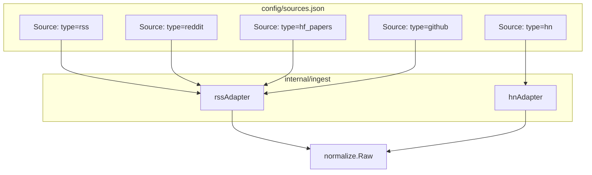

# sources.json — Source Definitions

This chapter documents the source configuration system: the `Source` struct, the five supported source types (RSS, Hacker News, Reddit, Hugging Face Papers, GitHub), the per-type `SourceOptions` union, and the `loadSources` function that reads `config/sources.json` into memory. It is a child of the **Configuration System** section.

## Table of Contents

- [Source Struct](#source-struct)
- [Source Types](#source-types)
- [SourceOptions per Type](#sourceoptions-per-type)
- [loadSources Function](#loadsources-function)
- [Validation Rules](#validation-rules)
- [Example Configuration](#example-configuration)
- [Referenced Files](#referenced-files)

---

## Source Struct

The `Source` struct represents one entry in `config/sources.json`. It is defined in `agent/internal/config/files.go` and maps directly to the JSON structure.

`agent/internal/config/files.go:27-36`

```go
type Source struct {
	Comment string        `json:"$comment,omitempty"`
	ID      string        `json:"id"`
	Name    string        `json:"name"`
	Type    string        `json:"type"`
	URL     string        `json:"url"`
	Tier    int           `json:"tier"`
	Tags    []string      `json:"tags"`
	Enabled bool          `json:"enabled"`
	Options SourceOptions `json:"options"`
}
```

| Field | JSON Key | Required | Description |
|-------|----------|----------|-------------|
| `Comment` | `$comment` | No | Documentation-only field, ignored at runtime |
| `ID` | `id` | Yes | Unique machine identifier (e.g., `openai`, `hn`, `reddit-localllama`) |
| `Name` | `name` | Yes | Human-readable display name |
| `Type` | `type` | Yes | One of the five valid source types (see below) |
| `URL` | `url` | Yes | Endpoint URL — meaning varies by type |
| `Tier` | `tier` | Yes | Importance tier 1–5 (1 = official lab, 5 = community) |
| `Tags` | `tags` | No | Arbitrary tags for filtering (e.g., `["labs"]`, `["community", "open-source"]`) |
| `Enabled` | `enabled` | Yes | Whether this source is active |
| `Options` | `options` | No | Type-specific configuration (see [SourceOptions per Type](#sourceoptions-per-type)) |

---

## Source Types

The system recognizes exactly five source types, declared as constants and validated against a map.

`agent/internal/config/files.go:11-24`

```go
const (
	SourceRSS      = "rss"
	SourceHN       = "hn"
	SourceReddit   = "reddit"
	SourceHFPapers = "hf_papers"
	SourceGitHub   = "github"
)

var validSourceTypes = map[string]bool{
	SourceRSS:      true,
	SourceHN:       true,
	SourceReddit:   true,
	SourceHFPapers: true,
	SourceGitHub:   true,
}
```

### Type Semantics

| Type | Adapter | Description | URL Field Meaning |
|------|---------|-------------|-------------------|
| `rss` | `rssAdapter` | Generic RSS/Atom feed | Feed URL (e.g., `https://openai.com/news/rss.xml`) |
| `hn` | `hnAdapter` | Hacker News via Algolia API | Algolia search endpoint (`https://hn.algolia.com/api/v1/search_by_date`) |
| `reddit` | `rssAdapter` | Reddit via RSS (`.json` feed) | Subreddit hot/new RSS endpoint (e.g., `https://www.reddit.com/r/LocalLLaMA/hot.json`) |
| `hf_papers` | `rssAdapter` | Hugging Face Daily Papers API | HF Daily Papers API endpoint (`https://huggingface.co/api/daily_papers`) |
| `github` | `rssAdapter` | GitHub Search API | GitHub Search API endpoint (`https://api.github.com/search/repositories`) |

> **Note**: Reddit, HFPapers, and GitHub all use the `rssAdapter` internally because they expose JSON feeds compatible with the RSS parsing logic. Only HN has a dedicated adapter (`hnAdapter`) due to its unique pagination and query structure.

---

## SourceOptions per Type

`SourceOptions` is a **union struct** — each adapter reads only the fields relevant to its type; unused fields stay at their zero values.

`agent/internal/config/files.go:40-57`

```go
type SourceOptions struct {
	// hn
	Queries   []string `json:"queries"`
	MinPoints int      `json:"min_points"`
	HoursBack int      `json:"hours_back"`

	// reddit
	Limit    int `json:"limit"`
	MinScore int `json:"min_score"`

	// hf_papers
	MinUpvotes int `json:"min_upvotes"`

	// github
	CreatedWithinDays int `json:"created_within_days"`
	MinStars          int `json:"min_stars"`
	MaxPerQuery       int `json:"max_per_query"`
}
```

### Per-Type Field Mapping

| Source Type | Fields Used | Fields Ignored |
|-------------|-------------|----------------|
| `hn` | `Queries`, `MinPoints`, `HoursBack` | `Limit`, `MinScore`, `MinUpvotes`, `CreatedWithinDays`, `MinStars`, `MaxPerQuery` |
| `reddit` | `Limit`, `MinScore` | `Queries`, `MinPoints`, `HoursBack`, `MinUpvotes`, `CreatedWithinDays`, `MinStars`, `MaxPerQuery` |
| `hf_papers` | `MinUpvotes` | All others |
| `github` | `Queries`, `CreatedWithinDays`, `MinStars`, `MaxPerQuery` | `MinPoints`, `HoursBack`, `Limit`, `MinScore`, `MinUpvotes` |
| `rss` | *(none)* | All fields ignored |

### Field Descriptions

#### HN Options (`type: "hn"`)

| Field | Type | Default | Description |
|-------|------|---------|-------------|
| `Queries` | `[]string` | Required | Search terms passed to Algolia API (e.g., `["AI", "LLM", "GPT"]`) |
| `MinPoints` | `int` | Required | Minimum HN points for inclusion |
| `HoursBack` | `int` | Required | How far back to search (hours) |

#### Reddit Options (`type: "reddit"`)

| Field | Type | Default | Description |
|-------|------|---------|-------------|
| `Limit` | `int` | Required | Maximum posts to fetch per request |
| `MinScore` | `int` | Required | Minimum Reddit score (upvotes - downvotes) |

#### HFPapers Options (`type: "hf_papers"`)

| Field | Type | Default | Description |
|-------|------|---------|-------------|
| `MinUpvotes` | `int` | Required | Minimum upvotes on HF Daily Papers |

#### GitHub Options (`type: "github"`)

| Field | Type | Default | Description |
|-------|------|---------|-------------|
| `Queries` | `[]string` | Required | Search queries for GitHub Search API (e.g., `["llm", "ai-agent"]`) |
| `CreatedWithinDays` | `int` | Required | Only repos created within this many days |
| `MinStars` | `int` | Required | Minimum star count |
| `MaxPerQuery` | `int` | Required | Maximum results per query |

#### RSS Options (`type: "rss"`)

No options are used. The `options` object may be omitted or empty.

---

## loadSources Function

Reads and parses `config/sources.json` into a slice of `Source` structs.

`agent/internal/config/files.go:59-69`

```go
type sourcesFile struct {
	Comment string   `json:"$comment,omitempty"`
	Sources []Source `json:"sources"`
}

func loadSources(path string) ([]Source, error) {
	f, err := store.ReadJSON[sourcesFile](path)
	if err != nil {
		return nil, fmt.Errorf("config: sources: %w", err)
	}
	return f.Sources, nil
}
```

### Behavior

1. Uses `store.ReadJSON` (atomic read with fallback) to deserialize the file into a `sourcesFile` wrapper.
2. Returns the `Sources` slice directly.
3. Wraps any error with `"config: sources:"` prefix for context.

### Call Site

`loadSources` is called from `config.Load` (in `agent/internal/config/config.go`, not shown in this scope) after resolving the config directory path. The returned slice is stored in `Config.Sources` and later filtered by `Enabled` during ingestion.

---

## Validation Rules

Validation occurs at two levels:

### 1. Structural (JSON → Go)

- `store.ReadJSON` enforces that required fields (`id`, `name`, `type`, `url`, `tier`, `enabled`) are present and correctly typed.
- Missing fields → zero values; type mismatches → parse error.

### 2. Semantic (in `Config.Validate`, not shown here but part of the config package)

| Rule | Enforcement |
|------|-------------|
| `Type` must be one of the five constants | Checked against `validSourceTypes` map |
| `Tier` must be 1–5 | Validated in `Config.Validate` |
| `ID` must be unique across all sources | Validated in `Config.Validate` |
| `URL` must be non-empty | Validated in `Config.Validate` |
| `Enabled` sources must have valid options for their type | Adapter validates at fetch time |

> The `SourceOptions` union means invalid/extra fields are silently ignored. Only the adapter for a given type validates its own fields at runtime (e.g., HN adapter requires `Queries`, `MinPoints`, `HoursBack`).

---

## Example Configuration

The canonical `config/sources.json` (abridged for clarity):

`config/sources.json:1-100`

```json
{
  "$comment": "Tier 1 = official lab. 2 = research. 3 = dev/tools. 4 = press. 5 = community. Verify every feed URL with `airfoil doctor` before trusting it — feed paths change.",
  "sources": [
    {
      "$comment": "Anthropic publishes no RSS feed — every documented path 404s. Their releases still reach us through HN and the press tier. Re-enable if a feed appears.",
      "id": "anthropic",
      "name": "Anthropic",
      "type": "rss",
      "url": "https://www.anthropic.com/rss.xml",
      "tier": 1,
      "tags": ["labs"],
      "enabled": false
    },
    {
      "id": "openai",
      "name": "OpenAI",
      "type": "rss",
      "url": "https://openai.com/news/rss.xml",
      "tier": 1,
      "tags": ["labs"],
      "enabled": true
    },
    {
      "id": "hf-papers",
      "name": "HF Daily Papers",
      "type": "hf_papers",
      "url": "https://huggingface.co/api/daily_papers",
      "tier": 2,
      "tags": ["research"],
      "enabled": true,
      "options": { "min_upvotes": 5 }
    },
    {
      "id": "github-trending-ai",
      "name": "GitHub Trending",
      "type": "github",
      "url": "https://api.github.com/search/repositories",
      "tier": 3,
      "tags": ["tools", "repos"],
      "enabled": true,
      "options": {
        "queries": ["llm", "ai-agent", "rag", "inference", "fine-tuning"],
        "created_within_days": 7,
        "min_stars": 100,
        "max_per_query": 5
      }
    },
    {
      "id": "hn",
      "name": "Hacker News",
      "type": "hn",
      "url": "https://hn.algolia.com/api/v1/search_by_date",
      "tier": 5,
      "tags": ["community"],
      "enabled": true,
      "options": {
        "queries": ["AI", "LLM", "GPT", "Claude", "Gemini", "open weights", "inference"],
        "min_points": 50,
        "hours_back": 48
      }
    },
    {
      "id": "reddit-localllama",
      "name": "r/LocalLLaMA",
      "type": "reddit",
      "url": "https://www.reddit.com/r/LocalLLaMA/hot.json",
      "tier": 5,
      "tags": ["community", "open-source"],
      "enabled": true,
      "options": { "limit": 50, "min_score": 100 }
    }
  ]
}
```

---

## Mermaid: Source → Adapter Mapping



---

## Referenced Files

| File | Symbols / Sections |
|------|-------------------|
| `agent/internal/config/files.go` | `SourceRSS`, `SourceHN`, `SourceReddit`, `SourceHFPapers`, `SourceGitHub`, `validSourceTypes`, `Source`, `SourceOptions`, `sourcesFile`, `loadSources` |
| `config/sources.json` | Complete source catalog with all 18 configured sources |

<!-- kaioken:files agent/internal/config/files.go,config/sources.json -->
