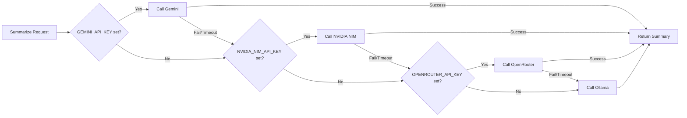

# Clone Repository & Configure Environment Variables

This chapter covers the initial setup steps to get the Airfoil repository running locally: cloning the codebase, creating a local environment file from the provided template, and configuring the API keys and paths required for the Go agent pipeline and the React site.

## Table of Contents

- [Prerequisites](#prerequisites)
- [Clone the Repository](#clone-the-repository)
- [Environment File Overview](#environment-file-overview)
- [Required vs Optional Variables](#required-vs-optional-variables)
- [LLM Provider Keys](#llm-provider-keys)
- [Embedding Configuration](#embedding-configuration)
- [Ingestion Tokens](#ingestion-tokens)
- [Site & Behaviour Settings](#site--behaviour-settings)
- [Directory Layout After Setup](#directory-layout-after-setup)
- [Verification](#verification)
- [Referenced Files](#referenced-files)

---

## Prerequisites

Before cloning, ensure the following tools are installed:

| Tool | Minimum Version | Purpose |
|------|----------------|---------|
| `git` | 2.30+ | Source control |
| `go` | 1.22+ | Build the Go agent (`cmd/airfoil`) |
| `node` | 20+ | Run the React + Vite site (`site/`) |
| `npm` | 10+ | Install site dependencies |
| `ollama` | 0.1+ | Local embedding model (default embedder) |

> **Note:** The Go agent uses `ollama` as the default embedder (`AIRFOIL_EMBEDDER=ollama`). If you prefer not to run Ollama locally, you can switch to the Gemini embedder for CI environments by setting `AIRFOIL_EMBEDDER=gemini` and providing a `GEMINI_API_KEY`.

---

## Clone the Repository

```bash
git clone https://github.com/papitsho/airfoil.git
cd airfoil
```

The repository contains two primary workspaces:

```
airfoil/
├── cmd/airfoil/          # Go agent CLI (Cobra)
├── internal/             # Go agent internal packages
├── config/               # JSON configuration files (sources.json, scoring.json, keywords.json)
├── data/                 # Generated data (items/, index.json, state.json, stories.json, cache/)
├── site/                 # React + Vite static site
│   ├── src/
│   ├── package.json
│   └── vite.config.ts
├── .env.example          # Template for environment variables
└── go.mod / go.sum       # Go module definition
```

---

## Environment File Overview

The repository provides a template file at `.env.example`. Copy it to `.env` (which is gitignored) and fill in the values.

```bash
cp .env.example .env
```

The template contains every environment variable the agent and site recognize, grouped by concern:

```
.env.example:1-35
```

```text
# Copy to .env and fill. Never commit .env.
 
# --- LLM providers (chain order: gemini -> nvidia_nim -> openrouter -> ollama) ---
GEMINI_API_KEY=
NVIDIA_NIM_API_KEY=
OPENROUTER_API_KEY=
 
# Model IDs are config-driven because free models rotate out.
GEMINI_MODEL=gemini-2.0-flash
NVIDIA_NIM_MODEL=meta/llama-3.3-70b-instruct
OPENROUTER_MODEL=meta-llama/llama-3.3-70b-instruct:free
 
# --- Embeddings ---
# ollama (local, default) | gemini (CI)
AIRFOIL_EMBEDDER=ollama
OLLAMA_HOST=http://localhost:11434
OLLAMA_EMBED_MODEL=nomic-embed-text
GEMINI_EMBED_MODEL=text-embedding-004
 
# --- GitHub ingest (optional, raises rate limit from 60/hr to 5000/hr) ---
GITHUB_TOKEN=
 
# --- Reddit requires a descriptive User-Agent or it returns 429 ---
REDDIT_USER_AGENT=airfoil/0.1 (by /u/YOUR_USERNAME)
 
# --- Site ---
SITE_URL=https://airfoil.example.com
 
# --- Behaviour ---
AIRFOIL_DATA_DIR=./data
AIRFOIL_CONFIG_DIR=./config
AIRFOIL_LOG_LEVEL=info
```

---

## Required vs Optional Variables

| Variable | Required? | Default | Description |
|----------|-----------|---------|-------------|
| `GEMINI_API_KEY` | **Yes** (for LLM summarization) | — | Primary LLM provider in the fallback chain |
| `NVIDIA_NIM_API_KEY` | No | — | Second fallback provider |
| `OPENROUTER_API_KEY` | No | — | Third fallback provider |
| `GEMINI_MODEL` | No | `gemini-2.0-flash` | Model ID for Gemini summarization |
| `NVIDIA_NIM_MODEL` | No | `meta/llama-3.3-70b-instruct` | Model ID for NVIDIA NIM |
| `OPENROUTER_MODEL` | No | `meta-llama/llama-3.3-70b-instruct:free` | Model ID for OpenRouter |
| `AIRFOIL_EMBEDDER` | No | `ollama` | Embedder backend: `ollama` or `gemini` |
| `OLLAMA_HOST` | No | `http://localhost:11434` | Ollama server endpoint |
| `OLLAMA_EMBED_MODEL` | No | `nomic-embed-text` | Ollama embedding model name |
| `GEMINI_EMBED_MODEL` | No | `text-embedding-004` | Gemini embedding model (used when `AIRFOIL_EMBEDDER=gemini`) |
| `GITHUB_TOKEN` | No | — | GitHub PAT for higher rate limits (60→5000/hr) |
| `REDDIT_USER_AGENT` | **Yes** (if Reddit source enabled) | — | Descriptive UA string; Reddit returns 429 without it |
| `SITE_URL` | No | `https://airfoil.example.com` | Canonical site URL for generated links |
| `AIRFOIL_DATA_DIR` | No | `./data` | Root for generated data (`items/`, `cache/`, `index.json`, `state.json`, `stories.json`) |
| `AIRFOIL_CONFIG_DIR` | No | `./config` | Directory containing `sources.json`, `scoring.json`, `keywords.json` |
| `AIRFOIL_LOG_LEVEL` | No | `info` | Log level: `debug`, `info`, `warn`, `error` |

> **Critical:** At least one LLM provider key (`GEMINI_API_KEY`, `NVIDIA_NIM_API_KEY`, or `OPENROUTER_API_KEY`) must be set for the summarization stage to succeed. The agent will fall back through the chain in order: **Gemini → NVIDIA NIM → OpenRouter → Ollama**.

---

## LLM Provider Keys

The summarization pipeline uses a **fallback chain** defined in the architecture:

1. **Gemini** (`GEMINI_API_KEY`) — Primary, lowest latency
2. **NVIDIA NIM** (`NVIDIA_NIM_API_KEY`) — Second
3. **OpenRouter** (`OPENROUTER_API_KEY`) — Third
4. **Ollama** (local, no key required) — Final fallback

Each provider has a configurable model ID. The template includes sensible defaults for free-tier models, but these rotate frequently. Update the `*_MODEL` variables when models are deprecated.



---

## Embedding Configuration

Embeddings are used during the **clustering stage** to group similar items. Two backends are supported:

| Backend | Env Var | When to Use |
|---------|---------|-------------|
| **Ollama** (local) | `AIRFOIL_EMBEDDER=ollama` | Default for local development. Requires `ollama serve` running and `ollama pull nomic-embed-text` (or your chosen model). |
| **Gemini** (cloud) | `AIRFOIL_EMBEDDER=gemini` | CI environments or when Ollama is unavailable. Requires `GEMINI_API_KEY`. |

The embedding cache lives at `data/cache/` (never committed). On first run, the agent will download the Ollama model if not present.

```bash
# Start Ollama and pull the default embedding model
ollama serve &
ollama pull nomic-embed-text
```

---

## Ingestion Tokens

### GitHub Token (`GITHUB_TOKEN`)

Optional but **strongly recommended**. Without it, the GitHub API allows only **60 requests/hour** (unauthenticated). With a Personal Access Token (classic or fine-grained), the limit rises to **5,000/hour**.

Create a token at <https://github.com/settings/tokens> with `public_repo` scope (for public repos) or `repo` scope (for private).

### Reddit User-Agent (`REDDIT_USER_AGENT`)

**Required** if the Reddit source is enabled in `config/sources.json`. Reddit returns **429 Too Many Requests** for generic or missing User-Agent strings.

Format: `airfoil/0.1 (by /u/YOUR_USERNAME)` — replace `YOUR_USERNAME` with your actual Reddit username.

---

## Site & Behaviour Settings

| Variable | Purpose |
|----------|---------|
| `SITE_URL` | Canonical URL used in generated story frontmatter and RSS/JSON feeds. Set to your production domain (e.g., `https://airfoil.example.com`). For local dev, the default is fine. |
| `AIRFOIL_DATA_DIR` | Root directory for all generated data. The agent derives sub-paths: `ItemsDir`, `CacheDir`, `IndexPath`, `StatePath`, `StoriesPath`, `EmbedCachePath`. |
| `AIRFOIL_CONFIG_DIR` | Directory containing the three JSON config files loaded at startup: `sources.json`, `scoring.json`, `keywords.json`. |
| `AIRFOIL_LOG_LEVEL` | Controls `slog` output verbosity. Use `debug` for troubleshooting pipeline stages. |

---

## Directory Layout After Setup

After cloning, copying `.env.example` to `.env`, and filling in keys, your workspace should resemble:

```
airfoil/
├── .env                    # ← your local config (gitignored)
├── .env.example            # ← template (committed)
├── config/
│   ├── sources.json        # Source definitions (RSS, HN, Reddit, HFPapers, GitHub)
│   ├── scoring.json        # Tier weights, recency decay, source multipliers
│   └── keywords.json       # Keyword boosts for scoring
├── data/                   # Created on first agent run
│   ├── items/              # Per-source JSON files (Raw → Item)
│   ├── cache/              # Embedding vectors (never committed)
│   ├── index.json          # Ranked IndexEntry[] for site
│   ├── state.json          # Dedup tracker (Seen/MarkSeen)
│   └── stories.json        # Serialized Story[] for site
├── site/
│   └── src/content/stories/ # Markdown stories (committed)
├── cmd/airfoil/
└── internal/
```

> **Important:** `data/cache/` is **never committed** (embeddings are regenerable and large). The `.gitignore` already excludes it.

---

## Verification

Once `.env` is populated, verify the configuration loads correctly:

```bash
# Build the agent
go build -o ./airfoil ./cmd/airfoil

# Run the doctor command (validates config, checks embedder connectivity, verifies API keys)
./airfoil doctor
```

Expected `doctor` output (abridged):

```
config: loaded from ./config
embedder: ollama @ http://localhost:11434 (model: nomic-embed-text) ✓
llm chain: gemini → nvidia_nim → openrouter → ollama
  gemini: configured ✓
  nvidia_nim: not configured (optional)
  openrouter: not configured (optional)
  ollama: available ✓
github: token configured ✓
reddit: user-agent configured ✓
data dir: ./data ✓
config dir: ./config ✓
```

If any required key is missing, `doctor` will report it with a clear error message.

---

## Referenced Files

| File | Description |
|------|-------------|
| `.env.example` | Template environment file with all supported variables and defaults |
| `config/sources.json` | Source definitions (loaded via `AIRFOIL_CONFIG_DIR`) |
| `config/scoring.json` | Scoring weights and tier configuration |
| `config/keywords.json` | Keyword boost definitions |
| `cmd/airfoil/main.go` | CLI entry point; invokes `doctor` and `run` |
| `internal/config/config.go` | `Config.Load()` — reads env vars and JSON configs, derives paths, validates |
| `internal/ingest/runner.go` | `Runner.Run()` — orchestration point that uses configured sources |
| `internal/model/state.go` | `State.Seen()` / `MarkSeen()` — dedup logic backed by `data/state.json` |

<!-- kaioken:files .env.example -->
