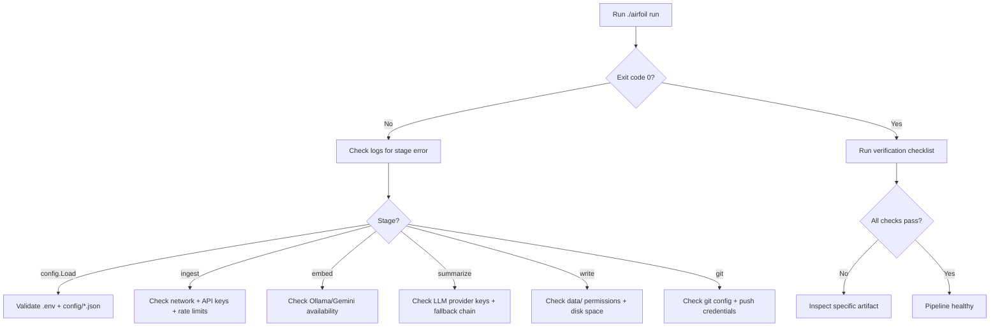

# Common Setup Issues & Verification

This chapter catalogs the most frequent setup problems when running the Airfoil pipeline locally and provides verification steps to confirm the agent produced valid output. It assumes you have followed the environment setup in the parent **Getting Started** guide.

## Table of Contents

- [Missing or Invalid API Keys](#missing-or-invalid-api-keys)
- [Port Conflicts](#port-conflicts)
- [Cache Directory Permissions](#cache-directory-permissions)
- [Embedder Unavailable](#embedder-unavailable)
- [Git Configuration Issues](#git-configuration-issues)
- [Verification Checklist](#verification-checklist)
- [Troubleshooting Flow](#troubleshooting-flow)
- [Referenced Files](#referenced-files)

---

## Missing or Invalid API Keys

The pipeline requires at least one LLM provider key for summarization and (optionally) an embedder key for CI. The fallback chain is **Gemini → NVIDIA NIM → OpenRouter → Ollama**. If all LLM providers fail, story generation aborts.

### Required Keys by Provider

| Provider | Environment Variable | Purpose | Fallback Order |
|----------|---------------------|---------|----------------|
| Gemini | `GEMINI_API_KEY` | Summarization + embeddings (CI) | 1st |
| NVIDIA NIM | `NVIDIA_NIM_API_KEY` | Summarization | 2nd |
| OpenRouter | `OPENROUTER_API_KEY` | Summarization | 3rd |
| Ollama | — (local) | Summarization + embeddings (local default) | 4th |
| GitHub | `GITHUB_TOKEN` | Raises ingest rate limit 60→5000/hr | Optional |
| Reddit | `REDDIT_USER_AGENT` | Required descriptive UA or 429 | Required for Reddit source |

### Configuration Source

Copy `.env.example` to `.env` (gitignored) and fill values:

`.env.example:1-25`

```text
# Copy to .env and fill. Never commit .env.
 
# --- LLM providers (chain order: gemini -> nvidia_nim -> openrouter -> ollama) ---
GEMINI_API_KEY=
NVIDIA_NIM_API_KEY=
OPENROUTER_API_KEY=
 
# Model IDs are config-driven because free models rotate out.
GEMINI_MODEL=gemini-2.0-flash
NVIDIA_NIM_MODEL=meta/llama-3.3-70b-instruct
OPENROUTER_MODEL=meta-llama/llama-3.3-70b-instruct:free
 
# --- Embeddings ---
# ollama (local, default) | gemini (CI)
AIRFOIL_EMBEDDER=ollama
OLLAMA_HOST=http://localhost:11434
OLLAMA_EMBED_MODEL=nomic-embed-text
GEMINI_EMBED_MODEL=text-embedding-004
 
# --- GitHub ingest (optional, raises rate limit from 60/hr to 5000/hr) ---
GITHUB_TOKEN=
 
# --- Reddit requires a descriptive User-Agent or it returns 429 ---
REDDIT_USER_AGENT=airfoil/0.1 (by /u/YOUR_USERNAME)
 
# --- Site ---
SITE_URL=https://airfoil.example.com
 
# --- Behaviour ---
AIRFOIL_DATA_DIR=./data
AIRFOIL_CONFIG_DIR=./config
AIRFOIL_LOG_LEVEL=info
```

### Common Failure Modes

| Symptom | Likely Cause | Fix |
|---------|--------------|-----|
| `summarize: all providers exhausted` | No valid LLM API key set | Set at least one of `GEMINI_API_KEY`, `NVIDIA_NIM_API_KEY`, `OPENROUTER_API_KEY`, or run Ollama locally |
| `embed: gemini: 401 Unauthorized` | `GEMINI_API_KEY` invalid or missing in CI | Use `AIRFOIL_EMBEDDER=ollama` locally; ensure secret is set in CI |
| `Reddit fetch: 429 Too Many Requests` | `REDDIT_USER_AGENT` not set or generic | Set descriptive UA: `airfoil/0.1 (by /u/YOUR_USERNAME)` |
| `GitHub rate limit exceeded` | `GITHUB_TOKEN` not set | Add token with `public_repo` scope |

### Validation Gate

`config.Load` validates required configuration before the pipeline runs. If validation fails, the agent exits with a structured error and **does not commit or push**.

---

## Port Conflicts

Two local services listen on fixed ports by default:

| Service | Default Port | Env Override | Conflict Symptom |
|---------|--------------|--------------|------------------|
| Ollama | 11434 | `OLLAMA_HOST` | `embed: connection refused` or `dial tcp 127.0.0.1:11434: connect: connection refused` |
| Vite dev server | 5173 | `PORT` (Vite) | `EADDRINUSE` on `npm run dev` |

### Resolution

**Ollama port conflict:**
```bash
# Check what's on 11434
lsof -i :11434

# Run Ollama on alternate port
OLLAMA_HOST=http://localhost:11435 ollama serve
# Then set in .env:
# OLLAMA_HOST=http://localhost:11435
```

**Vite port conflict:**
```bash
# Vite auto-increments; or force:
PORT=3000 npm run dev
```

---

## Cache Directory Permissions

The embedding cache lives at `data/cache/` (derived from `AIRFOIL_DATA_DIR` + `CacheDir`). This directory **must be writable** by the agent process and **must never be committed**.

### Directory Structure

```
data/
├── cache/           # ← embeddings cache (gitignored, regenerable, large)
├── items/           # ← per-item JSON (committed)
├── index.json       # ← ranked index (committed)
├── state.json       # ← dedup tracker (committed)
└── stories.json     # ← story metadata (committed)
```

### Permission Issues

| Scenario | Error | Fix |
|----------|-------|-----|
| `data/cache` owned by root (Docker) | `mkdir data/cache: permission denied` | `sudo chown -R $USER:$USER data/cache` |
| `data/cache` missing | `open data/cache/...: no such file or directory` | `mkdir -p data/cache` (agent creates on first run) |
| Cache grows unbounded | Disk pressure | `rm -rf data/cache/*` (safe, regenerates on next run) |

### .gitignore Enforcement

The repository `.gitignore` excludes `data/cache/`. Verify:
```bash
git check-ignore data/cache/  # should return the path if ignored
```

---

## Embedder Unavailable

The embedder is selected by `AIRFOIL_EMBEDDER` (`ollama` default, `gemini` for CI).

### Ollama (Local Default)

```bash
# Install Ollama
curl -fsSL https://ollama.com/install.sh | sh

# Pull embedding model
ollama pull nomic-embed-text

# Start server (background)
ollama serve &
```

**Verify:**
```bash
curl http://localhost:11434/api/embeddings -d '{"model":"nomic-embed-text","prompt":"test"}'
```

### Gemini (CI)

Requires `GEMINI_API_KEY` and `AIRFOIL_EMBEDDER=gemini`. Model set via `GEMINI_EMBED_MODEL` (default `text-embedding-004`).

### Fallback Behavior

If the configured embedder fails, the pipeline **does not fall back** to another embedder — it aborts. Only the LLM summarization stage has a provider fallback chain.

---

## Git Configuration Issues

The agent commits and pushes automatically on successful validation. Git must be configured for the runner identity.

### Required Git Config

```bash
git config user.name "Airfoil Bot"
git config user.email "airfoil@example.com"
```

### Common Failures

| Error | Cause | Fix |
|-------|-------|-----|
| `git commit: author identity unknown` | No user.name/user.email | Set config above |
| `git push: permission denied` | No push credentials | Use SSH key or GitHub token via `GITHUB_TOKEN` |
| `git push: non-fast-forward` | Concurrent runs | Pipeline is idempotent; re-run after pull |

### Commit Message Format

Agent commits use:
```
content: YYYY-MM-DD — N stories
```

Only `data/` and `site/src/content/stories/` are touched. Human commits should use conventional format (`feat:`, `fix:`, `chore:`).

---

## Verification Checklist

After running `./airfoil run`, verify each output artifact.

### 1. Exit Code & Logs

```bash
./airfoil run
echo $?  # 0 = success
```

Structured logs at `AIRFOIL_LOG_LEVEL=info` show each stage:
```
INFO ingest: fetched 42 items from 5 sources
INFO normalize: 38 new items after dedupe
INFO embed: generated 38 vectors (cached 12)
INFO cluster: 15 clusters (3 major, 7 notable, 5 minor)
INFO score: ranked 15 stories
INFO summarize: 15 stories via gemini
INFO write: wrote 15 stories + index + state
INFO git: committed content: 2025-01-15 — 15 stories
```

### 2. Generated Stories

**Location:** `site/src/content/stories/*.md`

Each story file has frontmatter + markdown body:

```markdown
---
title: "Story Title"
date: "2025-01-15T10:30:00Z"
tier: "Major"
tags: ["ai", "llm"]
sources:
  - name: "Hacker News"
    url: "https://news.ycombinator.com/item?id=123"
    type: "community"
  - name: "GitHub"
    url: "https://github.com/owner/repo"
    type: "lab"
clusterId: "clu_abc123"
---

Summary paragraph...

## Sources

- [Hacker News](https://news.ycombinator.com/item?id=123)
- [GitHub](https://github.com/owner/repo)
```

**Verify:**
```bash
# Count stories
ls site/src/content/stories/*.md | wc -l

# Check frontmatter validity
head -20 site/src/content/stories/*.md | grep -E '^(title|date|tier|tags|sources|clusterId):'
```

### 3. Index.json

**Location:** `data/index.json`

```json
{
  "generatedAt": "2025-01-15T10:30:00Z",
  "entries": [
    {
      "storyId": "clu_abc123",
      "score": 94.2,
      "tier": "Major",
      "date": "2025-01-15T10:30:00Z",
      "tags": ["ai", "llm"],
      "sources": ["Hacker News", "GitHub"]
    }
  ]
}
```

**Verify:**
```bash
# Valid JSON
jq empty data/index.json && echo "valid"

# Entry count matches stories
jq '.entries | length' data/index.json

# Scores descending
jq '.entries[].score' data/index.json | sort -rn | head
```

### 4. State.json (Dedup Tracker)

**Location:** `data/state.json`

```json
{
  "seen": {
    "item_abc123": "2025-01-15",
    "item_def456": "2025-01-15"
  }
}
```

**Verify idempotency:**
```bash
# Run twice same day — second run should produce 0 new stories
./airfoil run
./airfoil run  # logs: "normalize: 0 new items after dedupe"
```

### 5. Items Directory

**Location:** `data/items/*.json` (one per item)

```json
{
  "id": "item_abc123",
  "title": "Original Title",
  "url": "https://example.com/article",
  "canonicalUrl": "https://example.com/article",
  "excerpt": "First 300 chars...",
  "source": "Hacker News",
  "sourceType": "community",
  "publishedAt": "2025-01-15T08:00:00Z",
  "repoUrl": null,
  "paperUrl": null
}
```

**Verify:**
```bash
# All items have excerpt ≤ 300 chars
jq '.excerpt | length' data/items/*.json | sort -rn | head -1
# Should be ≤ 300
```

### 6. Site Build

```bash
cd site
npm run build  # Should complete without TypeScript errors
```

---

## Troubleshooting Flow



### Stage-Specific Debug Commands

| Stage | Debug Command |
|-------|---------------|
| Config | `./airfoil doctor` (if implemented) or `AIRFOIL_LOG_LEVEL=debug ./airfoil run` |
| Ingest | `curl -v <source_url>` with same headers |
| Embed | `curl -v http://localhost:11434/api/embeddings -d '{"model":"nomic-embed-text","prompt":"test"}'` |
| Summarize | Test each provider key independently via their APIs |
| Write | `ls -la data/ site/src/content/stories/` |
| Git | `git status && git log --oneline -3` |

---

## Referenced Files

| File | Purpose |
|------|---------|
| `agent/cmd/airfoil/main.go` | CLI entry point; thin wrapper over Cobra root command |
| `.env.example` | Template for all environment variables; copy to `.env` |
| `config/sources.json` | Source definitions (type, url, options, enabled) |
| `config/scoring.json` | Tier weights, source multipliers, recency decay |
| `config/keywords.json` | Keyword boosts for scoring |
| `internal/config/config.go` | `Config.Load`, validation, derived paths (`ItemsDir`, `CacheDir`, `IndexPath`, `StatePath`, `StoriesPath`, `EmbedCachePath`) |
| `internal/ingest/runner.go` | `Runner.Run` orchestration |
| `internal/normalize/normalize.go` | `Build`, `Dedupe`, `Excerpt` (300-char cap), `CanonicalURL` |
| `internal/store/store.go` | `ReadJSON`, `WriteJSON` (atomic) |
| `internal/model/types.go` | `Item`, `Cluster`, `Story`, `IndexEntry`, `Index`, `State`, `Metrics`, tier constants |
| `site/src/types/story.ts` | TypeScript mirror of Go frontmatter |
| `site/package.json` | Vite + React build scripts |

<!-- kaioken:files .env.example,agent/cmd/airfoil/main.go -->
