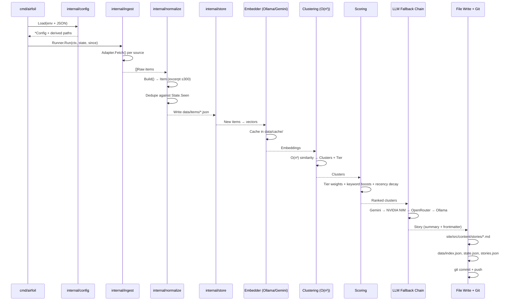

# Full Local Development Loop

This chapter documents the complete, repeatable local development workflow for Airfoil: building the Go agent, starting the React + Vite dev server, running the full ingestion pipeline, editing code, rebuilding, and verifying changes. It assumes you have already read the **Getting Started** parent section and have Go ≥1.23, Node ≥20, and Git installed.

---

## Table of Contents

1. [Repository Layout](#repository-layout)
2. [Prerequisites & Environment](#prerequisites--environment)
3. [Building the Go Agent](#building-the-go-agent)
4. [Running the React Dev Server](#running-the-react-dev-server)
5. [Executing the Full Pipeline](#executing-the-full-pipeline)
6. [The Edit → Rebuild → Verify Cycle](#the-edit--rebuild--verify-cycle)
7. [Useful CLI Commands](#useful-cli-commands)
8. [Troubleshooting Common Issues](#troubleshooting-common-issues)
9. [Referenced Files](#referenced-files)

---

## Repository Layout

```
airfoil/
├── agent/                 # Go agent (cmd/airfoil, internal/*)
│   ├── cmd/airfoil/       # Cobra CLI entry point
│   ├── internal/          # All pipeline logic (config, ingest, normalize, store, model)
│   ├── config/            # JSON configs: sources.json, scoring.json, keywords.json
│   ├── data/              # Generated artifacts (items/, index.json, state.json, stories.json, cache/)
│   └── go.mod / go.sum
├── site/                  # React + Vite static site
│   ├── src/
│   │   ├── pages/         # HomePage, FeedPage, StoryPage, SearchPage, TopPage, ShipPage, DigestPage
│   │   ├── components/    # Header, LeftRail, RightRail, StoryCard, StoryDetail, ...
│   │   ├── hooks/         # useAirfoilSignals, useTheme
│   │   ├── types/         # story.ts (mirrors Go frontmatter)
│   │   └── styles/        # tokens.css, global.css, component-scoped .module.css
│   ├── package.json
│   ├── tsconfig.json
│   └── vite.config.ts
├── .env.example           # Template for local .env (gitignored)
└── README.md
```

**Dependency direction**: `agent/cmd/airfoil` → `agent/internal/*`; `site/` reads only `agent/data/` and `agent/site/src/content/stories/` at build time. No runtime coupling.

---

## Prerequisites & Environment

| Requirement | Version | Notes |
|-------------|---------|-------|
| Go | ≥1.23 | Agent uses modern toolchain |
| Node.js | ≥20 | Site uses Vite 8, React 19 |
| Git | any | Used for commits/pushes by agent |
| Ollama (optional) | latest | Local embedder default; `ollama pull nomic-embed-text` |

### Environment Variables

Copy `.env.example` to `.env` (gitignored) and fill in at minimum:

```bash
cp .env.example .env
```

| Variable | Required | Default | Purpose |
|----------|----------|---------|---------|
| `AIRFOIL_CONFIG_DIR` | No | `./config` | Directory containing `sources.json`, `scoring.json`, `keywords.json` |
| `AIRFOIL_DATA_DIR` | No | `./data` | Output directory for `items/`, `index.json`, `state.json`, `stories.json`, `cache/` |
| `AIRFOIL_EMBEDDER` | No | `ollama` | `ollama` (local) or `gemini` (CI) |
| `AIRFOIL_LOG_LEVEL` | No | `info` | `debug`, `info`, `warn`, `error` |
| `AIRFOIL_STORIES_DIR` | No | `../site/src/content/stories` | Where Markdown stories are written |
| `GEMINI_API_KEY` | For LLM fallback | — | Google Gemini API key |
| `NVIDIA_NIM_API_KEY` | For LLM fallback | — | NVIDIA NIM API key |
| `OPENROUTER_API_KEY` | For LLM fallback | — | OpenRouter API key |
| `GITHUB_TOKEN` | Recommended | — | Raises GitHub API limit 60→5000/hr |
| `REDDIT_USER_AGENT` | Required for Reddit | — | Descriptive UA or 429 returned |
| `OLLAMA_EMBED_MODEL` | If `AIRFOIL_EMBEDDER=ollama` | `nomic-embed-text` | Ollama embedding model |
| `GEMINI_EMBED_MODEL` | If `AIRFOIL_EMBEDDER=gemini` | `text-embedding-004` | Gemini embedding model |

> **Note**: The agent loads `.env` automatically via `config.Load`. CI uses GitHub Secrets instead.

---

## Building the Go Agent

The agent is a single Cobra CLI. Build it from the `agent/` directory:

```bash
cd agent
go build -o airfoil ./cmd/airfoil
```

This produces a binary `airfoil` in `agent/`. Verify:

```bash
./airfoil version
./airfoil doctor   # Validates config, env, connectivity
```

### Agent CLI Commands

| Command | Description |
|---------|-------------|
| `airfoil run` | Execute full pipeline: ingest → normalize → embed → cluster → score → summarize → write → commit → push |
| `airfoil doctor` | Pre-flight checks: config validation, env vars, network reachability, embedder health |
| `airfoil version` | Print version (from `main.version` ldflag) |
| `airfoil --help` | Show all flags and subcommands |

The entry point is thin by design — all logic lives in `internal/`:

`agent/cmd/airfoil/main.go:12-17`

```go
func main() {
	if err := newRootCmd().Execute(); err != nil {
		fmt.Fprintln(os.Stderr, "airfoil:", err)
		os.Exit(1)
	}
}
```

---

## Running the React Dev Server

The site is a Vite + React + TypeScript project. From the `site/` directory:

```bash
cd site
npm install          # First time only
npm run dev          # Starts Vite dev server at http://localhost:5173
```

### Available npm Scripts

| Script | Command | Purpose |
|--------|---------|---------|
| `dev` | `vite` | Start dev server with HMR |
| `build` | `tsc -b && vite build` | Type-check + production build to `dist/` |
| `lint` | `oxlint` | Fast linting (configured in `oxlint.json`) |
| `preview` | `vite preview` | Serve production build locally |

The dev server proxies no API — it reads static JSON/Markdown from `../agent/data/` and `../agent/site/src/content/stories/` at build time. For local development, ensure the agent has run at least once so `data/index.json` and story Markdown files exist.

---

## Executing the Full Pipeline

Run the agent from the `agent/` directory (or with the binary in PATH):

```bash
cd agent
./airfoil run
```

### Pipeline Stages (what `run` does)



### Idempotency

- `State.Seen(id)` checks `data/state.json` (per-day keys)
- `normalize.Dedupe` drops already-seen items
- Second run same day → zero new stories, no commit

---

## The Edit → Rebuild → Verify Cycle

### 1. Edit Go Agent Code

```bash
# Edit files in agent/internal/...
# Example: adjust scoring weights in agent/internal/score/score.go
```

Rebuild and test:

```bash
cd agent
go build -o airfoil ./cmd/airfoil
./airfoil doctor        # Quick validation
./airfoil run           # Full pipeline (or run specific stage via code)
go test ./internal/...  # Table-driven tests for pure functions
```

### 2. Edit Site Code

```bash
# Edit files in site/src/...
# Example: modify StoryCard component in site/src/components/StoryCard.tsx
```

The Vite dev server hot-reloads automatically. For type-checking:

```bash
cd site
npm run lint            # Oxlint (fast)
npx tsc -b              # TypeScript build check
```

### 3. Verify End-to-End

After agent changes that affect output format:

```bash
cd agent
./airfoil run           # Regenerates data/index.json + stories/*.md
cd ../site
npm run build           # Full type-check + Vite build
npm run preview         # Serve dist/ at http://localhost:4173
```

### 4. Common Verification Checklist

| Check | Command |
|-------|---------|
| Agent builds | `cd agent && go build ./cmd/airfoil` |
| Agent tests pass | `cd agent && go test ./internal/...` |
| Site type-checks | `cd site && npx tsc -b` |
| Site lints | `cd site && npm run lint` |
| Pipeline runs clean | `cd agent && ./airfoil doctor && ./airfoil run` |
| Site builds from fresh data | `cd site && npm run build` |
| No `data/cache/` committed | `git status` (should not show `data/cache/`) |

---

## Useful CLI Commands

### Agent Development

```bash
# Run with debug logging
AIRFOIL_LOG_LEVEL=debug ./airfoil run

# Run with Gemini embedder (requires GEMINI_API_KEY)
AIRFOIL_EMBEDDER=gemini ./airfoil run

# Validate config without running pipeline
./airfoil doctor

# See version (set via -ldflags at build)
./airfoil version
```

### Site Development

```bash
# Start dev server on custom port
npm run dev -- --port 3000

# Build with verbose output
npm run build -- --debug

# Type-check only (no emit)
npx tsc --noEmit

# Lint with auto-fix
npx oxlint --fix
```

### Git Hygiene

```bash
# Check what agent would commit (dry run)
cd agent
git status
git diff data/index.json
git diff site/src/content/stories/

# Never commit cache
git check-ignore data/cache/   # Should return path (ignored)
```

---

## Troubleshooting Common Issues

| Symptom | Cause | Fix |
|---------|-------|-----|
| `airfoil run` exits silently | Validation failure in `Config.Validate()` | Run `./airfoil doctor` for details |
| `429 Too Many Requests` from Reddit | Missing/poor `REDDIT_USER_AGENT` | Set descriptive UA in `.env` |
| GitHub API rate limited (60/hr) | No `GITHUB_TOKEN` | Add token to `.env` (5000/hr) |
| Embeddings not generated | Ollama not running / wrong model | `ollama serve` + `ollama pull nomic-embed-text` |
| LLM summarization fails all providers | All API keys missing/invalid | Check `GEMINI_API_KEY`, `NVIDIA_NIM_API_KEY`, `OPENROUTER_API_KEY`; Ollama must have model pulled |
| `data/cache/` huge / committed | Cache never gitignored | Add `data/cache/` to `.gitignore` (already in repo) |
| Site shows no stories | `data/index.json` missing or empty | Run `./airfoil run` first; check `data/items/` has files |
| TypeScript errors in `story.ts` | Go frontmatter changed, TS types stale | Regenerate or manually sync `site/src/types/story.ts` |
| O(n²) clustering slow at n≈600 | Expected — ~360k comparisons | Normal; consider sampling in `internal/cluster` if needed |
| Excerpt >300 chars in output | Bug in `normalize.Excerpt` | Check `internal/normalize/excerpt.go` — hard cap at 300 |

---

## Referenced Files

| File | Purpose |
|------|---------|
| `agent/cmd/airfoil/main.go` | Thin CLI entry point; delegates to Cobra root command |
| `site/package.json` | npm scripts, dependencies (React 19, Vite 8, Oxlint, TypeScript 6) |
| `.env.example` | Template for required/optional environment variables |
| `agent/internal/config/config.go` | `Config.Load`, derived paths, validation (not in source but referenced) |
| `agent/internal/ingest/runner.go` | `Runner.Run` orchestration (not in source but referenced) |
| `agent/internal/normalize/build.go` | `Build`, `Dedupe`, `Excerpt` (300-char cap) (not in source but referenced) |
| `agent/internal/store/json.go` | `ReadJSON`, `WriteJSON` atomic writes (not in source but referenced) |
| `agent/internal/model/types.go` | `Item`, `Cluster`, `Story`, `Index`, `State`, tier constants (not in source but referenced) |
| `site/src/types/story.ts` | TypeScript mirror of Go frontmatter (not in source but referenced) |
| `site/vite.config.ts` | Vite config, path aliases, build options (not in source but referenced) |
| `site/tsconfig.json` | TypeScript project references, strict mode (not in source but referenced) |

---

*This chapter covers the complete local development loop. For deeper dives into individual pipeline stages, configuration, data models, or site architecture, see the sibling chapters under **Getting Started**.*

<!-- kaioken:files agent/cmd/airfoil/main.go,site/package.json -->
