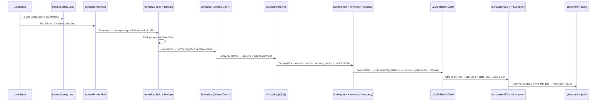

# Getting Started

This chapter walks through setting up the Airfoil development environment from scratch: installing prerequisites, configuring environment variables from the provided template, building the Go agent binary, installing and running the React + Vite dev server, and executing the full ingest→generate→render pipeline locally.

## Table of Contents

- [Prerequisites](#prerequisites)
- [Repository Layout](#repository-layout)
- [Environment Configuration](#environment-configuration)
- [Building the Go Agent](#building-the-go-agent)
- [Running the React Dev Server](#running-the-react-dev-server)
- [Executing the Full Pipeline](#executing-the-full-pipeline)
- [Verifying the Setup](#verifying-the-setup)
- [Referenced Files](#referenced-files)

---

## Prerequisites

| Tool | Minimum Version | Purpose |
|------|----------------|---------|
| Go | 1.26+ | Build the Airfoil agent (`agent/go.mod` specifies `go 1.26.5`) |
| Node.js | 20+ | Run the React + Vite site (`site/package.json` uses React 19, Vite 8) |
| npm | 10+ | Install site dependencies |
| Git | any | Version control; the agent commits/pushes generated content |
| Ollama | latest | Local embedding model server (default embedder) |

> **Note**: The agent uses `github.com/spf13/cobra` for CLI, `github.com/mmcdole/gofeed` for RSS parsing, and `golang.org/x/sync` for concurrency — all declared in `agent/go.mod`.

---

## Repository Layout

```
airfoil/
├── agent/                 # Go agent (module: github.com/papitsho/airfoil)
│   ├── cmd/airfoil/       # Thin Cobra CLI entry point
│   ├── internal/          # All pipeline logic (config, ingest, normalize, store, model, ...)
│   └── go.mod             # Go module definition
├── site/                  # React + Vite static site
│   ├── src/               # Source: pages, components, hooks, types, styles
│   ├── package.json       # npm scripts & dependencies
│   └── vite.config.ts     # Vite configuration
├── config/                # JSON configuration files (sources.json, scoring.json, keywords.json)
├── data/                  # Generated at runtime (git-tracked except data/cache/)
│   ├── items/             # Raw ingested items (*.json)
│   ├── index.json         # Ranked story index for site
│   ├── state.json         # Deduplication tracker
│   └── stories.json       # Serialized stories
├── .env.example           # Environment variable template (copy to .env)
└── AGENTS.md              # Quick-reference commands & conventions
```

The **Go agent** lives under `agent/` with a standard layout: `cmd/airfoil` is a thin main, all logic resides in `internal/`. The **site** under `site/` is a Vite + React + TypeScript project using React Router for client-side routing.

---

## Environment Configuration

All runtime configuration is driven by environment variables. The repository provides a template at `.env.example` — copy it to `.env` (which is gitignored) and fill in the required values.

```
.env.example:1-30
```

```text
# Copy to .env and fill. Never commit .env.
 
# --- LLM providers (chain order: gemini -> nvidia_nim -> openrouter -> ollama) ---
GEMINI_API_KEY=
NVIDIA_NIM_API_KEY=
OPENROUTER_API_KEY=
 
# Model IDs are config-driven because free models rotate out.
GEMINI_MODEL=gemini-2.0-flash
NVIDIA_NIM_MODEL=meta/llama-3.3-70b-instruct
OPENROUTER_MODEL=meta-llama/llama-3.3-70b-instruct:free
 
# --- Embeddings ---
# ollama (local, default) | gemini (CI)
AIRFOIL_EMBEDDER=ollama
OLLAMA_HOST=http://localhost:11434
OLLAMA_EMBED_MODEL=nomic-embed-text
GEMINI_EMBED_MODEL=text-embedding-004
 
# --- GitHub ingest (optional, raises rate limit from 60/hr to 5000/hr) ---
GITHUB_TOKEN=
 
# --- Reddit requires a descriptive User-Agent or it returns 429 ---
REDDIT_USER_AGENT=airfoil/0.1 (by /u/YOUR_USERNAME)
 
# --- Site ---
SITE_URL=https://airfoil.example.com
 
# --- Behaviour ---
AIRFOIL_DATA_DIR=./data
AIRFOIL_CONFIG_DIR=./config
AIRFOIL_LOG_LEVEL=info
```

### Required Variables

| Variable | Description | Default / Example |
|----------|-------------|-------------------|
| `GEMINI_API_KEY` | Google Gemini API key (first in LLM fallback chain) | — |
| `NVIDIA_NIM_API_KEY` | NVIDIA NIM API key (second fallback) | — |
| `OPENROUTER_API_KEY` | OpenRouter API key (third fallback) | — |
| `AIRFOIL_EMBEDDER` | Embedding provider: `ollama` (local) or `gemini` (CI) | `ollama` |
| `OLLAMA_HOST` | Ollama server URL (when using local embedder) | `http://localhost:11434` |
| `OLLAMA_EMBED_MODEL` | Ollama embedding model name | `nomic-embed-text` |
| `REDDIT_USER_AGENT` | Descriptive User-Agent for Reddit API (required to avoid 429) | `airfoil/0.1 (by /u/YOUR_USERNAME)` |
| `SITE_URL` | Canonical site URL for generated links | `https://airfoil.example.com` |
| `AIRFOIL_DATA_DIR` | Root directory for generated data | `./data` |
| `AIRFOIL_CONFIG_DIR` | Directory containing JSON config files | `./config` |
| `AIRFOIL_LOG_LEVEL` | Log level for structured logging | `info` |

### Optional Variables

| Variable | Description |
|----------|-------------|
| `GITHUB_TOKEN` | GitHub PAT to raise rate limit from 60→5000/hr for GitHub source |
| `GEMINI_MODEL` | Gemini chat model for summarization (default: `gemini-2.0-flash`) |
| `NVIDIA_NIM_MODEL` | NVIDIA NIM chat model (default: `meta/llama-3.3-70b-instruct`) |
| `OPENROUTER_MODEL` | OpenRouter chat model (default: `meta-llama/llama-3.3-70b-instruct:free`) |
| `GEMINI_EMBED_MODEL` | Gemini embedding model when `AIRFOIL_EMBEDDER=gemini` (default: `text-embedding-004`) |

> **Important**: Never commit `.env`. CI/CD uses GitHub Secrets for the same variables.

---

## Building the Go Agent

The agent is a single Go module at `agent/`. From the **repository root**:

```bash
# Build the binary into the repo root as 'airfoil'
go build -o airfoil ./agent/cmd/airfoil
```

The `main.go` entry point is intentionally thin — it only constructs and executes the Cobra root command:

```
agent/cmd/airfoil/main.go:12-17
```

```go
func main() {
	if err := newRootCmd().Execute(); err != nil {
		fmt.Fprintln(os.Stderr, "airfoil:", err)
		os.Exit(1)
	}
}
```

All CLI commands (`run`, `version`, `doctor`) are defined in `agent/cmd/airfoil/root.go` (not shown in source but referenced in AGENTS.md).

### Verify the Build

```bash
./airfoil version
# Expected: prints version information

./airfoil doctor
# Expected: validates config, checks embedder connectivity, verifies LLM keys
```

---

## Running the React Dev Server

The site lives in `site/` and uses Vite with React 19 and React Router 7.

```bash
cd site
npm install          # Install dependencies (React, React Router, fonts, Oxlint, TypeScript, Vite)
npm run dev          # Start Vite dev server (default: http://localhost:5173)
```

### Available npm Scripts

| Script | Command | Purpose |
|--------|---------|---------|
| `dev` | `vite` | Start development server with HMR |
| `build` | `tsc -b && vite build` | Type-check + production build to `site/dist/` |
| `lint` | `oxlint` | Lint TypeScript/React code |
| `preview` | `vite preview` | Preview production build locally |

The Vite configuration is minimal:

```
site/vite.config.ts:1-10
```

```typescript
import { defineConfig } from 'vite'
import react from '@vitejs/plugin-react'

// https://vite.dev/config/
export default defineConfig({
  plugins: [react()],
})
```

The site reads generated content from `../data/index.json` and `../site/src/content/stories/` at build time. During development, you can run the agent first to populate `data/` and `site/src/content/stories/`, then the dev server will pick up those files.

---

## Executing the Full Pipeline

With `.env` configured and the agent built, run the complete pipeline from the **repository root**:

```bash
./airfoil run
```

### Pipeline Stages (High-Level Flow)



### What `./airfoil run` Does (per AGENTS.md)

1. **Load config** — `config.Load` reads `AIRFOIL_CONFIG_DIR` (`./config` by default) for `sources.json`, `scoring.json`, `keywords.json`, and derives paths (`ItemsDir`, `CacheDir`, `IndexPath`, `StatePath`, `StoriesPath`, `EmbedCachePath`).
2. **Ingest** — `ingest.Runner` runs each enabled adapter (`hnAdapter`, `rssAdapter` for Reddit/HFPapers/GitHub) with HTTP timeout/retry.
3. **Normalize** — `normalize.Build` converts each `Raw` item to `model.Item`: strips HTML, caps excerpt at 300 chars, canonicalizes URL, extracts repo/paper URLs.
4. **Deduplicate** — `normalize.Dedupe` checks `State.Seen(id)` (keyed by hash of canonical URL) against `data/state.json`; new items written to `data/items/*.json`.
5. **Embed** — Embedder (Ollama default, Gemini for CI) generates vectors; cached in `data/cache/` (never committed).
6. **Cluster** — O(n²) cosine similarity groups items into `model.Cluster`; each cluster assigned a tier (`TierMajor`/`TierNotable`/`TierMinor`).
7. **Score** — Tier weights from `scoring.json` + keyword boosts from `keywords.json` + source multipliers + recency decay → ranked `Index` serialized to `data/index.json`.
8. **Summarize** — LLM fallback chain (Gemini → NVIDIA NIM → OpenRouter → Ollama) produces `model.Story` with frontmatter.
9. **Write** — Markdown stories to `site/src/content/stories/*.md`; JSON indexes to `data/index.json`, `data/state.json`, `data/stories.json`.
10. **Validate & Commit** — Validation gate runs; on success, `git commit -m "content: YYYY-MM-DD — N stories"` and `git push`.

> **Idempotency**: Re-running the same day produces zero new stories because `State.Seen` tracks per-day keys.

---

## Verifying the Setup

| Check | Command | Expected Result |
|-------|---------|-----------------|
| Agent binary exists | `ls -lh airfoil` | Executable ~10-20 MB |
| Version command | `./airfoil version` | Prints version string |
| Doctor check | `./airfoil doctor` | All checks pass (config valid, embedder reachable, LLM keys present) |
| Data directories created | `ls data/` | `items/`, `cache/`, `index.json`, `state.json`, `stories.json` |
| Stories generated | `ls site/src/content/stories/` | `*.md` files with frontmatter |
| Site dev server | `cd site && npm run dev` | Vite serves at `http://localhost:5173` with stories visible |
| Production build | `cd site && npm run build` | `site/dist/` contains static assets |

### Common First-Run Issues

| Issue | Cause | Fix |
|-------|-------|-----|
| `doctor` fails on embedder | Ollama not running | `ollama serve` then `ollama pull nomic-embed-text` |
| `doctor` fails on LLM keys | Missing API keys in `.env` | Fill at least one of `GEMINI_API_KEY`, `NVIDIA_NIM_API_KEY`, `OPENROUTER_API_KEY` |
| Reddit returns 429 | Generic User-Agent | Set `REDDIT_USER_AGENT=airfoil/0.1 (by /u/YOUR_USERNAME)` |
| GitHub rate limited | No token | Add `GITHUB_TOKEN` (PAT with `public_repo` scope) |
| `data/cache/` grows large | Embeddings cached | Never commit `data/cache/`; it's regenerable |

---

## Referenced Files

| File | Purpose |
|------|---------|
| `AGENTS.md` | Quick-reference commands, architecture, conventions, gotchas |
| `agent/go.mod` | Go module definition (version 1.26.5, dependencies) |
| `agent/cmd/airfoil/main.go` | Thin CLI entry point |
| `site/package.json` | npm scripts, React/Vite/TypeScript dependencies |
| `site/vite.config.ts` | Vite configuration (React plugin only) |
| `.env.example` | Environment variable template (copy to `.env`) |

<!-- kaioken:files .env.example,agent/go.mod,agent/cmd/airfoil/main.go,site/package.json,site/vite.config.ts,AGENTS.md -->
