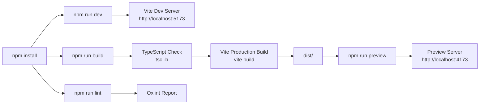

# Install React Site Dependencies

This chapter walks through installing the npm dependencies for the Vite + React site located in `site/` and verifying that the development server starts correctly. It covers the package manifest, available scripts, Vite configuration, and the exact commands to run.

## Table of Contents

- [Package Manifest](#package-manifest)
- [Available Scripts](#available-scripts)
- [Vite Configuration](#vite-configuration)
- [Installation Procedure](#installation-procedure)
- [Verifying the Dev Server](#verifying-the-dev-server)
- [Referenced Files](#referenced-files)

---

## Package Manifest

The `site/package.json` defines the project metadata, runtime dependencies, development dependencies, and npm scripts.

`site/package.json:1-31`

```json
{
  "name": "site",
  "private": true,
  "version": "0.0.0",
  "type": "module",
  "scripts": {
    "dev": "vite",
    "build": "tsc -b && vite build",
    "lint": "oxlint",
    "preview": "vite preview"
  },
  "dependencies": {
    "@fontsource/inter": "^5.3.0",
    "@fontsource/jetbrains-mono": "^5.3.0",
    "react": "^19.2.8",
    "react-dom": "^19.2.8",
    "react-router-dom": "^7.18.2"
  },
  "devDependencies": {
    "@types/node": "^24.13.3",
    "@types/react": "^19.2.17",
    "@types/react-dom": "^19.2.3",
    "@vitejs/plugin-react": "^6.0.4",
    "oxlint": "^1.75.0",
    "typescript": "~6.0.2",
    "vite": "^8.2.0"
  }
}
```

### Runtime Dependencies

| Package | Version | Purpose |
|---------|---------|---------|
| `react` | `^19.2.8` | Core React library |
| `react-dom` | `^19.2.8` | React DOM renderer |
| `react-router-dom` | `^7.18.2` | Client-side routing (used by `App.tsx` router) |
| `@fontsource/inter` | `^5.3.0` | Inter font (design system primary font) |
| `@fontsource/jetbrains-mono` | `^5.3.0` | JetBrains Mono font (code/monospace) |

### Development Dependencies

| Package | Version | Purpose |
|---------|---------|---------|
| `vite` | `^8.2.0` | Build tool and dev server |
| `@vitejs/plugin-react` | `^6.0.4` | Vite plugin for React (Fast Refresh, JSX) |
| `typescript` | `~6.0.2` | TypeScript compiler (used by `tsc -b` in build) |
| `@types/node` | `^24.13.3` | Node.js type definitions |
| `@types/react` | `^19.2.17` | React type definitions |
| `@types/react-dom` | `^19.2.3` | React DOM type definitions |
| `oxlint` | `^1.75.0` | Fast linter (replaces ESLint) |

### Project Settings

| Field | Value | Notes |
|-------|-------|-------|
| `name` | `"site"` | Package name |
| `private` | `true` | Prevents accidental publish to npm |
| `version` | `"0.0.0"` | Placeholder version |
| `type` | `"module"` | Enables ES modules (`.js`/`.ts` files use `import`/`export`) |

---

## Available Scripts

The `scripts` section defines four commands:

| Script | Command | Description |
|--------|---------|-------------|
| `dev` | `vite` | Starts the Vite development server with HMR |
| `build` | `tsc -b && vite build` | Type-checks (`tsc -b` = project references/build mode) then produces production build |
| `lint` | `oxlint` | Runs Oxlint across the codebase |
| `preview` | `vite preview` | Serves the production build locally for verification |



---

## Vite Configuration

The Vite configuration is minimal, enabling only the React plugin.

`site/vite.config.ts:1-10`

```typescript
import { defineConfig } from 'vite'
import react from '@vitejs/plugin-react'

// https://vite.dev/config/
export default defineConfig({
  plugins: [react()],
})
```

### Configuration Breakdown

| Setting | Value | Notes |
|---------|-------|-------|
| `plugins` | `[react()]` | Enables React Fast Refresh and JSX transform |
| `root` | (default) | Project root is `site/` (where `index.html` lives) |
| `build.outDir` | (default) | Outputs to `site/dist/` |
| `server.port` | (default 5173) | Dev server port; can be overridden via `--port` |

No additional configuration (aliases, proxy, CSS modules, etc.) is present in this file. The site relies on Vite defaults and the React plugin.

---

## Installation Procedure

### Prerequisites

- **Node.js** ≥ 20 (LTS recommended) — required by Vite 8 and React 19
- **npm** ≥ 10 (bundled with Node.js) or **pnpm** / **yarn** if preferred

### Steps

1. **Change into the site directory**

   ```bash
   cd site
   ```

2. **Install dependencies**

   Using npm:
   ```bash
   npm install
   ```

   Using pnpm (faster, disk-efficient):
   ```bash
   pnpm install
   ```

   Using yarn:
   ```bash
   yarn install
   ```

   This creates `node_modules/` and `package-lock.json` (or `pnpm-lock.yaml` / `yarn.lock`).

3. **Verify installation**

   ```bash
   npm ls --depth=0
   ```

   Expected output (versions may differ slightly):
   ```
   site@0.0.0
   ├── @fontsource/inter@5.3.0
   ├── @fontsource/jetbrains-mono@5.3.0
   ├── react@19.2.8
   ├── react-dom@19.2.8
   ├── react-router-dom@7.18.2
   ├── @types/node@24.13.3
   ├── @types/react@19.2.17
   ├── @types/react-dom@19.2.3
   ├── @vitejs/plugin-react@6.0.4
   ├── oxlint@1.75.0
   ├── typescript@6.0.2
   └── vite@8.2.0
   ```

---

## Verifying the Dev Server

### Start the Development Server

```bash
npm run dev
```

### Expected Output

```
  VITE v8.2.0  ready in XXX ms

  ➜  Local:   http://localhost:5173/
  ➜  Network: use --host to expose
  ➜  press h + enter to show help
```

### Confirm in Browser

1. Open `http://localhost:5173/` in a browser.
2. The Airfoil site should load with:
   - Header with AirfoilSVG logo
   - LeftRail (navigation/filters)
   - Feed of stories (if `data/index.json` and `site/src/content/stories/` exist)
   - RightRail (metadata/sidebar)

### Hot Module Replacement (HMR)

- Edit any `.tsx`/`.ts`/`.css` file in `site/src/`
- Browser updates instantly without full reload
- React component state is preserved where possible

### Stop the Server

Press `Ctrl+C` in the terminal.

---

## Troubleshooting

| Issue | Cause | Resolution |
|-------|-------|------------|
| `npm install` fails with `ENOENT package.json` | Wrong directory | Ensure you are in `site/` (where `package.json` exists) |
| `vite: command not found` | Local bin not in PATH | Use `npx vite` or `npm run dev` (which uses local bin) |
| Port 5173 already in use | Another dev server running | Run `vite --port 5174` or kill the other process |
| TypeScript errors on `npm run build` | Type mismatches in source | Run `npm run lint` first; fix reported issues |
| Blank page / console errors | Missing generated data (`data/index.json`, stories) | Run the Go agent (`./airfoil run`) to generate content, or check that `data/` exists with valid JSON |

---

## Referenced Files

| File | Description |
|------|-------------|
| `site/package.json` | Package manifest with dependencies, scripts, and metadata |
| `site/vite.config.ts` | Vite configuration enabling React plugin |

---

*End of chapter.*

<!-- kaioken:files site/package.json,site/vite.config.ts -->
